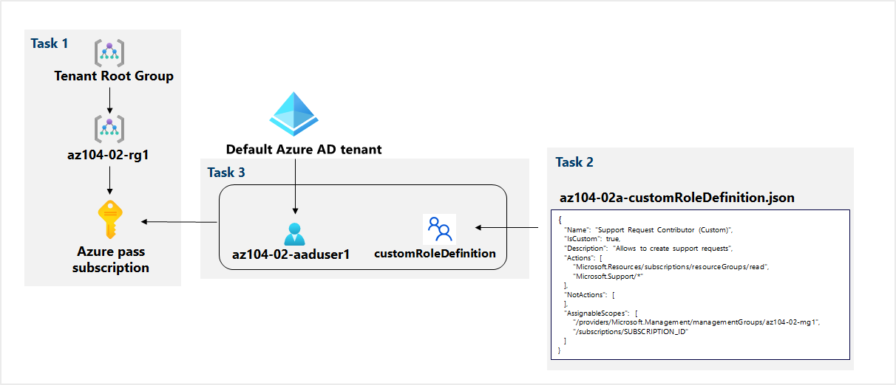
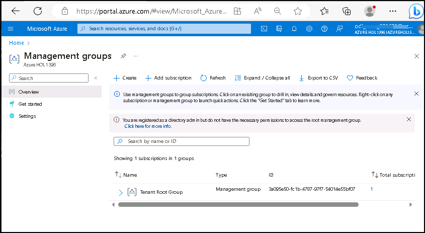
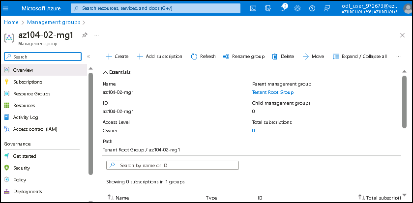
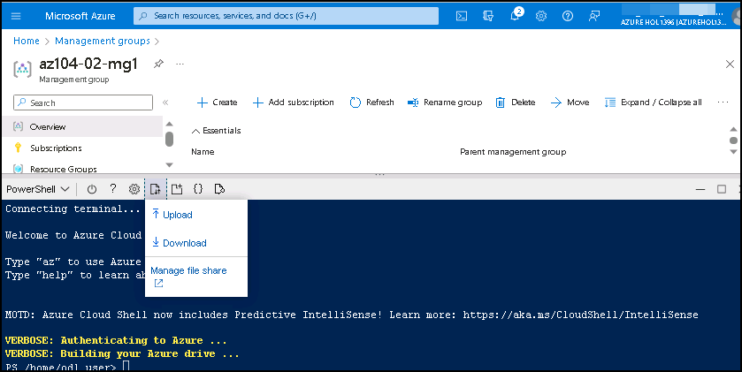
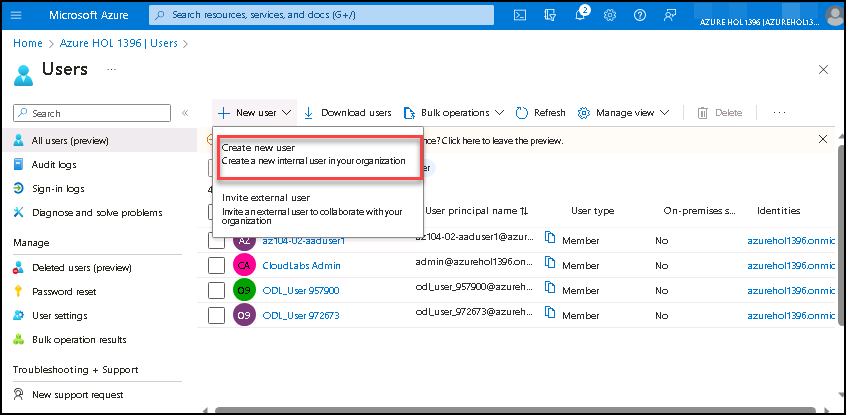

# Lab 02a - Manage Subscriptions and RBAC

## Lab requirements

This lab requires permissions to create Azure Active Directory (Azure AD) users, create custom Azure Role Based Access Control (RBAC) roles, and assign these roles to Azure AD users. Not all lab hosters may provide this capability. Ask your instructor for the availability of this lab.

## Lab scenario

In order to improve management of Azure resources in Contoso, you have been tasked with implementing the following functionality:

- creating a management group that would include all of Contoso's Azure subscriptions

- granting permissions to submit support requests for all subscriptions in the management group to a designated Azure Active Directory user. That user's permissions should be limited only to: 

    - creating support request tickets
    - viewing resource groups

   **Note:** An **[interactive lab simulation](https://mslabs.cloudguides.com/guides/AZ-104%20Exam%20Guide%20-%20Microsoft%20Azure%20Administrator%20Exercise%202)** is available that allows you to click through this lab at your own pace. You may find slight differences between the interactive simulation and the hosted lab, but the core concepts and ideas being demonstrated are the same.

## Objectives
In this lab, you will complete the following tasks:
+ Task 1: Implement Management Groups
+ Task 2: Create custom RBAC roles 
+ Task 3: Assign RBAC roles

## Architecture diagram

   

## Exercise 1: Manage Subscriptions and RBAC

### Task 1: Implement Management Groups

In this task, you will create and configure management groups.

1. If you have not yet signed in, please navigate to the [Azure portal](http://portal.azure.com).

1. Search for and select **Management groups** to navigate to the **Management groups** blade.

     
    
1. Review the messages at the top of the **Management groups** blade. If you are seeing the message stating **You are registered as a directory admin but do not have the necessary permissions to access the root management group**, perfom the following sequence of steps:

    1. In the Azure portal, search for and select **Azure Active Directory**.
    
    1.  On the blade displaying properties of your Azure Active Directory tenant, in the vertical menu on the left side, in the **Manage** section, select **Properties**.
    
    1.  On the **Properties** blade of your your Azure Active Directory tenant, in the **Access management for Azure resources** section, select **Yes** and then select **Save**.

        
   
    1.  Navigate back to the **Management groups** blade, and select **Refresh**.

1. On the **Management groups** blade, click **+ Create**.

    >**Note**: If you have not previously created Management Groups, select **Start using management groups**

1. Create a management group with the following settings:

    | Setting | Value |
    | --- | --- |
    | Management group ID | **az104-02-mg1** |
    | Management group display name | **az104-02-mg1** |

1. In the list of management groups, click the entry representing the newly created management group.

    
 
1. On the **az104-02-mg1** blade, click **Subscriptions**. 

1. On the **az104-02-mg1 \| Subscriptions** blade, click **+ Add**, on the **Add subscription** blade, in the **Subscription** drop-down list, select the subscription you are using in this lab and click **Save**.

    >**Note**: On the **az104-02-mg1 \| Subscriptions** blade, copy the ID of your Azure subscription into Clipboard. You will need it in the next task.

### Task 2: Create custom RBAC roles

In this task, you will create a definition of a custom RBAC role.

1. From the lab computer, open the file **C:\AllFiles\AZ-104-MicrosoftAzureAdministrator-Lab-Files\\Allfiles\\Labs\\02\\az104-02a-customRoleDefinition.json** in Notepad and review its content:

   ```json
   {
      "Name": "Support Request Contributor (Custom)",
      "IsCustom": true,
      "Description": "Allows to create support requests",
      "Actions": [
          "Microsoft.Resources/subscriptions/resourceGroups/read",
          "Microsoft.Support/*"
      ],
      "NotActions": [
      ],
      "AssignableScopes": [
          "/providers/Microsoft.Management/managementGroups/az104-02-mg1",
          "/subscriptions/SUBSCRIPTION_ID"
      ]
   }
   ```

    > **Note**: Replace the **`SUBSCRIPTION_ID`** placeholder in the JSON file with the subscription ID you copied into Clipboard and save the change.

1. In the Azure portal, open the **Azure Cloud Shell** by clicking on the icon in the top right of the Azure Portal.

    

1. If prompted to select either **Bash** or **PowerShell**, select **PowerShell**. 

    >**Note**: If this is the first time you are starting **Cloud Shell** and you are presented with the **You have no storage mounted** message, select the subscription you are using in this lab, and click **Create storage**. 

1. Click **Create storage**, and wait until the Azure Cloud Shell pane is displayed. 

1. In the toolbar of the Cloud Shell pane, click the **Upload/Download files** icon, in the drop-down menu click **Upload**, and upload the file **\\Allfiles\\Labs\\02\\az104-02a-customRoleDefinition.json** into the Cloud Shell home directory.

    

1. From the Cloud Shell pane, run the following to create the custom role definition:

   ```powershell
   New-AzRoleDefinition -InputFile $HOME/az104-02a-customRoleDefinition.json
   ```

1. Close the Cloud Shell pane.

### Task 3: Assign RBAC roles

In this task, you will create an Azure Active Directory user, assign the RBAC role you created in the previous task to that user, and verify that the user can perform the task specified in the RBAC role definition.

1. In the Azure portal, search for and select **Azure Active Directory**, on the Azure Active Directory blade, click **Users**, and then click **+ New user**.

   
  
1. Create a new user with the following settings (leave others with their defaults):

    | Setting | Value |
    | --- | --- |
    | User Principal name | **az104-02-aaduser1**|
    | Name | **az104-02-aaduser1**|
    | Let me create the password | enabled |
    | Initial password | **Provide a secure password** |

    >**Note**: **Copy to clipboard** the full **User name**. You will need it later in this lab.

1. In the Azure portal, navigate back to the **az104-02-mg1** management group and display its **details**.

1. Click **Access Control (IAM)**, click **+ Add** and then **Add role assignment**. On the **Role** tab.

     
    >**Note**: if your custom role is not visible, it can take up to 10 minutes for the custom role to appear after creation.

1. Search for **Support Request Contributor (Custom)**.Select the **Role** and click **Next**. On the **Members** tab, click **+ Select members** and **select** user account **az104-02-aaduser1.onmicrosoft.com**. Click **Next** and then **Review and assign**.

    
    
1. Open an **InPrivate** browser window and sign in to the [Azure portal](https://portal.azure.com) using the newly created user account. When prompted to update the password, change the password for the user.

    >**Note**: Rather than typing the user name, you can paste the content of Clipboard.

1. In the **InPrivate** browser window, in the Azure portal, search and select **Resource groups** to verify that the az104-02-aaduser1 user can see all resource groups.

1. In the **InPrivate** browser window, in the Azure portal, search and select **All resources** to verify that the az104-02-aaduser1 user cannot see any resources.

1. In the **InPrivate** browser window, in the Azure portal, search and select **Help + support** and then click **+ Create a support request**. 

1. In the **InPrivate** browser window, on the **Problem Description/Summary** tab of the **Help + support - New support request** blade, type **Service and subscription limits** in the Summary field and select the **Service and subscription limits (quotas)** issue type. Note that the subscription you are using in this lab is listed in the **Subscription** drop-down list.

    >**Note**: The presence of the subscription you are using in this lab in the **Subscription** drop-down list indicates that the account you are using has the permissions required to create the subscription-specific support request.

    >**Note**: If you do not see the **Service and subscription limits (quotas)** option, sign out from the Azure portal and sign in back.

1. Do not continue with creating the support request. Instead, sign out as the az104-02-aaduser1 user from the Azure portal and close the InPrivate browser window.

   > **Congratulations** on completing the task! Now, it's time to validate it. Here are the steps:
   > - Navigate to the Lab Validation Page, from the upper right corner in the lab guide section.
   > - Hit the Validate button for the corresponding task. If you receive a success message, you can proceed to the next task. 
   > - If not, carefully read the error message and retry the step, following the instructions in the lab guide.
   > - If you need any assistance, please contact us at labs-support@spektrasystems.com. We are available 24/7 to help you out.


## Review
In this lab, you have completed:
- Implemented Management Groups
- Created custom RBAC roles 
- Assigned RBAC roles

## You have successfully completed the lab
