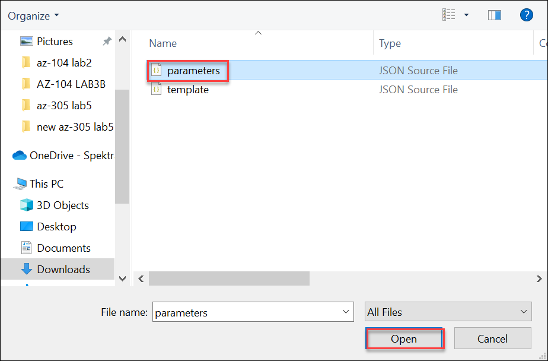

# Lab 3b - Manage Azure resources by Using ARM Templates
## Lab scenario
Now that you explored the basic Azure administration capabilities associated with provisioning resources and organizing them based on resource groups by using the Azure portal, you need to carry out the equivalent task by using Azure Resource Manager templates.

## Objectives
In this lab, you will:
+ Task 1: Review an ARM template for deployment of an Azure managed disk
+ Task 2: Create an Azure managed disk by using an ARM template
+ Task 3: Review the ARM template-based deployment of the managed disk

## Architecture diagram


### Excercise 1: Manage Azure resources by Using ARM Templates

#### Task 1: Review an ARM template for deployment of an Azure managed disk
In this task, you will create an Azure disk resource by using an Azure Resource Manager template.

1. In the Azure portal home page, search for and select **Resource groups**. 

1. In the list of resource groups, click **az104-03a-rg1-<inject key="DeploymentID" enableCopy="false" />**.

1. On the **az104-03a-rg1-<inject key="DeploymentID" enableCopy="false" />** resource group blade, in the **Settings** section, click **Deployments**.

1. On the **az104-03a-rg1-<inject key="DeploymentID" enableCopy="false" />** Deployments blade, click the first entry in the list of deployments.

1. On the **Microsoft.ManagedDisk-<inject key="DeploymentID" enableCopy="false" />| Overview** blade, click **Template**.

    >**Note**: Review the content of the template and note that you have the option to **Download** it to the local computer, **Add to library**, or **Deploy** it again.

    

1. Click **Download** and save the compressed file containing the template and parameters files to the **Downloads** folder on your lab computer.

1. On the **Microsoft.ManagedDisk-<inject key="DeploymentID" enableCopy="false" />| Template** blade, click **Inputs**.

1. Note the value of the **location** parameter. You will need it for the next task.

1. Extract the content of the downloaded file into the **Downloads** folder on your lab computer.

    >**Note**: These files are also available as **C:\AllFiles\AZ-104-MicrosoftAzureAdministrator-master\Allfiles\Labs\03\az104-03b-md-template.json** and **C:\AllFiles\AZ-104-MicrosoftAzureAdministrator-master\Allfiles\Labs\03\az104-03b-md-parameters.json**
    
1. Close all **File Explorer** windows.

#### Task 2: Create an Azure managed disk by using an ARM template

1. Navigate to Azure portal home page, search for and select **Deploy a custom template**.

1. Click **Template deployment (deploy using custom templates)** found under the **Marketplace** group.

1. On the **Custom deployment** blade, click **Build your own template in the editor**.

1. On the **Edit template** blade, click **Load file** and upload the **template.json** file you downloaded in the previous task.

   

1. Within the editor pane, remove the following lines:

   ```json
   "sourceResourceId": {
       "type": "String"
   },
   ```

   ```json
   "hyperVGeneration": {
       "defaultValue": "V1",
       "type": "String"
   },      
   ```

    >**Note**: These parameters are removed since they are not applicable to the current deployment. In particular, sourceResourceId, sourceUri, osType, and hyperVGeneration parameters are applicable to creating an Azure disk from an existing VHD file.

1. **Save** the changes.

1. Back on the **Custom deployment** blade, click **Edit parameters**. 

1. On the **Edit parameters** blade, click **Load file** and upload the **parameters.json** file you downloaded in the previous task, and **Save** the changes.

   

1. Back on the **Custom deployment** blade, specify the following settings:

    | Setting | Value |
    | --- |--- |
    | Subscription | *the name of the Azure subscription you are using in this lab* |
    | Resource Group | select the existing resource group **az104-03b-rg1-<inject key="DeploymentID" enableCopy="false" />** |
    | Region | Same region as the Resource Group |
    | Disk Name | **az104-03b-disk1** |
    | Location | the value of the location parameter you noted in the previous task |
    | Sku | **Standard_LRS** |
    | Disk Size Gb | **32** |
    | Create Option | **empty** |
    | Disk Encryption Set Type | **EncryptionAtRestWithPlatformKey** |
    | Network Access Policy | **AllowAll** |

1. Select **Review + Create** and then select **Create**.

1. Verify that the deployment completed successfully.

#### Task 3: Review the ARM template-based deployment of the managed disk

1. Navigate to the Azure portal home page, search for and select **Resource groups**. 

1. In the list of resource groups, click **az104-03b-rg1-<inject key="DeploymentID" enableCopy="false" />**.

1. On the **az104-03b-rg1-<inject key="DeploymentID" enableCopy="false" />** resource group blade, in the **Settings** section, click **Deployments**.

1. From the **az104-03b-rg1-<inject key="DeploymentID" enableCopy="false" />** **Deployments** blade, click the first entry in the list of deployments and review the content of the **Input** and **Template** blades.
    
   > **Congratulations** on completing the task! Now, it's time to validate it. Here are the steps:
   > - Navigate to the Lab Validation Page, from the upper right corner in the lab guide section.
   > - Hit the Validate button for the corresponding task. If you receive a success message, you can proceed to the next task. 
   > - If not, carefully read the error message and retry the step, following the instructions in the lab guide.
   > - If you need any assistance, please contact us at labs-support@spektrasystems.com. We are available 24/7 to help you out.

### Review
In this lab, you have:
- Reviewed an ARM template for deployment of an Azure managed disk
- Created an Azure managed disk by using an ARM template
- Reviewed the ARM template-based deployment of the managed disk

## You have successfully completed the lab
