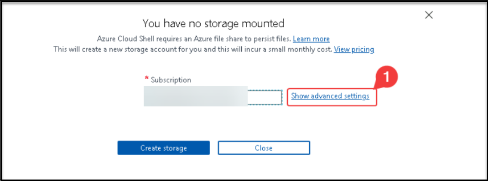
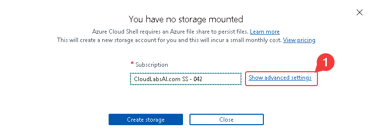

# Lab 03c - Manage Azure resources by Using Azure PowerShell
# Student lab manual

## Lab scenario

Now that you explored the basic Azure administration capabilities associated with provisioning resources and organizing them based on resource groups by using the Azure portal and Azure Resource Manager templates, you need to carry out the equivalent task by using Azure PowerShell. To avoid installing Azure PowerShell modules, you will leverage PowerShell environment available in Azure Cloud Shell.

## Objectives

In this lab, you will:

+ Task 1: Start a PowerShell session in Azure Cloud Shell
+ Task 2: Use the existing resource group and create an Azure managed disk by using Azure PowerShell
+ Task 3: Configure the managed disk by using Azure PowerShell

## Estimated timing: 20 minutes

## Instructions

> **Note**:  Always create your own secure password for any virtual machine or user account you create. If the virtual machine is created for you, use **Reset password** in the Portal to update the password.

### Exercise 1

#### Task 1: Start a PowerShell session in Azure Cloud Shell

In this task, you will open a PowerShell session in Cloud Shell. 

1. In the portal, open the **Azure Cloud Shell** by clicking on the icon in the top right of the Azure Portal.

1. If prompted to select either **Bash** or **PowerShell**, select **PowerShell**. 

    >**Note**: If this is the first time you are starting **Cloud Shell** and you are presented with the **You have no storage mounted** message, select the subscription you are using in this lab, and click **Show Advanced Settings**. 
    
    
    
    >Under **Advanced Settings**, you need to select an existing resource group from the **Resource group** dropdown and give some unique name under the **Storage Account** section, and under the **File share** section type none as shown in the below image.

    

1. Click **Create storage**, and wait until the Azure Cloud Shell pane is displayed. 

1. Ensure **PowerShell** appears in the drop-down menu in the upper-left corner of the Cloud Shell pane.

#### Task 2: Use the existing resource group and create an Azure managed disk by using Azure PowerShell

In this task, you will use an existing resource group and create an Azure managed disk by using the Azure PowerShell session within the Cloud Shell

1. From the PowerShell session within Cloud Shell, run the following commands with the value of the DeploymentID, you can find Deployment ID from the environmental detail page:

   ```powershell
   $location = (Get-AzResourceGroup -Name az104-03b-rg1-DeploymentID).Location

   $rgName = 'az104-03c-rg1-DeploymentID'
   ```
1. To retrieve properties of the created resource group, run the following:

   ```powershell
   Get-AzResourceGroup -Name $rgName
   ```
1. To create a new managed disk with the same characteristics as those you created in the previous labs of this module, run the following:

   ```powershell
   $diskConfig = New-AzDiskConfig `
    -Location $location `
    -CreateOption Empty `
    -DiskSizeGB 32 `
    -Sku Standard_LRS

   $diskName = 'az104-03c-disk1'

   New-AzDisk `
    -ResourceGroupName $rgName `
    -DiskName $diskName `
    -Disk $diskConfig
   ```

1. To retrieve properties of the newly created disk, run the following:

   ```powershell
   Get-AzDisk -ResourceGroupName $rgName -Name $diskName
   ```

#### Task 3: Configure the managed disk by using Azure PowerShell

In this task, you will manage the configuration of the Azure managed disk by using the Azure PowerShell session within Cloud Shell.

1. To increase the size of the Azure managed disk to **64 GB**, from the PowerShell session within Cloud Shell, run the following:

   ```powershell
   New-AzDiskUpdateConfig -DiskSizeGB 64 | Update-AzDisk -ResourceGroupName $rgName -DiskName $diskName
   ```

1. To verify that the change took effect, run the following:

   ```powershell
   Get-AzDisk -ResourceGroupName $rgName -Name $diskName
   ```

1. To verify the current SKU as **Standard_LRS**, run the following:

   ```powershell
   (Get-AzDisk -ResourceGroupName $rgName -Name $diskName).Sku
   ```

1. To change the disk performance SKU to **Premium_LRS**, from the PowerShell session within Cloud Shell, run the following:

   ```powershell
   New-AzDiskUpdateConfig -Sku Premium_LRS | Update-AzDisk -ResourceGroupName $rgName -DiskName $diskName
   ```

1. To verify that the change took effect, run the following:

   ```powershell
   (Get-AzDisk -ResourceGroupName $rgName -Name $diskName).Sku
   ```

   > **Congratulations** on completing the task! Now, it's time to validate it. Here are the steps:
   > - Navigate to the Lab Validation Page, from the upper right corner in the lab guide section.
   > - Hit the Validate button for the corresponding task. If you receive a success message, you can proceed to the next task. 
   > - If not, carefully read the error message and retry the step, following the instructions in the lab guide.
   > - If you need any assistance, please contact us at labs-support@spektrasystems.com. We are available 24/7 to help you out.

#### Review

In this lab, you have:

- Started a PowerShell session in Azure Cloud Shell
- Use the existing resource group and create an Azure managed disk by using Azure PowerShell
- Configured the managed disk by using Azure PowerShell
