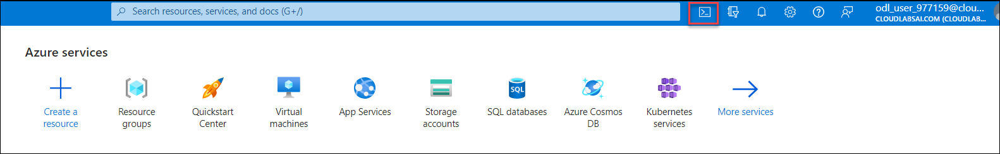
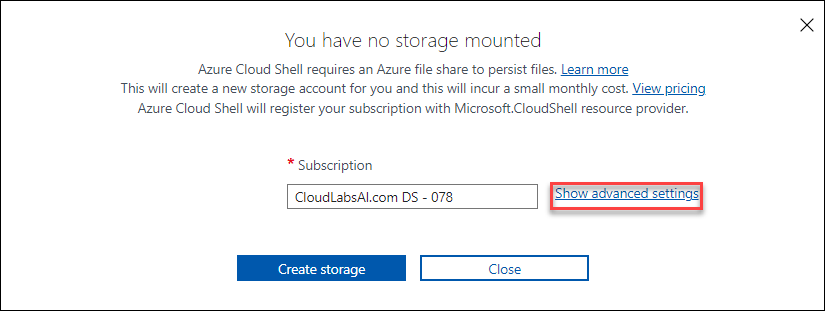
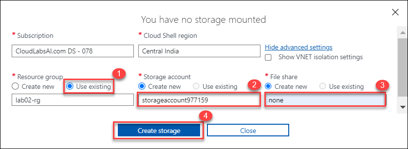
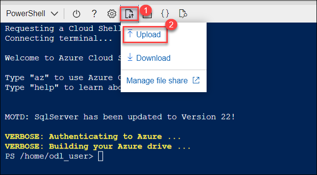

# Lab 06 - Implement Traffic Management
## Lab scenario
You were tasked with testing managing network traffic targeting Azure virtual machines in the hub and spoke network topology, which Contoso is considering implementing in its Azure environment (instead of creating the mesh topology, which you tested in the previous lab). This testing needs to include implementing connectivity between spokes by relying on user defined routes that force traffic to flow via the hub, as well as traffic distribution across virtual machines by using layer 4 and layer 7 load balancers. For this purpose, you intend to use Azure Load Balancer (layer 4) and Azure Application Gateway (layer 7).

## Objectives
In this lab, you will complete the following tasks:
+ Task 1: Provision the lab environment
+ Task 2: Configure the hub and spoke network topology
+ Task 3: Test the transitivity of virtual network peering
+ Task 4: Configure routing in the hub and spoke topology
+ Task 5: Implement Azure Load Balancer
+ Task 6: Implement Azure Application Gateway

## Estimated timing: 90 minutes

## Architecture diagram


## Excercise 1: Implement Traffic Management

### Task 1: Provision the lab environment
In this task, you will deploy four virtual machines into the same Azure region. The first two will reside in a hub virtual network, while each of the remaining two will reside in a separate spoke virtual network.

1. In the Azure portal, open the **Azure Cloud Shell** by clicking on the icon in the top right of the Azure Portal.

   

1. If prompted to select either **Bash** or **PowerShell**, select **PowerShell**. 

   
   
   >**Note**: If this is the first time you are starting **Cloud Shell** and you are presented with the **You have no storage mounted** message, select the subscription you are using in this lab, and click **Show Advanced Settings**. 
       
   > Under the **Show advanced settings**, provide the following details and click **Create Storage(4)**.

   * Resource group : Select **Use existing(1)** -> **az104-06-rg1**
   * Storage account : Select **Create new(2)** and Enter **cloudstore<inject key="DeploymentID" enableCopy="false"/>**
   * File Share: Select **Create new** and Enter **none(3)**

    

   > **Note :** Please wait until the storage account is created and proceed with next step.
   
1. In the toolbar of the Cloud Shell pane, click the **Upload/Download files (1)** icon, in the drop-down menu, click **Upload (2)** and upload the files **C:\AllFiles\AZ-104-MicrosoftAzureAdministrator-Lab-Files\Allfiles\Labs\06\az104-06-vms-loop-template.json** and **C:\AllFiles\AZ-104-MicrosoftAzureAdministrator-Lab-Files\Allfiles\Labs\06\az104-06-vms-loop-parameters.json** into the Cloud Shell home directory.

    
    

1. From the Cloud Shell pane, run the following to create the first resource group that will be hosting the lab environment:

   ```powershell
   Get-AzResourceGroup
   
   $rgName = 'az104-06-rg1'
   
   ```

1. From the Cloud Shell pane, run the following to create the three virtual networks and four Azure VMs into them by using the template and parameter files you uploaded:

   ```powershell
   New-AzResourceGroupDeployment `
      -ResourceGroupName $rgName `
      -TemplateFile $HOME/az104-06-vms-loop-template.json `
      -TemplateParameterFile $HOME/az104-06-vms-loop-parameters.json
      
   ```

1. Enter any Password at the **adminPassword** prompt.

    >**Note**: Wait for the deployment to complete before proceeding to the next step. This should take about 5 minutes.

1. From the Cloud Shell pane, run the following to install the Network Watcher extension on the Azure VMs deployed in the previous step:

   ```powershell
   $location = (Get-AzResourceGroup -ResourceGroupName $rgName).location
   $vmNames = (Get-AzVM -ResourceGroupName $rgName).Name

   foreach ($vmName in $vmNames) {
     Set-AzVMExtension `
     -ResourceGroupName $rgName `
     -Location $location `
     -VMName $vmName `
     -Name 'networkWatcherAgent' `
     -Publisher 'Microsoft.Azure.NetworkWatcher' `
     -Type 'NetworkWatcherAgentWindows' `
     -TypeHandlerVersion '1.4'
   }
   ```

    >**Note**: Wait for the deployment to complete before proceeding to the next step. This should take about 5 minutes.

1. Close the Cloud Shell pane.
    
   > **Congratulations** on completing the task! Now, it's time to validate it. Here are the steps:
   > - Navigate to the Lab Validation Page, from the upper right corner in the lab guide section.
   > - Hit the Validate button for the corresponding task. If you receive a success message, you can proceed to the next task. 
   > - If not, carefully read the error message and retry the step, following the instructions in the lab guide.
   > - If you need any assistance, please contact us at labs-support@spektrasystems.com. We are available 24/7 to help you out.

### Task 2: Configure the hub and spoke network topology
In this task, you will configure local peering between the virtual networks you deployed in the previous tasks to create a hub and spoke network topology.

1. In the Azure portal, search for and select **Virtual networks**.

1. Review the virtual networks you created in the previous task.

    >**Note**: The template you used for the deployment of the three virtual networks ensures that the IP address ranges of the three virtual networks do not overlap.

1. In the list of virtual networks, select **az104-06-vnet2**.

1. On the **az104-06-vnet2** blade, select **Properties(1)**. 

1. On the **az104-06-vnet2 \| Properties** blade, record the value of the **Resource ID(2)** property.

   

1. Navigate back to the list of virtual networks and select **az104-06-vnet3**.

1. On the **az104-06-vnet3** blade, select **Properties(1)**. 

1. On the **az104-06-vnet3 \| Properties** blade, record the value of the **Resource ID(2)** property.

   

    >**Note**: You will need the values of the ResourceID property for both virtual networks later in this task.

    >**Note**: This is a workaround that addresses the issue with the Azure portal occasionally not displaying the newly provisioned virtual network when creating virtual network peerings.

1. In the list of virtual networks, click **az104-06-vnet01**.

1. On the **az104-06-vnet01** virtual network blade, in the **Settings** section, click **Peerings** and then click **+ Add**.

1. Add a peering with the following settings (leave others with their default values) and click Add:

    | Setting | Value |
    | --- | --- |
    | This virtual network: Peering link name | **az104-06-vnet01_to_az104-06-vnet2** |
    | Traffic to remote virtual network | **Allow** |
    | Traffic forwarded from remote virtual network | **Block traffic that originates from outside this virtual network** |
    | Virtual network gateway | **None** |
    | Remote virtual network: Peering link name | **az104-06-vnet2_to_az104-06-vnet01** |
    | Virtual network deployment model | **Resource manager** |
    | I know my resource ID | enabled |
    | Resource ID | the value of resourceID parameter of **az104-06-vnet2** you recorded earlier in this task |
    | Traffic to remote virtual network | **Allow** |
    | Traffic forwarded from remote virtual network | **Allow** |
    | Virtual network gateway | **None** |

    >**Note**: Wait for the operation to complete.

    >**Note**: This step establishes two local peerings - one from az104-06-vnet01 to az104-06-vnet2 and the other from az104-06-vnet2 to az104-06-vnet01.

    >**Note**: **Allow forwarded traffic** needs to be enabled in order to facilitate routing between spoke virtual networks, which you will implement later in this lab.

1. On the **az104-06-vnet01** virtual network blade, in the **Settings** section, click **Peerings** and then click **+ Add**.

1. Add a peering with the following settings (leave others with their default values) and click Add:

    | Setting | Value |
    | --- | --- |
    | This virtual network: Peering link name | **az104-06-vnet01_to_az104-06-vnet3** |
    | Traffic to remote virtual network | **Allow** |
    | Traffic forwarded from remote virtual network | **Block traffic that originates from outside this virtual network** |
    | Virtual network gateway | **None** |
    | Remote virtual network: Peering link name | **az104-06-vnet3_to_az104-06-vnet01** |
    | Virtual network deployment model | **Resource manager** |
    | I know my resource ID | enabled |
    | Resource ID | the value of resourceID parameter of **az104-06-vnet3** you recorded earlier in this task |
    | Traffic to remote virtual network | **Allow** |
    | Traffic forwarded from remote virtual network | **Allow** |
    | Virtual network gateway | **None** |

    >**Note**: This step establishes two local peerings - one from az104-06-vnet01 to az104-06-vnet3 and the other from az104-06-vnet3 to az104-06-vnet01. This completes setting up the hub and spoke topology (with two spoke virtual networks).

    >**Note**: **Allow forwarded traffic** needs to be enabled in order to facilitate routing between spoke virtual networks, which you will implement later in this lab.


   > **Congratulations** on completing the task! Now, it's time to validate it. Here are the steps:
   > - Navigate to the Lab Validation Page, from the upper right corner in the lab guide section.
   > - Hit the Validate button for the corresponding task. If you receive a success message, you can proceed to the next task. 
   > - If not, carefully read the error message and retry the step, following the instructions in the lab guide.
   > - If you need any assistance, please contact us at labs-support@spektrasystems.com. We are available 24/7 to help you out.

### Task 3: Test the transitivity of virtual network peering
In this task, you will test the transitivity of virtual network peering by using Network Watcher.

1. In the Azure portal, search for and select **Network Watcher**.

1.  On the **Network Watcher** blade, expand the listing of Azure regions and verify the service is enabled in the region you are using. 

1. On the **Network Watcher** blade, navigate to the **Connection troubleshoot**.

1. On the **Network Watcher - Connection troubleshoot** blade, initiate a check with the following settings (leave others with their default values):

    | Setting | Value |
    | --- | --- |
    | Subscription | the name of the Azure subscription you are using in this lab |
    | Resource group | **az104-06-rg1** |
    | Source type | **Virtual machine** |
    | Virtual machine | **az104-06-vm0** |
    | Destination | **Specify manually** |
    | URI, FQDN or IPv4 | **10.62.0.4** |
    | Protocol | **TCP** |
    | Destination Port | **3389** |

    > **Note**: **10.62.0.4** represents the private IP address of **az104-06-vm2**

1. Click **Run diagnostic tests** and wait until the results of the connectivity check are returned. Verify that the status is **Success**. Review the network path and note that the connection was direct, with no intermediate hops in between the VMs.

    > **Note**: This is expected since the hub virtual network has peered directly with the first spoke virtual network.

1. On the **Network Watcher - Connection troubleshoot** blade, initiate a check with the following settings (leave others with their default values):

    | Setting | Value |
    | --- | --- |
    | Subscription | the name of the Azure subscription you are using in this lab |
    | Resource group | **az104-06-rg1** |
    | Source type | **Virtual machine** |
    | Virtual machine | **az104-06-vm0** |
    | Destination | **Specify manually** |
    | URI, FQDN or IPv4 | **10.63.0.4** |
    | Protocol | **TCP** |
    | Destination Port | **3389** |

    > **Note**: **10.63.0.4** represents the private IP address of **az104-06-vm3**

1. Click **Run diagnostic tests** and wait until the results of the connectivity check are returned. Verify that the status is **Success**. Review the network path and note that the connection was direct, with no intermediate hops in between the VMs.

    > **Note**: This is expected since the hub virtual network has peered directly with the second spoke virtual network.

1. On the **Network Watcher - Connection troubleshoot** blade, initiate a check with the following settings (leave others with their default values):

    | Setting | Value |
    | --- | --- |
    | Subscription | the name of the Azure subscription you are using in this lab |
    | Resource group | **az104-06-rg1** |
    | Source type | **Virtual machine** |
    | Virtual machine | **az104-06-vm2** |
    | Destination | **Specify manually** |
    | URI, FQDN or IPv4 | **10.63.0.4** |
    | Protocol | **TCP** |
    | Destination Port | **3389** |

1. Click **Run diagnostic tests** and wait until the results of the connectivity check are returned. Note that the status is **Fail**.

    > **Note**: This is expected since the two spoke virtual networks have not peered with each other (virtual network peering is not transitive).

#### Task 4: Configure routing in the hub and spoke topology
In this task, you will configure and test routing between the two spoke virtual networks by enabling IP forwarding on the network interface of the **az104-06-vm0** virtual machine, enabling routing within its operating system, and configuring user-defined routes on the spoke virtual network.

1. In the Azure portal, search and select **Virtual machines**.

1. On the **Virtual machines** blade, in the list of virtual machines, click **az104-06-vm0**.

1. On the **az104-06-vm0** virtual machine blade, in the **Settings** section, click **Networking**.

1. Click the **az104-06-nic0** link next to the **Network interface** label, and then, on the **az104-06-nic0** network interface blade, in the **Settings** section, click **IP configurations**.

1. Set **IP forwarding** to **Enabled** and save the change.

   > **Note**: This setting is required in order for **az104-06-vm0** to function as a router, which will route traffic between two spoke virtual networks.

   > **Note**: Now you need to configure the operating system of the **az104-06-vm0** virtual machine to support routing.

1. In the Azure portal, navigate back to the **az104-06-vm0** Azure virtual machine blade and click **Overview**.

1. On the **az104-06-vm0** blade, in the **Operations** section, click **Run command**, and, in the list of commands, click **RunPowerShellScript**.

1. On the **Run Command Script** blade, type the following and click **Run** to install the Remote Access Windows Server role.

   ```powershell
   Install-WindowsFeature RemoteAccess -IncludeManagementTools
   ```

   > **Note**: Wait for the confirmation that the command completed successfully.

1. On the **Run Command Script** blade, type the following and click **Run** to install the Routing role service.

   ```powershell
   Install-WindowsFeature -Name Routing -IncludeManagementTools -IncludeAllSubFeature

   Install-WindowsFeature -Name "RSAT-RemoteAccess-Powershell"

   Install-RemoteAccess -VpnType RoutingOnly

   Get-NetAdapter | Set-NetIPInterface -Forwarding Enabled
   ```

   > **Note**: Wait for the confirmation that the command completed successfully.

   > **Note**: Now you need to create and configure user defined routes on the spoke virtual networks.

1. In the Azure portal, search and select **Route tables** and, on the **Route tables** blade, click **+ Create**.

1. Create a route table with the following settings (leave others with their default values):

    | Setting | Value |
    | --- | --- |
    | Subscription | the name of the Azure subscription you are using in this lab |
    | Resource group | **az104-06-rg1** |
    | Location | the name of the Azure region in which you created the virtual networks |
    | Name | **az104-06-rt23** |
    | Propagate gateway routes | **No** |

1. Click **Review and Create**. Let validation occur, and click **Create** to submit your deployment.

   > **Note**: Wait for the route table to be created. This should take about 3 minutes.

1. Click **Go to resource**.

1. On the **az104-06-rt23** route table blade, in the **Settings** section, click **Routes**, and then click **+ Add**.

1. Add a new route with the following settings (leave others with their default values):

    | Setting | Value |
    | --- | --- |
    | Route name | **az104-06-route-vnet2-to-vnet3** |
    | Address prefix destination | **IP Addresses** |
    | Destination IP addresses/CIDR ranges | **10.63.0.0/20** |
    | Next hop type | **Virtual appliance** |
    | Next hop address | **10.60.0.4** |

1. Click **Add**

1. Back on the **az104-06-rt23** route table blade, in the **Settings** section, click **Subnets**, and then click **+ Associate**.

1. Associate the route table **az104-06-rt23** with the following subnet:

    | Setting | Value |
    | --- | --- |
    | Virtual network | **az104-06-vnet2** |
    | Subnet | **subnet0** |

1. Click **OK**

1. Navigate back to **Route tables** blade and click **+ Create**.

1. Create a route table with the following settings (leave others with their default values):

    | Setting | Value |
    | --- | --- |
    | Subscription | the name of the Azure subscription you are using in this lab |
    | Resource group | **az104-06-rg1** |
    | Region | the name of the Azure region in which you created the virtual networks |
    | Name | **az104-06-rt32** |
    | Propagate gateway routes | **No** |

1. Click Review and Create. Let validation occur, and hit Create to submit your deployment.

   > **Note**: Wait for the route table to be created. This should take about 3 minutes.

1. Click **Go to resource**.

1. On the **az104-06-rt32** route table blade, in the **Settings** section, click **Routes**, and then click **+ Add**.

1. Add a new route with the following settings:

    | Setting | Value |
    | --- | --- |
    | Route name | **az104-06-route-vnet3-to-vnet2** |
    | Address prefix destination | **IP Addresses** |
    | Destination IP addresses/CIDR ranges | **10.62.0.0/20** |
    | Next hop type | **Virtual appliance** |
    | Next hop address | **10.60.0.4** |

1. Click **Add**

1. Back on the **az104-06-rt32** route table blade, in the **Settings** section, click **Subnets**, and then click **+ Associate**.

1. Associate the route table **az104-06-rt32** with the following subnet:

    | Setting | Value |
    | --- | --- |
    | Virtual network | **az104-06-vnet3** |
    | Subnet | **subnet0** |

1. Click **OK**

1. In the Azure portal, navigate back to the **Network Watcher - Connection troubleshoot** blade.

1. On the **Network Watcher - Connection troubleshoot** blade, initiate a check with the following settings (leave others with their default values):

    | Setting | Value |
    | --- | --- |
    | Subscription | the name of the Azure subscription you are using in this lab |
    | Resource group | **az104-06-rg1** |
    | Source type | **Virtual machine** |
    | Virtual machine | **az104-06-vm2** |
    | Destination | **Specify manually** |
    | URI, FQDN or IPv4 | **10.63.0.4** |
    | Protocol | **TCP** |
    | Destination Port | **3389** |

1. Click **Run diagnostic tests** and wait until the results of the connectivity check are returned. Verify that the status is **Success**. Review the network path and note that the traffic was routed via **10.60.0.4**, assigned to the **az104-06-nic0** network adapter. If the status is **Fail**, you should stop and then start az104-06-vm0.

    > **Note**: This is expected since the traffic between spoke virtual networks is now routed via the virtual machine located in the hub virtual network, which functions as a router.

    >**Note**:Before giving the IPV4 address, go to the virtual machine and cross verify the ip address.

    > **Note**: You can use **Network Watcher** to view the topology of the network.
    
   > **Congratulations** on completing the task! Now, it's time to validate it. Here are the steps:
   > - Navigate to the Lab Validation Page, from the upper right corner in the lab guide section.
   > - Hit the Validate button for the corresponding task. If you receive a success message, you can proceed to the next task. 
   > - If not, carefully read the error message and retry the step, following the instructions in the lab guide.
   > - If you need any assistance, please contact us at labs-support@spektrasystems.com. We are available 24/7 to help you out.

#### Task 5: Implement Azure Load Balancer
In this task, you will implement an Azure Load Balancer in front of the two Azure virtual machines in the hub virtual network

1. In the Azure portal, search and select **Load balancers** and, on the **Load balancers** blade, click **+ Create**.

1. Create a load balancer with the following settings (leave others with their default values):

    | Setting | Value |
    | --- | --- |
    | Subscription | the name of the Azure subscription you are using in this lab |
    | Resource group | az104-06-rg1 |
    | Name | **az104-06-lb4** |
    | Region| name of the Azure region into which you deployed all other resources in this lab |
    | SKU | **Standard** |
    | Type | **Public** |
    
1. Click Next: **Frontend IP configuration** >, on the Frontend IP configuration tab click **+ Add frontend IP configuration** , under **Add frontend IP configuration** window add the following settings
 
    | Setting | Value |
    | --- | --- |
    | Name | **az104-06-pip4** |
    | IP version | **IPv4** |
    | IP type | **IP address** |
    | Public IP address | **Create new** |

    
    | Setting | Value |
    | --- | --- |
    | Name | **az104-06-pip4** |
    | Availability zone | **No Zone** |

1. Click Next: **Backend pools**, and click **+ Add**.

1. Add a backend pool with the following settings (leave others with their default values):

    | Setting | Value |
    | --- | --- |
    | Name | **az104-06-lb4-be1** |
    | Virtual network | **az104-06-vnet01** |
    | Backend Pool Configuration | **NIC** |
    
1. Click **+ Add**, under **IP Configurations** on the **Add backend pool** blade, select both the virtual machines on the **Add IP configurations to backend pool** window and click on **Add** and then click **Save** to save the IP configurations to the backend pool.

1. Click **Next: Inbound rules >**, **+ Add a load balancing rule** with the following settings (leave others with their default values):

    | Setting | Value |
    | --- | --- |
    | Name | **az104-06-lb4-lbrule1** |
    | IP Version | **IPv4** |
    | Frontend IP Address | **select the LoadBalancerFrontEnd from the drop down**
    | Backend pool | **az104-06-lb4-be1** |    
    | Protocol | **TCP** |
    | Port | **80** |
    | Backend port | **80** |
    | Session persistence | **None** |
    | Idle timeout (minutes) | **4** |
    | TCP reset | **Disabled** |
    | Floating IP (direct server return) | **Disabled** |
    | Health probe | **Create new** |
    
1. click **create new** under **Health probe**, on the **Add load balancing rules** blade.

    Add a health probe with the following settings:

    | Setting | Value |
    | --- | --- |
    | Name | **az104-06-lb4-hp1** |
    | Protocol | **TCP** |
    | Port | **80** |
    | Interval | **5** |

1. Click **OK** and back on the **Add load balancing rules** blade, click **Add**.

1. Click **Next: Outbound rules >**, followed by **Next: Tags >**, followed by **Next: Review + create >**. Let validation occur, and then click **Create** to submit your deployment.

    > **Note**: Wait for the Azure load balancer to be provisioned. This should take about 2 minutes.

1. Wait for the load balancing rule to be created, click **Go to resource** and on the **az104-06-lb4** load balancers blade, in the **Settings** section, click **Frontend IP configuration** and note the value of the **Public IP address**.

1. Start another browser window and navigate to the IP address you identified in the previous step.

1. Verify that the browser window displays the message **Hello World from az104-06-vm0** or **Hello World from az104-06-vm1**.

1. Open another browser window but this time by using InPrivate mode and verify whether the target vm changes (as indicated by the message).

    > **Note**: You might need to refresh the browser window or open it again by using InPrivate mode.
    
   > **Congratulations** on completing the task! Now, it's time to validate it. Here are the steps:
   > - Navigate to the Lab Validation Page, from the upper right corner in the lab guide section.
   > - Hit the Validate button for the corresponding task. If you receive a success message, you can proceed to the next task. 
   > - If not, carefully read the error message and retry the step, following the instructions in the lab guide.
   > - If you need any assistance, please contact us at labs-support@spektrasystems.com. We are available 24/7 to help you out.

#### Task 6: Implement Azure Application Gateway
In this task, you will implement an Azure Application Gateway in front of the two Azure virtual machines in the spoke virtual networks.

1. In the Azure portal, search and select **Virtual networks**.

1. On the **Virtual networks** blade, in the list of virtual networks, click **az104-06-vnet01**.

1. On the  **az104-06-vnet01** virtual network blade, in the **Settings** section, click **Subnets**, and then click **+ Subnet**.

1. Add a subnet with the following settings (leave others with their default values):

    | Setting | Value |
    | --- | --- |
    | Name | **subnet-appgw** |
    | Subnet address range | **10.60.3.224/27** |

1. Click **Save**

    > **Note**: This subnet will be used by the Azure Application Gateway instances, which you will deploy later in this task. The Application Gateway requires a dedicated subnet of /27 or larger size.

1. In the Azure portal, search and select **Application Gateways** and, on the **Application Gateways** blade, click **+ Create**.

1. On the **Basics** tab of the **Create an application gateway** blade, specify the following settings (leave others with their default values):

    | Setting | Value |
    | --- | --- |
    | Subscription | the name of the Azure subscription you are using in this lab |
    | Resource group | az104-06-rg1 |
    | Application gateway name | **az104-06-appgw5** |
    | Region | name of the Azure region into which you deployed all other resources in this lab |
    | Tier | **Standard V2** |
    | Enable autoscaling | **No** |
    | HTTP2 | **Disabled** |
    | Virtual network | **az104-06-vnet01** |
    | Subnet | **subnet-appgw** |

1. Click **Next: Frontends >** and, on the **Frontends** tab of the **Create an application gateway** blade, click **Add new**, and specify the following settings (leave others with their default values):

    | Setting | Value |
    | --- | --- |
    | Frontend IP address type | **Public** |
    | Public IP address name| **Add new** |
    
1. Under **Add a Public IP**, Specify the following settings(leave others with their default values):   

    | Setting | Value |
    | --- | --- |
    | Name | **az104-06-pip5** |
    

1. Click **Next: Backends >**, on the **Backends** tab of the **Create an application gateway** blade, click **Add a backend pool**, and, on the **Add a backend pool** blade, specify the following settings (leave others with their default values):

    | Setting | Value |
    | --- | --- |
    | Name | **az104-06-appgw5-be1** |
    | Add backend pool without targets | **No** |
    | Target type | **IP address or FQDN** |
    | Target | **10.62.0.4** |
    | Target type | **IP address or FQDN** |
    | Target | **10.63.0.4** |

    > **Note**: The targets represent the private IP addresses of virtual machines in the spoke virtual networks **az104-06-vm2** and **az104-06-vm3**.

1. Click **Add**, click **Next: Configuration >** and, on the **Configuration** tab of the **Create an application gateway** blade, click **+ Add a routing rule**.

1. On the **Add a routing rule** blade, on the **Listener** tab, specify the following settings:

    | Setting | Value |
    | --- | --- |
    | Rule name | **az104-06-appgw5-rl1** |
    | Priority | **1** |
    | Listener name | **az104-06-appgw5-rl1l1** |
    | Frontend IP | **Public** |
    | Protocol | **HTTP** |
    | Port | **80** |
    | Listener type | **Basic** |
    | Error page url | **No** |

1. Switch to the **Backend targets** tab of the **Add a routing rule** blade and specify the following settings (leave others with their default values):

    | Setting | Value |
    | --- | --- |
    | Target type | **Backend pool** |
    | Backend target | **az104-06-appgw5-be1** |

1. Click **Add new** under to the **Backend setting** text box, and, on the **Add Backend setting** blade, specify the following settings (leave others with their default values):

    | Setting | Value |
    | --- | --- |
    | Backend setting | **az104-06-appgw5-http1** |
    | Backend protocol | **HTTP** |
    | Backend port | **80** |
    | Cookie-based affinity | **Disable** |
    | Connection draining | **Disable** |
    | Request time-out (seconds) | **20** |

1. Click **Add** on the **Add Backend setting** blade, and back on the **Add a routing rule** blade, click **Add**.

1. Click **Next: Tags >**, followed by **Next: Review + create >** and then click **Create**.

    > **Note**: Wait for the Application Gateway instance to be created. This might take about 8 minutes.

1. In the Azure portal, search and select **Application Gateways** and, on the **Application Gateways** blade, click **az104-06-appgw5**.

1. On the **az104-06-appgw5** Application Gateway blade, note the value of the **Frontend public IP address**.

1. Start another browser window and navigate to the IP address you identified in the previous step.

1. Verify that the browser window displays the message **Hello World from az104-06-vm2** or **Hello World from az104-06-vm3**.

1. Open another browser window but this time by using InPrivate mode and verify whether the target vm changes (based on the message displayed on the web page).

    > **Note**: You might need to refresh the browser window or open it again by using InPrivate mode.

    > **Note**: Targeting virtual machines on multiple virtual networks is not a common configuration, but it is meant to illustrate the point that Application Gateway is capable of targeting virtual machines on multiple virtual networks (as well as endpoints in other Azure regions or even outside of Azure), unlike Azure Load Balancer, which load balances across virtual machines in the same virtual network.
    
   > **Congratulations** on completing the task! Now, it's time to validate it. Here are the steps:
   > - Navigate to the Lab Validation Page, from the upper right corner in the lab guide section.
   > - Hit the Validate button for the corresponding task. If you receive a success message, you can proceed to the next task. 
   > - If not, carefully read the error message and retry the step, following the instructions in the lab guide.
   > - If you need any assistance, please contact us at labs-support@spektrasystems.com. We are available 24/7 to help you out.
    
### Review
In this lab, you have completed:
+ Provisioned the lab environment
+ Configured the hub and spoke network topology
+ Tested transitivity of virtual network peering
+ Configure routing in the hub and spoke topology
+ Implement Azure Load Balancer
+ Implement Azure Application Gateway

## You have successfully completed the lab
