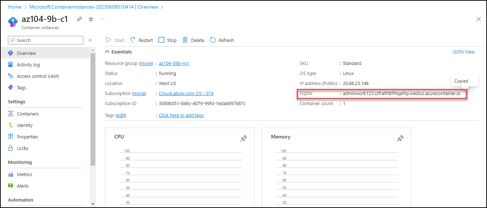
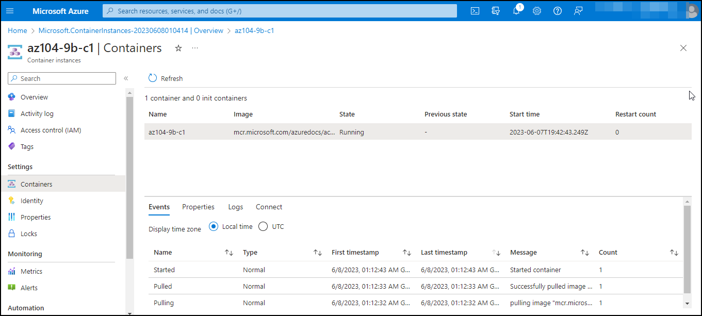

# Lab 09b - Implement Azure Container Instances
# Student lab manual

## Lab scenario

Contoso wants to find a new platform for its virtualized workloads. You identified a number of container images that can be leveraged to accomplish this objective. Since you want to minimize container management, you plan to evaluate the use of Azure Container Instances for deployment of Docker images.

**Note:** An **[interactive lab simulation](https://mslabs.cloudguides.com/guides/AZ-104%20Exam%20Guide%20-%20Microsoft%20Azure%20Administrator%20Exercise%2014)** is available that allows you to click through this lab at your own pace. You may find slight differences between the interactive simulation and the hosted lab, but the core concepts and ideas being demonstrated are the same. 

## Objectives

In this lab, you will:

- Task 1: Deploy a Docker image by using the Azure Container Instance
- Task 2: Review the functionality of the Azure Container Instance

## Architecture diagram

### Exercise 1

#### Task 1: Deploy a Docker image by using the Azure Container Instance

In this task, you will create a new container instance for the web application.

1. Sign in to the [Azure portal](https://portal.azure.com).

1. In the Azure portal, search for locate **Container instances** and then, on the **Container instances** blade, click **+ Create**.

1. On the **Basics** tab of the **Create container instance** blade, specify the following settings (leave others with their default values):

    

    | Setting | Value |
    | ---- | ---- |
    | Subscription | the name of the Azure subscription you are using in this lab |
    | Resource group | the name of a new resource group **az104-09b-rg1** |
    | Container name | **az104-9b-c1** |
    | Region | the name of a region where you can provision Azure container instances |
    | Image Source | **Quickstart images** |
    | Image | **mcr.microsoft.com/azuredocs/aci-helloworld:latest (Linux)** |

1. Click **Next: Networking >** and, on the **Networking** tab of the **Create container instance** blade, specify the following settings (leave others with their default values):

    

    | Setting | Value |
    | --- | --- |
    | DNS name label | any valid, globally unique DNS host name |

    >**Note**: Your container will be publicly reachable at dns-name-label.region.azurecontainer.io. If you receive a **DNS name label not available** error message, specify a different value.

1. Click **Next: Advanced >**, review the settings on the **Advanced** tab of the **Create container instance** blade without making any changes, click **Review + Create**, ensure that the validation passed and click **Create**.

    >**Note**: Wait for the deployment to complete. This should take about 3 minutes.

    >**Note**: While you wait, you may be interested in viewing the [code behind the sample application](https://github.com/Azure-Samples/aci-helloworld). To view it, browse the \\app folder.

#### Task 2: Review the functionality of the Azure Container Instance

In this task, you will review the deployment of the container instance.

1. On the deployment blade, click the **Go to resource** link.

1. On the **Overview** blade of the container instance, verify that **Status** is reported as **Running**.

    

1. Copy the value of the container instance **FQDN**, open a new browser tab, and navigate to the corresponding URL.

    

1. Verify that the **Welcome to Azure Container Instance** page is displayed.

    

1. Close the new browser tab, back in the Azure portal, in the **Settings** section of the container instance blade, click **Containers**, and then click **Logs**.

    

1. Verify that you see the log entries representing the HTTP GET request generated by displaying the application in the browser.

   > **Congratulations** on completing the task! Now, it's time to validate it. Here are the steps:
   > - Navigate to the Lab Validation Page, from the upper right corner in the lab guide section.
   > - Hit the Validate button for the corresponding task. If you receive a success message, you can proceed to the next task. 
   > - If not, carefully read the error message and retry the step, following the instructions in the lab guide.
   > - If you need any assistance, please contact us at labs-support@spektrasystems.com. We are available 24/7 to help you out.

## Review

In this lab, you have:

- Deployed a Docker image by using the Azure Container Instance
- Reviewed the functionality of the Azure Container Instance
