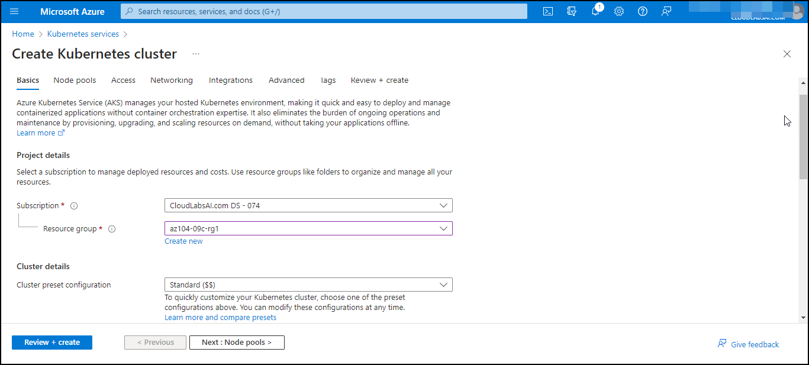
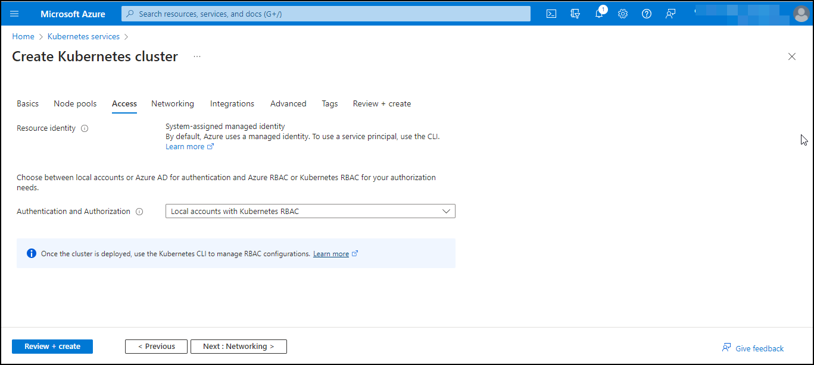
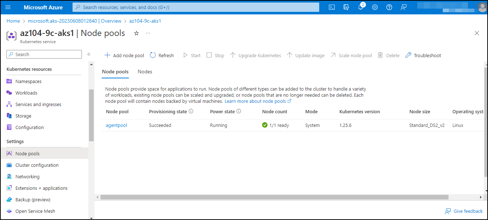
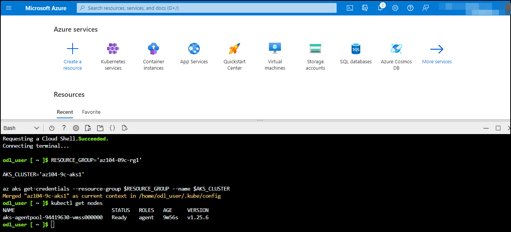
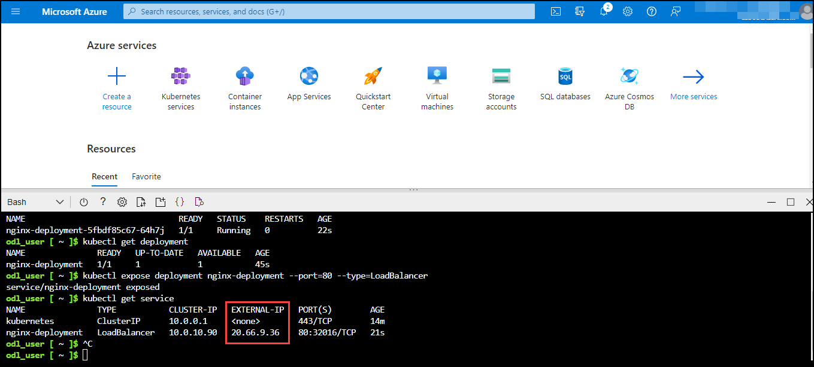
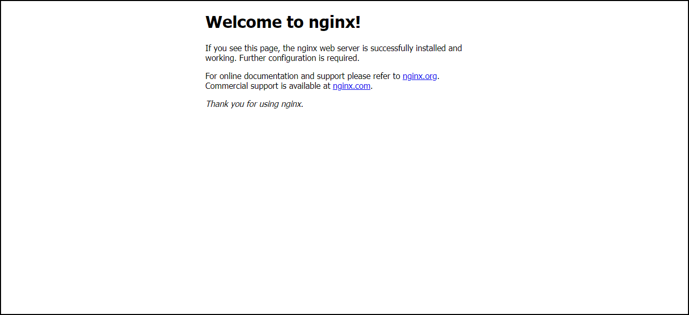
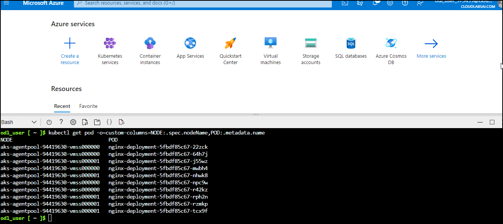

# Lab 09c - Implement Azure Kubernetes Service

## Lab scenario
Contoso has a number of multi-tier applications that are not suitable to run by using Azure Container Instances. In order to determine whether they can be run as containerized workloads, you want to evaluate using Kubernetes as the container orchestrator. To further minimize management overhead, you want to test Azure Kubernetes Service, including its simplified deployment experience and scaling capabilities.

**Note:** An **[interactive lab simulation](https://mslabs.cloudguides.com/guides/AZ-104%20Exam%20Guide%20-%20Microsoft%20Azure%20Administrator%20Exercise%2015)** is available that allows you to click through this lab at your own pace. You may find slight differences between the interactive simulation and the hosted lab, but the core concepts and ideas being demonstrated are the same. 

## Lab objectives
In this lab, you will complete the following tasks:
+ Task 1: Register Microsoft.Kubernetes and Microsoft.KubernetesConfiguration resource providers.
+ Task 2: Deploy an Azure Kubernetes Service cluster
+ Task 3: Deploy pods into the Azure Kubernetes Service cluster
+ Task 4: Scale containerized workloads in the Azure Kubernetes Service cluster

## Estimated timing: 60 minutes

## Architecture diagram


## Exercise 1
### Task 1: Register the Microsoft.Kubernetes and Microsoft.KubernetesConfiguration resource providers.

In this task, you will register resource providers necessary to deploy an Azure Kubernetes Services cluster.

1. If you have not yet signed in, please navigate to the [Azure portal](http://portal.azure.com).

1. In the Azure portal, open the **Azure Cloud Shell** by clicking on the icon in the top right of the Azure Portal.

    

1. If prompted to select either **Bash** or **PowerShell**, select **PowerShell**. 

    >**Note**: If this is the first time you are starting **Cloud Shell** and you are presented with the **You have no storage mounted** message, select the subscription you are using in this lab, and click **Show Advanced Settings**. 
    
    
    
    >Under **Advanced Settings**, you need to select an existing resource group from the **Resource group** dropdown and give some unique name under the **Storage Account** section, and under the **File share** section type none as shown in the below image.

    

1. Click **Create storage**, and wait until the Azure Cloud Shell pane is displayed. 

1. From the Cloud Shell pane, run the following to register the Microsoft.Kubernetes and Microsoft.KubernetesConfiguration resource providers.

   ```powershell
   Register-AzResourceProvider -ProviderNamespace Microsoft.Kubernetes

   Register-AzResourceProvider -ProviderNamespace Microsoft.KubernetesConfiguration
   ```

   

1. Close the Cloud Shell pane.

### Task 2: Deploy an Azure Kubernetes Service cluster

In this task, you will deploy an Azure Kubernetes Services cluster by using the Azure portal.

1. In the Azure portal, search for locate **Kubernetes services** and then, on the **Kubernetes services** blade, click **+ Create**, and then click **+ Create a Kubernetes cluster**.

    

1. On the **Basics** tab of the **Create Kubernetes cluster** blade, specify the following settings (leave others with their default values):

    | Setting | Value |
    | ---- | ---- |
    | Subscription | the name of the Azure subscription you are using in this lab |
    | Resource group | the name of a new resource group **az104-09c-rg1** |
    | Cluster preset configuration | **Dev/Test ($)** |
    | Kubernetes cluster name | **az104-9c-aks1** |
    | Region | the name of a region where you can provision a Kubernetes cluster |
    | Availability zones | **None** (uncheck all boxes) |
    | Kubernetes version | accept the default |
    | API server availability | accept the default |
    | Node size | accept the default |
    | Scale method | **Manual** |
    | Node count | **1** |

1. Click **Next: Node Pools >** and, on the **Node Pools** tab of the **Create Kubernetes cluster** blade, specify the following settings (leave others with their default values):

    | Setting | Value |
    | ---- | ---- |
    | Enable virtual nodes | **Disabled** (default) |

1. Click **Next: Access >** and, on the **Access** tab of the **Create Kubernetes cluster** blade, leave settings with their default values:

    | Setting | Value |
    | ---- | ---- |
    | Resource identity | **System-assigned managed identity** |
    | Authentication method | **Local accounts with Kubernetes RBAC** |

    

1. Click **Next: Networking >** and, on the **Networking** tab of the **Create Kubernetes cluster** blade, specify the following settings (leave others with their default values):

    | Setting | Value |
    | ---- | ---- |
    | Network configuration | **kubenet** |
    | DNS name prefix | **any valid, globally unique DNS prefix** |

1. Click **Next: Integrations >**, on the **Integrations** tab of the **Create Kubernetes cluster** blade, specify the following settings (leave others with their default values):

    | Setting | Value |
    | ---- | ---- |
    | Container monitoring | **Disable** |
    | Enable recommended alert rules | **Uncheck** |
    
1.  Click **Review + create**, ensure that the validation passed and click **Create**.

    >**Note**: In production scenarios, you would want to enable monitoring. Monitoring is disabled in this case since it is not covered in the lab.

    >**Note**: Wait for the deployment to complete. This should take about 10 minutes.

### Task 3: Deploy pods into the Azure Kubernetes Service cluster

In this task, you will deploy a pod into the Azure Kubernetes Service cluster.

1. On the deployment blade, click the **Go to resource** link.

    

1. On the **az104-9c-aks1** Kubernetes service blade, in the **Settings** section, click **Node pools**.

1. On the **az104-9c-aks1 - Node pools** blade, verify that the cluster consists of a single pool with one node.

    

1. In the Azure portal, open the **Azure Cloud Shell** by clicking on the icon in the top right of the Azure Portal.

1. Switch the **Azure Cloud Shell** to **Bash** (black background).

    

1. From the Cloud Shell pane, run the following to retrieve the credentials to access the AKS cluster:

    ```sh
    RESOURCE_GROUP='az104-09c-rg1'

    AKS_CLUSTER='az104-9c-aks1'

    az aks get-credentials --resource-group $RESOURCE_GROUP --name $AKS_CLUSTER
    ```

1. From the **Cloud Shell** pane, run the following to verify connectivity to the AKS cluster:

    ```sh
    kubectl get nodes
    ```

1. In the **Cloud Shell** pane, review the output and verify that the one node which the cluster consists of at this point is reporting the **Ready** status.

    

1. From the **Cloud Shell** pane, run the following to deploy the **nginx** image from the Docker Hub:

    ```sh
    kubectl create deployment nginx-deployment --image=nginx
    ```

    > **Note**: Make sure to use lower case letters when typing the name of the deployment (nginx-deployment)

1. From the **Cloud Shell** pane, run the following to verify that a Kubernetes pod has been created:

    ```sh
    kubectl get pods
    ```

1. From the **Cloud Shell** pane, run the following to identify the state of the deployment:

    ```sh
    kubectl get deployment
    ```

1. From the **Cloud Shell** pane, run the following to make the pod available from Internet:

    ```sh
    kubectl expose deployment nginx-deployment --port=80 --type=LoadBalancer
    ```

1. From the **Cloud Shell** pane, run the following to identify whether a public IP address has been provisioned:

    ```sh
    kubectl get service
    ```

1. Re-run the command until the value in the **EXTERNAL-IP** column for the **nginx-deployment** entry changes from **\<pending\>** to a public IP address. Note the public IP address in the **EXTERNAL-IP** column for **nginx-deployment**.

    

1. Open a browser window and navigate to the IP address you obtained in the previous step. Verify that the browser page displays the **Welcome to nginx!** message.

    

### Task 4: Scale containerized workloads in the Azure Kubernetes service cluster

In this task, you will scale horizontally the number of pods and then number of cluster nodes.

1. From the **Cloud Shell** pane, and run the following to scale the deployment by increasing of the number of pods to 2:

    ```sh
    kubectl scale --replicas=2 deployment/nginx-deployment
    ```

1. From the **Cloud Shell** pane, run the following to verify the outcome of scaling the deployment:

    ```sh
    kubectl get pods
    ```

    

    > **Note**: Review the output of the command and verify that the number of pods increased to 2.

1. From the **Cloud Shell** pane, run the following to scale out the cluster by increasing the number of nodes to 2:

    ```sh
    RESOURCE_GROUP='az104-09c-rg1'

    AKS_CLUSTER='az104-9c-aks1'

    az aks scale --resource-group $RESOURCE_GROUP --name $AKS_CLUSTER --node-count 2
    ```

    > **Note**: Wait for the provisioning of the additional node to complete. This might take about 3 minutes. If it fails, rerun the `az aks scale` command.

1. From the **Cloud Shell** pane, run the following to verify the outcome of scaling the cluster:

    ```sh
    kubectl get nodes
    ```
    
    

    > **Note**: Review the output of the command and verify that the number of nodes increased to 2.

1. From the **Cloud Shell** pane, run the following to scale the deployment:

    ```sh
    kubectl scale --replicas=10 deployment/nginx-deployment
    ```

1. From the **Cloud Shell** pane, run the following to verify the outcome of scaling the deployment:

    ```sh
    kubectl get pods
    ```

    > **Note**: Review the output of the command and verify that the number of pods increased to 10.

1. From the **Cloud Shell** pane, run the following to review the pods distribution across cluster nodes:

    ```sh
    kubectl get pod -o=custom-columns=NODE:.spec.nodeName,POD:.metadata.name
    ```
    

    > **Note**: Review the output of the command and verify that the pods are distributed across both nodes.

1. From the **Cloud Shell** pane, run the following to delete the deployment:

    ```sh
    kubectl delete deployment nginx-deployment
    ```

1. Close the **Cloud Shell** pane.


   > **Congratulations** on completing the task! Now, it's time to validate it. Here are the steps:
   > - Navigate to the Lab Validation Page, from the upper right corner in the lab guide section.
   > - Hit the Validate button for the corresponding task. If you receive a success message, you can proceed to the next task. 
   > - If not, carefully read the error message and retry the step, following the instructions in the lab guide.
   > - If you need any assistance, please contact us at labs-support@spektrasystems.com. We are available 24/7 to help you out.

## Review
In this lab, you have completed:
+ Deployed an Azure Kubernetes Service cluster
+ Deployed pods into the Azure Kubernetes Service cluster
+ Scaled containerized workloads in the Azure Kubernetes service cluster

**You have successfully completed the lab**
