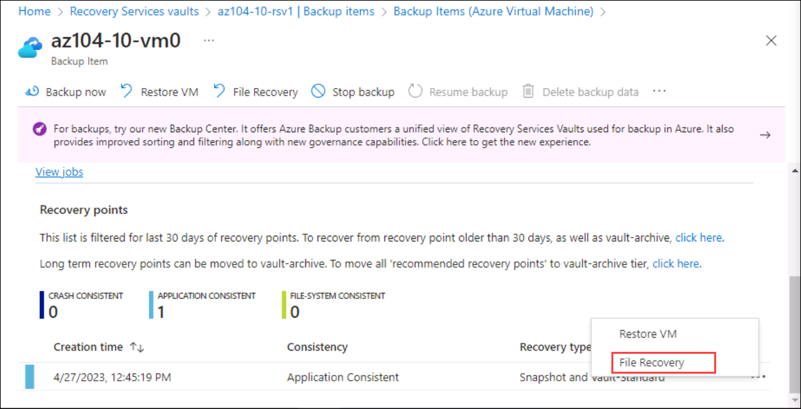

# Lab 10 - Backup virtual machines
# Student lab manual

## Lab scenario

You have been tasked with evaluating the use of Azure Recovery Services for backup and restore of files hosted on Azure virtual machines and on-premises computers. In addition, you want to identify methods of protecting data stored in the Recovery Services vault from accidental or malicious data loss.

## Objectives

In this lab, you will:

+ Task 1: Provision the lab environment
+ Task 2: Create a Recovery Services vault
+ Task 3: Implement Azure virtual machine-level backup
+ Task 4: Implement File and Folder backup
+ Task 5: Perform file recovery by using Azure Recovery Services agent
+ Task 6: Perform file recovery by using Azure virtual machine snapshots (optional)
+ Task 7: Review the Azure Recovery Services soft delete functionality (optional)

## Estimated timing: 50 minutes

## Instructions

### Exercise 1

#### Task 1: Provision the lab environment

In this task, you will deploy two virtual machines that will be used to test different backup scenarios.

1. If you have not yet signed in, please navigate to the [**Azure portal**](http://portal.azure.com).

1. On the azure portal home page go to **Resource Groups** and click on **az104-10-rg0-<inject key="DeploymentID" enableCopy="false"/>** resource group, on the overview page of **az104-10-rg0-<inject key="DeploymentID" enableCopy="false"/>** copy the location and paste it in a notepad you will need it in next steps

1. In the Azure portal, open the **Azure Cloud Shell** by clicking on the icon in the top right of the Azure Portal.

1. If prompted to select either **Bash** or **PowerShell**, select **PowerShell**. 

    >**Note**: If this is the first time you are starting **Cloud Shell** and you are presented with the **You have no storage mounted** message, select the subscription you are using in this lab, and click **Show Advanced Settings**. 
    
    
    
    >Under **Advanced Settings**, you need to select an existing resource group from the **Resource group** dropdown and give some unique name under the **Storage Account** section, and under the **File share** section type none as shown in the below image.

    

1. Click **Create storage**, and wait until the Azure Cloud Shell pane is displayed.

1. In the toolbar of the Cloud Shell pane, click the **Upload/Download files** icon, in the drop-down menu, click **Upload** and upload the files **C:\AllFiles\AZ-104-MicrosoftAzureAdministrator-master\Allfiles\Labs\10\az104-10-vms-edge-template.json** and **C:\AllFiles\AZ-104-MicrosoftAzureAdministrator-master\Allfiles\Labs\10\az104-10-vms-edge-parameters.json** into the Cloud Shell home directory.

1. From the Cloud Shell pane, run the following to create the first virtual network and deploy a virtual machine into it by using the template and parameter files you uploaded: (replace the `[Azure_region]` placeholder with the location of your resource group and also replace **[DeploymentID]**: **<inject key="DeploymentID" enableCopy="false"/>** 

   >**Note**: You will be prompted to provide an Admin password. Please enter a **password** **<inject key="AzureAdUserPassword"></inject>** within the powershell pane and hit enter.

   ```powershell
   $location = '[Azure_region]'

   $rgName = 'az104-10-rg0-[DeplymentID]'

   New-AzResourceGroupDeployment `
      -ResourceGroupName $rgName `
      -TemplateFile $HOME/az104-10-vms-edge-template.json `
      -TemplateParameterFile $HOME/az104-10-vms-edge-parameters.json `
      -AsJob
   ```

1. Minimize Cloud Shell (but do not close it).

    >**Note**: Do not wait for the deployment to complete but instead proceed to the next task. The deployment should take about 5 minutes.

#### Task 2: Create a Recovery Services vault

In this task, you will create a recovery services vault.

1. In the Azure portal, search for and select **Recovery Services vaults** and, on the **Recovery Services vaults** blade, click **+ Create**.

1. On the **Create Recovery Services vault** blade, specify the following settings:

    | Settings | Value |
    | --- | --- |
    | Subscription | the name of the Azure subscription you are using in this lab |
    | Resource group | the name of a new resource group **az104-10-rg1-<inject key="DeploymentID" enableCopy="false"/>** |
    | Vault Name | **az104-10-rsv1** |
    | Region | the name of a region which you copied in previous steps |

    >**Note**: Make sure that you specify the same region into which you deployed virtual machines in the previous task.

1. Click **Review + Create**, ensure that the validation has passed, and click **Create**.

    >**Note**: Wait for the deployment to complete. The deployment should take less than 1 minute.

1. When the deployment is completed, click **Go to Resource**.

1. On the **az104-10-rsv1** Recovery Services vault blade, in the **Settings** section, click **Properties**.

1. On the **az104-10-rsv1 - Properties** blade, click the **Update** link under **Backup Configuration** label.

1. On the **Backup Configuration** blade, note that you can set the **Storage replication type** to either **Locally-redundant** or **Geo-redundant**. Leave the default setting of **Geo-redundant** in place and close the blade.

    >**Note**: This setting can be configured only if there are no existing backup items.

1. Back on the **az104-10-rsv1 - Properties** blade, click the **Update** link under **Security Settings** label.

1. On the **Security Settings** blade, note that **Soft Delete (For Azure Virtual Machines)** is **Enabled**.

1. Close the **Security Settings** blade and, back on the **az104-10-rsv1** Recovery Services vault blade, click **Overview**.

#### Task 3: Implement Azure virtual machine-level backup

In this task, you will implement Azure virtual-machine level backup.

   >**Note**: Before you start this task, make sure that the deployment you initiated in the first task of this lab has successfully completed. You can check that by going to the respected resource group in the Azure portal and on the overview page of the resource group click on **Deployments**.

1. On the **az104-10-rsv1** Recovery Services vault blade, click **Overview**, then click **+ Backup**.

1. On the **Backup Goal** blade, specify the following settings:

    | Settings | Value |
    | --- | --- |
    | Where is your workload running? | **Azure** |
    | What do you want to backup? | **Virtual machine** |

1. On the **Backup Goal** blade, click **Backup**.

1. On **Configure backup** in **Backup policy**, review the **DefaultPolicy** settings and select **Create a new policy**.

1. Define a new backup policy with the following settings (leave others with their default values):

    | Setting | Value |
    | ---- | ---- |
    | Policy name | **az104-10-backup-policy** |
    | Frequency | **Daily** |
    | Time | **12:00 AM** |
    | Timezone | the name of your local time zone |
    | Retain instant recovery snapshot(s) for | **2** Days(s) |

1. Click **OK** to create the policy and then, in the **Virtual Machines** section, select **Add**.

1. On the **Select virtual machines** blade, select **az-104-10-vm0**, click **OK**, and, back on the **Backup** blade, click **Enable backup**.

    >**Note**: Wait for the backup to be enabled. This should take about 2 minutes.

1. Navigate back to the **az104-10-rsv1** Recovery Services vault blade, in the **Protected items** section, click **Backup items**, and then under Backup Management type select the **Azure virtual machines**  entry.

1. On the **Backup Items (Azure Virtual Machine)** blade of **az104-10-vm0**, review the values of the **Backup Pre-Check** and **Last Backup Status** entries, and click on **View details**.

1. On the **az104-10-vm0** Backup Item blade, click **Backup now**, accept the default value in the **Retain Backup Till** drop-down list, and click **OK**.

    >**Note**: Do not wait for the backup to complete but instead proceed to the next task.

#### Task 4: Implement File and Folder backup

In this task, you will implement file and folder backup by using Azure Recovery Services.

1. In the Azure portal, search for and select **Virtual machines**, and on the **Virtual machines** blade, click **az104-10-vm1**.

1. On the **az104-10-vm1** blade, click **Connect**, in the drop-down menu, click **RDP**, on the **Connect with RDP** blade, click **Download RDP File** and follow the prompts to start the Remote Desktop session.

    >**Note**: This step refers to connecting via Remote Desktop from a Windows computer. On a Mac, you can use Remote Desktop Client from the Mac App Store and on Linux computers, you can use an open source RDP client software.

    >**Note**: You can ignore any warning prompts when connecting to the target virtual machines.

1. When prompted, sign in by using the **Student** username and the **password** **<inject key="AzureAdUserPassword"></inject>**

    >**Note:** Because the Azure portal doesn't support IE11 anymore, you'll have to use the Microsoft Edge Browser for this task.

1. Within the Remote Desktop session to the **az104-10-vm1** Azure virtual machine, select the Windows Start button, search and open **Microsoft Edge** browse to the [Azure portal](https://portal.azure.com), and sign in using your credentials.

1. On **Sign in to Microsoft Azure** blade, you will see a login screen, in that enter the following email/username and then click on **Next**. 
   * Email/Username: <inject key="AzureAdUserEmail"></inject>

1. Now enter the following password and click on **Sign in**.
   * Password: <inject key="AzureAdUserPassword"></inject>

1. In the Azure portal, search for and select **Recovery Services vaults** and, on the **Recovery Services vaults**, click **az104-10-rsv1**.

1. On the **az104-10-rsv1** Recovery Services vault blade, click **+ Backup**.

1. On the **Backup Goal** blade, specify the following settings:

    | Settings | Value |
    | --- | --- |
    | Where is your workload running? | **On-premises** |
    | What do you want to backup? | **Files and folders** |

    >**Note**: Even though the virtual machine you are using in this task is running in Azure, you can leverage it to evaluate the backup capabilities applicable to any on-premises computer running Windows Server operating system.

1. On the **Backup Goal** blade, click **Prepare infrastructure**.

1. On the **Prepare infrastructure** blade, click the **Download Agent for Windows Server or Windows Client** link.

1. After completing the download, click on it to start the installation of **MARSAgentInstaller.exe** with the default settings.

1. On **Installtion Settings** page click on **Next**.

1. On **Proxy Configuration** page click on **Next**.

1. On the **Microsoft Update Opt-In** page of the **Microsoft Azure Recovery Services Agent Setup Wizard**, select the **I do not want to use Microsoft Update** installation option. Then click on Next and Install.

1. On the **Installation** page of the **Microsoft Azure Recovery Services Agent Setup Wizard**, click **Proceed to Registration**. This will start **Register Server Wizard**.

1. Switch to the web browser window displaying the Azure portal, on the **Prepare infrastructure** blade, select the checkbox **Already downloaded or using the latest Recovery Server Agent**, and click **Download**.

1. When prompted, whether to open or save the vault credentials file, click **Save**. This will save the vault credentials file to the local Downloads folder.

1. Switch back to the **Register Server Wizard** window and, on the **Vault Identification** page, click **Browse**.

1. In the **Select Vault Credentials** dialog box, browse to the **Downloads** folder, click the vault credentials file you downloaded, and click **Open**.

1. Back on the **Vault Identification** page, click **Next**.

1. On the **Encryption Setting** page of the **Register Server Wizard**, click **Generate Passphrase**.

1. On the **Encryption Setting** page of the **Register Server Wizard**, click the **Browse** button next to the **Enter a location to save the passphrase** drop-down list.

1. In the **Browse For Folder** dialog box, select the **Documents** folder and click **OK**.

1. Click **Finish**, review the **Microsoft Azure Backup** warning and click **Yes**, and wait for the registration to complete.

    >**Note**: In a production environment, you should store the passphrase file in a secure location other than the server being backed up.

1. On the **Server Registration** page of the **Register Server Wizard**, review the warning regarding the location of the passphrase file, ensure that the **Launch Microsoft Azure Recovery Services Agent** checkbox is selected, and click **Close**. This will automatically open the **Microsoft Azure Backup** console.

1. In the **Microsoft Azure Backup** console, in the **Actions** pane, click **Schedule Backup**.

1. In the **Schedule Backup Wizard**, on the **Getting started** page, click **Next**.

1. On the **Select Items to Backup** page, click **Add Items**.

1. In the **Select Items** dialog box, expand **C:\\Windows\\System32\\drivers\\etc\\**, select **hosts**, and then click **OK**:

1. On the **Select Items to Backup** page, click **Next**.

1. On the **Specify Backup Schedule** page, ensure that the **Day** option is selected under **Schedule a back up every**, in the first drop-down list box below the **At following times (Maximum allowed is three times a day)** box, select **4:30 AM**, and then click **Next**.

1. On the **Select Retention Policy** page, accept the defaults and then click **Next**.

1. On the **Choose Initial Backup type** page, accept the defaults, and then click **Next**.

1. On the **Confirmation** page, click **Finish**. When the backup schedule is created, click **Close**.

1. In the **Microsoft Azure Backup** console, in the **Actions** pane, click **Back Up Now**.

    >**Note**: The option to run backup on demand becomes available once you create a scheduled backup.

1. In the Back Up Now Wizard, on the **Select Backup Item** page, ensure that the **Files and Folders** option is selected and click **Next**.

1. On the **Retain Backup Till** page, accept the default setting and click **Next**.

1. On the **Confirmation** page, click **Back Up**.

1. When the backup is complete, click **Close**, and then minimize the **Microsoft Azure Backup**.

1. Switch to the web browser window displaying the Azure portal, navigate back to the **Recovery Services vault** blade, in the **Protected items** section, and click **Backup items**.

1. On the **az104-10-rsv1 - Backup items** blade, click **Azure Backup Agent**.

1. On the **Backup Items (Azure Backup Agent)** blade, verify that there is an entry referencing the **C:\\** drive of **az104-10-vm1.**.

#### Task 5: Perform file recovery by using Azure Recovery Services agent (optional)

In this task, you will perform file restore by using Azure Recovery Services agent.

1. Within the Remote Desktop session to **az104-10-vm1**, open File Explorer, navigate to the **C:\\Windows\\System32\\drivers\\etc\\** folder and delete the **hosts** file.

1. Open **Microsoft Azure Backup** and click **Recover data** in the **Actions** pane. This will start **Recover Data Wizard**.

1. On the **Getting Started** page of **Recover Data Wizard**, ensure that **This server (az104-10-vm1.)** option is selected and click **Next**.

1. On the **Select Recovery Mode** page, ensure that **Individual files and folders** option is selected, and click **Next**.

1. On the **Select Volume and Date** page, in the **Select the volume** drop down list, select **C:\\**, accept the default selection of the available backup, and click **Mount**.

    >**Note**: Wait for the mount operation to complete. This might take about 2 minutes.

1. On the **Browse And Recover Files** page, note the drive letter of the recovery volume and review the tip regarding the use of robocopy.

1. Select the Windows Start button, search and open **Command Prompt**

1. From the Command Prompt, run the following to copy the restore the **hosts** file to the original location (replace `[recovery_volume]` with the drive letter of the recovery volume you identified earlier):

   ```sh
   robocopy [recovery_volume]:\Windows\System32\drivers\etc C:\Windows\system32\drivers\etc hosts /r:1 /w:1
   ```

1. Switch back to the **Recover Data Wizard** and, on the **Browse and Recover Files**, click **Unmount** and, when prompted to confirm, click **Yes**.

1. Terminate the Remote Desktop session.

#### Task 6: Perform file recovery by using Azure virtual machine snapshots (optional)

In this task, you will restore a file from the Azure virtual machine-level snapshot-based backup.

1. Switch to the browser window running on your lab computer and displaying the Azure portal.

1. In the Azure portal, search for and select **Virtual machines**, and on the **Virtual machines** blade, click **az104-10-vm0**.

1. On the **az104-10-vm0** blade, click **Connect**, in the drop-down menu, click **RDP**, on the **Connect with RDP** blade, click **Download RDP File** and follow the prompts to start the Remote Desktop session.

    >**Note**: This step refers to connecting via Remote Desktop from a Windows computer. On a Mac, you can use Remote Desktop Client from the Mac App Store and on Linux computers, you can use an open source RDP client software.

    >**Note**: You can ignore any warning prompts when connecting to the target virtual machines.

1. When prompted, sign in by using the **Student** username and the password **<inject key="AzureAdUserPassword"></inject>**

   >**Note:** Because the Azure portal doesn't support IE11 anymore, you'll have to use the Microsoft Edge Browser for this task.

1. Within the Remote Desktop session to the **az104-10-vm0**, Click **Start**, search and open **Command Prompt**.

1. From the Command Prompt, run the following to delete the **hosts** file:

   ```sh
   del C:\Windows\system32\drivers\etc\hosts
   ```

   >**Note**: You will restore this file from the Azure virtual machine-level snapshot-based backup later in this task.

1. Within the Remote Desktop session to the **az104-10-vm0** Azure virtual machine,  select the Windows Start button, search and open **Microsoft Edge**  browse to the [Azure portal](https://portal.azure.com), and sign in using your credentials.

1. On **Sign in to Microsoft Azure** blade, you will see a login screen, in that enter the following email/username and then click on **Next**. 
   * Email/Username: <inject key="AzureAdUserEmail"></inject>

1. Now enter the following password and click on **Sign in**.
   * Password: <inject key="AzureAdUserPassword"></inject>

1. In the Azure portal, search for and select **Recovery Services vaults** and, on the **Recovery Services vaults**, click **az104-10-rsv1**.

1. On the **az104-10-rsv1** Recovery Services vault blade, in the **Protected items** section, click **Backup items**.

1. On the **az104-10-rsv1 - Backup items** blade, click **Azure Virtual Machine** and click on View policy.

1. On the **Backup Items (Azure Virtual Machine)** blade, click **az104-10-vm0** view details link.

1. On the **az104-10-vm0** Backup Item blade, click **File Recovery**.

   

    >**Note**: You have the option of running recovery shortly after backup starts based on the application consistent snapshot.

1. On the **File Recovery** blade, accept the default recovery point and click **Download Executable**.

    >**Note**: The script mounts the disks from the selected recovery point as local drives within the operating system from which the script is run.

1. Click **Download** and, when prompted whether to run or save **IaaSVMILRExeForWindows.exe**, click **Save**.

1. Back in the **File Explorer** window, double-click the newly downloaded file.

1. When prompted to provide the password from the portal, copy the password from the **Password to run the script** text box on the **File Recovery** blade, paste it at the Command Prompt, and press **Enter**.

    >**Note**: This will open a Windows PowerShell window displaying the progress of the mount.

    >**Note**: If you receive an error message at this point, refresh the web browser window and repeat the last three steps.

1. Wait for the mount process to complete, review the informational messages in the Windows PowerShell window, note the drive letter assigned to the volume hosting **Windows**, and start File Explorer.

1. In File Explorer, navigate to the drive letter hosting the snapshot of the operating system volume you identified in the previous step and review its content.

1. Switch to the **Command Prompt** window.

1. From the Command Prompt, run the following to copy the restore the **hosts** file to the original location (replace `[os_volume]` with the drive letter of the operating system volume you identified earlier):

   ```sh
   robocopy [os_volume]:\Windows\System32\drivers\etc C:\Windows\system32\drivers\etc hosts /r:1 /w:1
   ```

1. Switch back to the **File Recovery** blade in the Azure portal and click **Unmount Disks**.

1. Terminate the Remote Desktop session.

#### Task 7: Review the Azure Recovery Services soft delete functionality

1. On the lab computer, in the Azure portal, search for and select **Recovery Services vaults** and, on the **Recovery Services vaults**, click **az104-10-rsv1**.

1. On the **az104-10-rsv1** Recovery Services vault blade, in the **Protected items** section, click **Backup items**.

1. On the **az104-10-rsv1 - Backup items** blade, click **Azure Backup Agent**.

1. On the **Backup Items (Azure Backup Agent)** blade, select **view details link** the entry representing the backup of **az104-10-vm1**.

1. On the **C:\\ on az104-10-vm1.** blade, and click on view details and click on **az104-10-vm1.** link under computer name.

1. On the **az104-10-vm1.** Protected Servers blade, click **Delete**.

1. On the **Delete** blade, specify the following settings.

    | Settings | Value |
    | --- | --- |
    | TYPE THE SERVER NAME | **az104-10-vm1.** |
    | Reason | **Recycling Dev/Test server** |
    | Comments | **az104 10 lab** |

    >**Note**: Make sure to include the trailing period when typing the server name

1. Enable the checkbox next to the label **There is backup data of 1 backup items associated with this server. I understand that clicking "Confirm" will permanently delete all the cloud backup data. This action cannot be undone. An alert may be sent to the administrators of this subscription notifying them of this deletion** and click **Delete**.

    >**Note**: This will fail because the Soft delete feature must be disabled.

1. Navigate back to the **az104-10-rsv1 - Backup items** blade and click **Azure Virtual Machines**.

1. On the **az104-10-rsv1 - Backup items** blade, click **Azure Virtual Machine**.

1. On the **Backup Items (Azure Virtual Machine)** blade, select **View details** for **az104-10-vm0**.

1. On the **az104-10-vm0** Backup Item blade, click **Stop backup**.

1. On the **Stop backup** blade, select **Delete Backup Data**, specify the following settings, and click **Stop backup**:

    | Settings | Value |
    | --- | --- |
    | Type the name of Backup item | **az104-10-vm0** |
    | Reason | **Others** |
    | Comments | **az104 10 lab** |

1. Navigate back to the **az104-10-rsv1 - Backup items** blade and click **Refresh**.

    >**Note**: The **Azure Virtual Machine** entry is still lists **1** backup item.

1. Click the **Azure Virtual Machine** entry and, on the **Backup Items (Azure Virtual Machine)** blade, click the **az104-10-vm0** entry.

1. On the **az104-10-vm0** Backup Item blade, note that you have the option to **Undelete** the deleted backup.

    >**Note**: This functionality is provided by the soft-delete feature, which is, by default, enabled for Azure virtual machine backups.

1. Navigate back to the **az104-10-rsv1** Recovery Services vault blade, and in the **Settings** section, click **Properties**.

1. On the **az104-10-rsv1 - Properties** blade, click the **Update** link under **Security Settings** label.

1. On the **Security Settings** blade, Disable **Soft Delete (For eligible Backup Management Types)** and also disable **Security Features (For workloads running on-premises)** and click **Save**.

    >**Note**: This will not affect items already in the soft delete state.

1. Close the **Security Settings** blade and, back on the **az104-10-rsv1** Recovery Services vault blade, click **Overview**.

1. Navigate back to the az104-10-rsv1 Recovery Services vault blade, in the Protected items section, click Backup items, and then click the Azure virtual machines entry and select the **az104-10-vm0** view details link, on Backup Item blade and click **Undelete**.

1. On the **Undelete az104-10-vm0** blade, click **Undelete**.

1. Wait for the undelete operation to complete, refresh the web browser page, if needed, navigate back to the **az104-10-vm0** Backup Item blade, and click **Delete backup data**.

1. On the **Delete Backup Data** blade, specify the following settings and click **Delete**:

    | Settings | Value |
    | --- | --- |
    | Type the name of Backup item | **az104-10-vm0** |
    | Reason | **Others** |
    | Comments | **az104 10 lab** |

1. Repeat the steps at the beginning of this task to delete the backup items for **az104-10-vm1**.

   > **Congratulations** on completing the task! Now, it's time to validate it. Here are the steps:
   > - Navigate to the Lab Validation Page, from the upper right corner in the lab guide section.
   > - Hit the Validate button for the corresponding task. If you receive a success message, you can proceed to the next task. 
   > - If not, carefully read the error message and retry the step, following the instructions in the lab guide.
   > - If you need any assistance, please contact us at labs-support@spektrasystems.com. We are available 24/7 to help you out.

#### Review

In this lab, you have:

+ Provisioned the lab environment
+ Created a Recovery Services vault
+ Implemented Azure virtual machine-level backup
+ Implemented File and Folder backup
+ Performed file recovery by using Azure Recovery Services agent
+ Performed file recovery by using Azure virtual machine snapshots
+ Reviewed the Azure Recovery Services soft delete functionality
