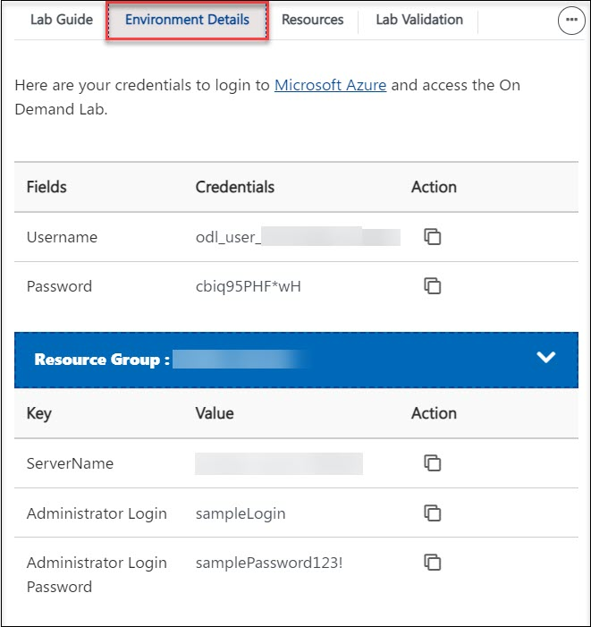
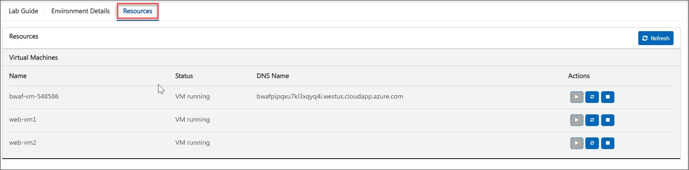
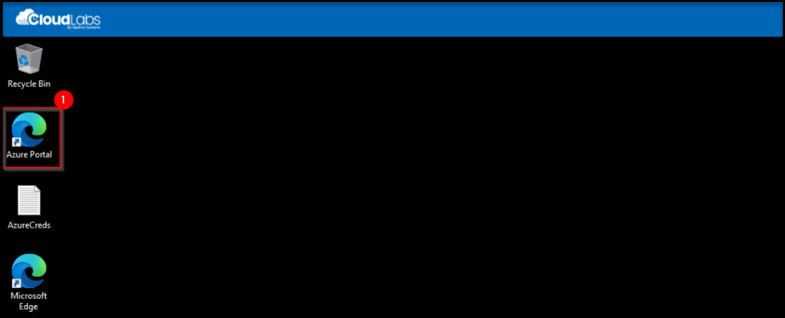
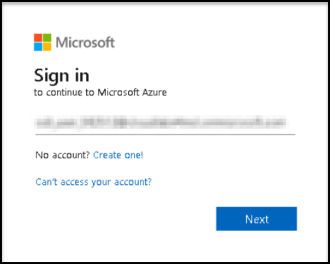

# Getting Started

1. Once the environment is provisioned, a virtual machine and lab guide will get loaded into your browser. Use this virtual machine throughout the workshop to perform the lab.

1. To get the lab environment details, you can select the **Environment Details** tab.

    

1. You can also open the Lab Guide on a separate full window by selecting the **Split Window** button on the bottom right corner.

        

1. Also, you can **start, stop and restart** the virtual machines from the **Resources** tab.

    
    
1. Click on **Next** from the bottom right and follow the instructions to perform the lab.

    

### Log in to Azure Portal and verify the pre-deployed resources.

1. In the virtual machine (VM) on the left, click on the Azure Portal as shown below.

    

1. When you click on Azure portal, the edge browser will ask you to sign in to sync data, click on **Start without your data**.

    

1. On the next window, click on **Confirm and start browsing**.

     

1. Now, you will see two tabs in the edge browser, close the first tab named with Microsoft Edge.
1. On the **Sign in to Microsoft Azure** window, you will see the login screen, enter the following username and click on **Next**.
1. On the Sign in to Microsoft Azure window, you will see the login screen, enter the username and click on Next.

    
     
1. Now enter the password and click on Sign in.
  
    

1. First-time users are often prompted to Stay Signed In, if you see any such pop-up, click on No.

    

1. If a **Welcome to Microsoft Azure** popup window appears, click Maybe Later to skip the tour.
    
