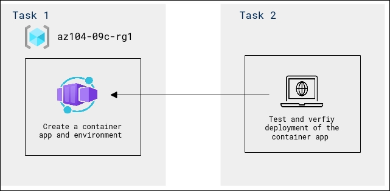

# Lab Scenario Preview - 09 - Administer Serverless Computing
## Lab overview
+ You need to evaluate the use of Azure Web apps for hosting Contoso's websites, hosted currently in the company's on-premises data centers. The websites are running on Windows servers using PHP runtime stack. You also need to determine how you can implement DevOps practices by leveraging Azure web apps deployment slots.
+ Contoso wants to find a new platform for its virtualized workloads. You identified a number of container images that can be leveraged to accomplish this objective. Since you want to minimize container management, you plan to evaluate the use of Azure Container Instances for the deployment of Docker images.
+ Azure Container Apps enables you to run microservices and containerized applications on a serverless platform. With Container Apps, you enjoy the benefits of running containers while leaving behind the concerns of manually configuring cloud infrastructure and complex container orchestrators.

## Lab objectives
In this lab, you will complete the following tasks:
+ Lab 9a - Implement Web Apps
    + Task 1: Create an Azure web app
    + Task 2: Create a staging deployment slot
    + Task 3: Configure web app deployment settings
    + Task 4: Deploy code to the staging deployment slot
    + Task 5: Swap the staging slots
    + Task 6: Configure and test autoscaling of the Azure web app
+ Lab 9b - Implement Azure Container Instances
    + Task 1: Deploy a Docker image by using the Azure Container Instance
    + Task 2: Review the functionality of the Azure Container Instance
      
+ Lab 09c: Implement Azure Container Apps
    + Task 1: Create a container app and environment
    + Task 2: Test and verfiy deployment of the container app

## Lab 9a - Architecture diagram

## Lab 9b - Architecture diagram

## Lab 9c - Architecture diagram

Once you understand the lab's content, you can start the Hands-on Lab by clicking the **Launch** button located in the top right corner. This will lead you to the lab environment and guide. You can also preview the full lab guide [here](https://experience.cloudlabs.ai/#/labguidepreview/8da387c6-31f8-4ee3-b945-e40f1f026219) if you want to go through detailed guide prior to launching lab environment.

