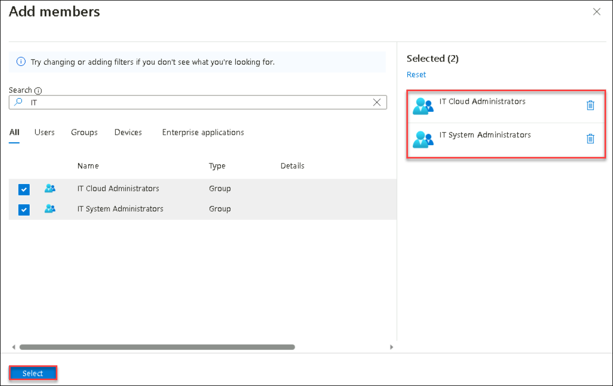
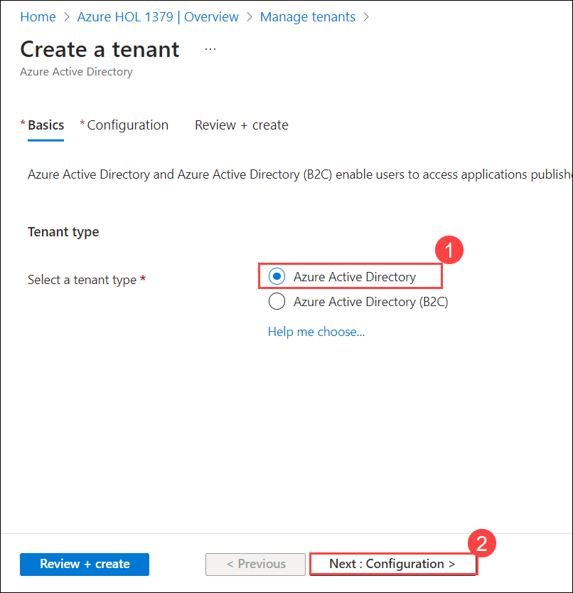

# Lab 01 - Manage Microsoft Entra ID Identities

## Lab scenario
To allow Contoso users to authenticate by using Entra ID, you have been tasked with provisioning users and group accounts. Membership of the groups should be updated automatically based on the user's job titles. You also need to create a test Entra ID tenant with a test user account and grant that account limited permissions to resources in the Contoso Azure subscription.

## Lab objectives
In this lab, you will complete the following tasks:

+ Task 1: Create and configure Entra ID users
+ Task 2: Create Entra ID groups with assigned and dynamic membership
+ Task 3: Create a Microsoft Entra ID tenant
+ Task 4: Manage Entra ID guest users

## Estimated timing: 30 minutes

## Architecture diagram

   
   
## Exercise 1

### Task 1: Create and configure Entra ID users
In this task, you will create and configure Entra ID users.

1. In the Azure portal, search for Microsoft Entra ID (1) and select **Microsoft Entra ID (2)**.

    

1. On the Microsoft Entra ID blade, scroll down to the **Manage** section, click **User settings**, and review available configuration options.

   

1. From the **User settings**  blade, in the **Manage** section, click **Users**.

    

1. Click your user account to display its **Profile** settings. 

     

1. Click **Edit properties**. then navigate to **Settings** tab and make sure that **Usage location** set to **United States**, if not select  **Usage location** to **United States**and click **Save** to apply the change.

     
   
1. Click **Settings** tab and make sure that **Usage location** set to **United States**, if not select  **Usage location** to **United States**and click **Save** to apply the change.

     

    >**Note**: This is necessary in order to assign a Microsoft Entra ID Premium P2 license to your user account later in this lab.
  
1. Navigate back to the **Users - All users** blade, and then click **+ New user (1)** then select **+ Create new user (2)**.

     

1. Create a new user on the **Basics (1)** tab with the following settings (leave others with their defaults) and select **Next: properties (6) >**.

    | Setting | Value |
    | --- | --- |
    | User principal name | **az104-01a-aaduser1 (2)**  |
    | Display Name | **az104-01a-aaduser1 (3)** |
    | Auto-generate password | unchecked **(4)** |
    | Password | **Provide a secure password (5)** |
    | Account enabled | **Checked (7)** |
    
      >**Note**: **Copy to clipboard** the full **User Principal Name** (user name plus domain) and record the password. You will need it later in this task.
    
      
    
 1. On  the **Properties** tab specify the following settings (leave others with their defaults):  

    | Setting | Value |
    | --- | --- |
    | Job title  | **Cloud Administrator** |
    | Department | **IT** |
    | Usage location | **United States** |
    
      
     
      
    
1. Click on **Review + create** and then **Create**.

1. In the list of users, click the newly created user account to display its blade.

   

1. Review the options available in the **Manage** section and note that you can identify the Entra ID roles assigned to the user account as well as the user account's permissions to Azure resources.

1. In the **Manage** section, click **Assigned roles**.

     

1.  Then click **+ Add assignment** button and assign the **User administrator** role to **az104-01a-aaduser1**.

    >**Note**: You also have the option of assigning Entra ID roles when provisioning a new user.

      
     
1. Open an **InPrivate** browser window and sign in to the [Azure portal](https://portal.azure.com) using the newly created user account. When prompted to update the password, change the password to a secure password of your choosing. 

    >**Note**: Rather than typing the user name (including the domain name), you can paste the content of Clipboard.
   

1. In the **InPrivate** browser window, in the Azure portal, search for and select **Microsoft Entra ID**.

      
    >**Note**: While this user account can access the Azure Active Directory tenant, it does not have any access to Azure resources. This is expected since such access would need to be granted explicitly by using Azure Role-Based Access Control. 

1. In the **InPrivate** browser window, on the Entra ID blade, scroll down to the **Manage** section, click **User settings**, note that you do not have permission to modify any configuration options, and sign out of the user account **az104-01a-aaduser1** and close the InPrivate window.

1. In the Azure portal, search for and select **Microsoft Entra ID**, in the **Manage** section, click **Users**, then click **+ New user** then select **+ Create new user**.

     

1. Create a new user on the **Basics** tab with the following settings (leave others with their defaults) and select **Next: properties>**.

    | Setting | Value |
    | --- | --- |
    | User principal name | **az104-01a-aaduser2** |
    | Display Name | **az104-01a-aaduser2** |
    | Auto-generate password | unchecked |
    | Password | **Provide a secure password** |
    | Account enabled | **Checked** |
    
     >**Note**: **Copy to clipboard** the full **User Principal Name** (user name plus domain) and record the password. You will need it later in this task.
    
 1. on **Properties** tab specify the following settings (leave others with their defaults):
    
    | Setting | Value |
    | --- | --- |
    | Job title | **System Administrator** |
    | Department | **IT** |
    | Usage location | **United States** |
    
1. Click on **Review + create** and then **Create**.

1. Sign out as the az104-01a-aaduser1 user from the Azure portal and close the InPrivate browser window.

    >**Note**: If the users are already created then you can skip this task and continue further. 

### Task 2: Create Entra ID groups with assigned and dynamic membership
In this task, you will create Azure Active Directory groups with assigned and dynamic membership.

1. Back in the Azure portal where you are signed in with your **user account**, navigate back to the **Overview** blade of the Entra ID tenant and, in the **Manage** section, click **Licenses**.

          

    >**Note**: Microsoft Entra ID P2 are required in order to implement dynamic groups.

1. In the Azure portal, navigate back to the Entra ID tenant blade and click **Groups**.

            

1. Use the **+ New group** button to create a new group with the following settings:

    | Setting | Value |
    | --- | --- |
    | Group type | **Security (1)** |
    | Group name | **IT Cloud Administrators (2)** |
    | Group description | **Contoso IT cloud administrators (3)** |
    | Membership type | **Dynamic User (4)** |
   
     >**Note**: If the **Membership type** drop-down list is grayed out, wait a few minutes and refresh the browser page.

1. Click **Add dynamic query**.

      

1. On the **Configure Rules** tab of the **Dynamic membership rules** blade, create a new rule with the following setting by clicking on **+Add expression** and **Save**.

    | Setting | Value |
    | --- | --- |
    | Property | **jobTitle** |
    | Operator | **Equals** |
    | Value | **Cloud Administrator** |

       
   
1. Back on the **New Group** blade, click **Create**.

1. Back on the **Groups - All groups** blade of the Entra ID tenant, click the **+ New group** button and create a new group with the following settings:

    | Setting | Value |
    | --- | --- |
    | Group type | **Security** |
    | Group name | **IT System Administrators** |
    | Group description | **Contoso IT system administrators** |
    | Membership type | **Dynamic User** |

1. Click **Add dynamic query**.

1. On the **Configure Rules** tab of the **Dynamic membership rules** blade, create a new rule with the following settings:

    | Setting | Value |
    | --- | --- |
    | Property | **jobTitle** |
    | Operator | **Equals** |
    | Value | **System Administrator** |
    
1. On the **Configure Rules** tab of the **Dynamic membership rules** blade, create a new rule with the following setting by clicking on **+Add expression** and **Save**.

1. Back on the **New Group** blade, click **Create**.

1. Back on the **Groups - All groups** blade of the Entra ID tenant, click the **+ New group** button, and create a new group with the following settings:

    | Setting | Value |
    | --- | --- |
    | Group type | **Security** |
    | Group name | **IT Lab Administrators** |
    | Group description | **Contoso IT Lab administrators** |
    | Membership type | **Assigned** |

1. Click **No members selected**.

1. From the **Add members** blade, search and select the **IT Cloud Administrators** and **IT System Administrators** groups and, back on the **New Group** blade, click **Create**.

       

1. Back on the **Groups - All groups** blade, click the entry representing the **IT Cloud Administrators** group and, then display its **Members** blade. Verify that the **az104-01a-aaduser1** appears in the list of group members.

    >**Note**: You might experience delays with updates of the dynamic membership groups. To expedite the update, navigate to the group blade, display its **Dynamic membership rules** blade, **Edit** the rule listed in the **Rule syntax** textbox by adding whitespace at the end, and **Save** the change.

1. Navigate back to the **Groups - All groups** blade, click the entry representing the **IT System Administrators** group and, then display its **Members** blade. Verify that the **az104-01a-aaduser2** appears in the list of group members.

### Task 3: Create an Microsoft Entra ID tenant
In this task, you will create a new Entra ID tenant.

1. In the Azure portal, search for and select **Microsoft Entra ID**.

   >**Note**: There is a known issue with the Captcha verification in the lab environment. If you receive the error **Creation failed. Too many requests, please try later**, do the following: 
    - Try the creation a few times. 
    - Check the **Manage tenant** section to ensure the tenant wasn't created in the background.  
    - Open a new **InPrivate** window and use the Azure Portal and try to create the tenant from there. 
    - Use the **[interactive lab simulation](https://mslabs.cloudguides.com/guides/AZ-104%20Exam%20Guide%20-%20Microsoft%20Azure%20Administrator%20Exercise%201)** to view the steps.  
    - You can try this task later, but creating a tenant isn't required in other labs. 

1. Click **Manage tenant**, and then on the next screen, click **+ Create**, and specify the following setting:

      
   
    | Setting | Value |
    | --- | --- |
    | Select a tenant type | **Microsoft Entra ID** |    
   
         
    
1. Click **Next: Configuration** then Click **Review + create (4)**

    | Setting | Value |
    | --- | --- |
    | Organization name | **Contoso Lab (1)** |
    | Initial domain name | any valid DNS name consisting of lower case letters and digits and starting with a letter **(2)** | 
    | Country/Region | **United States (3)** |
    

       
   
     > **Note**: The **Initial domain name** should not be a legitimate name that potentially matches your organization or another. The green checkmark in the **Initial domain name** text box will indicate that the domain name you typed in is valid and unique.

1. On **Review + create (4)** page Click **Create**, enter the captcha and click **Submit**.

      

   >**Note**: After clicking on **Submit** wait for 2 mintues and proceed with next step.

1. In the Azure portal search and select **Microsoft Entra ID**.
    
1. Select **Manage tenants** to display the blade of the newly created Entra ID tenant or by selecting **settings** button in the Azure portal toolbar and, click on **Switch**.

### Task 4: Manage Entra ID, guest users.

In this task, you will create Entra ID guest users and grant them access to resources in an Azure subscription.

1. In the Azure portal displaying the Contoso Lab Entra ID tenant, in the **Manage** section, click **Users**, and then click **+ New user** then select **Create new user**.

1. Create a new user on the **Basics** tab with the following settings (leave others with their defaults) and select **Next: properties>**.

    | Setting | Value |
    | --- | --- |
    | User principal name | **az104-01b-aaduser1** |
    |  Display Name | **az104-01b-aaduser1** |
    |  Auto-generate password | uncheck |
    |  Password | **Provide a secure password** |
    | Account enabled | **Checked** |
       
    >**Note**: **Copy to clipboard** the full **User Principal Name** (user name plus domain) and record the password. You will need it later in this task.

 1. on **Properties** tab specify the following settings (leave others with their defaults).

    | Setting | Value |
    | --- | --- |
    | Job title | **System Administrator** |
    | Department | **IT** |
       
1. Click on the newly created profile.

    >**Note**: **Copy to clipboard** the full **User Principal Name** (user name plus domain). You will need it later in this task.

1. Return to the first tenant that you created earlier **xxxxxxx@onmicrosoft.com**.
1. Select **Overview** in the navigation pane.
1. Click **Manage tenants**.
1. Check the box next to the first tenant , then select **Switch**.

1. Navigate back to the **Users - All users** blade, click **+ New user** then select **Invite external user**.

      
    
1. Create a new user on **Basics** tab with the following settings (leave others with their defaults) and select **Next: properties>**.

    | Setting | Value |
    | --- | --- |
    | Email address | the User Principal Name you copied earlier in this task |
    | Display Name | **az104-01b-aaduser1** |
    

        
    
 1. on the **Properties** tab specify the following settings (leave others with their defaults).    
   
    | Setting | Value |
    | --- | --- | 
    | Job title | **Lab Administrator** |
    | Department | **IT** |
    | Usage location | **United States** |

1. Click **Review+Invite** and then **Invite**. 

1. Back on the **Users - All users** blade, click the entry representing the newly created guest user account.

1. On the **az104-01b-aaduser1 - Profile** blade, click **Groups**.

1. Click **+ Add membership** and add the guest user account to the **IT Lab Administrators** group.

   > **Congratulations** on completing the task! Now, it's time to validate it. Here are the steps:
   > - Navigate to the Lab Validation Page, from the upper right corner in the lab guide section.
   > - Hit the Validate button for the corresponding task. If you receive a success message, you can proceed to the next task. 
   > - If not, carefully read the error message and retry the step, following the instructions in the lab guide.
   > - If you need any assistance, please contact us at labs-support@spektrasystems.com. We are available 24/7 to help you out.

### Review
In this lab, you have completed:
- Created and configured Entra ID users
- Created Entra ID groups with assigned and dynamic membership
- Created a Microsoft Entra ID (AD) tenant
- Managed Entra ID guest users 

### You have successfully completed the lab
