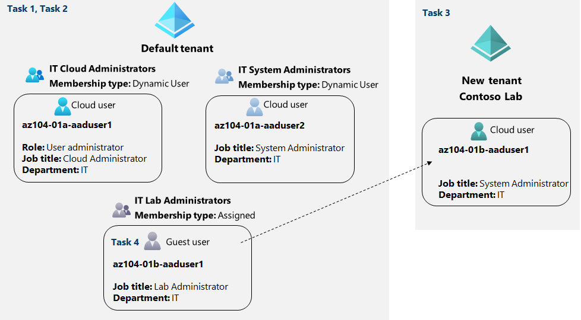

---
lab:
    title: 'Lab 01: Manage Microsoft Entra ID Identities'
    module: 'Administer Identity'
---

# Lab 01 - Manage Microsoft Entra ID Identities

# Student lab manual

## Lab scenario

In order to allow Contoso users to authenticate by using Microsoft Entra ID, you have been tasked with provisioning users and group accounts. Membership of the groups should be updated automatically based on the user job titles. You also need to create a test tenant with a test user account and grant that account limited permissions to resources in the Contoso Azure subscription.

**Note:** An **[interactive lab simulation](https://mslabs.cloudguides.com/guides/AZ-104%20Exam%20Guide%20-%20Microsoft%20Azure%20Administrator%20Exercise%201)** is available that allows you to click through this lab at your own pace. You may find slight differences between the interactive simulation and the hosted lab, but the core concepts and ideas being demonstrated are the same.

## Objectives

In this lab, you will:

+ Task 1: Create and configure users
+ Task 2: Create groups with assigned and dynamic membership
+ Task 3: Create a tenant (Optional - lab environment issue)
+ Task 4: Manage guest users (Optional - lab environment issue)

## Estimated timing: 30 minutes

## Architecture diagram

### Instructions

## Exercise 1

## Task 1: Create and configure  users

In this task, you will create and configure users.

>**Note**: If you have previously used the Trial license for Microsoft Entra ID on this tenant you will need a new tenant and perform  Task 2 after Task 3 in the new tenant.

1. Sign in to the [Azure portal](https://portal.azure.com).

1. In the Azure portal, search for and select **Microsoft Entra ID**.

1. On the Microsoft Entra ID blade, scroll down to the **Manage** section, click **User settings**, and review available configuration options.

1. On the Microsoft Entra ID blade, in the **Manage** section, click **Users**, and then click your user account to display its **Profile** settings. 

1. Click **Edit properties**, and then in the **Settings** tab, set **Usage location** to **United States** and click **Save** to apply the change.

    >**Note**: This is necessary in order to assign an Microsoft Entra ID P2 license to your user account later in this lab.

1. Navigate back to the **Users - All users** blade, and then click **+ New user**.

1. Create a new user with the following settings (leave others with their defaults):

    | Setting | Value |
    | --- | --- |
    | User principal name | **az104-01a-aaduser1** |
    | Display name | **az104-01a-aaduser1** |
    | Auto-generate password | de-select |
    | Initial password | **Provide a secure password** |
    | Job title (Properties tab) | **Cloud Administrator** |
    | Department (Properties tab) | **IT** |
    | Usage location (Properties tab) | **United States** |

    >**Note**: **Copy to clipboard** the full **User Principal Name** (user name plus domain). You will need it later in this task.

1. In the list of users, click the newly created user account to display its blade.

1. Review the options available in the **Manage** section and note that you can identify the roles assigned to the user account as well as the user account's permissions to Azure resources.

1. In the **Manage** section, click **Assigned roles**, then click **+ Add assignment** button and assign the **User administrator** role to **az104-01a-aaduser1**.

    >**Note**: You also have the option of assigning roles when provisioning a new user.

1. Open an **InPrivate** browser window and sign in to the [Azure portal](https://portal.azure.com) using the newly created user account. When prompted to update the password, change the password to a secure password of your choosing. 

    >**Note**: Rather than typing the user name (including the domain name), you can paste the content of Clipboard.

1. In the **InPrivate** browser window, in the Azure portal, search for and select **Microsoft Entra ID**.

    >**Note**: While this user account can access the tenant, it does not have any access to Azure resources. This is expected, since such access would need to be granted explicitly by using Azure Role-Based Access Control. 

1. In the **InPrivate** browser window, on the Microsoft Entra ID blade, scroll down to the **Manage** section, click **User settings**, and note that you do not have permissions to modify any configuration options.

1. In the **InPrivate** browser window, on the Microsoft Entra ID blade, in the **Manage** section, click **Users**, and then click **+ New user**.

1. Create a new user with the following settings (leave others with their defaults):

    | Setting | Value |
    | --- | --- |
    | User principal name | **az104-01a-aaduser2** |
    | Display name | **az104-01a-aaduser2** |
    | Auto-generate password | de-select  |
    | Initial password | **Provide a secure password** |
    | Job title | **System Administrator** |
    | Department | **IT** |
    | Usage location | **United States** |
    
1. Sign out as the az104-01a-aaduser1 user from the Azure portal and close the InPrivate browser window.

## Task 2: Create groups with assigned and dynamic membership

In this task, you will create groups with assigned and dynamic membership.

1. Back in the Azure portal where you are signed in with your **user account**, navigate back to the **Overview** blade of the tenant and, in the **Manage** section, click **Licenses**.

    >**Note**: Microsoft Entra ID Premium P1 or P2 licenses are required in order to implement dynamic groups.

1. In the **Manage** section, click **All products**.

1. Click **+ Try/Buy** and activate the free trial of Microsoft Entra ID Premium P2.

1. Refresh the browser window to verify that the activation was successful. 

    >**Note**: It can take up to 10 minutes for the licenses to activate. Continue refreshing the page until it appears. Do not proceed until the licenses have been activated.

1. From the **Licenses - All products** blade, select the **Microsoft Entra ID P2** entry, and assign all license options to your user account and the two newly created user accounts.

1. In the Azure portal, navigate back to the Microsoft Entra ID tenant blade and click **Groups**.

1. Use the **+ New group** button to create a new group with the following settings:

    | Setting | Value |
    | --- | --- |
    | Group type | **Security** |
    | Group name | **IT Cloud Administrators** |
    | Group description | **Contoso IT cloud administrators** |
    | Membership type | **Dynamic User** |

    >**Note**: If the **Membership type** drop-down list is grayed out, wait a few minutes and refresh the browser page.

1. Click **Add dynamic query**.

1. On the **Configure Rules** tab of the **Dynamic membership rules** blade, create a new rule with the following settings:

    | Setting | Value |
    | --- | --- |
    | Property | **jobTitle** |
    | Operator | **Equals** |
    | Value | **Cloud Administrator** |

1. Save the rule by clicking **+Add expression** and **Save**. Back on the **New Group** blade, click **Create**. 

1. Back on the **Groups - All groups** blade of the tenant, click the **+ New group** button and create a new group with the following settings:

    | Setting | Value |
    | --- | --- |
    | Group type | **Security** |
    | Group name | **IT System Administrators** |
    | Group description | **Contoso IT system administrators** |
    | Membership type | **Dynamic User** |

1. Click **Add dynamic query**.

1. On the **Configure Rules** tab of the **Dynamic membership rules** blade, create a new rule with the following settings:

    | Setting | Value |
    | --- | --- |
    | Property | **jobTitle** |
    | Operator | **Equals** |
    | Value | **System Administrator** |

1. Save the rule by clicking **+Add expression** and **Save**. Back on the **New Group** blade, click **Create**. 

1. Back on the **Groups - All groups** blade of the tenant, click the **+ New group** button, and create a new group with the following settings:

    | Setting | Value |
    | --- | --- |
    | Group type | **Security** |
    | Group name | **IT Lab Administrators** |
    | Group description | **Contoso IT Lab administrators** |
    | Membership type | **Assigned** |
    
1. Click **No members selected**.

1. From the **Add members** blade, search and select the **IT Cloud Administrators** and **IT System Administrators** groups and, back on the **New Group** blade, click **Create**.

1. Back on the **Groups - All groups** blade, click the entry representing the **IT Cloud Administrators** group and, on then display its **Members** blade. Verify that the **az104-01a-aaduser1** appears in the list of group members.

    >**Note**: You might experience delays with updates of the dynamic membership groups. To expedite the update, navigate to the group blade, display its **Dynamic membership rules** blade, **Edit** the rule listed in the **Rule syntax** textbox by adding a whitespace at the end, and **Save** the change.

1. Navigate back to the **Groups - All groups** blade, click the entry representing the **IT System Administrators** group and, on then display its **Members** blade. Verify that the **az104-01a-aaduser2** appears in the list of group members.

## Task 3: Create a tenant (Optional - Possible captcha issues, paid subscription required)

In this task, you will create a new tenant.
    
1. In the Azure portal, search for and select **Microsoft Entra ID**.

    >**Note**: There is a known issue with the Captcha verification in the lab environment. If you receive the error **Creation failed. Too many requests, please try later**, do the following:
    - Try the creation a few times. 
    - Check the **Manage tenant** section to ensure the tenant wasn't created in the background.  
    - Open a new **InPrivate** window and using the Azure Portal and try to create the tenant from there. 
     Raise the problem with the trainer, then use the **[interactive lab simulation](https://mslabs.cloudguides.com/guides/AZ-104%20Exam%20Guide%20-%20Microsoft%20Azure%20Administrator%20Exercise%201)** to view the steps.  
    - You can try this task later, but creating a tenant isn't required in other labs. 

1. Click **Manage tenants**, and then on the next screen, click **+ Create**, and specify the following setting:

    | Setting | Value |
    | --- | --- |
    | Directory type | **Microsoft Entra ID** |
    
1. Click **Next : Configuration**

    | Setting | Value |
    | --- | --- |
    | Organization name | **Contoso Lab** |
    | Initial domain name | any valid DNS name consisting of lower case letters and digits and starting with a letter | 
    | Country/Region | **United States** |

   > **Note**: The **Initial domain name** should not be a legitimate name that potentially matches your organization or another. The green check mark in the **Initial domain name** text box will indicate that the domain name you typed in is valid and unique.

1. Click **Review + create** and then click **Create**.

1. Display the blade of the newly created tenant by using the **Click here to navigate to your new tenant: Contoso Lab** link or the **Directory + Subscription** button (directly to the right of the Cloud Shell button) in the Azure portal toolbar.

## Task 4: Manage guest users.

In this task, you will create  guest users and grant them access to resources in an Azure subscription.

1. In the Azure portal displaying the Contoso Lab tenant, in the **Manage** section, click **Users**, and then click **+ New user**.

1. Create a new user with the following settings (leave others with their defaults):

    | Setting | Value |
    | --- | --- |
    | User principal name | **az104-01b-aaduser1** |
    | Display name | **az104-01b-aaduser1** |
    | Auto-generate password | de-select  |
    | Initial password | **Provide a secure password** |
    | Job title | **System Administrator** |
    | Department | **IT** |

1. Click on the newly created profile.

    >**Note**: **Copy to clipboard** the full **User Principal Name** (user name plus domain). You will need it later in this task.

1. Return to the first tenant that you created earlier. Do this by using the **Directory + Subscription** button (directly to the right of the Cloud Shell button) in the Azure portal toolbar.

1. Navigate back to the **Users - All users** blade, and then click **+ Invite external user**.

1. Invite a new guest user with the following settings (leave others with their defaults):

    | Setting | Value |
    | --- | --- |
    | Email | the User Principal Name you copied earlier in this task |
    | Display Name (Properties tab)  | **az104-01b-aaduser1** |
    | Job title (Properties tab) | **Lab Administrator** |
    | Department (Properties tab) | **IT** |
    | Usage location (Properties tab) | **United States** |

1. Click **Invite**. 

1. Back on the **Users - All users** blade, click the entry representing the newly created guest user account.

1. On the **az104-01b-aaduser1 - Profile** blade, click **Groups**.

1. Click **+ Add membership** and add the guest user account to the **IT Lab Administrators** group.

## Task 5: Clean up resources

> **Note**: Remember to remove any newly created Azure resources that you no longer use. Removing unused resources ensures you will not incur unexpected costs. While, in this case, there are no additional charges associated with tenants and their objects, you might want to consider removing the user accounts, the group accounts, and the tenant you created in this lab.

 > **Note**:  Don't worry if the lab resources cannot be immediately removed. Sometimes resources have dependencies and take a longer time to delete. It is a common Administrator task to monitor resource usage, so just periodically review your resources in the Portal to see how the cleanup is going. 

1. In the **Azure Portal** search for **Microsoft Entra ID** in the search bar. Under **Manage** select **Licenses**. Once at **Licenses** under **Manage** select **All Products** and then select **Microsoft Entra ID Premium P2** item in the list. Proceed by then selecting **Licensed Users**. Select the user accounts **az104-01a-aaduser1** and **az104-01a-aaduser2** to which you assigned licenses in this lab, click **Remove license**, and, when prompted to confirm, click **Yes**.

1. In the Azure portal, navigate to the **Users - All users** blade, click the entry representing the **az104-01b-aaduser1** guest user account, on the **az104-01b-aaduser1 - Profile** blade click **Delete**, and, when prompted to confirm, click **OK**.

1. Repeat the same sequence of steps to delete the remaining user accounts you created in this lab.

1. Navigate to the **Groups - All groups** blade, select the groups you created in this lab, click **Delete**, and, when prompted to confirm, click **OK**.

1. In the Azure portal, display the blade of the Contoso Lab tenant by using the **Directory + Subscription** button (directly to the right of the Cloud Shell button) in the Azure portal toolbar.

1. Navigate to the **Users - All users** blade, click the entry representing the **az104-01b-aaduser1** user account, on the **az104-01b-aaduser1 - Profile** blade click **Delete**, and, when prompted to confirm, click **OK**.

1. Navigate to the **Contoso Lab - Overview** blade of the Contoso Lab tenant, click **Manage tenants** and then on the next screen, select the box next to **Contoso Lab**, click **Delete**, on the **Delete tenant 'Contoso Labs'?** blade, click the **Get permission to delete Azure resources** link, on the **Properties** blade, set **Access management for Azure resources** to **Yes** and click **Save**.

1. Navigate back to the **Delete tenant 'Contoso Lab'** blade and click **Refresh**, click **Delete**.

> **Note**: If a tenant has a trial license, then you would have to wait for the trial license expiration before you could delete the tenant. This would not incur any additional cost.

#### Review

In this lab, you have:

- Created and configured users
- Created groups with assigned and dynamic membership
- Created a tenant
- Managed guest users 
