# Lab 01 - Manage Microsoft Entra ID Identities

## Lab introduction

This is the first in a series of labs for Azure Administrators. In this lab, you learn about users and groups. Users and groups are the basic building blocks for an identity solution. 

## Lab scenario

Your organization is building a new lab environment for pre-production testing of apps and services.  A few engineers are being hired to manage the lab environment, including the virtual machines. To allow the engineers to authenticate by using Microsoft Entra ID, you have been tasked with provisioning users and groups. To minimize administrative overhead, membership of the groups should be updated automatically based on job titles. 

## Interactive lab simulation

This lab uses an interactive lab simulation. The simulation lets you to click through a similar scenario at your own pace. There are differences between the interactive simulation and this lab, but many of the core concepts are the same. An Azure subscription is not required.

>**Note:** This simulation is being updated. Microsoft Entra ID is the new name for Azure Active Directory (Azure AD). 

+ [Manage Entra ID Identities](https://mslabs.cloudguides.com/guides/AZ-104%20Exam%20Guide%20-%20Microsoft%20Azure%20Administrator%20Exercise%201). Create and configure users and assign to groups. Create an Azure tenant and manage guest accounts. 

## Lab objectives
In this lab, you will complete the following tasks:

+ Task 1: Create and configure Entra ID users
+ Task 2: Create Entra ID groups with assigned and dynamic membership
+ Task 3: Create a Microsoft Entra ID tenant
+ Task 4: Manage Entra ID guest users

## Estimated timing: 30 minutes

## Architecture diagram

   
   
## Exercise 1

### Task 1: Create and configure Entra ID users
In this task, you will create and configure Entra ID users.

1. In the Azure portal, search for Microsoft Entra ID (1) and select **Microsoft Entra ID (2)**.

    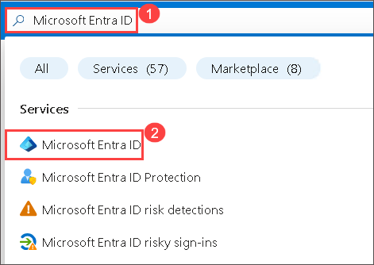

1. On the **Microsoft Entra ID** blade, scroll down to the **Manage** section, click **User settings**, and review available configuration options.

   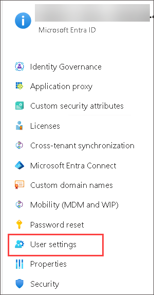

1. From the **User settings**  blade, in the **Manage** section, click **Users**.

    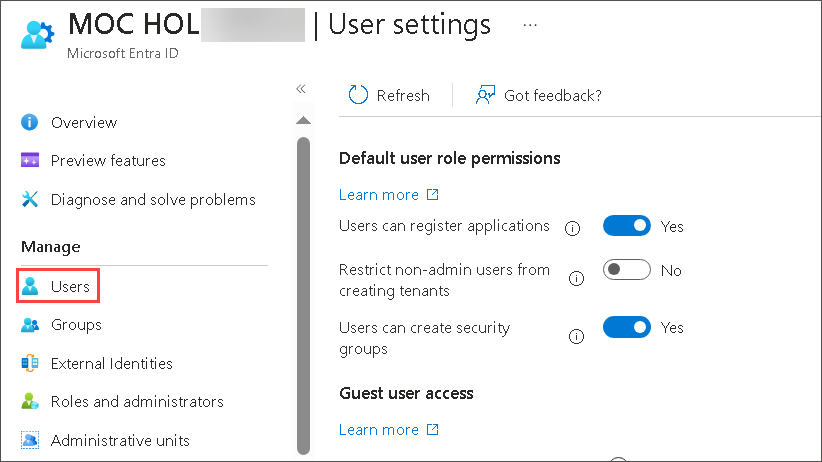

1. Click your user account to display its **Profile** settings. 

     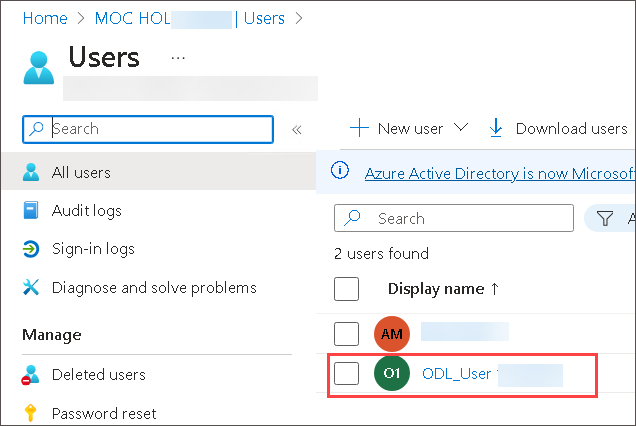

1. Click **Edit properties**. 

     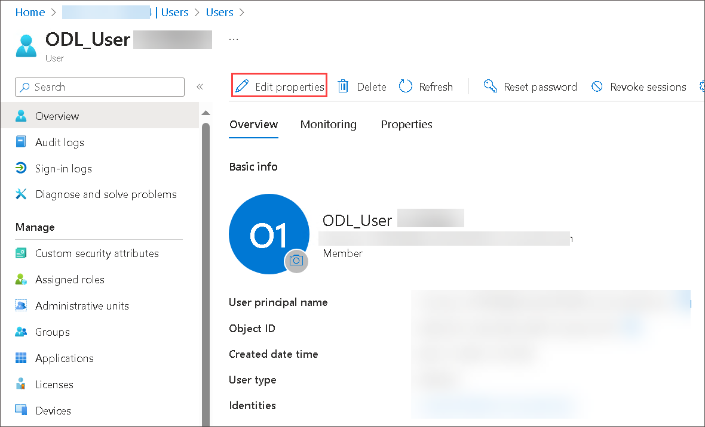
   
1. Click **Settings** tab and make sure that **Usage location** set to **United States**, if not select  **Usage location** to **United States** and click **Save** to apply the change.

     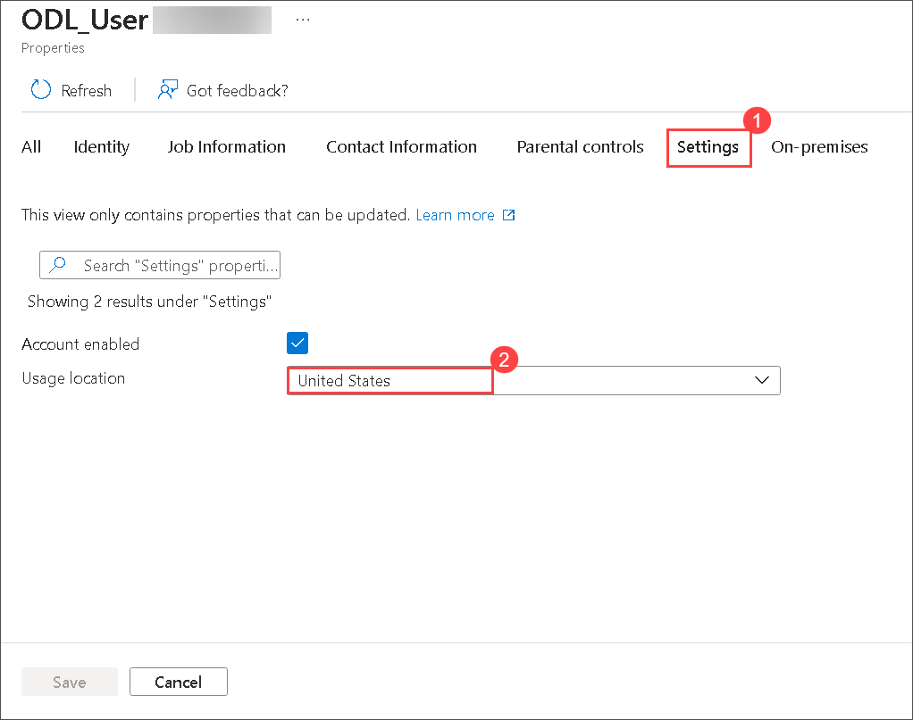

    >**Note**: This is necessary in order to assign a Microsoft Entra ID Premium P2 license to your user account later in this lab.
  
1. Navigate back to the **Users - All users** blade, and then click **+ New user (1)** then select **+ Create new user (2)**.

     

1. Create a new user on the **Basics (1)** tab with the following settings (leave others with their defaults) and select **Next: properties (6) >**.

    | Setting | Value |
    | --- | --- |
    | User principal name | **az104-01a-aaduser1 (2)**  |
    | Display Name | **az104-01a-aaduser1 (3)** |
    | Auto-generate password | unchecked **(4)** |
    | Password | **Provide a secure password (5)** |
    | Account enabled | **Checked (7)** |
    
      >**Note**: **Copy to clipboard** the full **User Principal Name** (user name plus domain) and record the password. You will need it later in this task.
    
      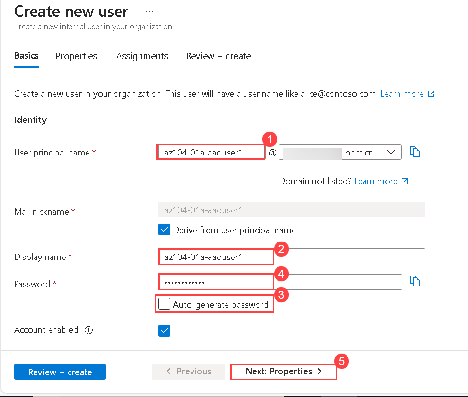
    
 1. On  the **Properties** tab specify the following settings (leave others with their defaults):  

    | Setting | Value |
    | --- | --- |
    | Job title  | **Cloud Administrator** |
    | Department | **IT** |
    | Usage location | **United States** |
    
      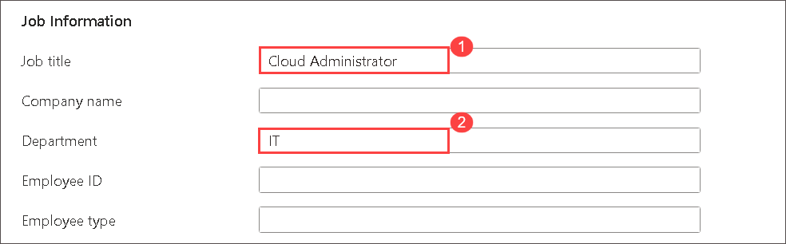
     
      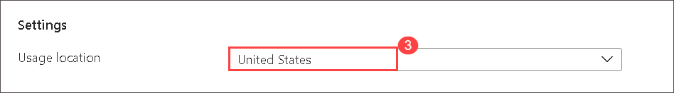
    
1. Click on **Review + create** and then **Create**.

1. In the list of users, click the newly created user account to display its blade.

   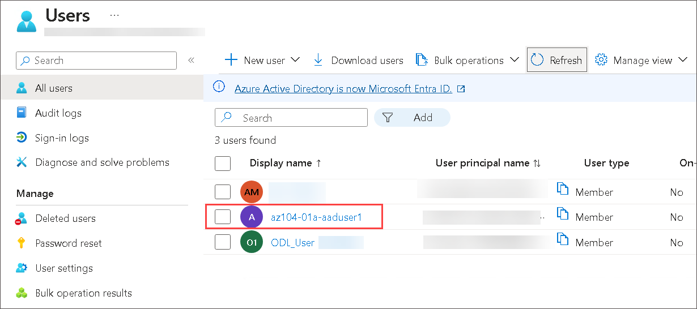

1. Review the options available in the **Manage** section and note that you can identify the Entra ID roles assigned to the user account as well as the user account's permissions to Azure resources.

1. In the **Manage** section, click **Assigned roles**.

     

1.  Then click **+ Add assignment** button and search and select **User administrator** role and click **Add** to assign role to **az104-01a-aaduser1**.

    >**Note**: You also have the option of assigning Entra ID roles when provisioning a new user.

     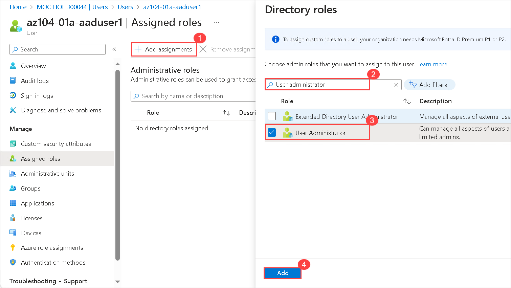
     
1. Open an **InPrivate** browser window and sign in to the [Azure portal](https://portal.azure.com) using the newly created user account. When prompted to update the password, change the password to a secure password of your choosing. 

    >**Note**: Rather than typing the user name (including the domain name), you can paste the content of Clipboard.
   
1. In the **InPrivate** browser window, in the Azure portal, search for and select **Microsoft Entra ID**.

      
    >**Note**: While this user account can access the Azure Active Directory tenant, it does not have any access to Azure resources. This is expected since such access would need to be granted explicitly by using Azure Role-Based Access Control. 

1. In the **InPrivate** browser window, on the Entra ID blade, scroll down to the **Manage** section, click **User settings**, note that you do not have permission to modify any configuration options, and sign out of the user account **az104-01a-aaduser1** and close the InPrivate window.

1. In the Azure portal, search for and select **Microsoft Entra ID**, in the **Manage** section, click **Users**, then click **+ New user** then select **+ Create new user**.

     

1. Create a new user on the **Basics** tab with the following settings (leave others with their defaults) and select **Next: properties>**.

    | Setting | Value |
    | --- | --- |
    | User principal name | **az104-01a-aaduser2** |
    | Display Name | **az104-01a-aaduser2** |
    | Auto-generate password | unchecked |
    | Password | **Provide a secure password** |
    | Account enabled | **Checked** |
    
     >**Note**: **Copy to clipboard** the full **User Principal Name** (user name plus domain) and record the password. You will need it later in this task.
    
 1. on **Properties** tab specify the following settings (leave others with their defaults):
    
    | Setting | Value |
    | --- | --- |
    | Job title | **System Administrator** |
    | Department | **IT** |
    | Usage location | **United States** |
    
1. Click on **Review + create** and then **Create**.

    >**Note**: If the users are already created then you can skip this task and continue further. 

### Task 2: Create Entra ID groups with assigned and dynamic membership
In this task, you will create Azure Active Directory groups with assigned and dynamic membership.

1. Back in the Azure portal where you are signed in with your **user account**, navigate back to the **Overview** blade of the Entra ID tenant and, in the **Manage** section, click **Licenses**.

          

1. Under **Manage** section click on **All products**. Notice the **Microsoft Entra ID P2** is listed and assigned to the odl user.

    >**Note**: Microsoft Entra ID P2 are required in order to implement dynamic groups.
    
    >**Note**: From here you can purchase a license, manage the licenses you have, and assign licenses to users and groups. Select **Licensed features** to see what is available.
    
    >**Note**: Please review the document to enhance your understanding of Microsoft Entra ID P2. You can find it at: https://learn.microsoft.com/en-us/entra/fundamentals/licensing
    
1. In the Azure portal, navigate back to the Entra ID tenant blade and click **Groups**.

            

1. Use the **+ New group** button to create a new group with the following settings:

    | Setting | Value |
    | --- | --- |
    | Group type | **Security (1)** |
    | Group name | **IT Cloud Administrators (2)** |
    | Group description | **Contoso IT cloud administrators (3)** |
    | Membership type | **Dynamic User (4)** |
   
     >**Note**: If the **Membership type** drop-down list is grayed out, wait a few minutes and refresh the browser page.

1. Click **Add dynamic query**.

      

1. On the **Configure Rules** tab of the **Dynamic membership rules** blade, create a new rule with the following setting by clicking on **+ Add expression** and **Save**.

    | Setting | Value |
    | --- | --- |
    | Property | **jobTitle** |
    | Operator | **Equals** |
    | Value | **Cloud Administrator** |

       
   
1. Back on the **New Group** blade, click **Create**.

1. Back on the **Groups - All groups** blade of the Entra ID tenant, click the **+ New group** button and create a new group with the following settings:

    | Setting | Value |
    | --- | --- |
    | Group type | **Security** |
    | Group name | **IT System Administrators** |
    | Group description | **Contoso IT system administrators** |
    | Membership type | **Dynamic User** |

1. Click **Add dynamic query**.

1. On the **Configure Rules** tab of the **Dynamic membership rules** blade, create a new rule with the following setting by clicking on **+ Add expression** and **Save**.

    | Setting | Value |
    | --- | --- |
    | Property | **jobTitle** |
    | Operator | **Equals** |
    | Value | **System Administrator** |

1. Back on the **New Group** blade, click **Create**.

1. Back on the **Groups - All groups** blade of the Entra ID tenant, click the **+ New group** button, and create a new group with the following settings:

    | Setting | Value |
    | --- | --- |
    | Group type | **Security** |
    | Group name | **IT Lab Administrators** |
    | Group description | **Contoso IT Lab administrators** |
    | Membership type | **Assigned** |

1. Click **No members selected**. From the **Add members** blade, under **Groups** tab search and select the **IT Cloud Administrators** and **IT System Administrators** groups and click on **Select**, back on the **New Group** blade, click **Create**.

    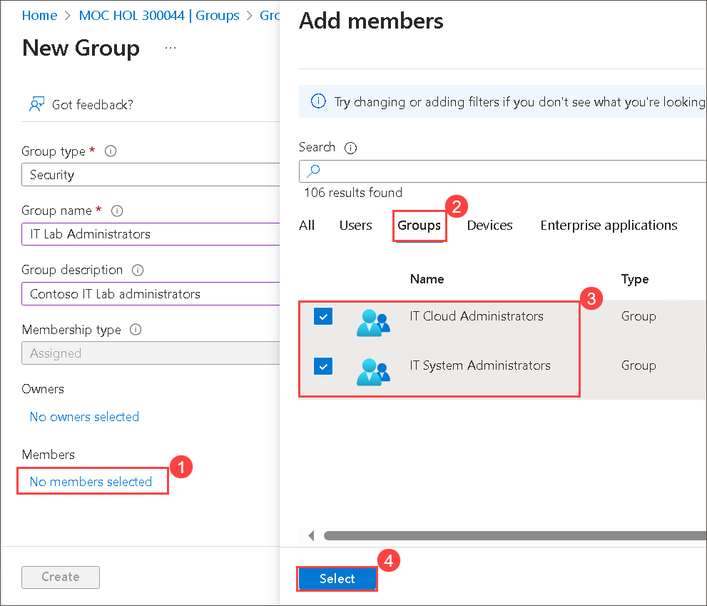
   
1. Back on the **Groups - All groups** blade, click the entry representing the **IT Cloud Administrators** group and, then display its **Members** blade. Verify that the **az104-01a-aaduser1** appears in the list of group members.

    >**Note**: You might experience delays with updates of the dynamic membership groups. To expedite the update, navigate to the group blade, display its **Dynamic membership rules** blade, **Edit** the rule listed in the **Rule syntax** textbox by adding whitespace at the end, and **Save** the change.

1. Navigate back to the **Groups - All groups** blade, click the entry representing the **IT System Administrators** group and, then display its **Members** blade. Verify that the **az104-01a-aaduser2** appears in the list of group members.

### Task 3: Create an Microsoft Entra ID tenant
In this task, you will create a new Entra ID tenant.

1. In the Azure portal in the main browser window, search for and select **Microsoft Entra ID**.
   
1. Click **Manage tenant**, and then on the next screen, click **+ Create**, and specify the following setting:
   
    | Setting | Value |
    | --- | --- |
    | Select a tenant type | **Microsoft Entra ID** |    
    
1. Click **Next: Configuration** then Click **Review + create (4)**

    | Setting | Value |
    | --- | --- |
    | Organization name | **Contoso Lab (1)** |
    | Initial domain name | any valid DNS name consisting of lower case letters and digits and starting with a letter **(2)** | 
    | Country/Region | **United States (3)** |
    
       
   
   > **Note**: The **Initial domain name** should not be a legitimate name that potentially matches your organization or another. The green checkmark in the **Initial domain name** text box will indicate that the domain name you typed in is valid and unique.

1. On **Review + create (4)** page Click **Create**, enter the captcha and click **Submit**.

      

    >**Note**: After clicking on Submit, please wait for 2 minutes before proceeding to the next step. You may not receive any notifications during this time then after some time procced with next step.

    >**Note**: There is a known issue with the Captcha verification in the lab environment. If you receive the error **Creation failed. Too many requests, please try later**, do the following: 
    >- Try the creation a few times. 
    >- Check the **Manage tenant** section to ensure the tenant wasn't created in the background.  
    >- Open a new **InPrivate** window and use the Azure Portal and try to create the tenant from there. 
    >- Use the **[interactive lab simulation](https://mslabs.cloudguides.com/guides/AZ-104%20Exam%20Guide%20-%20Microsoft%20Azure%20Administrator%20Exercise%201)** to view the steps.  
    >- You can try this task later, but creating a tenant isn't required in other labs. 

1. In the Azure portal search and select **Microsoft Entra ID**.
    
1. Select **Manage tenants** to display the blade of the newly created Entra ID tenant and select **settings (1)** button in the Azure portal toolbar and, click on **Switch (2)**.

     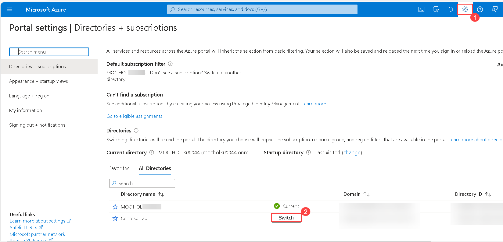

### Task 4: Manage Entra ID, guest users.

In this task, you will create Entra ID guest users and grant them access to resources in an Azure subscription.

1. In the Azure portal displaying the Contoso Lab Entra ID tenant, in the **Manage** section, click **Users**, and then click **+ New user** then select **Create new user**.

1. Create a new user on the **Basics** tab with the following settings (leave others with their defaults) and select **Next: properties>**.

    | Setting | Value |
    | --- | --- |
    | User principal name | **az104-01b-aaduser1** |
    |  Display Name | **az104-01b-aaduser1** |
    |  Auto-generate password | uncheck |
    |  Password | **Provide a secure password** |
    | Account enabled | **Checked** |
       
    >**Note**: **Copy to clipboard** the full **User Principal Name** (user name plus domain) and record the password. You will need it later in this task.

 1. on **Properties** tab specify the following settings (leave others with their defaults).

    | Setting | Value |
    | --- | --- |
    | Job title | **System Administrator** |
    | Department | **IT** |

1. Click on **Review + create** and then **Create**.       
1. Click on the newly created profile.

    >**Note**: **Copy to clipboard** the full **User Principal Name** (user name plus domain). You will need it later in this task.

1. From the left navigation pane in the Entra ID page,select **Overview**.
1. Click **Manage tenants**.
1. Check the box next to the first tenant , then select **Switch**.

    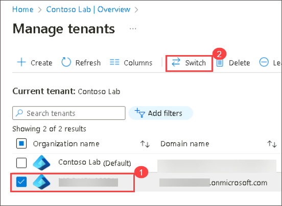

1. Open **Microsoft Entra ID**, from the left navigation pane, under **Manage** select **Users** blade, click **+ New user** then select **Invite external user**.

      
    
1. Create a new user on **Basics** tab with the following settings (leave others with their defaults) and select **Next: properties>**.

    | Setting | Value |
    | --- | --- |
    | Email address | the User Principal Name you copied earlier in this task |
    | Display Name | **az104-01b-aaduser1** |
    

        
    
 1. On the **Properties** tab specify the following settings (leave others with their defaults).    
   
    | Setting | Value |
    | --- | --- | 
    | Job title | **Lab Administrator** |
    | Department | **IT** |
    | Usage location | **United States** |

1. Click **Review + Invite** and then **Invite**. 

1. Back on the **Users - All users** blade, click the entry representing the newly created guest user account.

1. On the **az104-01b-aaduser1 - Profile** blade, click **Groups**.

1. Click **+ Add membership** and add the guest user account to the **IT Lab Administrators** group.

   <validation step="f05516fb-26d1-48f6-a20f-e2f9c0616ec2" />
   
  > **Congratulations** on completing the task! Now, it's time to validate it. Here are the steps:
  > - Hit the Validate button for the corresponding task. If you receive a success message, you can proceed to the next task. 
  > - If not, carefully read the error message and retry the step, following the instructions in the lab guide.
  > - If you need any assistance, please contact us at labs-support@spektrasystems.com. We are available 24/7 to help

### Review
In this lab, you have completed:
- Created and configured Entra ID users
- Created Entra ID groups with assigned and dynamic membership
- Created a Microsoft Entra ID (AD) tenant
- Managed Entra ID guest users 

## Key takeaways

Congratulations on completing the lab. Here are some main takeways for this lab:

+ A tenant represents your organization and helps you to manage a specific instance of Microsoft cloud services for your internal and external users.
+ Microsoft Entra ID has user and guest accounts. Each account has a level of access specific to the scope of work expected to be done.
+ Groups combine together related users or devices. There are two types of groups including Security and Microsoft 365.
+ Group membership can be statically or dynamically assigned.

## Learn more with self-paced training

+ [Understand Microsoft Entra ID](https://learn.microsoft.com/training/modules/understand-azure-active-directory/). Compare Microsoft Entra ID to Active Directory DS, learn about Microsoft Entra ID P1 and P2, and explore Microsoft Entra Domain Services for managing domain-joined devices and apps in the cloud.
+ [Create Azure users and groups in Microsoft Entra ID](https://learn.microsoft.com//training/modules/create-users-and-groups-in-azure-active-directory/). Create users in Microsoft Entra ID. Understand different types of groups. Create a group and add members. Manage business-to-business guest accounts.
+ [Allow users to reset their password with Microsoft Entra self-service password reset](https://learn.microsoft.com/training/modules/allow-users-reset-their-password/). Evaluate self-service password reset to allow users in your organization to reset their passwords or unlock their accounts. Set up, configure, and test self-service password reset.

## Extend your learning with Copilot

Copilot can assist you in learning how to use the Azure scripting tools. Copilot can also assist in areas not covered in the lab or where you need more information. Open an Edge browser and choose Copilot (top right) or navigate to *copilot.microsoft.com*. Take a few minutes to try these prompts.
+ What are the Azure PowerShell and CLI commands to create a security group called IT Admins? Provide the official command reference page.  
+ Provide a step-by-step strategy for managing users and groups in Microsoft Entra ID.
+ What are the steps in the Azure portal to bulk create users and groups?
+ Provide a comparison table of internal and external Microsoft Entra ID user accounts. 

### You have successfully completed the lab
