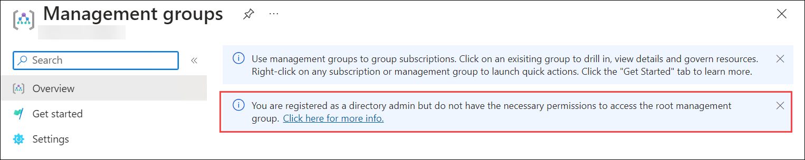
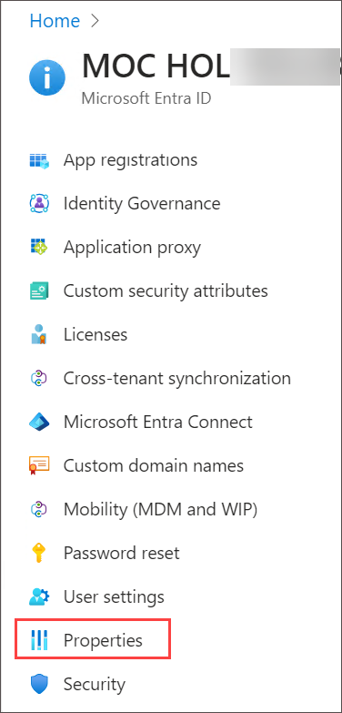
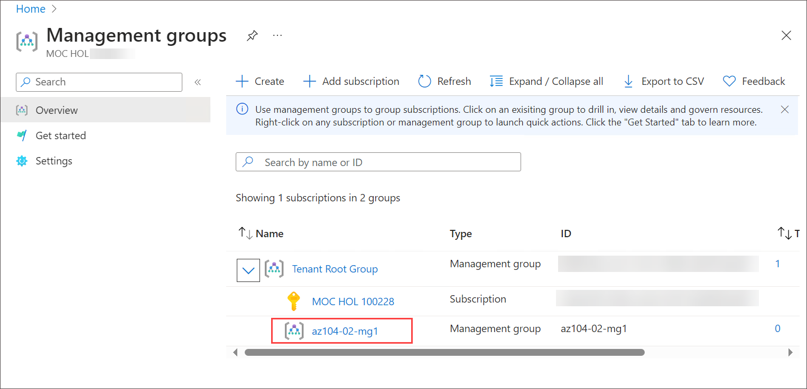
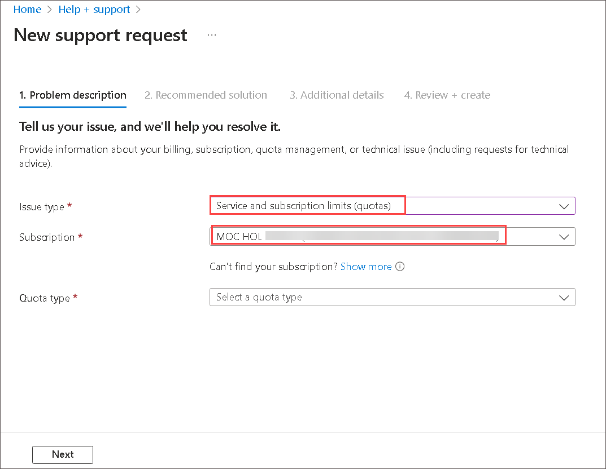

# Lab 02a - Manage Subscriptions and RBAC

## Lab introduction

In this lab, you learn about role-based access control. You learn how to use permissions and scopes to control what actions identities can and cannot perform. You also learn how to make subscription management easier using management groups. 

## Lab scenario

To simplify management of Azure resources in your organization, you have been tasked with implementing the following functionality:

- Creating a management group that includes all your Azure subscriptions.

- Granting permissions to submit support requests for all subscriptions in the management group. The permissions should be limited only to: 

    - Create and manage virtual machines
    - Create support request tickets (do not include adding Azure providers)

## Interactive lab simulations

There are some interactive lab simulations that you might find useful for this topic. The simulation lets you to click through a similar scenario at your own pace. There are differences between the interactive simulation and this lab, but many of the core concepts are the same. An Azure subscription is not required. 

+ [Manage access with RBAC](https://mslearn.cloudguides.com/en-us/guides/AZ-900%20Exam%20Guide%20-%20Azure%20Fundamentals%20Exercise%2014). Assign built-in role to a user and monitor the activity logs. 

+ [Manage subscriptions and RBAC](https://mslabs.cloudguides.com/guides/AZ-104%20Exam%20Guide%20-%20Microsoft%20Azure%20Administrator%20Exercise%202). Implement a management group and create and assign a custom RBAC role.

+ [Open a support request](https://mslearn.cloudguides.com/en-us/guides/AZ-900%20Exam%20Guide%20-%20Azure%20Fundamentals%20Exercise%2022). Review support plan options, then create and monitor a support request, technical or billing.

## Lab objectives
In this lab, you will complete the following tasks:
+ Task 1: Implement Management Groups
+ Task 2: Create custom RBAC roles 
+ Task 3: Assign RBAC roles

## Estimated timing: 60 minutes

## Architecture diagram

   

## Exercise 1

### Task 1: Implement Management Groups
In this task, you will create and configure management groups.

1. On Azure Portal page, in **Search resources, services and docs (G+/)** box at the top of the portal, enter **Management groups**, and then select **Management groups** under services.

     
    
1. Review the messages at the top of the **Management groups** blade. If you are seeing the message stating **You are registered as a directory admin but do not have the necessary permissions to access the root management group**, perform the following sequence of steps:

     

    1. In the Azure portal, search for and select **Microsoft Entra ID**.

         
    
    1.  On the blade displaying properties of your tenant, in the vertical menu on the left side, in the **Manage** section, select **Properties**.
  
         
    
    1.  On the **Properties** blade of your tenant, in the **Access management for Azure resources** section, select **Yes** and then select **Save**.

         
   
    1.  Navigate back to the **Management groups** blade, and select **Refresh**.

1. On the **Management groups** blade, click **+ Create**.

1. On **Create a management** group blade specify the following settings and click **Submit**.

    | Setting | Value |
    | --- | --- |
    | Management group ID | **az104-02-mg1** |
    | Management group display name | **az104-02-mg1** |

    
   
1. In the list of management groups, click the entry representing the newly created management group.

    
 
1. On the **az104-02-mg1** blade, from the left navigation pane click **Subscriptions** and  click **+ Add**.

     

1. On the **Add subscription** blade, in the **Subscription** drop-down list, select the subscription you are using in this lab and click **Save**.

    

1. On the **az104-02-mg1 \| Subscriptions** blade, refresh the page and  copy the ID of your Azure subscription into Clipboard. You will need it in the next task.

      
   
## Task 2: Create a custom RBAC role

In this task, you will create a custom RBAC role. Custom roles are a core part of implementing the principle of least privilege for an environment. Built-in roles might have too many permissions for your scenario. In this task we will create a new role and remove permissions that are not be necessary. Do you have a plan for managing overlapping permissions?

1. Continue working on your management group. In the **Access control (IAM)** blade, select the **Check access** tab and in the **Create a custom role** box, select **Add**.

   

1. On the Basics tab specify the following configuration and select **Next**. 

    | Setting | Value |
    | --- | --- |
    | Custom role name | `Support Request Contributor (Custom)` |
    | Description | A custom contributor role for support requests. |
    | Baseline permissions | select **Clone a role**|
    | Role to clone drop-down menu | select **Support Request Contributor** |

     

1. On **Permissions** tab, and then select **+ Exclude permissions**.

   
   
1. In the resource provider search field, enter `.Support` and select **Microsoft.Support**.

   

1. In the list of permissions, place a checkbox next to **Other: Registers Support Resource Provider** and then select **Add** > **Next**. The role should be updated to include this permission as a *NotAction*.

    
   
    >**Note:** An Azure resource provider is a set of REST operations that enable functionality for a specific Azure service. We do not want the Help Desk to be able to have this capability, so it is being removed from the cloned role. You could also selete and add other capabilities to the new role. 

1. On the **Assignable scopes** tab, ensure your management group is listed, then click **Next**.

    

1. Review the JSON for the *Actions*, *NotActions*, and *AssignableScopes* that are customized in the role.

   

1. Select **Review + Create**, and then select **Create**. Select **OK** when **You have successfully created the custom role "Custom Support Request". It may take the system a few minutes to display your role everywhere** popped up. 

    >**Note:** At this point, you have created a custom role and assigned it to the management group.  

### Task 3: Assign RBAC roles

In this task, you will create a Microsoft Entra ID user, assign the RBAC role you created in the previous task to that user, and verify that the user can perform the task specified in the RBAC role definition.

1. In the Azure portal, search for and select **Microsoft Entra ID**, click on **Users** under the **Manage** section of the left navigation pane, and then click **+ New user** > **Create New User**.

   
  
1. Create a new user with the following settings (leave others with their defaults) and click on **Review + Create**

    | Setting | Value |
    | --- | --- |
    | User Principal name | **az104-02-aaduser1**|
    | Display name | **az104-02-aaduser1**|
    | Auto-generate password | unchecked |
    | Password | **Provide a secure password** |
    | Account enabled | **Checked** |

    >**Note**: **Copy to clipboard** the full **User name**. You will need it later in this lab.

    .png)

1. Click **Create**.
   
1. In the Azure portal, navigate back to the Management group and and select **az104-02-mg1** to display its **details**.

   

1. Click **Access Control (IAM)**, click **+ Add** and then **Add role assignment**.

    

   >**Note**: if your custom role is not visible, it can take up to 10 minutes for the custom role to appear after creation.

1. Search and select **Support Request Contributor (Custom)**. Click **Next**.

    
  
1. On the **Members** tab, click **+ Select members** and **select** user account **az104-02-aaduser1.onmicrosoft.com**. Click **Next** and then **Review and assign**.

     
    
1. Open an **InPrivate** browser window and sign in to the [Azure portal](https://portal.azure.com) using the newly created user account. When prompted to update the password, change the password for the user.

    >**Note**: Rather than typing the user name, you can paste the content of Clipboard.

1. In the **InPrivate** browser window, in the Azure portal, search and select **Resource groups** to verify that the az104-02-aaduser1 user can see all resource groups.
 
    

    
   
1. In the **InPrivate** browser window, in the Azure portal, select **All resources** to verify that the az104-02-aaduser1 user cannot see any resources.

   

1. Verify that the az104-02-aaduser1 user cannot see any resources.

    
   
1. In the **InPrivate** browser window, in the Azure portal, search and select **Help + support**. 
   
   

1. Click **+ Create a support request**.

   
   
1. In the **InPrivate** browser window, on the **Problem Description** tab of the **Help + support - New support request** blade, type **Service and subscription limits** in the Summary field and select the **Service and subscription limits (quotas)** issue type. Note that the subscription you are using in this lab is listed in the **Subscription** drop-down list.
    
    

    >**Note**: The presence of the subscription you are using in this lab in the **Subscription** drop-down list indicates that the account you are using has the permissions required to create the subscription-specific support request.

    >**Note**: If you do not see the **Service and subscription limits (quotas)** option, sign out from the Azure portal and sign in back.

1. Do not continue with creating the support request. Instead, sign out as the az104-02-aaduser1 user from the Azure portal and close the InPrivate browser window.

   > **Congratulations** on completing the task! Now, it's time to validate it. Here are the steps:
   > - Navigate to the Lab Validation Page, from the upper right corner in the lab guide section.
   > - Hit the Validate button for the corresponding task. If you receive a success message, you can proceed to the next task. 
   > - If not, carefully read the error message and retry the step, following the instructions in the lab guide.
   > - If you need any assistance, please contact us at labs-support@spektrasystems.com. We are available 24/7 to help you out.

## Task 4: Monitor role assignments with the Activity Log

In this task, you view the activity log to determine if anyone has created a new role. 

1. In the Azure portal, navigate back to the Management group and and select **az104-02-mg1**. The activity log provides insight into subscription-level events. 

1. Select **Quick Insight** > **Role assignment**. The activity log can be filtered for specific operations and review the activites for role assignments. . 

    

### Task 5: Clean up resources

   >**Note**: Remember to remove any newly created Azure resources that you no longer use. Removing unused resources ensures you will not see unexpected charges, although, resources created in this lab do not incur extra cost.

   >**Note**: Don't worry if the lab resources cannot be immediately removed. Sometimes resources have dependencies and take a longer time to delete. It is a common Administrator task to monitor resource usage, so just periodically review your resources in the Portal to see how the cleanup is going.

1. In the Azure portal, navigate back to the **Management groups** blade. 

1. On the **Management groups** blade, select **Access control (IAM)** then under **Roles** tab search for **Support Request Contributor (Custom)** under details select **View** link and select **Assignment** tab > **Remove** and select **yes**.

   
   
   
   
1. Back on **az104-02-mg1 | Access control (IAM)** Refresh the page on click on  **Support Request Contributor (Custom)** select **ellipsis** and click **Delete**.
   
    

1. In the Azure portal, navigate back to the **Users - All users** blade of the **Microsoft Entra ID**, and select  **az104-02-aaduser1** user account click on **Delete**.

    
   
1. In the Azure portal, search and select **Management groups**.
   
1. On the **Management groups** blade,  select the **ellipsis** icon next to your subscription under the **az104-02-mg1** management group and select **Move** to move the subscription to the **Tenant Root management group**.

    
   
    

   >**Note**: It is likely that the target management group is the **Tenant Root management group**, unless you created a custom management group hierarchy before running this lab.
   
1. Select **Refresh** to verify that the subscription has successfully moved to the **Tenant Root management group**.

1. Navigate back to the **Management groups** blade, click the **ellipsis** icon to the right of the **az104-02-mg1** management group and click **Delete**.

   >**Note**: If you are unable to delete the **Tenant Root management group**, chances are that the **Azure Subscription** is under the management group. You need to move **Azure Subscription** out of the **Tenant Root management group** and then delete the group.

1. If you are unable to delete the management group, please reach out to the support team for assistance.
    
### Review
In this lab, you have completed:
- Implemented Management Groups
- Created custom RBAC roles 
- Assigned RBAC roles

## Key takeaways

Congratulations on completing the lab. Here are the main takeaways for this lab. 

+ Management groups are used to logically organize subscriptions.
+ The built-in root management group includes all the management groups and subscriptions.
+ Azure has many built-in roles. You can assign these roles to control access to resources.
+ You can create new roles or customize existing roles.
+ Roles are defined in a JSON formatted file and include *Actions*, *NotActions*, and *AssignableScopes*.
+ You can use the Activity Log to monitor role assignments. 

## Learn more with self-paced training

+ [Secure your Azure resources with Azure role-based access control (Azure RBAC)](https://learn.microsoft.com/training/modules/secure-azure-resources-with-rbac/). Use Azure RBAC to manage access to resources in Azure.
+ [Create custom roles for Azure resources with role-based access control (RBAC)](https://learn.microsoft.com/training/modules/create-custom-azure-roles-with-rbac/). Understand the structure of role definitions for access control. Identify the role properties to use that define your custom role permissions. Create an Azure custom role and assign to a user.

### You have successfully completed the lab
