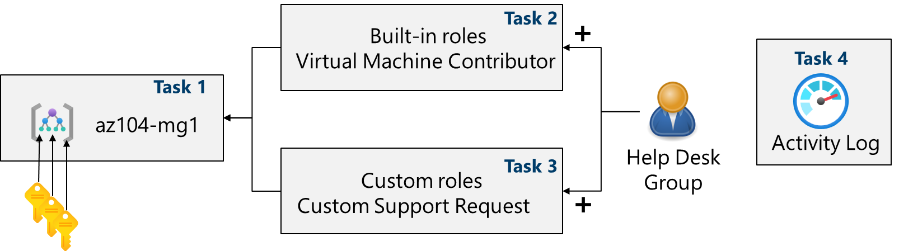

---
lab:
    title: 'Lab 02a: Manage Subscriptions and RBAC'
    module: 'Administer Governance and Compliance'
---

# Lab 02a - Manage Subscriptions and RBAC

## Lab introduction

In this lab, you learn about role-based access control. You learn how to use permissions and scopes to control what actions identities can and cannot perform. You also learn how to make subscription management easier using management groups. 

This lab requires an Azure subscription. Your subscription type may affect the availability of features in this lab. You may change the region, but the steps are written using **East US**. 

## Estimated timing: 30 minutes

## Lab scenario

To simplify management of Azure resources in your organization, you have been tasked with implementing the following functionality:

- Creating a management group that includes all your Azure subscriptions.

- Granting permissions to submit support requests for all subscriptions in the management group. The permissions should be limited only to: 

    - Create and manage virtual machines
    - Create support request tickets (do not include adding Azure providers)

## Interactive lab simulations

There are some interactive lab simulations that you might find useful for this topic. The simulation lets you to click through a similar scenario at your own pace. There are differences between the interactive simulation and this lab, but many of the core concepts are the same. An Azure subscription is not required. 

+ [Manage access with RBAC](https://mslearn.cloudguides.com/en-us/guides/AZ-900%20Exam%20Guide%20-%20Azure%20Fundamentals%20Exercise%2014). Assign built-in role to a user and monitor the activity logs. 

+ [Manage subscriptions and RBAC](https://mslabs.cloudguides.com/guides/AZ-104%20Exam%20Guide%20-%20Microsoft%20Azure%20Administrator%20Exercise%202). Implement a management group and create and assign a custom RBAC role.

+ [Open a support request](https://mslearn.cloudguides.com/en-us/guides/AZ-900%20Exam%20Guide%20-%20Azure%20Fundamentals%20Exercise%2022). Review support plan options, then create and monitor a support request, technical or billing.

## Architecture diagram

## Job skills

+ Task 1: Implement management groups.
+ Task 2: Review and assign a built-in Azure role.
+ Task 3: Create a custom RBAC role.
+ Task 4: Monitor role assignments with the Activity Log.

## Task 1: Implement Management Groups

In this task, you will create and configure management groups. Management groups are used to logically organize subscriptions. Subscriptions should be segmented and allow for RBAC and Azure Policy to be assigned and inherited to other management groups and subscriptions. For example, if your organization has a dedicated support team for Europe, you can organize European subscriptions into a management group to provide the support staff access to those subscriptions (without providing individual access to all subscriptions). In our scenario everyone at the Help Desk will need to create a support request across all subscriptions. 

1. Sign in to the **Azure portal** - `https://portal.azure.com`.

1. Search for and select `Microsoft Entra ID`.

1. In the **Manage** blade, select **Properties**.

1. Review the **Access management for Azure resources** area. Ensure you can manage access to all Azure subscriptions and management groups in the tenant.
   
1. Search for and select `Management groups`.

1. On the **Management groups** blade, click **+ Create**.

1. Create a management group with the following settings. Select **Submit** when you are done. 

    | Setting | Value |
    | --- | --- |
    | Management group ID | `az104-mg1` (must be unique in the directory) |
    | Management group display name | `az104-mg1` |

1. **Refresh** the management group page to ensure your new management group displays. This may take a minute. 

   >**Note:** Did you notice the root management group? The root management group is built into the hierarchy to have all management groups and subscriptions fold up to it. This root management group allows for global policies and Azure role assignments to be applied at the directory level. After creating a management group, you would add any subscriptions that should be included in the group. 

## Task 2: Review and assign a built-in Azure role

In this task, you will review the built-in roles and assign the VM Contributor role to a member of the Help Desk. Azure provides a large number of [built-in roles](https://learn.microsoft.com/azure/role-based-access-control/built-in-roles). 

1. Select the **az104-mg1** management group.

1. Select the **Access control (IAM)** blade, and then the **Roles** tab.

1. Scroll through the built-in role definitions that are available. **View** a role to get detailed information about the **Permissions**, **JSON**, and **Assignments**. You will often use *owner*, *contributor*, and *reader*. 

1. Select **+ Add**, from the drop-down menu, select **Add role assignment**. 

1. On the **Add role assignment** blade, search for and select the **Virtual Machine Contributor**. The Virtual machine contributor role lets you manage virtual machines, but not access their operating system or manage the virtual network and storage account they are connected to. This is a good role for the Help Desk. Select **Next**.

    >**Did you know?** Azure originally provided only the **Classic** deployment model. This has been replaced by the **Azure Resource Manager** deployment model. As a best practice, do not use classic resources. 

1. On the **Members** tab, **Select Members**.

    >**Note:** The next step assigns the role to the **helpdesk** group. If you do not have a Help Desk group, take a minute to create it.

1. Search for and select the `helpdesk` group. Click **Select**. 

1. Click **Review + assign** twice to create the role assignment.

1. Continue on the **Access control (IAM)** blade. On the **Role assignments** tab, confirm the **helpdesk** group has the **Virtual Machine Contributor** role. 

    >**Note:** As a best practice always assign roles to groups not individuals. 

    >**Did you know?** This assignment might not actually grant you any additional privileges. If you already have the Owner role, that role includes all permissions associated with the VM Contributor role.
    
## Task 3: Create a custom RBAC role

In this task, you will create a custom RBAC role. Custom roles are a core part of implementing the principle of least privilege for an environment. Built-in roles might have too many permissions for your scenario. In this task we will create a new role and remove permissions that are not be necessary. Do you have a plan for managing overlapping permissions?

1. Continue working on your management group. In the **Access control (IAM)** blade, select the **Check access** tab.

1. In the **Create a custom role** box, select **Add**.

1. On the Basics tab complete the configuration.

    | Setting | Value |
    | --- | --- |
    | Custom role name | `Custom Support Request` |
    | Description | ``A custom contributor role for support requests.` |

1. For **Baseline permissions**, select **Clone a role**. In the **Role to clone** drop-down menu, select **Support Request Contributor**.

    

1. Select **Next** to move to the **Permissions** tab, and then select **+ Exclude permissions**.

1. In the resource provider search field, enter `.Support` and select **Microsoft.Support**.

1. In the list of permissions, place a checkbox next to **Other: Registers Support Resource Provider** and then select **Add**. The role should be updated to include this permission as a *NotAction*.

    >**Note:** An Azure resource provider is a set of REST operations that enable functionality for a specific Azure service. We do not want the Help Desk to be able to have this capability, so it is being removed from the cloned role. You could also selete and add other capabilities to the new role. 

1. On the **Assignable scopes** tab, ensure your management group is listed, then click **Next**.

1. Review the JSON for the *Actions*, *NotActions*, and *AssignableScopes* that are customized in the role. 

1. Select **Review + Create**, and then select **Create**.

    >**Note:** At this point, you have created a custom role and assigned it to the management group.  

## Task 4: Monitor role assignments with the Activity Log

In this task, you view the activity log to determine if anyone has created a new role. 

1. In the portal locate the **az104-mg1** resource and select **Activity log**. The activity log provides insight into subscription-level events. 

1. Review the activites for role assignments. The activity log can be filtered for specific operations. 

    

## Cleanup your resources

If you are working with **your own subscription** take a minute to delete the lab resources. This will ensure resources are freed up and cost is minimized. The easiest way to delete the lab resources is to delete the lab resource group. 

+ In the Azure portal, select the resource group, select **Delete the resource group**, **Enter resource group name**, and then click **Delete**.
+ Using Azure PowerShell, `Remove-AzResourceGroup -Name resourceGroupName`.
+ Using the CLI, `az group delete --name resourceGroupName`.
  
## Key takeaways

Congratulations on completing the lab. Here are the main takeaways for this lab. 

+ Management groups are used to logically organize subscriptions.
+ The built-in root management group includes all the management groups and subscriptions.
+ Azure has many built-in roles. You can assign these roles to control access to resources.
+ You can create new roles or customize existing roles.
+ Roles are defined in a JSON formatted file and include *Actions*, *NotActions*, and *AssignableScopes*.
+ You can use the Activity Log to monitor role assignments. 

## Learn more with self-paced training

+ [Secure your Azure resources with Azure role-based access control (Azure RBAC)](https://learn.microsoft.com/training/modules/secure-azure-resources-with-rbac/). Use Azure RBAC to manage access to resources in Azure.
+ [Create custom roles for Azure resources with role-based access control (RBAC)](https://learn.microsoft.com/training/modules/create-custom-azure-roles-with-rbac/). Understand the structure of role definitions for access control. Identify the role properties to use that define your custom role permissions. Create an Azure custom role and assign to a user.

