# Lab 02: Manage Subscriptions,RBAC and Governance

## Lab Overview

In this lab, you will explore role-based access control (RBAC) to manage permissions and scopes, enabling precise control over actions that identities can perform. You will also simplify subscription management by organizing all Azure subscriptions under a management group and configuring permissions to allow virtual machine management and support request submissions.

## Interactive lab simulations

There are some interactive lab simulations that you might find useful for this topic. The simulation lets you to click through a similar scenario at your own pace. There are differences between the interactive simulation and this lab, but many of the core concepts are the same. An Azure subscription is not required. 

+ [Manage access with RBAC](https://mslearn.cloudguides.com/en-us/guides/AZ-900%20Exam%20Guide%20-%20Azure%20Fundamentals%20Exercise%2014). Assign built-in role to a user and monitor the activity logs. 

+ [Manage subscriptions and RBAC](https://mslabs.cloudguides.com/guides/AZ-104%20Exam%20Guide%20-%20Microsoft%20Azure%20Administrator%20Exercise%202). Implement a management group and create and assign a custom RBAC role.

+ [Open a support request](https://mslearn.cloudguides.com/en-us/guides/AZ-900%20Exam%20Guide%20-%20Azure%20Fundamentals%20Exercise%2022). Review support plan options, then create and monitor a support request, technical or billing.

## Lab objectives
In this lab, you will complete the following tasks:

+ Task 1: Implement management groups.
+ Task 2: Review and assign a built-in Azure role
+ Task 3: Create a custom RBAC role
+ Task 4: Assign RBAC roles
+ Task 5: Create a custom RBAC role.
+ Task 6: Monitor role assignments with the Activity Log.

## Exercise 1: Manage Subscriptions and RBAC

In this exercise you will learn how to organize Azure subscriptions effectively and implement Role-Based Access Control (RBAC) to manage permissions and actions securely.

### Task 1: Implement Management Groups

In this task, you will create and organize management groups to streamline Azure subscription governance. This setup enables efficient policy enforcement and access management across your organization.

1. On the Azure portal, in **Search resources, services and docs (G+/)** box at the top of the portal search for and select **Microsoft Entra ID**.

   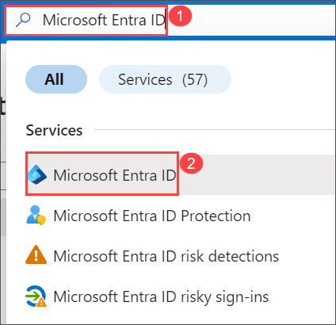 
    
1.  On the blade displaying properties of your tenant, in the vertical menu on the left side, in the **Manage** section, select **Properties**.
  
    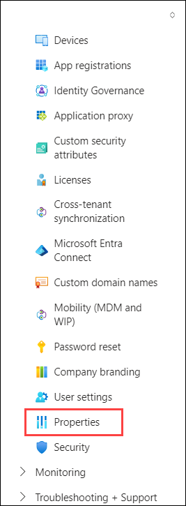 
    
1.  On the **Properties** blade of your tenant, in the **Access management for Azure resources** section, select **Yes** and then select **Save**.

    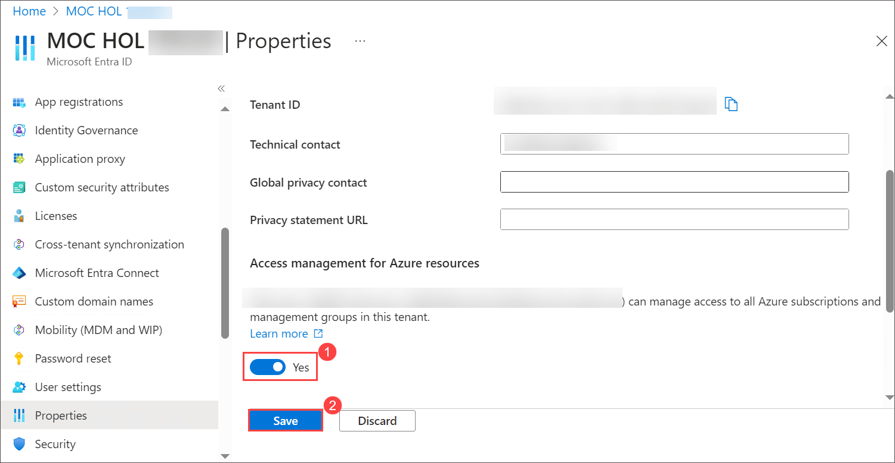 

1. On the Azure Portal page, in **Search resources, services and docs (G+/)** box at the top of the portal, enter **Management groups**, and then select **Management groups** under services.

    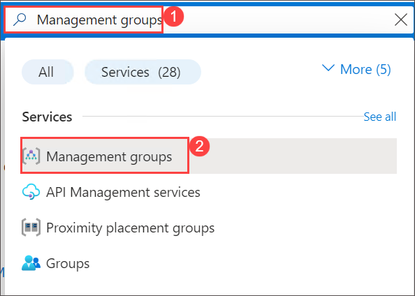 
    
    >**Note:** The Management Group page may take sometime to load. Please try to refresh the browser in the VM periodically until the Management group page loads.
  
1. In the list of management groups, click the entry representing the **az104-02-mg1** management group.

    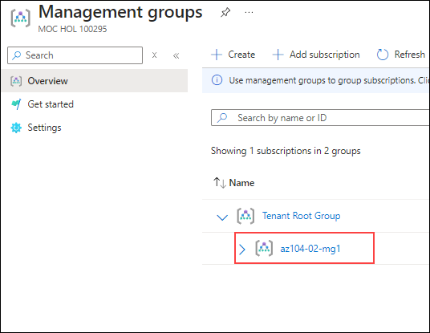

 > **Note:** If the management group is not present, kindly follow the below steps:
  
  1. On the **Management groups** blade, click **+ Create**.

  1. On **Create a management** group blade specify the following settings and click **Submit**.

   | Setting | Value |
   | --- | --- |
   | Management group ID | **az104-02-mg1** |
   | Management group display name | **az104-02-mg1** |

   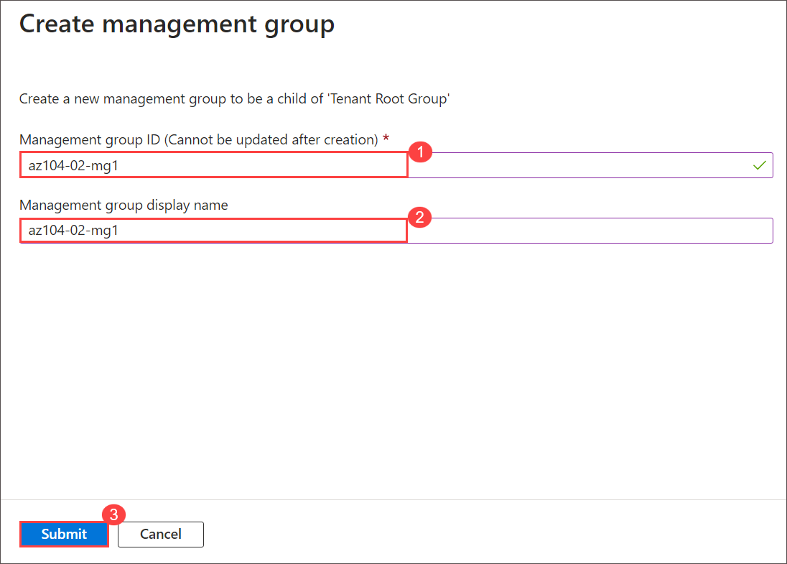
 
1. Review the Subscription group if it is coming up under the Management Group.

   > **Note:** If you dont find the Subscription group, follow the below steps:
   
   1. On the **az104-02-mg1** blade, from the left navigation pane click **Subscriptions** and  click **+ Add**.
   
         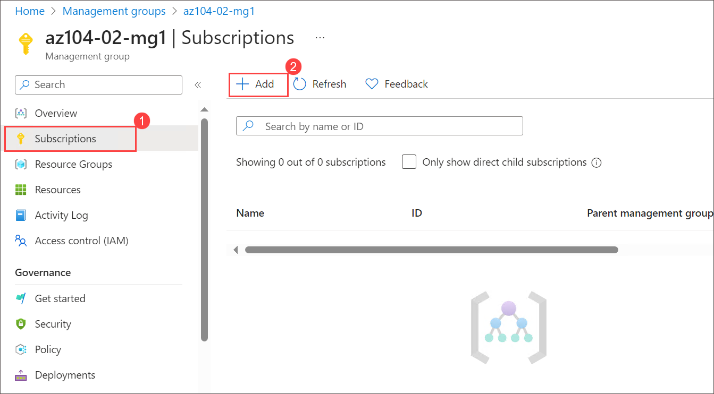
   
    1. On the **Add subscription** blade, in the **Subscription** drop-down list, select the subscription you are using in this lab and click **Save**.
   
       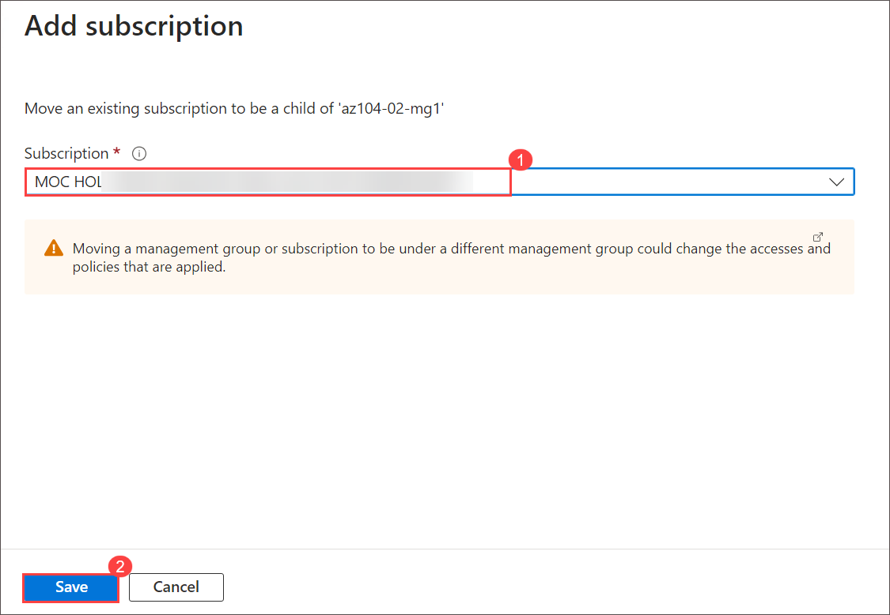
   
      1. On the **az104-02-mg1 \| Subscriptions** blade, refresh the page and  copy the ID of your Azure subscription into Clipboard. You will need it in the next task.
       
         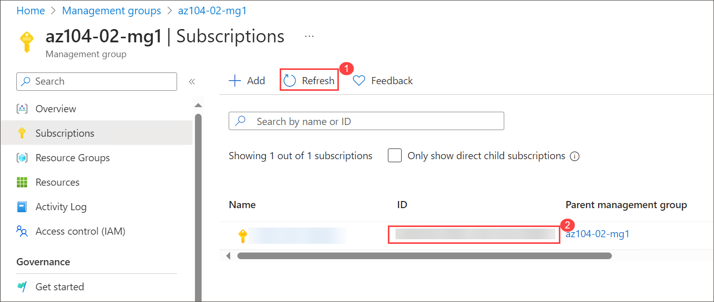

## Task 2: Review and assign a built-in Azure role

In this task, you will review the built-in roles and assign the VM Contributor role to a member of the Help Desk. Azure provides a large number of [built-in roles](https://learn.microsoft.com/azure/role-based-access-control/built-in-roles). 

1. Select the **az104-mg1** management group.

1. Select the **Access control (IAM)** blade (1), and then the **Roles** (2) tab.

    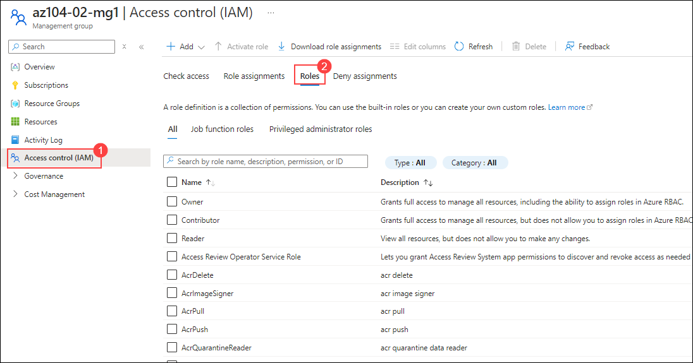

1. Scroll through the built-in role definitions that are available. **View** a role to get detailed information about the **Permissions**, **JSON**, and **Assignments**. You will often use *owner*, *contributor*, and *reader*. 

1. Select **+ Add**, from the drop-down menu, select **Add role assignment**. 

1. On the **Add role assignment** blade, search for and select the **Virtual Machine Contributor**. The Virtual machine contributor role lets you manage virtual machines, but not access their operating system or manage the virtual network and storage account they are connected to. Select **Next**.

    >**Did you know?** Azure originally provided only the **Classic** deployment model. This has been replaced by the **Azure Resource Manager** deployment model. As a best practice, do not use classic resources. 

1. On the **Members** tab, select **+ Select members**.

1. Search for and select the  <inject key="AzureAdUserEmail"></inject> user and click on **Select**. 

1. Click **Review + assign** twice to create the role assignment.

   >**Did you know?** This assignment might not actually grant you any additional privileges. If you already have the Owner role, that role includes all permissions associated with the VM Contributor role.
    
## Task 3: Create a custom RBAC role

In this task, you will create a custom RBAC role. Custom roles are a core part of implementing the principle of least privilege for an environment. Built-in roles might have too many permissions for your scenario. We will also create a new role and remove permissions that are not be necessary. Do you have a plan for managing overlapping permissions?

1. Continue working on your management group. In the **Access control (IAM)** blade, select the **Check access** tab and in the **Create a custom role** box, select **Add**.

   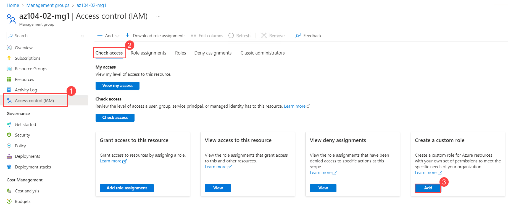

1. On the Basics tab specify the following configuration and select **Next**. 

    | Setting | Value |
    | --- | --- |
    | Custom role name | `Support Request Contributor (Custom)` |
    | Description | A custom contributor role for support requests. |
    | Baseline permissions | select **Clone a role**|
    | Role to clone drop-down menu | select **Support Request Contributor** |

     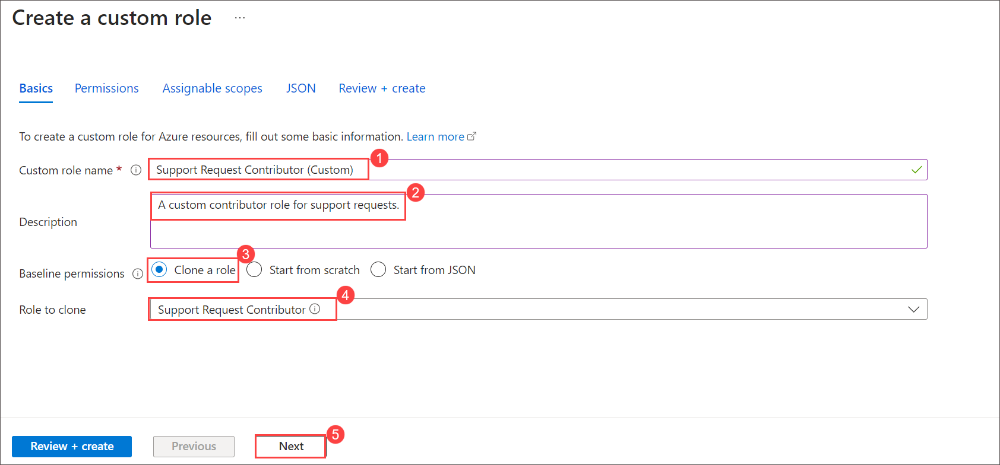

1. On **Permissions** tab, and then select **+ Exclude permissions**.

   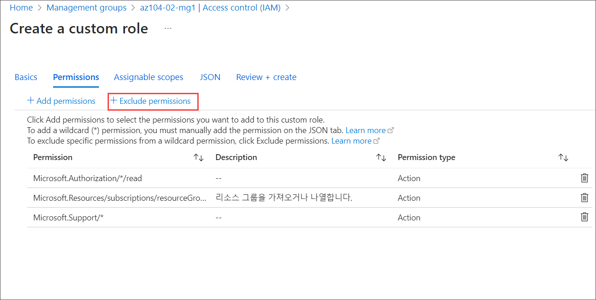
   
1. In the resource provider search field, enter `.Support` and select **Microsoft.Support**.

   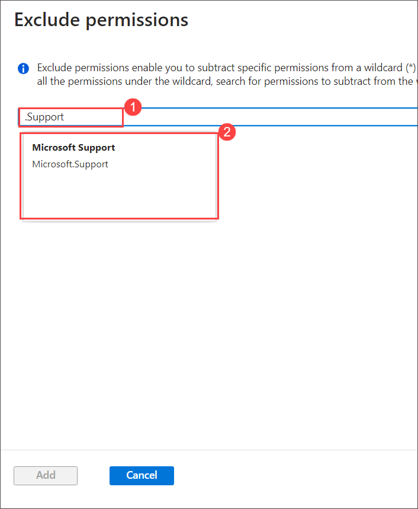

1. In the list of permissions, place a checkbox next to **Other: Registers Support Resource Provider** and then select **Add** > **Next**. The role should be updated to include this permission as a *NotAction*.

    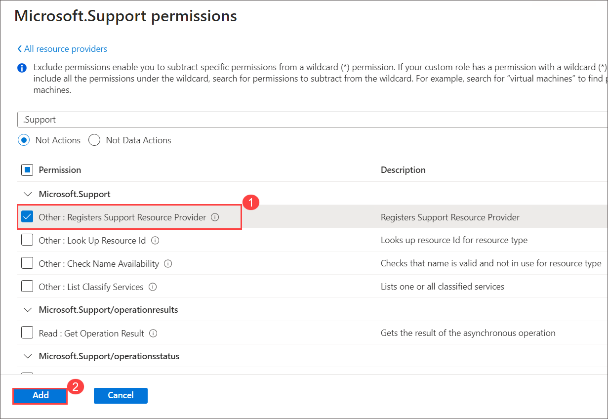
   
    >**Note:** An Azure resource provider is a set of REST operations that enable functionality for a specific Azure service. We do not want the Help Desk to be able to have this capability, so it is being removed from the cloned role. 

1. On the **Assignable scopes** tab, ensure your management group is listed, then click **Next**.

    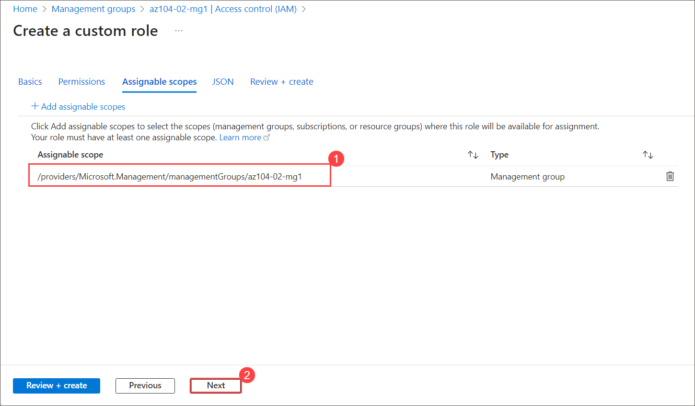

1. Review the JSON for the *Actions*, *NotActions*, and *AssignableScopes* that are customized in the role.

   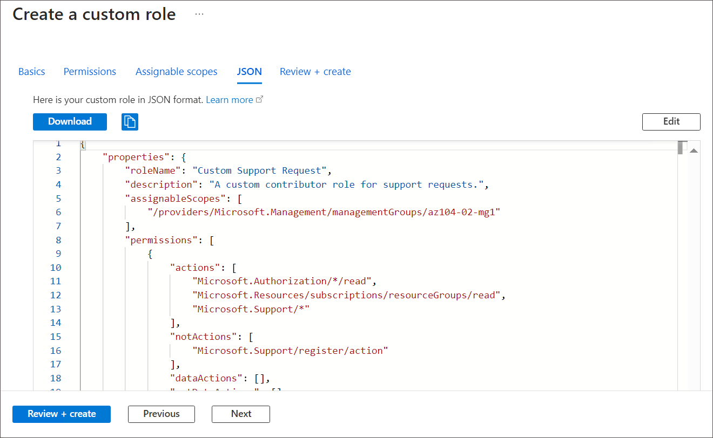

1. Select **Review + create**, and then select **Create**. Select **OK** when you see the pop up **You have successfully created the custom role "Custom Support Request". It may take the system a few minutes to display your role everywhere**. 

    >**Note:** At this point, you have created a custom role and assigned it to the management group. 

### Task 4: Assign RBAC roles

In this task, you will create a Microsoft Entra ID user, assign the RBAC role you created in the previous task to that user, and verify that the user can perform the task specified in the RBAC role definition.

1. In the Azure portal, search for and select **Microsoft Entra ID**, click on **Users** under the **Manage** section of the left navigation pane. Click **+ New user** > **Create New User**.

   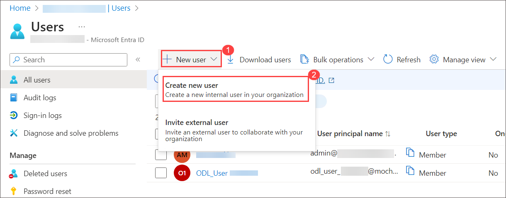
  
1. Create a new user with the following settings (leave others with their defaults) and click on **Review + create** (6)

    | Setting | Value |
    | --- | --- |
    | User Principal name | **az104-02-aaduser1** (1)|
    | Display name | **az104-02-aaduser1** (2)|
    | Auto-generate password | unchecked (3) |
    | Password | **Provide a secure password** (4) |
    | Account enabled | **Checked** (5) |

    >**Note**: **Copy to clipboard** the full **User name**. You will need it later in this lab.

    .png)

1. Click **Create**.
   
1. In the Azure portal, navigate back to the Management group and and select **az104-02-mg1** to display its **details**.

   

1. Click **Access control (IAM)**, click **+ Add** and then **Add role assignment**.

    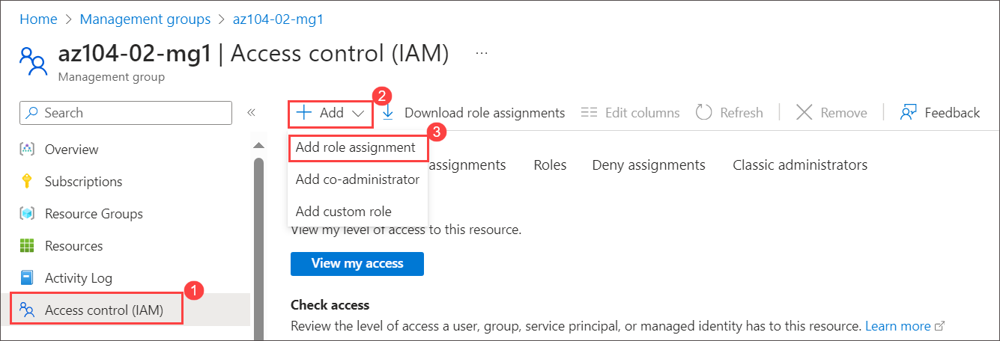

   >**Note**: If your custom role is not visible, it can take up to 10 minutes for the custom role to appear after creation.

1. Search and select **Support Request Contributor (Custom)**. Click **Next**.

    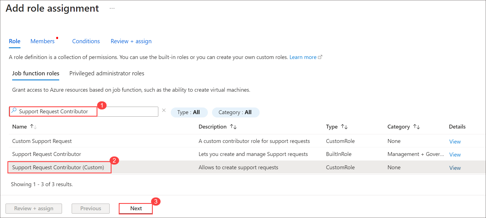
  
1. On the **Members** tab, click **+ Select members** and **select** user account **az104-02-aaduser1**. Click **Select** and then **Review and assign** twice.

     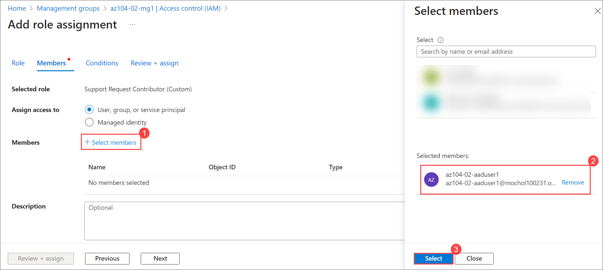
    
1. Open an **InPrivate** browser window and sign in to the [Azure portal](https://portal.azure.com) using the newly created user account. When prompted to update the password, change the password for the user.

    >**Note**: You can copy the username for the newly created user by navigating to the Microsoft Entra ID --> Users section.

1. In the **InPrivate** browser window, in the Azure portal, search and select **Resource groups** to verify that the az104-02-aaduser1 user can see all resource groups.
 
    

    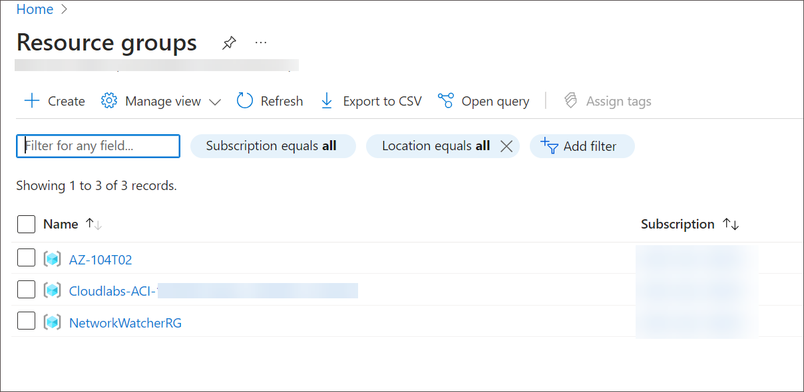
   
1. In the **InPrivate** browser window, in the Azure portal, select **All resources** to verify that the az104-02-aaduser1 user cannot see any resources.

   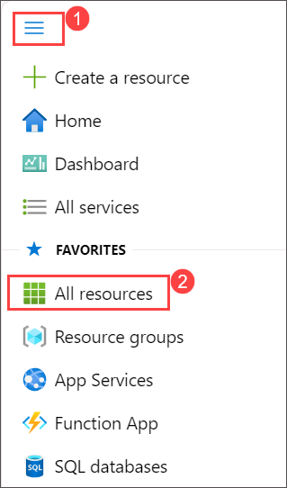

1. Verify that the az104-02-aaduser1 user cannot see any resources.

    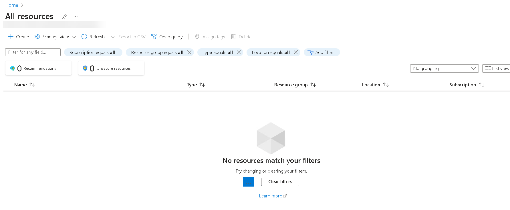
   
1. In the **InPrivate** browser window, in the Azure portal, search and select **Help + support**. 
   
   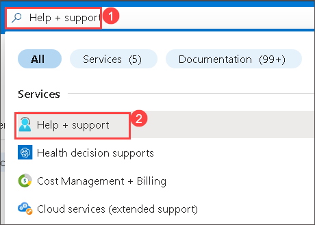

1. Click **Create a support request**.

   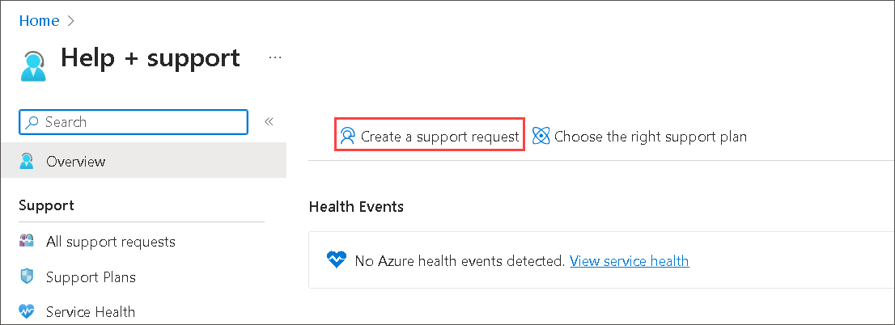
   
1. In the **InPrivate** browser window, on the **Describe your issue** tab of the **Help + support** blade, type **Service and subscription limits** (1) and select **Go** (2). Select the **Service and subscription limits (quotas)** (3)issue type. Select **Next** (4). Select **Create a support request** under Service and subscription limits (quotas).

    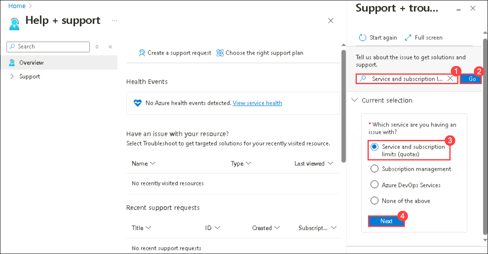

    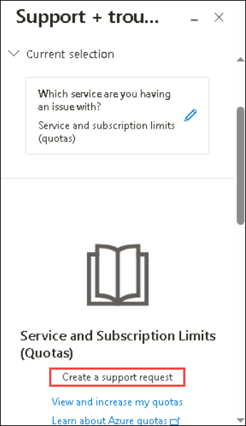
    
1. In the **InPrivate** browser window, on the **Problem Description** tab of the **Help + support - New support request** blade, **Service and subscription limits (quotas)** (1) as issue type is selected. Note that the subscription you are using in this lab is listed in the **Subscription** (2) drop-down list.
    
    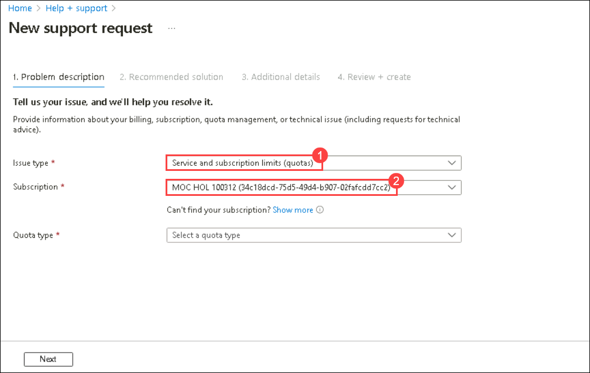

    >**Note**: The presence of the subscription you are using in this lab in the **Subscription** drop-down list indicates that the account you are using has the permissions required to create the subscription-specific support request.

    >**Note**: If you do not see the **Service and subscription limits (quotas)** option, sign out from the Azure portal and sign in back.

1. Do not continue with creating the support request. Instead, sign out as the az104-02-aaduser1 user from the Azure portal and close the InPrivate browser window.

> **Congratulations** on completing the task! Now, it's time to validate it. Here are the steps:
> - Hit the Validate button for the corresponding task. If you receive a success message, you can proceed to the next task. 
> - If not, carefully read the error message and retry the step, following the instructions in the lab guide.
> - If you need any assistance, please contact us at labs-support@spektrasystems.com. We are available 24/7 to help

<validation step="3fd36f71-74c5-4bba-8d44-9c8ed81fd0be" />

## Task 5: Monitor role assignments with the Activity Log

In this task, you will review the Azure activity log to check for any actions indicating the creation of a new role. This helps ensure proper tracking and auditing of role-based changes within your Azure environment.

1. In the Azure portal, navigate back to the Management group and and select **az104-02-mg1**. The activity log provides insight into subscription-level events. 

1. Select **Activity Log**  from the left navigation pane and click on **Quick Insights** from the list that appears and select **Role assignment**. The activity log can be filtered for specific operations and review the activites for role assignments.  

    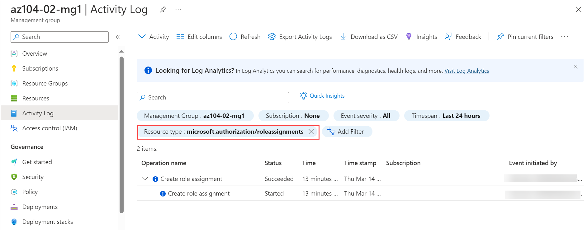

### Task 6: Clean up resources

   >**Note**: Remember to remove any newly created Azure resources that you no longer use. Removing unused resources ensures you will not see unexpected charges, although, resources created in this lab do not incur extra cost.

   >**Note**: Don't worry if the lab resources cannot be immediately removed. Sometimes resources have dependencies and take a longer time to delete. It is a common Administrator task to monitor resource usage, so just periodically review your resources in the Portal to see how the cleanup is going.

1. In the Azure portal, navigate back to the **Management groups** blade. 

1. On the **Management groups** blade choose **az104-02-mg1**, select **Access control (IAM)** then under **Roles** tab search for **Support Request Contributor (Custom)** under details select **View** link and select **Assignment** tab > **Remove** and select **yes**.

   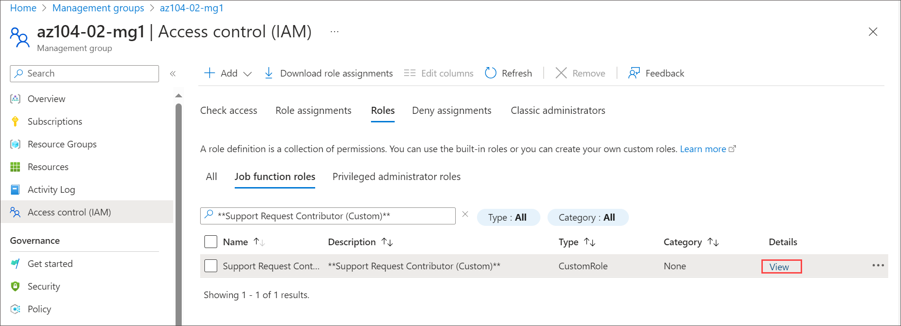
   
   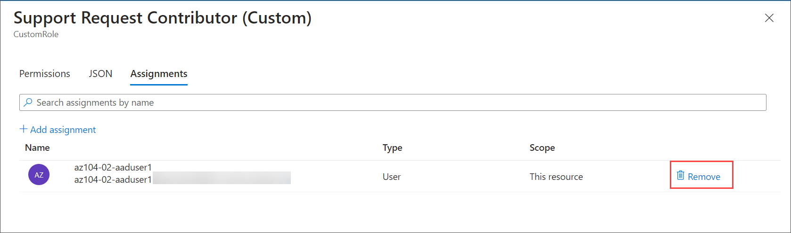
   
1. Back on **az104-02-mg1 | Access control (IAM)** Refresh the page on click on  **Support Request Contributor (Custom)** select **ellipsis** and click **Delete**.
   
    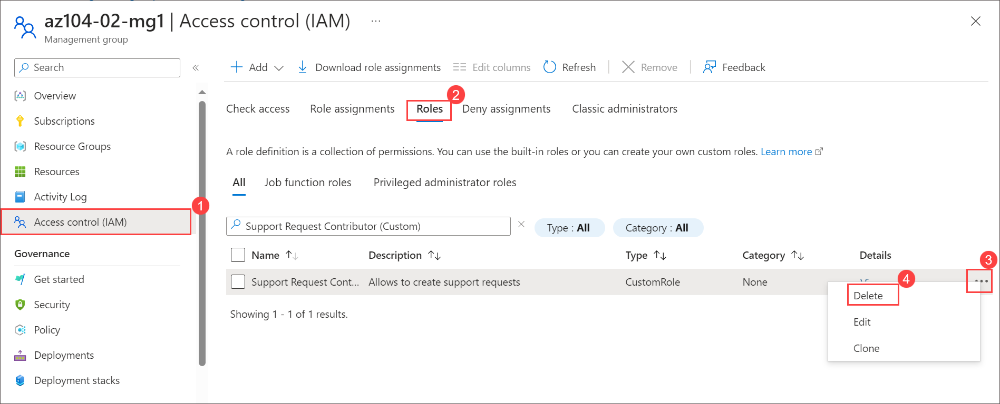

1. In the Azure portal, navigate back to the **Users - All users** blade of the **Microsoft Entra ID**, and select  **az104-02-aaduser1** user account click on **Delete**.

    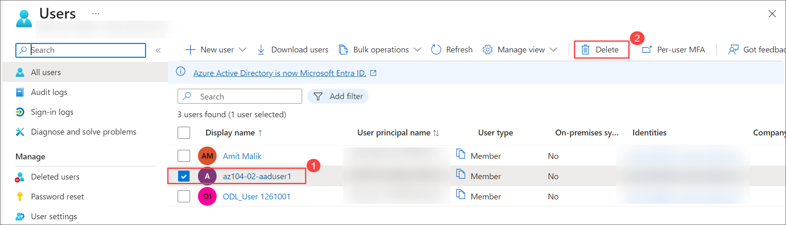
   
1. In the Azure portal, search and select **Management groups**.
   
1. On the **Management groups** blade,  select the **ellipsis** icon next to your subscription under the **az104-02-mg1** management group and select **Move** to move the subscription to the **Tenant Root management group**.

    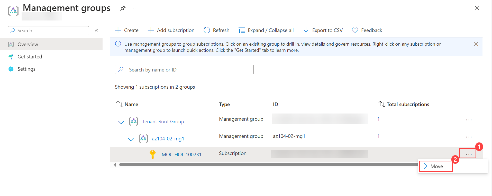
   
    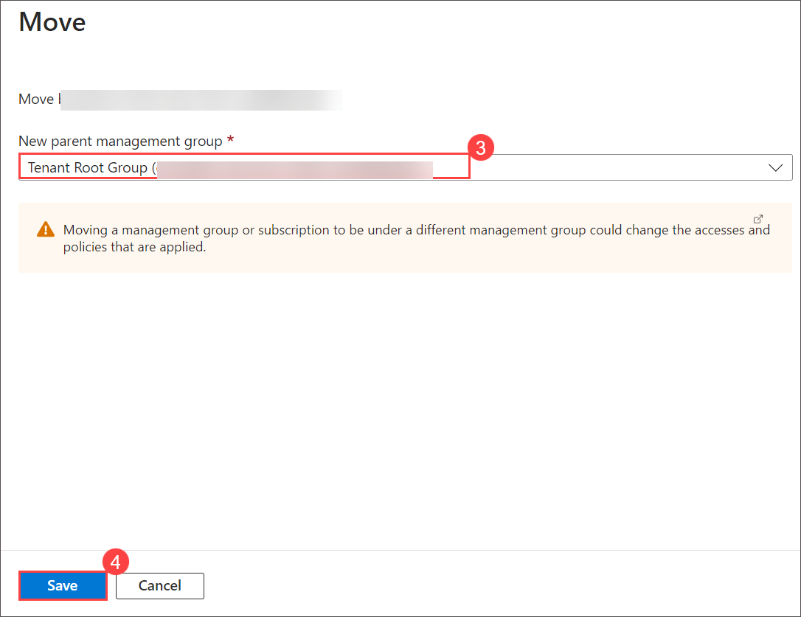

   >**Note**: It is likely that the target management group is the **Tenant Root management group**, unless you created a custom management group hierarchy before running this lab.
   
1. Select **Refresh** to verify that the subscription has successfully moved to the **Tenant Root management group**.

1. Navigate back to the **Management groups** blade, click the **ellipsis** icon to the right of the **az104-02-mg1** management group and click **Delete**,click **Ok** in the pop-up that appears.

   >**Note**: If you are unable to delete the **management group**, chances are that the **Azure Subscription** is under the management group. You need to move **Azure Subscription** out of the **management group** and then delete the group make sure you also have the **Owner** permission on the **Tenant Root management group**.

1. If you are unable to delete the management group, please reach out to the support team for assistance.

### Review
In this lab, you have completed:

- Implemented management groups to organize your Azure subscriptions, allowing centralized governance and better control over policies and access management across your environment.
- Created a custom RBAC role to define specific permissions, ensuring that users can only access the resources they need, enhancing security and compliance.
- Assigned RBAC roles to users based on their job responsibilities, allowing them to perform necessary tasks without overstepping access boundaries.
- Designed and deployed a custom RBAC role to meet your organization's unique security requirements, ensuring that the right level of access is granted to the right users.
- Used the Activity Log to monitor role assignments and track changes to ensure that access control policies are being followed and that no unauthorized role modifications occur.

## Extend your learning with Copilot

Copilot can assist you in learning how to use the Azure scripting tools. Copilot can also assist in areas not covered in the lab or where you need more information. Open an Edge browser and choose Copilot (top right) or navigate to *copilot.microsoft.com*. Take a few minutes to try these prompts.
+ Create two tables highlighting important PowerShell and CLI commands to get information about organization subscriptions on Azure and explain each command in the column “Explanation”. 
+ What is the format of the Azure RBAC JSON file?
+ What are the basic steps for creating a custom Azure RBAC role?
+ What is the difference between Azure RBAC roles and Microsoft Entra ID roles? 

## Learn more with self-paced training

+ [Secure your Azure resources with Azure role-based access control (Azure RBAC)](https://learn.microsoft.com/training/modules/secure-azure-resources-with-rbac/). Use Azure RBAC to manage access to resources in Azure.
+ [Create custom roles for Azure resources with role-based access control (RBAC)](https://learn.microsoft.com/training/modules/create-custom-azure-roles-with-rbac/). Understand the structure of role definitions for access control. Identify the role properties to use that define your custom role permissions. Create an Azure custom role and assign to a user.

## Key takeaways

Congratulations on completing the lab. Here are the main takeaways for this lab. 

+ Management groups are used to logically organize subscriptions.
+ The built-in root management group includes all the management groups and subscriptions.
+ Azure has many built-in roles. You can assign these roles to control access to resources.
+ You can create new roles or customize existing roles.
+ Roles are defined in a JSON formatted file and include *Actions*, *NotActions*, and *AssignableScopes*.
+ You can use the Activity Log to monitor role assignments.

### You have successfully completed the lab
