# Lab 02b - Manage Governance via Azure Policy

## Lab scenario
To improve the management of Azure resources in Contoso, you have been tasked with implementing the following functionality:

- tagging resource groups that include only infrastructure resources (such as Cloud Shell storage accounts)

- ensuring that only properly tagged infrastructure resources can be added to infrastructure resource groups

- remediating any non-compliant resources 

## Lab objectives
In this lab, you will complete the following tasks:
+ Task 1: Create and assign tags via the Azure portal
+ Task 2: Enforce tagging via an Azure policy
+ Task 3: Apply tagging via an Azure policy

## Estimated timing: 60 minutes

## Architecture diagram


## Exercise 1

### Task 1: Assign tags via the Azure portal
In this task, you will create and assign a tag to an Azure resource group via the Azure portal.

1. In the Azure portal, open the **Azure Cloud Shell** by clicking on the icon in the top right of the Azure Portal.

    

1. If prompted to select either **Bash** or **PowerShell**, select **PowerShell**. 

    >**Note**: If this is the first time you are starting **Cloud Shell** and you are presented with the **You have no storage mounted** message, select the subscription you are using in this lab, and click **Show Advanced Settings**. 
    
    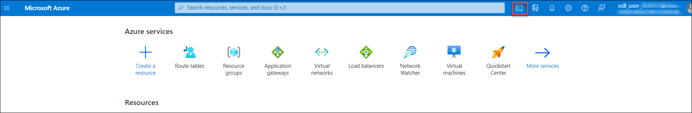
    
    >Under **Advanced Settings**, you need to select an existing resource group from the **Resource group** dropdown and give some unique name under the **Storage Account** section, and under the **File share** section type none as shown in the below image.

    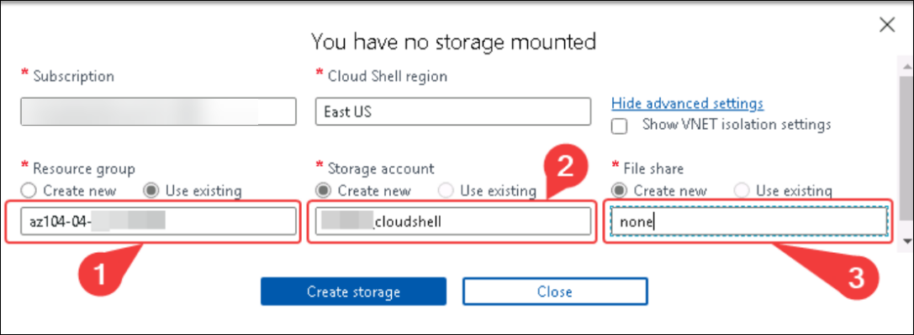

1. Click **Create storage**, and wait until the Azure Cloud Shell pane is displayed. 

1. From the Cloud Shell pane, run the following to identify the name of the storage account used by Cloud Shell:

   ```powershell
   df
   ```

1. In the output of the command, note the first part of the fully qualified path designating the Cloud Shell home drive mount (marked here as `xxxx`):

   ```
   //xxxx.file.core.windows.net/cloudshell   (..)  /usr/csuser/clouddrive
   ```

    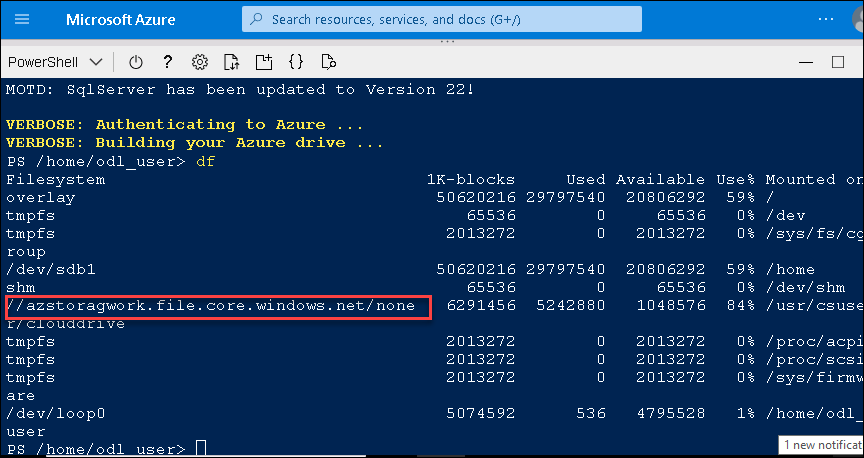

1. In the Azure portal, search and select **Storage accounts** and, in the list of storage accounts, click the entry representing the storage account you identified in the previous step.

1. On the storage account blade, click the link representing the name of the resource group containing the storage account.

    **Note**: note what resource group the storage account is in, you'll need it later in the lab.

1. On Azure Portal page, in **Search resources, services and docs (G+/)** box at the top of the portal, enter **Resource group**, and then select **Resource group** under services.

1. On the resource group blade, click **Tags** and create a tag with the following settings and click on **Apply** to save your change:

    | Setting | Value |
    | --- | --- |
    | Name | **Role** |
    | Value | **Infra** |

   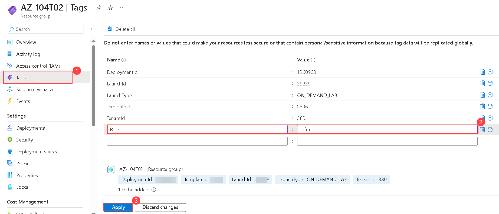
   
### Task 2: Enforce tagging via an Azure policy
In this task, you will assign the built-in *Require a tag and its value on resources* policy to the resource group and evaluate the outcome. 

1. On Azure Portal page, in **Search resources, services and docs (G+/)** box at the top of the portal, enter **Policy**, and then select **Policy** under services.

   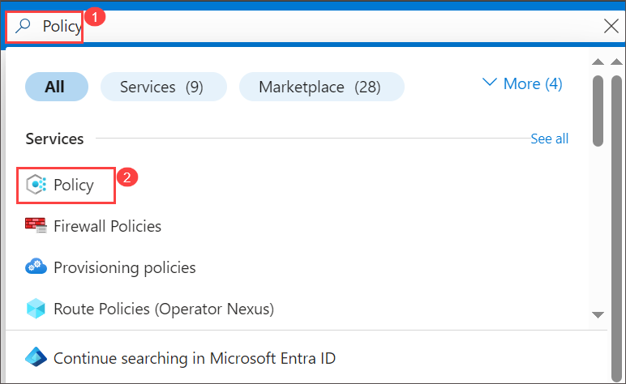

1. In the **Authoring** section, click **Definitions**. Take a moment to browse through the list of built-in policy definitions that are available for you to use. List all built-in policies that involve the use of tags by selecting the **Tags** entry (and de-selecting all other entries) in the **Category** drop-down list and click on **Apply**.

   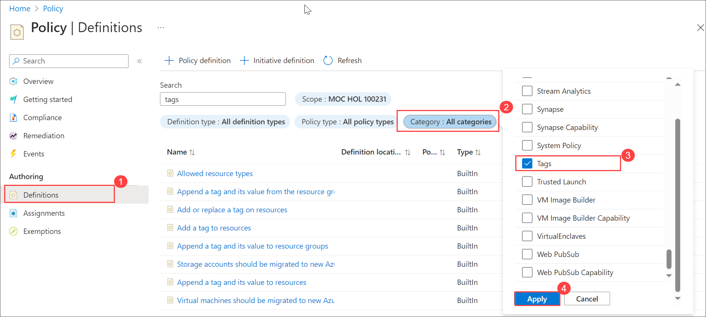

1. In search bar enter **require** and click the entry representing the **Require a tag and its value on resources** built-in policy and review its definition.

    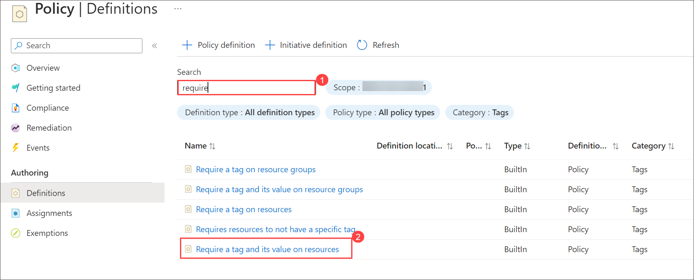
   
1. On the **Require a tag and its value on resources** built-in policy definition blade, click **Assign**.

    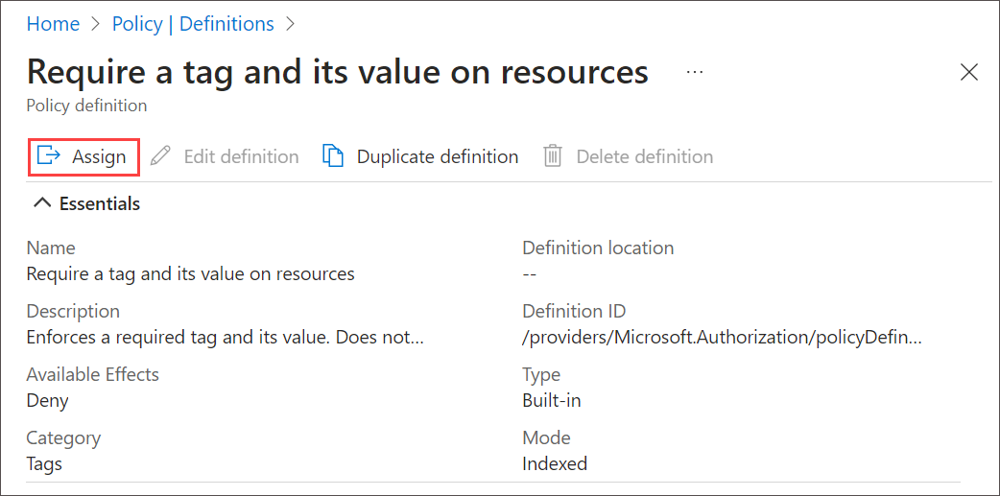

1. Specify the **Scope** by clicking the ellipsis button and selecting the following values:

    | Setting | Value |
    | --- | --- |
    | Subscription | the name of the Azure subscription you are using in this lab |
    | Resource Group | AZ-104T02 |

   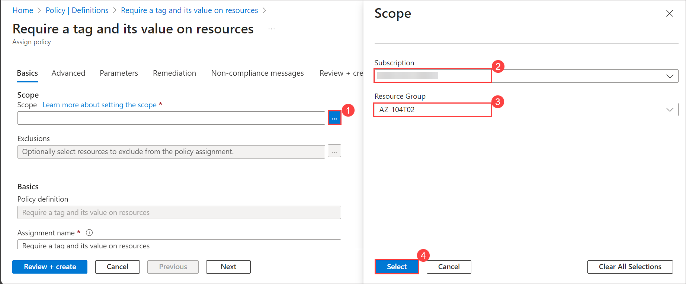
   
   >**Note**: A scope determines the resources or resource groups where the policy assignment takes effect. You could assign policies on the management group, subscription, or resource group level. You also have the option of specifying exclusions, such as individual subscriptions, resource groups, or resources (depending on the assignment scope). 

1. Configure the **Basics** properties of the assignment by specifying the following settings (leave others with their defaults):

    | Setting | Value |
    | --- | --- |
    | Assignment name | **Require Role tag with Infra value**|
    | Description | **Require Role tag with Infra value for all resources in the Cloud Shell resource group**|
    | Policy enforcement | Enabled |

    >**Note**: The **Assignment name** is automatically populated with the policy name you selected, but you can change it. You can also add an optional **Description**. **Assigned by** is automatically populated based on the user name creating the assignment. 

1. Click **Next** and set **Parameters** to the following values:

    | Setting | Value |
    | --- | --- |
    | Tag Name | **Role** |
    | Tag Value | **Infra** |

1. Click **Next** and review the **Remediation** tab. Leave the **Create a Managed Identity** checkbox unchecked. 

    >**Note**: This setting can be used when the policy or initiative includes the **deployIfNotExists** or **Modify** effect.

1. Click **Review + Create** and then click **Create**.

    >**Note**: Now you will verify that the new policy assignment is in effect by attempting to create another Azure Storage account in the resource group without explicitly adding the required tag. 
    
    >**Note**: It might take between 5 and 15 minutes for the policy to take effect.

1. Navigate back to the blade of the resource group hosting the storage account used for the Cloud Shell home drive, which you identified in the previous task.

1. On the resource group blade, click **+ Create** and then search for Storage Account, and click **+Create**. 

1. On the **Basics** tab of the **Create storage account** blade, verify that you are using the Resource Group that the Policy was applied to and specify the following settings (leave others with their defaults), click **Review + create** and then click **Create**:

    | Setting | Value |
    | --- | --- |
    | Storage account name | any globally unique combination of between 3 and 24 lower case letters and digits, starting with a letter |

1. Once you create the deployment, you should see the **Deployment failed** message in the **Notifications** list of the portal. From the **Notifications** list, navigate to the deployment overview and click the **Deployment failed. Click here for details** message to identify the reason for the failure. 

    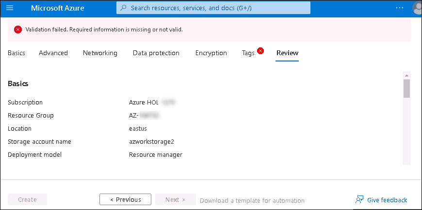

    >**Note**: Verify whether the error message states that the resource deployment was disallowed by the policy. 

    >**Note**: By clicking the **Raw Error** tab, you can find more details about the error, including the name of the role definition **Require Role tag with Infra value**. The deployment failed because the storage account you attempted to create did not have a tag named **Role** with its value set to **Infra**.

### Task 3: Apply tagging via an Azure policy
In this task, we will use a different policy definition to remediate any non-compliant resources. 

1. In the Azure portal, search for and select **Policy**. 

1. In the **Authoring** section, click **Assignments**. 

1. In the list of assignments, right click the ellipsis icon in the row representing the **Require Role tag with Infra value** policy assignment and use the **Delete assignment** menu item to delete the assignment.

   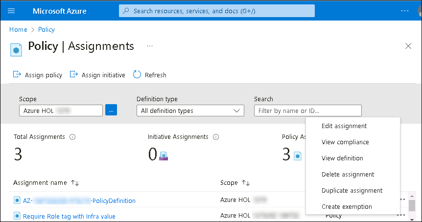

1. Click **Assign policy** and specify the **Scope** by clicking the ellipsis button and selecting the following values:

    | Setting | Value |
    | --- | --- |
    | Subscription | the name of the Azure subscription you are using in this lab |
    | Resource Group | AZ-104T02 |

1. To specify the **Policy definition**, click the ellipsis button and then search for and select **Inherit a tag from the resource group if missing**.

1. Configure the remaining **Basics** properties of the assignment by specifying the following settings (leave others with their defaults):

    | Setting | Value |
    | --- | --- |
    | Assignment name | **Inherit the Role tag and its Infra value from the Cloud Shell resource group if missing**|
    | Description | **Inherit the Role tag and its Infra value from the Cloud Shell resource group if missing**|
    | Policy enforcement | Enabled |

    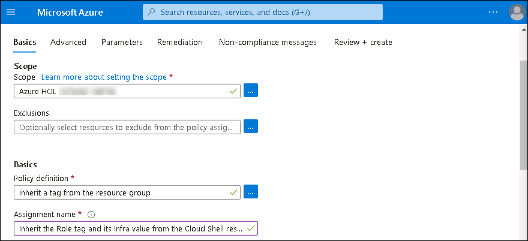 

1. Click **Next** and set **Parameters** to the following values:

    | Setting | Value |
    | --- | --- |
    | Tag Name | **Role** |

1. Click **Next** and, on the **Remediation** tab, configure the following settings (leave others with their defaults):

    | Setting | Value |
    | --- | --- |
    | Create a remediation task | enabled |
    | Policy to remediate | **Inherit a tag from the resource group if missing** |

    >**Note**: This policy definition includes the **Modify** effect.

1. Click **Review + Create** and then click **Create**.

    >**Note**: To verify that the new policy assignment is in effect, you will create another Azure Storage account in the same resource group without explicitly adding the required tag. 
    
    >**Note**: It might take between 5 and 15 minutes for the policy to take effect.

1. Navigate back to the blade of the resource group hosting the storage account used for the Cloud Shell home drive, which you identified in the first task.

1. On the resource group blade, click **+ Create** and then search for Storage Account, and click **+Create**. 

1. On the **Basics** tab of the **Create storage account** blade, verify that you are using the Resource Group that the Policy was applied to, and specify the following settings (leave others with their defaults) and click **Review + create**:

    | Setting | Value |
    | --- | --- |
    | Storage account name | any globally unique combination of between 3 and 24 lower case letters and digits, starting with a letter |

1. Verify that this time the validation passed and click **Create**.

1. Once the new storage account is provisioned, click **Go to resource** button and, on the **Overview** blade of the newly created storage account, note that the tag **Role** with the value **Infra** has been automatically assigned to the resource.

   > **Congratulations** on completing the task! Now, it's time to validate it. Here are the steps:
   > - Navigate to the Lab Validation Page, from the upper right corner in the lab guide section.
   > - Hit the Validate button for the corresponding task. If you receive a success message, you can proceed to the next task. 
   > - If not, carefully read the error message and retry the step, following the instructions in the lab guide.
   > - If you need any assistance, please contact us at labs-support@spektrasystems.com. We are available 24/7 to help you out.

### Review
In this lab, you have completed:
- Created and assigned tags via the Azure portal
- Enforced tagging via an Azure policy
- Applied tagging via an Azure policy

### You have successfully completed the lab
