# Lab 02: Manage Subscriptions,RBAC and Governance

## Lab Overview

In this lab, you will implement management groups to organize your Azure subscriptions for centralized governance and access control. You'll create custom RBAC roles to define specific permissions, ensuring users only access needed resources.These roles will be assigned based on job responsibilities to enforce security and compliance. Finally, you'll use the Activity Log to monitor role assignments, track changes, and ensure adherence to access control policies.

## Interactive lab simulations

There are several interactive lab simulations that you might find useful for this topic. The simulation lets you to click through a similar scenario at your own pace. There are differences between the interactive simulation and this lab, but many of the core concepts are the same. An Azure subscription is not required. 

+ [Manage resource locks](https://mslearn.cloudguides.com/en-us/guides/AZ-900%20Exam%20Guide%20-%20Azure%20Fundamentals%20Exercise%2015). Add a resource lock and test to confirm.
  
+ [Create an Azure policy](https://mslearn.cloudguides.com/en-us/guides/AZ-900%20Exam%20Guide%20-%20Azure%20Fundamentals%20Exercise%2017). Create an Azure policy that restricts the location resources can be located. Create a new resource and ensure the policy is enforced. 

+ [Manage governance via Azure policy](https://mslabs.cloudguides.com/guides/AZ-104%20Exam%20Guide%20-%20Microsoft%20Azure%20Administrator%20Exercise%203). Create and assign tags via the Azure portal. Create an Azure policy that requires tagging. Remediate non-compliant resources.

## Lab objectives
In this lab, you will complete the following tasks:
+ Task 1: Create and assign tags via the Azure portal.
+ Task 2: Enforce tagging via an Azure Policy.
+ Task 3: Apply tagging via an Azure Policy.
+ Task 4: Configure and test resource locks. 

## Exercise 2: Manage Governance via Azure_Policy

In this exercise, you will learn to manage governance via Azure Policy that involves defining and enforcing rules that govern the resources in your Azure environment to ensure compliance with organizational standards.

### Task 1: Assign tags via the Azure portal

In this task, you will learn how to create and assign a tag to an Azure resource group through the Azure portal. Tags in Azure are key-value pairs that help in organizing and categorizing resources for better management and reporting.

1. On Azure Portal page, in **Search resources, services and docs (G+/)** box at the top of the portal, search and select **Resource group** under services. Select **Resource group az104-rg2** from the list.

   

1. On the resource group blade, click **Tags** and create a tag with the following settings and click on **Apply** to save your change:

    | Setting | Value |
    | --- | --- |
    | Name | **Role** |
    | Value | **Infra** |

   
   
### Task 2: Enforce tagging via an Azure policy

In this task, you will explore how to enforce governance policies by assigning the built-in Require a tag and its value on resources policy to a specific Azure resource group. This policy ensures that all resources created within the resource group are tagged with a predefined key-value pair, promoting consistency and compliance with organizational standards.

1. On Azure Portal page, in **Search resources, services and docs (G+/)** box at the top of the portal, enter **Policy**, and then select **Policy** under services.

   

1. In the **Authoring** section, click **Definitions**. Take a moment to browse through the list of built-in policy definitions that are available for you to use. List all built-in policies that involve the use of tags by selecting the **Tags** entry (and de-selecting all other entries) in the **Category** drop-down list and click on **Apply**.

   

1. In search bar enter **require** and click the entry representing the **Require a tag and its value on resources** built-in policy and review its definition.

    
   
1. On the **Require a tag and its value on resources group** built-in policy definition blade, click **Assign policy**.

    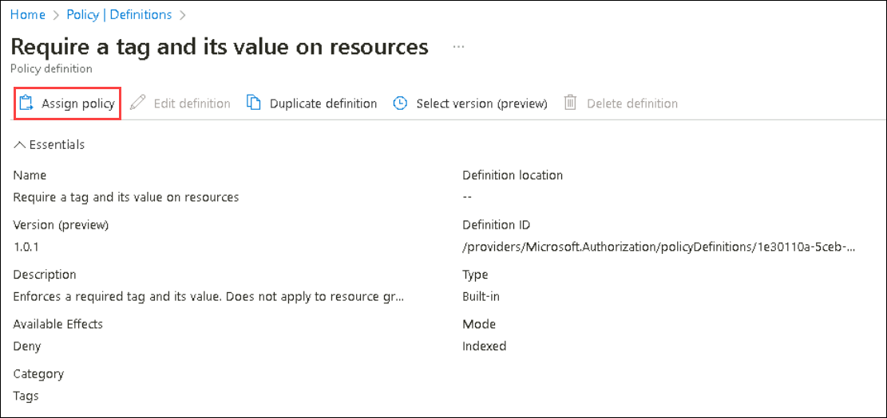

1. Specify the **Scope** by clicking the ellipsis button and selecting the following values and choose **Select** :

    | Setting | Value |
    | --- | --- |
    | Subscription | the name of the Azure subscription you are using in this lab |
    | Resource Group | AZ-104T02 |

   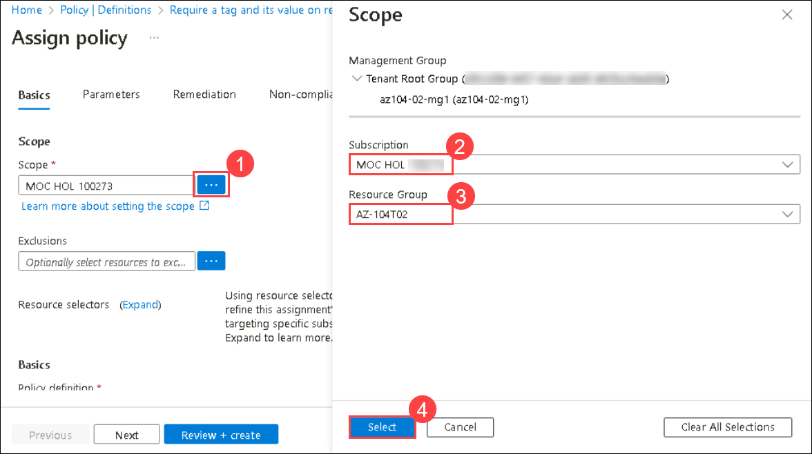
   
   >**Note**: A scope determines the resources or resource groups where the policy assignment takes effect. You could assign policies on the management group, subscription, or resource group level. You also have the option of specifying exclusions, such as individual subscriptions, resource groups, or resources (depending on the assignment scope). 

1. Configure the **Basics** properties of the assignment by specifying the following settings and click on **Next**  (leave others with their defaults):

    | Setting | Value |
    | --- | --- |
    | Assignment name | **Require Role tag with Infra value**|
    | Description | **Require Role tag with Infra value for all resources in the Cloud Shell resource group**|
    | Policy enforcement | Enabled |

    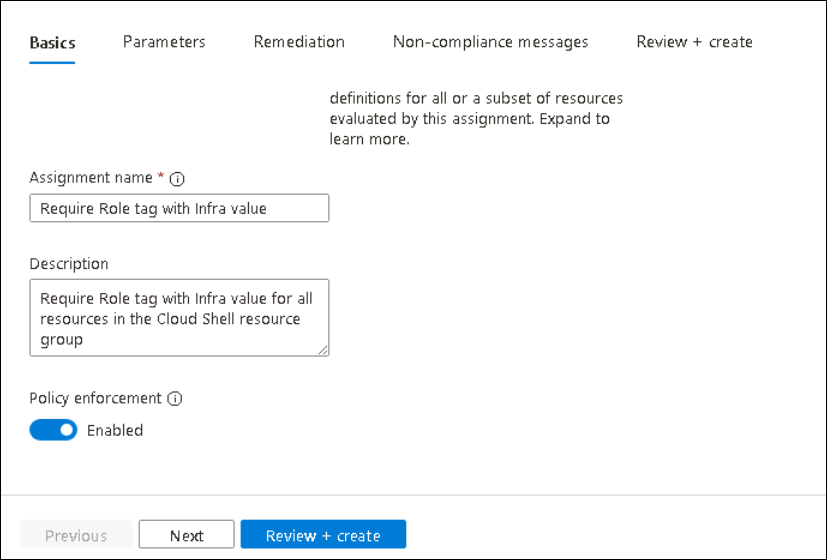
   
    >**Note**: The **Assignment name** is automatically populated with the policy name you selected, but you can change it. You can also add an optional **Description**. **Assigned by** is automatically populated based on the user name creating the assignment. 

1. Set **Parameters** to the following values:

    | Setting | Value |
    | --- | --- |
    | Tag Name | **Role** |
    | Tag Value | **Infra** |

   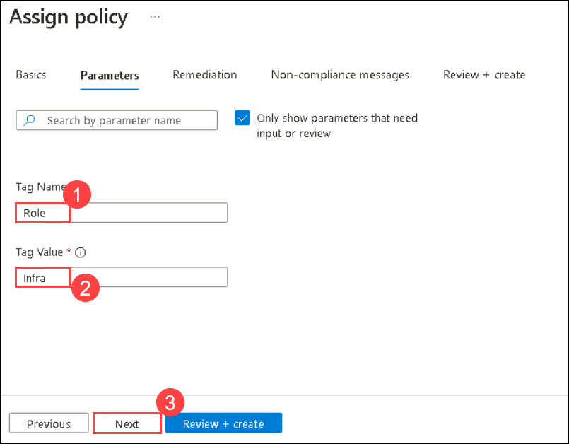
   
1. Click **Next** and review the **Remediation** tab. Leave the **Create a Managed Identity** checkbox unchecked. 

    >**Note**: This setting can be used when the policy or initiative includes the **deployIfNotExists** or **Modify** effect.

1. Click **Review + create** and then click **Create**.

    >**Note**: Now you will verify that the new policy assignment is in effect by attempting to create another Azure Storage account in the resource group without explicitly adding the required tag. 
    
    >**Note**: It might take between 5 and 15 minutes for the policy to take effect.

1. On Azure Portal page, in **Search resources, services and docs (G+/)** box at the top of the portal, search and select **Storage accounts** under services and then click **+ Create**.

1. On the **Basics** tab of the **Create storage account** blade, verify that you are using the Resource Group that the Policy was applied to and specify the following settings (leave others with their defaults), click **Review + create** and then click **Create**:

    | Setting | Value |
    | --- | --- |
    | Storage account name | storage<inject key="DeploymentID" enableCopy="false"/> |

1. Once you create the deployment, you should see the **Validation failed. Required information is missing or not valid** message.

    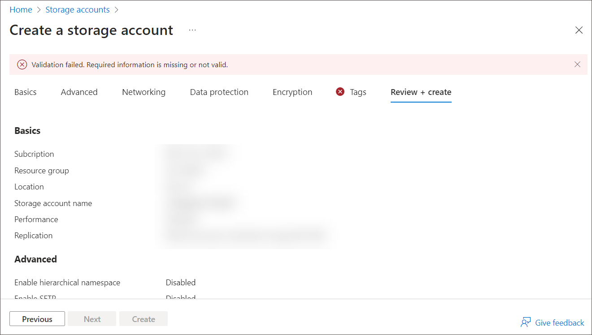

1. Verify whether the error message states that the resource deployment was disallowed by the policy by clicking **Previous** tags tab and select **Policy details** link to review the details.

   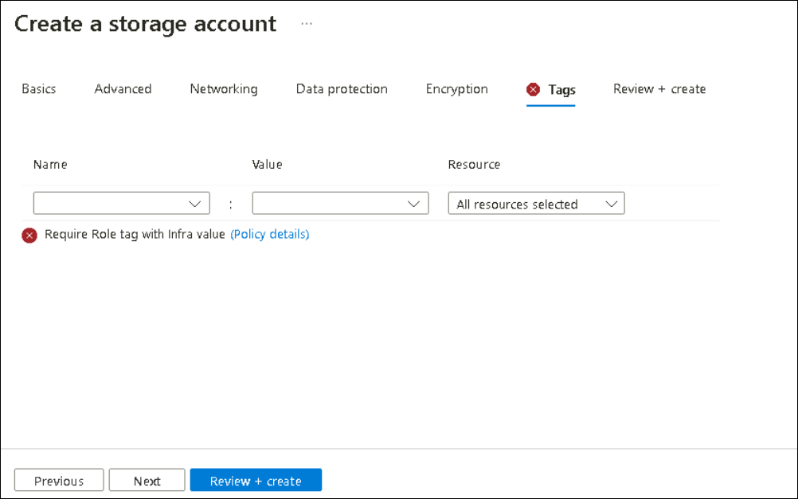

    >**Note**: You can find more details about the error, including the name of the role definition **Require Role tag with Infra value**. The deployment failed because the storage account you attempted to create did not have a tag named **Role** with its value set to **Infra**.

### Task 3: Apply tagging via an Azure policy

In this task, you will focus on identifying and remediating non-compliant resources by leveraging a different Azure Policy definition. Non-compliant resources are those that do not meet the criteria defined in your organization's governance policies, such as missing mandatory tags or violating security configurations. 

1. In the Azure portal, search for and select **Policy**. 

   

1. In the list of assignments, right click the ellipsis icon in the row representing the **Require Role tag with Infra value** policy assignment and use the **Delete assignment** menu item to delete the assignment and then select **Yes**.

   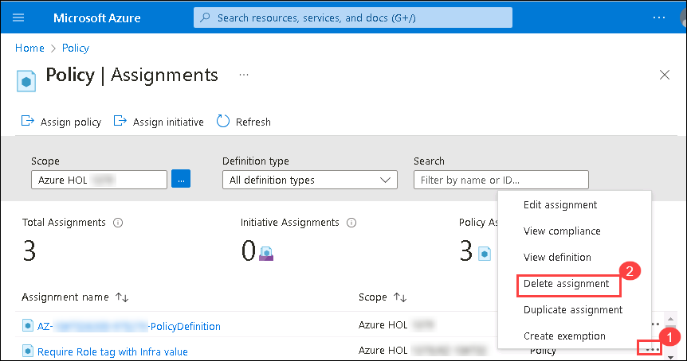

1. In the **Authoring** section, click **Definitions**. Take a moment to browse through the list of built-in policy definitions that are available for you to use. List all built-in policies that involve the use of tags by selecting the **Tags** entry (and de-selecting all other entries) in the **Category** drop-down list and click on **Apply**.

1. In search bar enter **Inherit** and click the entry representing the **Inherit a tag from the resource group if missing** built-in policy and review its definition.

1. On the **Inherit a tag from the resource group if missing** built-in policy definition blade, click **Assign Policy**.

1. Click **Assign policy** and specify the **Scope** by clicking the ellipsis button and selecting the following values and choose **Select**:

    | Setting | Value |
    | --- | --- |
    | Subscription | the name of the Azure subscription you are using in this lab |
    | Resource Group | az104-rg2 |

1. To specify the **Policy definition**, click the ellipsis button and then search for and select **Inherit a tag from the resource group if missing** then click on **Add** if not selected in the definition.

    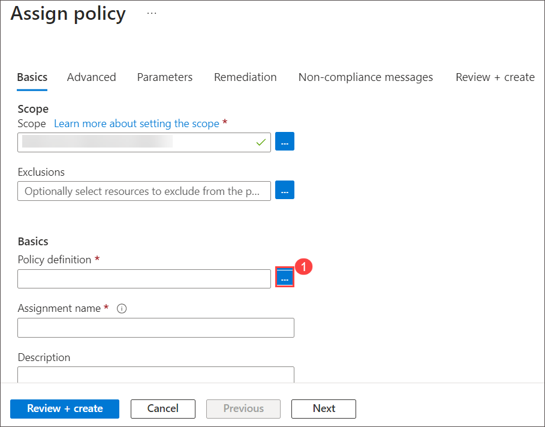

    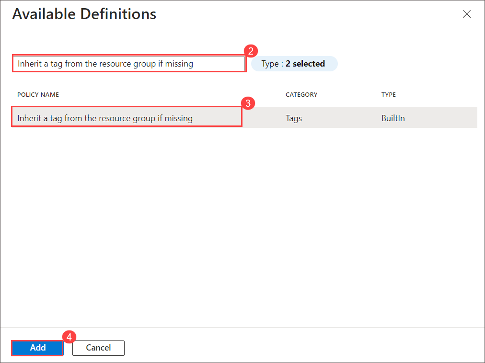

   >**Note**: You can ignore the above step if the policy definition has appeared automatically.

1. Configure the remaining **Basics** properties of the assignment by specifying the following settings (leave others with their defaults) and click on **Next**.

    | Setting | Value |
    | --- | --- |
    | Assignment name | **Inherit the Role tag and its Infra value from the Cloud Shell resource group if missing**|
    | Description | **Inherit the Role tag and its Infra value from the Cloud Shell resource group if missing**|
    | Policy enforcement | Enabled |

    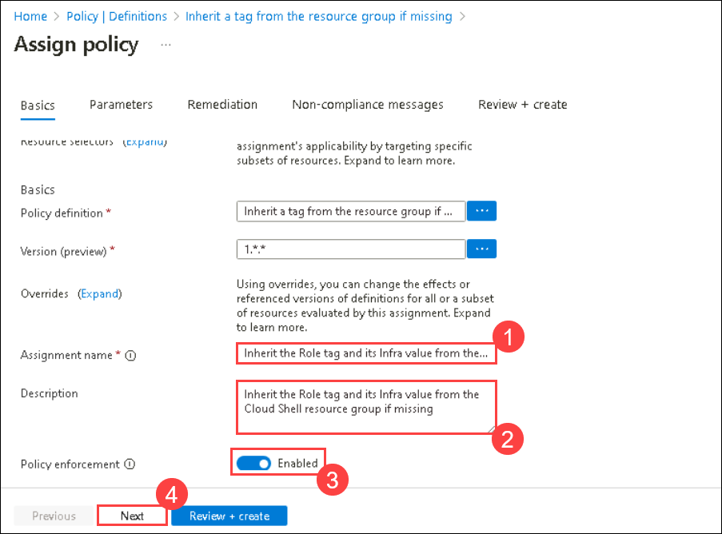

1. Click **Next** and set **Parameters** to the following values:

    | Setting | Value |
    | --- | --- |
    | Tag Name | **Role** |

    
   
1. Click **Next** and, on the **Remediation** tab, configure the following settings (leave others with their defaults) and click **Review + Create**.

    | Setting | Value |
    | --- | --- |
    | Create a remediation task | enabled |
    | Policy to remediate | **Inherit a tag from the resource group if missing** |

    >**Note**: This policy definition includes the **Modify** effect.

    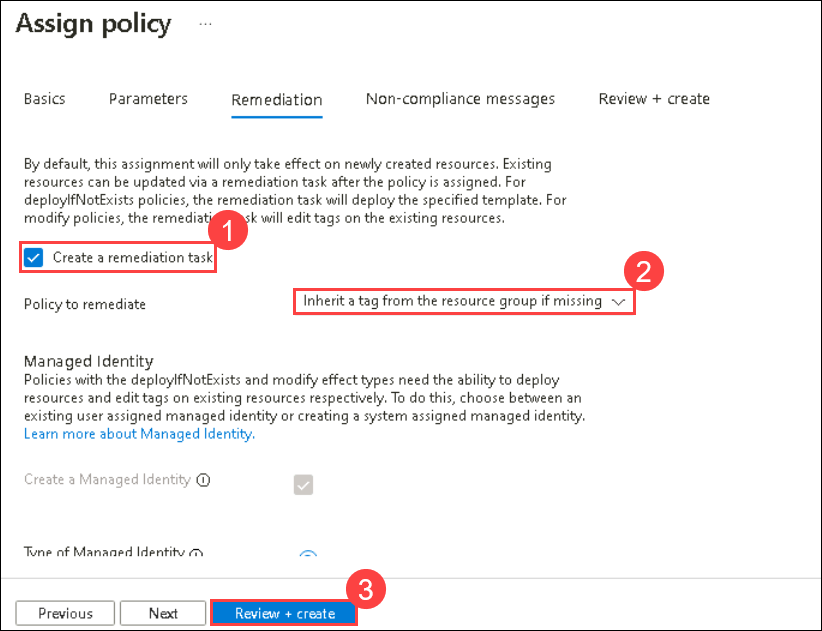
  
1. Click  **Create**.

    >**Note**: To verify that the new policy assignment is in effect, you will create another Azure Storage account in the same resource group without explicitly adding the required tag. 
    
    >**Note**: It might take between 5 and 15 minutes for the policy to take effect.

1. On Azure Portal page, in **Search resources, services and docs (G+/)** box at the top of the portal, search and select **Storage accounts** under services and then click **+ Create**. 

1. On the **Basics** tab of the **Create storage account** blade, verify that you are using the Resource Group that the Policy was applied to, and specify the following settings (leave others with their defaults) and click **Review + create**:

    | Setting | Value |
    | --- | --- |
    | Subscription | the name of the Azure subscription you are using in this lab |
    | Resource Group | az104-rg2 |
    | Storage account name |  **storage<inject key="DeploymentID" enableCopy="false"/>** |
    | Redundancy |  **Locally-redundant storage (LRS)** |

    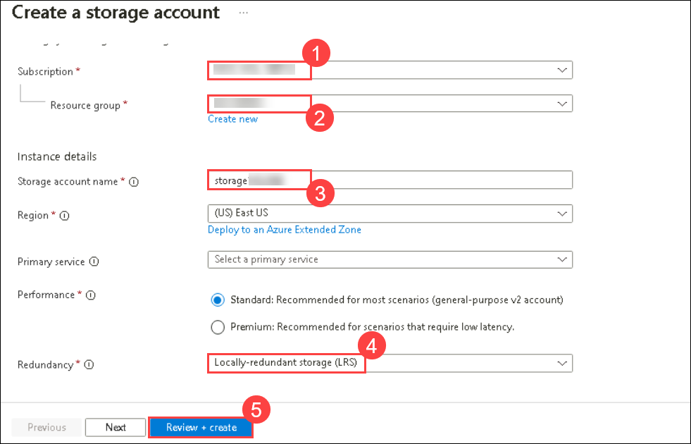
   
1. Verify that this time the validation passed and click **Create**.

   >**Note**: If the validation fails, kindly wait for some time as it might take some time for the policy to take effect for the validation to pass through.

1. Once the new storage account is provisioned, click **Go to resource** button and, on the **Overview** blade of the newly created storage account, note that the tag **Role** with the value **Infra** has been automatically assigned to the resource.

   

   <validation step="061bae10-923e-490f-8721-18d37b25821a" />

   > **Congratulations** on completing the task! Now, it's time to validate it. Here are the steps:
   > - Hit the Validate button for the corresponding task. If you receive a success message, you can proceed to the next task. 
   > - If not, carefully read the error message and retry the step, following the instructions in the lab guide.
   > - If you need any assistance, please contact us at cloudlabs-support@spektrasystems.com. We are available 24/7 to help

## Task 4: Configure and test resource locks

In this task, you will configure and test a resource lock to safeguard critical Azure resources from unintended changes or deletions. Resource locks are a powerful governance feature in Azure.

1. Search for and select your resource group **az104-rg2**.
   
1. In the **Settings** blade from the left navigation pane, select **Locks**.

1. Select **+ Add** and complete the resource lock information. When finished select **Ok**. 

    | Setting | Value |
    | --- | --- |
    | Lock name | `rg-lock` |
    | Lock type | **Delete** (notice the selection for read-only) |
    
1. Navigate to the resource group **Overview** blade, and select **Delete resource group**.

    

1. In the **Enter resource group name to confirm deletion** textbox provide the resource group name, `az104-rg2`. Notice you can copy and paste the resource group name and click on **Delete** twice. 

    
   
1. You should receive a notification denying the deletion. 

     

1. From the **az104-rg2** resource group **Overview** blade, under **Settings** section select **Locks** and Select Locks and proceed to click **Delete** to remove the existing **rg-lock** locks.

    

### Review

In this lab, you have completed:

- Created and assigned tags to resource groups using the Azure portal.
- Enforced tagging compliance by assigning an Azure Policy.
- Applied tagging to resources automatically using Azure Policy.
- Configured and validated resource locks to prevent accidental changes or deletions.

## Extend your learning with Copilot
Copilot can assist you in learning how to use the Azure scripting tools. Copilot can also assist in areas not covered in the lab or where you need more information. Open an Edge browser and choose Copilot (top right) or navigate to *copilot.microsoft.com*. Take a few minutes to try these prompts.
+ What are the Azure PowerShell and CLI commands for adding and deleting resource locks on a resource group?
+ Tabulate the differences between Azure policy and Azure RBAC, include examples.
+ What are the steps to enforce Azure policy and remediate resources which are not compliant?
+ How can I get a report of Azure resources with specific tags?

## Learn more with self-paced training

+ [Design an enterprise governance strategy](https://learn.microsoft.com/training/modules/enterprise-governance/). Use RBAC and Azure Policy to limit access to your Azure solutions, and determine which method is right for your security goals.

## Key takeaways

Congratulations on completing the lab. Here are the main takeaways for this lab. 

+ Azure tags are metadata that consists of a key-value pair. Tags describe a particular resource in your environment. In particular, tagging in Azure enables you to label your resources in a logical manner.
+ Azure Policy establishes conventions for resources. Policy definitions describe resource compliance conditions and the effect to take if a condition is met. A condition compares a resource property field or a value to a required value. There are many built-in policy definitions and you can customize the policies. 
+ The Azure Policy remediation task feature is used to bring resources into compliance based on a definition and assignment. Resources that are non-compliant to a modify or deployIfNotExist definition assignment, can be brought into compliance using a remediation task.
+ You can configure a resource lock on a subscription, resource group, or resource. The lock can protect a resource from accidental user deletions and modifications. The lock overrides any user permissions.
+ Azure Policy is pre-deployment security practice. RBAC and resource locks are post-deployment security practice.
  
### You have successfully completed the lab
