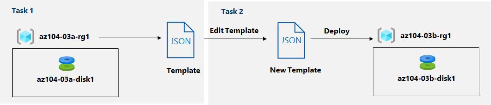

---
lab:
    title: '03b - Manage Azure resources by Using ARM Templates'
    module: 'Administer Azure Resources'
---

# Lab 03b - Manage Azure resources by Using ARM Templates
# Student lab manual

## Lab scenario
Now that you explored the basic Azure administration capabilities associated with provisioning resources and organizing them based on resource groups by using the Azure portal, you need to carry out the equivalent task by using Azure Resource Manager templates.

**Note:** An **[interactive lab simulation](https://mslabs.cloudguides.com/guides/AZ-104%20Exam%20Guide%20-%20Microsoft%20Azure%20Administrator%20Exercise%205)** is available that allows you to click through this lab at your own pace. You may find slight differences between the interactive simulation and the hosted lab, but the core concepts and ideas being demonstrated are the same. 

## Objectives

In this lab, you will:

+ Task 1: Review an ARM template for deployment of an Azure managed disk
+ Task 2: Create an Azure managed disk by using an ARM template
+ Task 3: Review the ARM template-based deployment of the managed disk

## Estimated timing: 20 minutes

## Architecture diagram



## Instructions

### Exercise 1

#### Task 1: Review an ARM template for deployment of an Azure managed disk

1. Sign in to the [**Azure portal**](http://portal.azure.com).

1. In the Azure portal, search for and select **Resource groups**. 

1. In the list of resource groups, click **az104-03a-rg1**.

1. On the **az104-03a-rg1** resource group blade, in the **Settings** section, click **Deployments**.

1. On the **az104-03a-rg1 - Deployments** blade, click the first entry in the list of deployments.

1. On the **Microsoft.ManagedDisk-*XXXXXXXXX* \| Overview** blade, click **Template**.

    >**Note**: Review the content of the template and note that you have the option to **Download** it to the local computer, **Add to library**, or **Deploy** it again.

1. Click **Download** and save the compressed file containing the template and parameters files to the **Downloads** folder on your lab computer.

1. On the **Microsoft.ManagedDisk-*XXXXXXXXX* \| Template** blade, click **Inputs**.

1. Note the value of the **location** parameter. You will need it in the next task.

1. Extract the content of the downloaded file into the **Downloads** folder on your lab computer.

    >**Note**: These files are also available as **\\Allfiles\\Labs\\03\\az104-03b-md-template.json** and **\\Allfiles\\Labs\\03\\az104-03b-md-parameters.json**
    
1. Close all **File Explorer** windows.

#### Task 2: Create an Azure managed disk by using an ARM template

1. In the Azure portal, search for and select **Deploy a custom template**.

1. On the **Custom deployment** blade, click **Build your own template in the editor**.

1. On the **Edit template** blade, click **Load file** and upload the **template.json** file you downloaded in the previous task.

1. Within the editor pane, remove the following lines:

   ```json
   "sourceResourceId": {
       "type": "String"
   },
   ```

   ```json
   "hyperVGeneration": {
       "defaultValue": "V1",
       "type": "String"
   },      
   ```

    >**Note**: These parameters are removed since they are not applicable to the current deployment. In particular, sourceResourceId, sourceUri, osType, and hyperVGeneration parameters are applicable to creating an Azure disk from an existing VHD file.

1. **Save** the changes.

1. Back on the **Custom deployment** blade, click **Edit parameters**. 

1. On the **Edit parameters** blade, click **Load file** and upload the **parameters.json** file you downloaded in the previous task, and **Save** the changes.

1. Back on the **Custom deployment** blade, specify the following settings:

    | Setting | Value |
    | --- |--- |
    | Subscription | *the name of the Azure subscription you are using in this lab* |
    | Resource Group | the name of a **new** resource group **az104-03b-rg1** |
    | Region | the name of any Azure region available in the subscription you are using in this lab |
    | Disk Name | **az104-03b-disk1** |
    | Location | the value of the location parameter you noted in the previous task |
    | Sku | **Standard_LRS** |
    | Disk Size Gb | **32** |
    | Create Option | **empty** |
    | Disk Encryption Set Type | **EncryptionAtRestWithPlatformKey** |
    | Network Access Policy | **AllowAll** |

1. Select **Review + Create** and then select **Create**.

1. Verify that the deployment completed successfully.

#### Task 3: Review the ARM template-based deployment of the managed disk

1. In the Azure portal, search for and select **Resource groups**. 

1. In the list of resource groups, click **az104-03b-rg1**.

1. On the **az104-03b-rg1** resource group blade, in the **Settings** section, click **Deployments**.

1. From the **az104-03b-rg1 - Deployments** blade, click the first entry in the list of deployments and review the content of the **Input** and **Template** blades.

#### Clean up resources

   >**Note**: Do not delete resources you deployed in this lab. You will reference them in the next lab of this module.

#### Review

In this lab, you have:

- Reviewed an ARM template for deployment of an Azure managed disk
- Created an Azure managed disk by using an ARM template
- Reviewed the ARM template-based deployment of the managed disk
