# Lab 3 - Manage Azure resources by Using ARM Templates

## Lab Overview
 
 In this hands-on lab, you will learn to manage Azure resources using ARM templates, automating resource deployment and management. You'll explore editing, redeploying templates, and deploying resources using Azure PowerShell, CLI, and Bicep. 
 
## Lab objectives

-  Task 1: Create an Azure Resource Manager template.
-  Task 2: Edit an Azure Resource Manager template and redeploy the template.
-  Task 3: Configure the Cloud Shell and deploy a template with Azure PowerShell.
-  Task 4: Deploy a template with the CLI. 
-  Task 5: Deploy a resource by using Azure Bicep.

## Excercise 1: Manage Azure resources by Using ARM Templates

In this exercise,you will learn to  manage Azure resources using ARM templates which involves defining and deploying infrastructure as code, automating resource provisioning and configuration. 

### Task 1: Create an Azure Resource Manager template

In this task, we will create a managed disk in the Azure portal. Managed disks are storage designed to be used with virtual machines. Once the disk is deployed you will export a template that you can use in other deployments.

1. In Search resources, services, and docs (G+/) box at the top of the portal, enter **Disks**, and then select **Disks** from the results.

   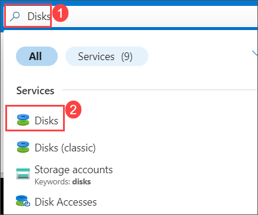

1. On the Disks page, select **Create**.

1. On the **Create a managed disk** page, configure the disk and then select **Review + create (11)**. 
    
    | Setting | Value |
    | --- | --- |
    | Subscription | *your default subscription* (1) | 
    | Resource Group | **az104-rg2** (2))
    | Disk name | **az104-09b-disk1** (3) | 
    | Region | **<inject key="Region" enableCopy="false" />** (4)|
    | Availability zone | **No infrastructure redundancy required** (5) | 
    | Source type | **None** (6)|
    | Size | Click on **change size (7)** link |
    | Select a disk size  | Under **Storage type** select **Standard HDD (8)** then select **32 GIB (9)** and click on **OK (10)**. |
    -------------------------------------------------------------------------------------------------------------------------------------
    

    

    

   >**Note:** We are creating a simple managed disk so you can practice with templates. Azure managed disks are block-level storage volumes that are managed by Azure.

1. Click **Create**.

1. Monitor the notifications (upper right) and after the deployment select **Go to resource**. 

1. In the **Automation** blade, select **Export template (1)**. Take a minute to review the **Template** and **Parameters** files.

1. Click **Download (2)** and save the templates to the local drive. This creates a compressed zipped file. 

   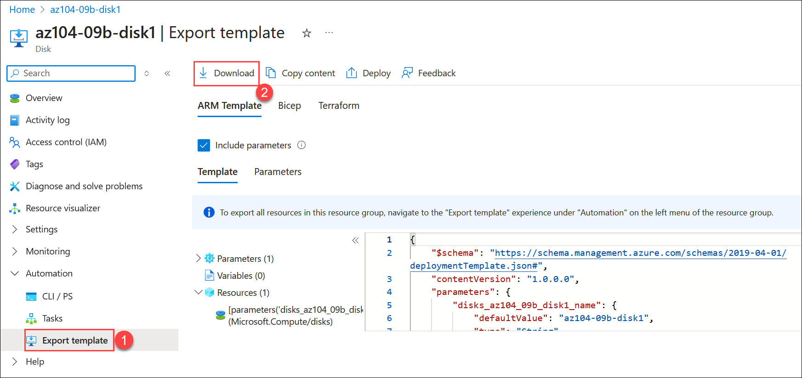

1. Use File Explorer to extract the content of the downloaded file into the **Downloads** folder open the downloaded file and extra on your computer. Notice there are two JSON files (template and parameters). 
    
     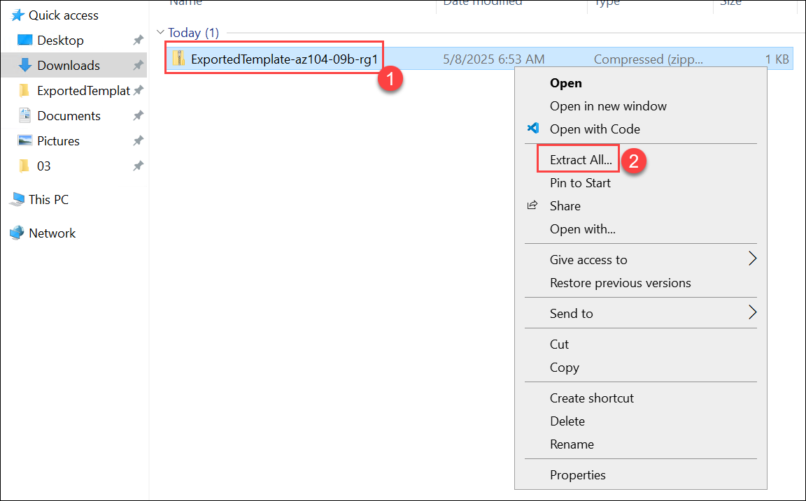

     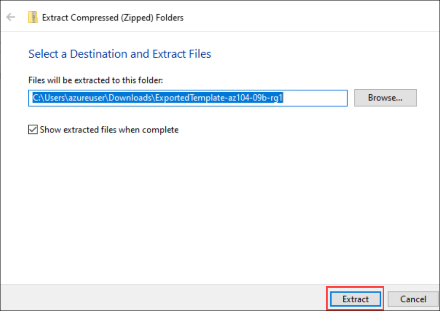

    >**Did you know?**  You can export an entire resource group or just specific resources within that resource group.

## Task 2: Edit an Azure Resource Manager template and then redeploy the template

In this task, you will utilize the previously downloaded Azure Resource Manager (ARM) template to deploy a new managed disk. The template, which includes the configuration and settings for the disk, allows for rapid and consistent deployment of resources.

1. In Search resources, services, and docs (G+/) box at the top of the portal, enter **Deploy a custom template**, and then select **Deploy a custom template** from the results.

   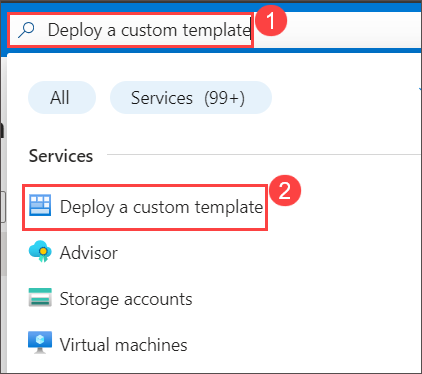
   
1. On the **Custom deployment** blade, notice there is the ability to use a **Quickstart template**. There are many built-in templates as shown in the drop-down menu. 

1. Instead of using a Quickstart, select **Build your own template in the editor**.

     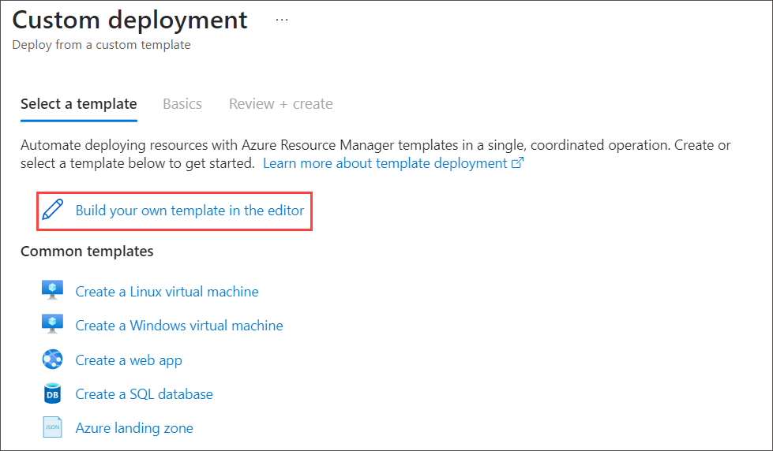

1. On the **Edit template** blade, click **Load file** and upload the **template.json** file you downloaded to the local disk.

   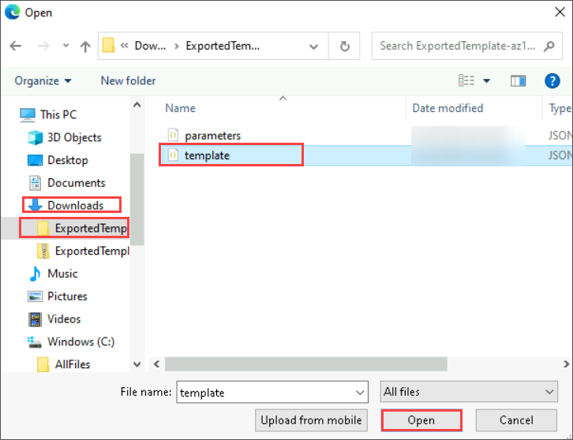

1. Within the editor pane, make these changes.

    -  Change **disks_az104_disk1_name** to `disk_name` (two places to change line number 5 and 15)
    
    -  Change **az104-03b-disk1** to **az104-09b-disk2 (3)** (one place to change line number 6)

      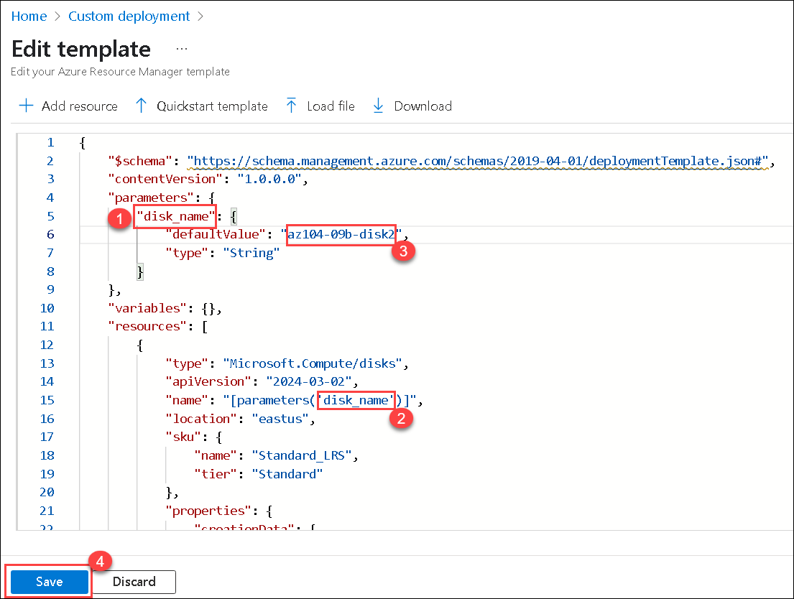

1. **Save** your changes.

1. Don't forget the parameters file. Select **Edit parameters**, click **Load file** and upload the **parameters.json**. 

    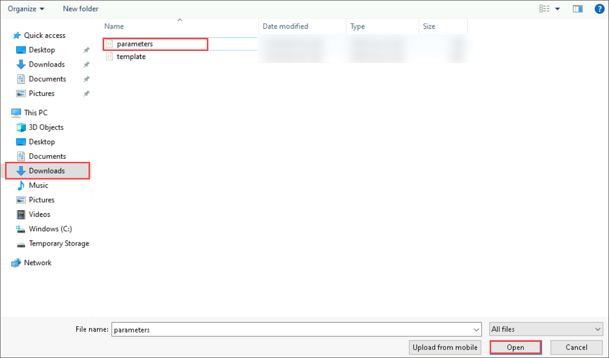

1. Make this change so it matches the template file.

    Change **disks_az104_disk1_name** to **disk_name** (one place to change)

     

1. **Save** your changes. 

1. Complete the custom deployment settings:

    | Setting | Value |
    | --- |--- |
    | Subscription | *your subscription* |
    | Resource Group | **az104-rg2** |
    | Region | **<inject key="Region" enableCopy="false" />** |
    | Disk_name | **az104-09b-disk2**|

1. Select **Review + Create** and then select **Create**.

1. Select **Go to resource**. Verify **az104-09b-disk2** was created.

1. On the **Overview** blade, select the resource group, **az104-rg2**. You should now have two disks.

      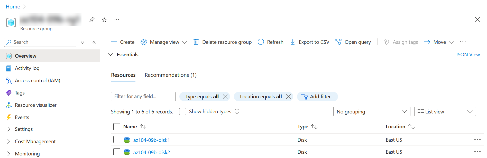

1. In the **Settings** section, click **Deployments**.

     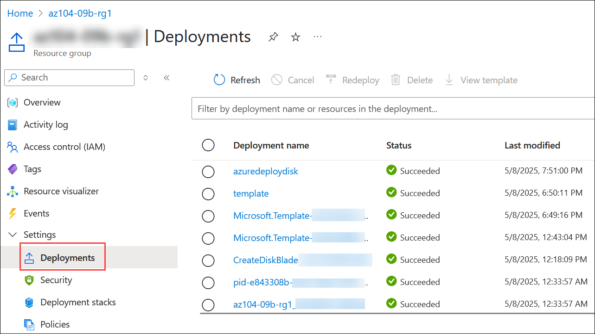

   >**Note:** All deployments details are documented in the resource group. It is a good practice to review the first few template-based deployments to ensure success prior to using the templates for large-scale operations.

## Task 3: Configure the Cloud Shell and deploy a template with Azure PowerShell

In this task, you work with the Azure Cloud Shell and Azure PowerShell. Azure Cloud Shell is an interactive, authenticated, browser-accessible terminal for managing Azure resources. It provides the flexibility of choosing the shell experience that best suits the way you work, either Bash or PowerShell. In this task, you use PowerShell to deploy a template. 

1. Select the **Cloud Shell** icon in the top right of the Azure Portal. 

   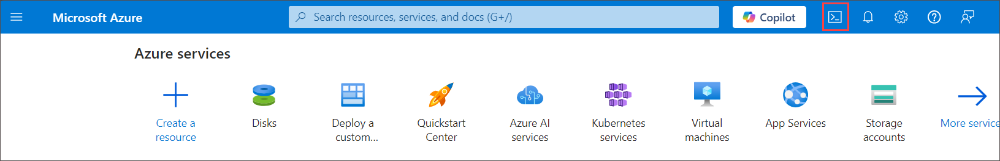

1. When prompted to select either **Bash** or **PowerShell**, select **PowerShell**. 

    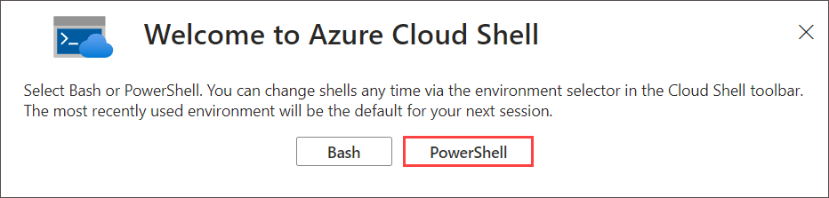

   >**Did you know?**  If you mostly work with Linux systems, Bash (CLI) feels more familiar. If you mostly work with Windows systems, Azure PowerShell feels more familiar. 

1. On the **You have no storage mounted** screen select **Mount Storage Account**, select the storage account subscription from drop down and click on **Apply**

     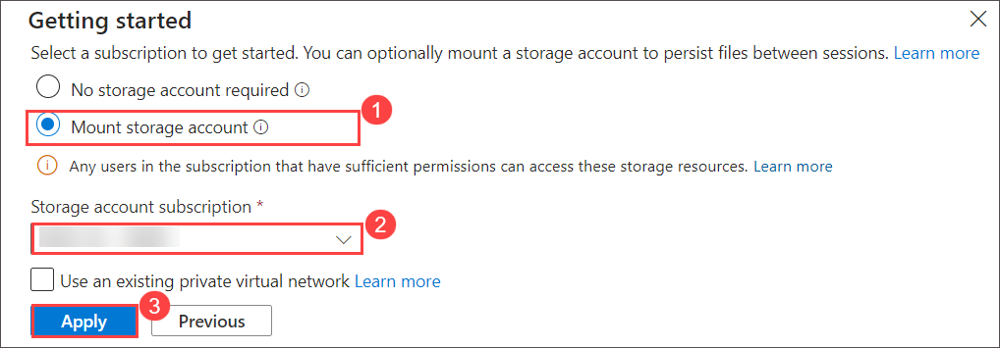

1. On mount storage account page, select **I want to create a storage account**. click on **Next**.

    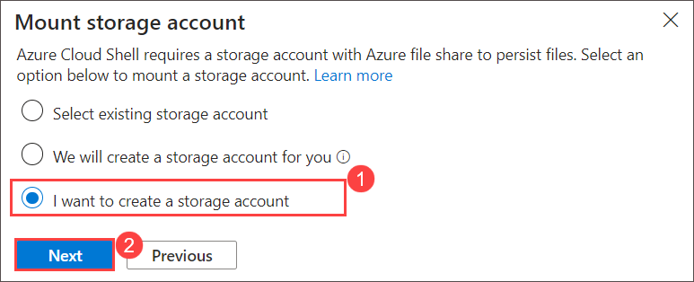

1. Provide the below details to create the storage account and click on **Create**.

    >**Note:** As you work with the Cloud Shell a storage account and file share is required. 

    | Settings | Values |
    |  -- | -- |
    | Subscription | Accept default |
    | Resource Group | **az104-rg2** |
    | Region | **<inject key="Region" enableCopy="false" />** |
    | Storage account (Create new) | **str<inject key="DeploymentID" enableCopy="false" />** |
    | File share (Create new) | **none** |

    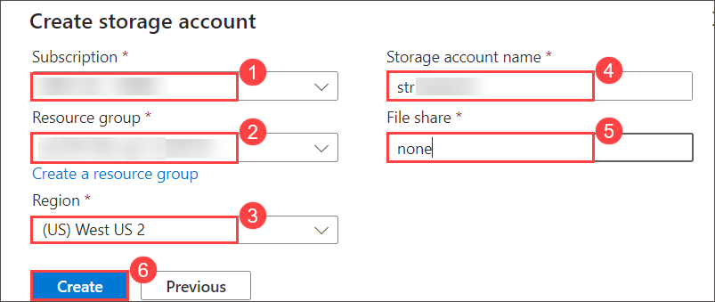

1. On the toolbar of the Cloud Shell pane, select the Select **Manage files** icon, in the drop-down menu, select **Upload** and upload the the template and parameters file from the downloads directory. You will need to upload each file separately one after the another.

   

1. Verify your files are available in the Cloud Shell storage. 

    ```powershell
    dir
    ```
    >**Note**: If you need to, you can use **cls** to clear the command window. You can use the arrow keys to move the command history.

1. Select the **Editor** 

   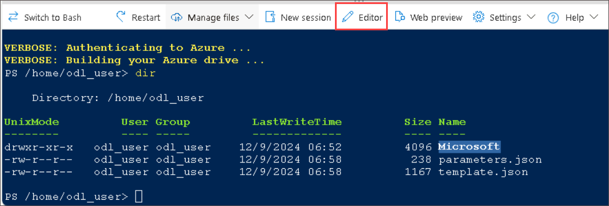

1. Click on **Confirm** on **Switch to classic Cloud Shell**

   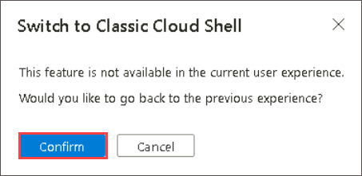

1. Select the **Editor** (curly brackets) icon and navigate to the template JSON file.

   

1. Select **template.json** and make a change. For example, change the disk name to **az104-09b-disk3**. Use **Ctrl +S** to save your changes.

    

    >**Note**: You can target your template deployment to a resource group, subscription, management group, or tenant. Depending on the scope of the deployment, you use different commands.

1. To deploy to a resource group, use **New-AzResourceGroupDeployment**.

    ```powershell
    New-AzResourceGroupDeployment -ResourceGroupName az104-03b-rg1-<inject key="DeploymentID" enableCopy="false"/> -TemplateFile template.json -TemplateParameterFile parameters.json
    ```

    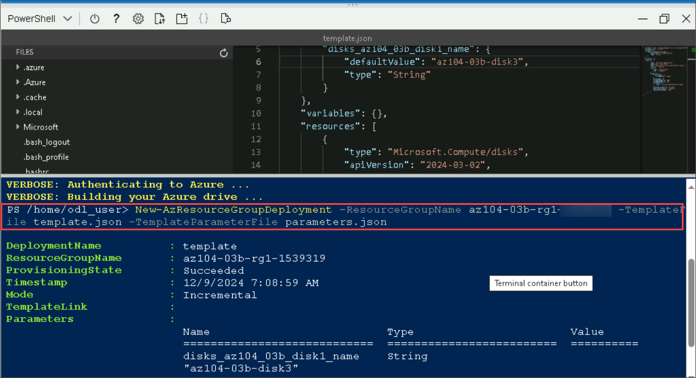

1. Ensure the command completes and the ProvisioningState is **Succeeded**.

1. Confirm the disk was created.

   ```powershell
   Get-AzDisk
   ```

## Task 4: Deploy a template with the CLI 

In this task, you will deploy an Azure Resource Manager (ARM) template using the Command-Line Interface (CLI). The Azure CLI provides a powerful, scriptable interface to interact with Azure resources.

1. Continue in the **Cloud Shell** select **Bash**. **Confirm** your choice.

    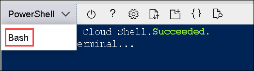

    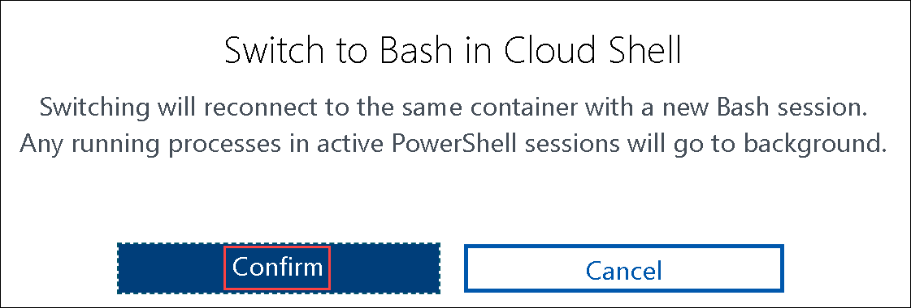

1. Verify your files are available in the Cloud Shell storage. If you completed the previous task your template files should be available. 

    ```sh
    ls
    ```
     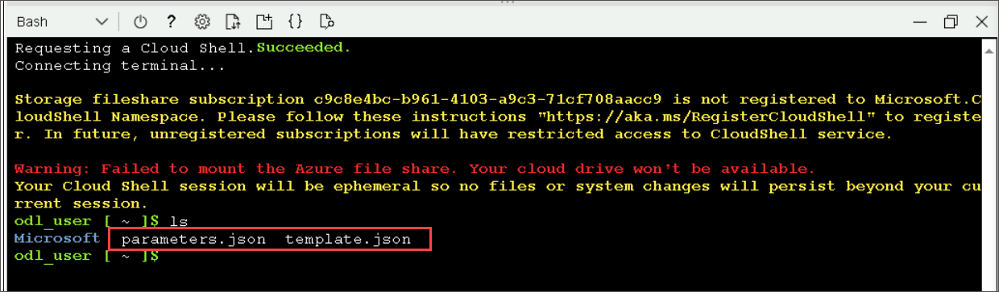

1. Select the **Editor** (curly brackets) icon and navigate to the template JSON file.

1. Make a change. For example, change the disk name to **az104-09b-disk4**. Use **Ctrl +S** to save your changes. 

    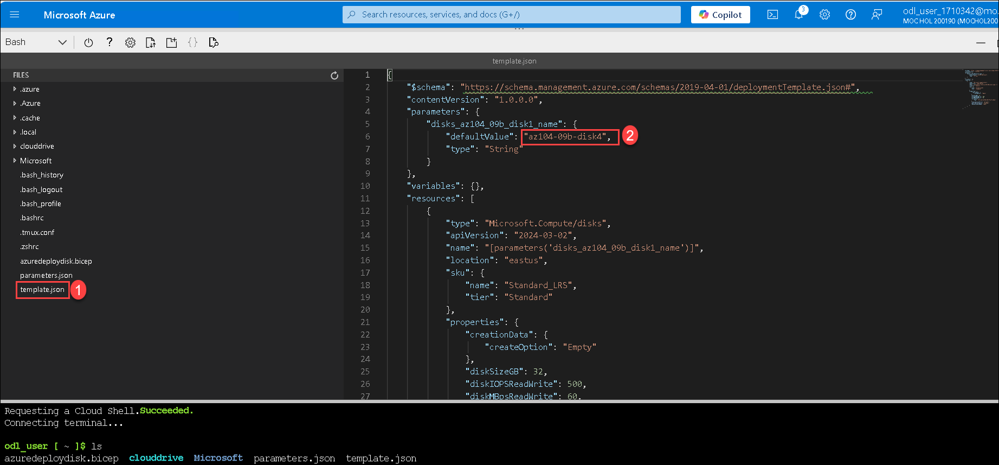

    >**Note**: You can target your template deployment to a resource group, subscription, management group, or tenant. Depending on the scope of the deployment, you use different commands.

1. To deploy to a resource group, use **az deployment group create**.

   ```sh
    az deployment group create --resource-group az104-03b-rg1-<inject key="DeploymentID" enableCopy="false"/> --template-file template.json --parameters parameters.json
    ```    
1. Ensure the command completes and the ProvisioningState is **Succeeded**.

1. Confirm the disk was created.

     ```sh
     az disk list --output table
     ```

     

## Task 5: Deploy a resource by using Azure Bicep

In this task, you will use a Bicep file to deploy a managed disk. Bicep is a declarative automation tool that is built on ARM templates.

1. Close and reopen **Cloud Shell** in a **Bash** session.

1. Select **Editor (1)** and click **Confirm (2)** on **Switch to classsic Cloud Shell**.

   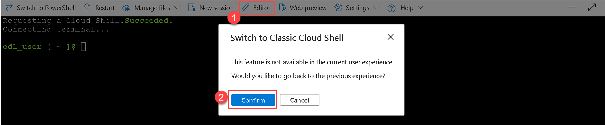
   
1. On the toolbar of the Cloud Shell pane, select the Select **Manage files** icon, in the drop-down menu, select **Upload**. Locate and upload the **C:\AllFiles\AZ-104-MicrosoftAzureAdministrator-Lab-Files\Allfiles\Labs\03\azuredeploydisk.bicep** file.

    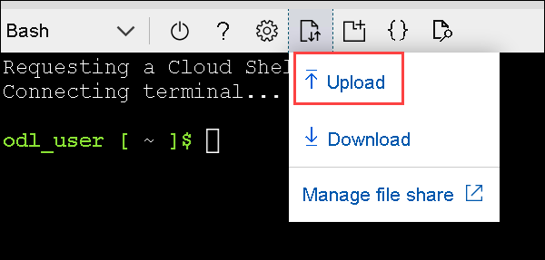

1. Select the **Editor** (curly brackets) icon and navigate to azuredeploydisk.bicep file.

1. Take a minute to read through the bicep template file. Notice how the disk resource is defined. 
   
1. Make the following changes:

   - Change the **managedDiskName** value to **az104-09b-disk5** .
   - Change the **diskSizeinGiB** value to **32**.
   - Change the **sku name** value to `StandardSSD_LRS`.

     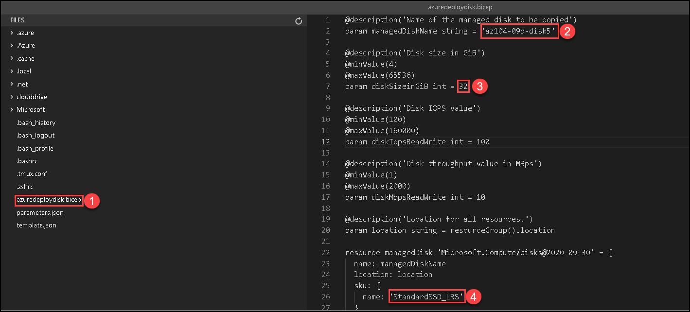

1. Use **Ctrl +S** to save your changes.

1. Now, deploy the template.

    ```
    az deployment group create --resource-group az104-03b-rg1-<inject key="DeploymentID" enableCopy="false"/> --template-file azuredeploydisk.bicep
    ```

1. Confirm the disk was created.

    ```sh
    az disk list --output table
    ```
     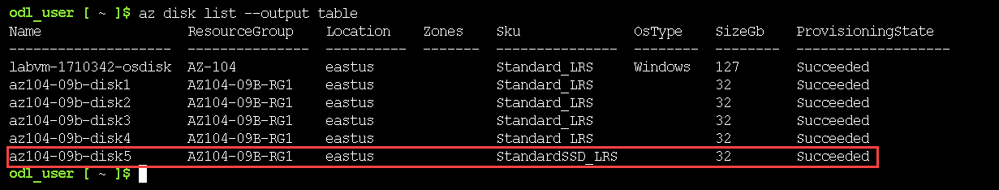

   <validation step="20812377-9bdd-4b28-91c7-ff8aed11421f" />
 
  > **Congratulations** on completing the task! Now, it's time to validate it. Here are the steps:
  > - Hit the Validate button for the corresponding task. If you receive a success message, you can proceed to the next  task. 
  > - If not, carefully read the error message and retry the step, following the instructions in the lab guide.
  > - If you need any assistance, please contact us at cloudlabs-support@spektrasystems.com. We are available 24/7 to help

### Review

In this lab, you have completed the following:

- Created an Azure Resource Manager (ARM) template: You initiated the process by creating a template to define the resources, such as managed disks, in your Azure environment.
- Edited and redeployed an Azure Resource Manager (ARM) template: You modified the initial template to change specific parameters, such as disk names, and redeployed it to replicate resource creation easily.
- Configured the Cloud Shell and deployed a template using Azure PowerShell: You set up the Azure Cloud Shell, configured it for PowerShell, and deployed a resource template using PowerShell commands.
- Deployed a template using the Azure Command-Line Interface (CLI): You used the Azure CLI in Cloud Shell to deploy the template, practicing automation through command-line tools.
- Deployed a resource using Azure Bicep: You utilized Azure Bicep, a declarative language, to deploy resources and modify the template for a more efficient and scalable deployment process.

## Extend your learning with Copilot

Copilot can assist you in learning how to use the Azure scripting tools. Copilot can also assist in areas not covered in the lab or where you need more information. Open an Edge browser and choose Copilot (top right) or navigate to *copilot.microsoft.com*. Take a few minutes to try these prompts.

+ What is the format of the Azure Resource Manager template file? Explain each component with examples. 
+ How do I use an existing Azure Resource Manager template?
+ Compare and contrast Azure Resource Manager templates and Azure Bicep templates. 


## Learn more with self-paced training

+ [Deploy Azure infrastructure by using JSON ARM templates](https://learn.microsoft.com/training/modules/create-azure-resource-manager-template-vs-code/). Write JSON Azure Resource Manager templates (ARM templates) by using Visual Studio Code to deploy your infrastructure to Azure consistently and reliably.
+ [Review the features and tools for Azure Cloud Shell](https://learn.microsoft.com/training/modules/review-features-tools-for-azure-cloud-shell/). Cloud Shell features and tools. 
+ [Manage Azure resources with Windows PowerShell](https://learn.microsoft.com/training/modules/manage-azure-resources-windows-powershell/). This module explains how to install the necessary modules for cloud services management and use PowerShell commands to perform simple administrative tasks on cloud resources like Azure virtual machines, Azure subscriptions and Azure storage accounts.
+ [Introduction to Bash](https://learn.microsoft.com/training/modules/bash-introduction/). Use Bash to manage IT infrastructure.
+ [Build your first Bicep template](https://learn.microsoft.com/training/modules/build-first-bicep-template/). Define Azure resources within a Bicep template. Improve the consistency and reliability of your deployments, reduce the manual effort required, and scale your deployments across environments. Your template will be flexible and reusable by using parameters, variables, expressions, and modules.

## Key takeaways

Congratulations on completing the lab. Here are the main takeaways for this lab. 

+ Azure Resource Manager templates let you deploy, manage, and monitor all the resources for your solution as a group, rather than handling these resources individually.
+ An Azure Resource Manager template is a JavaScript Object Notation (JSON) file that lets you manage your infrastructure declaratively rather than with scripts.
+ Rather than passing parameters as inline values in your template, you can use a separate JSON file that contains the parameter values.
+ Azure Resource Manager templates can be deployed in a variety of ways including the Azure portal, Azure PowerShell, and CLI.
+ Bicep is an alternative to Azure Resource Manager templates. Bicep uses a declarative syntax to deploy Azure resources.
+ Bicep provides concise syntax, reliable type safety, and support for code reuse. Bicep offers a first-class authoring experience for your infrastructure-as-code solutions in Azure.

### You have successfully completed the lab
