# Lab 3 - Manage Azure resources by Using ARM Templates

## Lab scenario
Now that you explored the basic Azure administration capabilities associated with provisioning resources and organizing them based on resource groups by using the Azure portal, you need to carry out the equivalent task by using Azure Resource Manager templates.

## Lab objectives

-  Task 1: Create an Azure Resource Manager template.
-  Task 2: Edit an Azure Resource Manager template and redeploy the template.
-  Task 3: Configure the Cloud Shell and deploy a template with Azure PowerShell.
-  Task 4: Deploy a template with the CLI. 
-  Task 5: Deploy a resource by using Azure Bicep.

## Estimated timing: 60 minutes

## Architecture diagram


## Excercise 1: Manage Azure resources by Using ARM Templates

### Task 1: Create an Azure Resource Manager template

In this task, we will create a managed disk in the Azure portal. Managed disks are storage designed to be used with virtual machines. Once the disk is deployed you will export a template that you can use in other deployments.

1. In the search bar in the Azure portal, search for and select **Disks**

   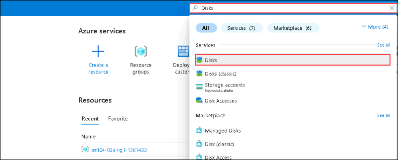

1. On the Disks page, select **Create**.

1. On the **Create a managed disk** page, configure the disk and then select **Ok**. 
    
    | Setting | Value |
    | --- | --- |
    | Subscription | *your default subscription* (1) | 
    | Resource Group | **az104-03b-rg1-<inject key="DeploymentID" enableCopy="false" />** (2))
    | Disk name | **az104-03b-disk1** (3) | 
    | Region | **<inject key="Region" enableCopy="false" />** (4)|
    | Availability zone | **No infrastructure redundancy required** (5) | 
    | Source type | **None** (6)|
    | Size | **32 Gib** (7) |
    | Performance | **Standard HDD** (change size) (8)|

   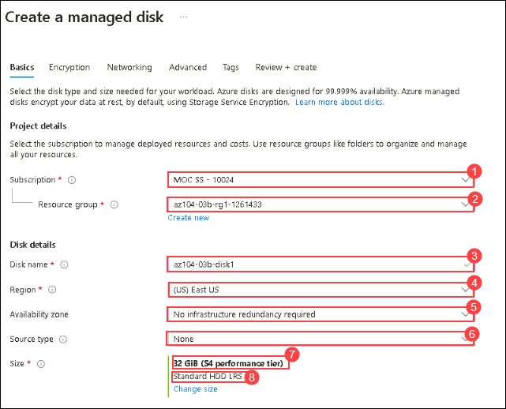

   >**Note:** We are creating a simple managed disk so you can practice with templates. Azure managed disks are block-level storage volumes that are managed by Azure.

1. Click **Review + Create** then select **Create**.

1. Monitor the notifications (upper right) and after the deployment select **Go to resource**. 

1. In the **Automation** blade, select **Export template**. 

1. Take a minute to review the **Template** and **Parameters** files.

1. Click **Download** and save the templates to the local drive. This creates a compressed zipped file. 

1. Use File Explorer to extract the content of the downloaded file into the **Downloads** folder on your computer. Notice there are two JSON files (template and parameters). 

   >**Did you know?**  You can export an entire resource group or just specific resources within that resource group.

## Task 2: Edit an Azure Resource Manager template and then redeploy the template

In this task, you use the downloaded template to deploy a new managed disk. This task outlines how to quicky and easily repeat deployments. 

1. In the Azure portal, search for and select `Deploy a custom template`.

   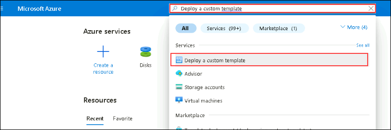
   
1. On the **Custom deployment** blade, notice there is the ability to use a **Quickstart template**. There are many built-in templates as shown in the drop-down menu. 

1. Instead of using a Quickstart, select **Build your own template in the editor**.

1. On the **Edit template** blade, click **Load file** and upload the **template.json** file you downloaded to the local disk.

   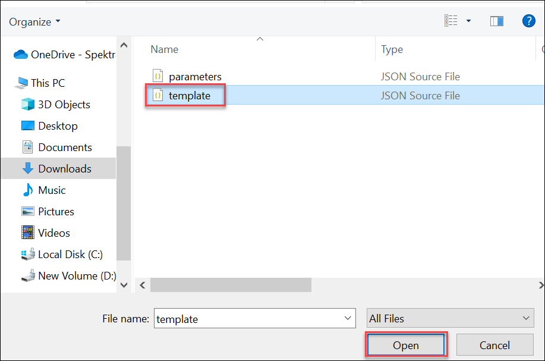

1. Within the editor pane, make these changes.

    -  Change **disks_az104_disk1_name** to `disk_name` (two places to change line number 5 and 15)

       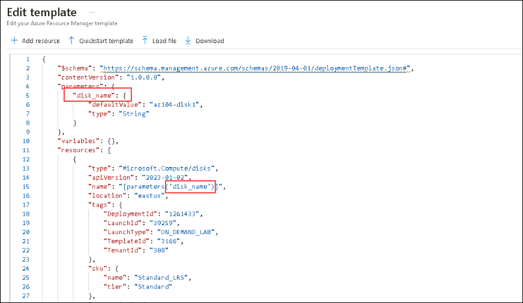
    
    - Change **az104-03b-disk1** to **az104-03b-disk2** (one place to change line number 6)

      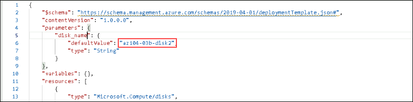

1. **Save** your changes.

1. Don't forget the parameters file. Select **Edit parameters**, click **Load file** and upload the **parameters.json**. 

1. Make this change so it matches the template file.

    Change **disks_az104_disk1_name** to **disk_name** (one place to change)

     

1. **Save** your changes. 

1. Complete the custom deployment settings:

    | Setting | Value |
    | --- |--- |
    | Subscription | *your subscription* |
    | Resource Group | **az104-03b-rg1-<inject key="DeploymentID" enableCopy="false" />** |
    | Region | **<inject key="Region" enableCopy="false" />** |
    | Disk_name | **az104-03b-disk2**|

1. Select **Review + Create** and then select **Create**.

1. Select **Go to resource**. Verify **az104-03b-disk2** was created.

1. On the **Overview** blade, select the resource group, **az104-03b-rg1-<inject key="DeploymentID" enableCopy="false" />**. You should now have two disks.
   
1. In the **Settings** section, click **Deployments**.

    >**Note:** All deployments details are documented in the resource group. It is a good practice to review the first few template-based deployments to ensure success prior to using the templates for large-scale operations.

## Task 3: Configure the Cloud Shell and deploy a template with Azure PowerShell

In this task, you work with the Azure Cloud Shell and Azure PowerShell. Azure Cloud Shell is an interactive, authenticated, browser-accessible terminal for managing Azure resources. It provides the flexibility of choosing the shell experience that best suits the way you work, either Bash or PowerShell. In this task, you use PowerShell to deploy a template. 

1. Select the **Cloud Shell** icon in the top right of the Azure Portal. 

   

1. When prompted to select either **Bash** or **PowerShell**, select **PowerShell**. 

    >**Did you know?**  If you mostly work with Linux systems, Bash (CLI) feels more familiar. If you mostly work with Windows systems, Azure PowerShell feels more familiar. 

1. On the **You have no storage mounted** screen select **Mount Storage Account**, select the storage account subscription from drop down and click on **Apply**

1. On mount storage account page, select the **I want to create a storage account**. click on Next.

1. Provide the below details to create the storage account and click on **Next**.

    >**Note:** As you work with the Cloud Shell a storage account and file share is required. 

    | Settings | Values |
    |  -- | -- |
    | Resource Group | **az104-03b-rg1-<inject key="DeploymentID" enableCopy="false" />** |
    | Storage account (Create new) | **str<inject key="DeploymentID" enableCopy="false" />** |
    | Region | **<inject key="Region" enableCopy="false" />** |
    | File share (Create new) | **none** |

1. Click on Editor, it will ask you to switch to classic cloud shell. click on **Confirm**.

1. Use the **Upload/Download files** icon to upload the template and parameters file from the downloads directory. You will need to upload each file separately.

   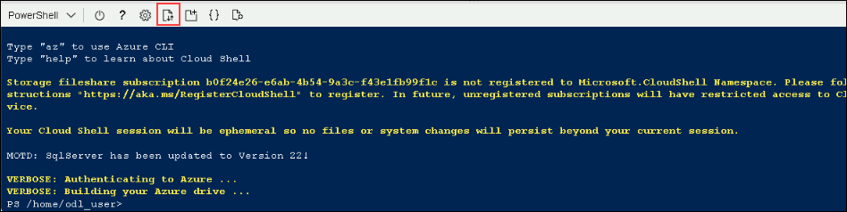

1. Verify your files are available in the Cloud Shell storage. 

    ```powershell
    dir
    ```
    >**Note**: If you need to, you can use **cls** to clear the command window. You can use the arrow keys to move the command history.
   
1. Select the **Editor** (curly brackets) icon and navigate to the template JSON file.

   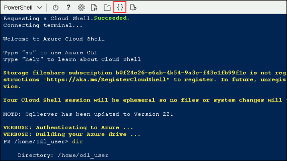

1. Make a change. For example, change the disk name to **az104-03b-disk3**. Use **Ctrl +S** to save your changes.

    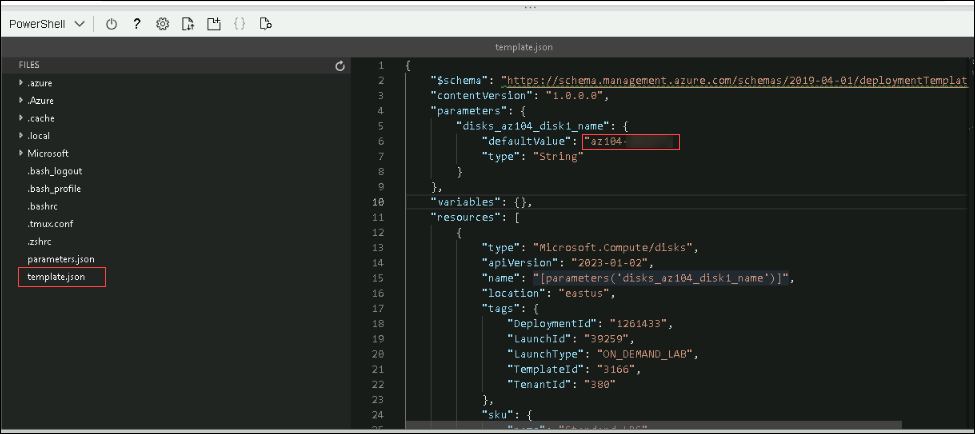

    >**Note**: You can target your template deployment to a resource group, subscription, management group, or tenant. Depending on the scope of the deployment, you use different commands.

1. To deploy to a resource group, use **New-AzResourceGroupDeployment**.

   Replace [DID] with **<inject key="DeploymentID" enableCopy="false" />**

    ```powershell
    New-AzResourceGroupDeployment -ResourceGroupName az104-03b-rg1-[DID] -TemplateFile template.json -TemplateParameterFile parameters.json
    ```
1. Ensure the command completes and the ProvisioningState is **Succeeded**.

1. Confirm the disk was created.

   ```powershell
   Get-AzDisk
   ```

## Task 4: Deploy a template with the CLI 

1. Continue in the **Cloud Shell** select **Bash**. **Confirm** your choice.

1. Verify your files are available in the Cloud Shell storage. If you completed the previous task your template files should be available. 

    ```sh
    ls
    ```

1. Select the **Editor** (curly brackets) icon and navigate to the template JSON file.

1. Make a change. For example, change the disk name to **az104-03b-disk4**. Use **Ctrl +S** to save your changes. 

   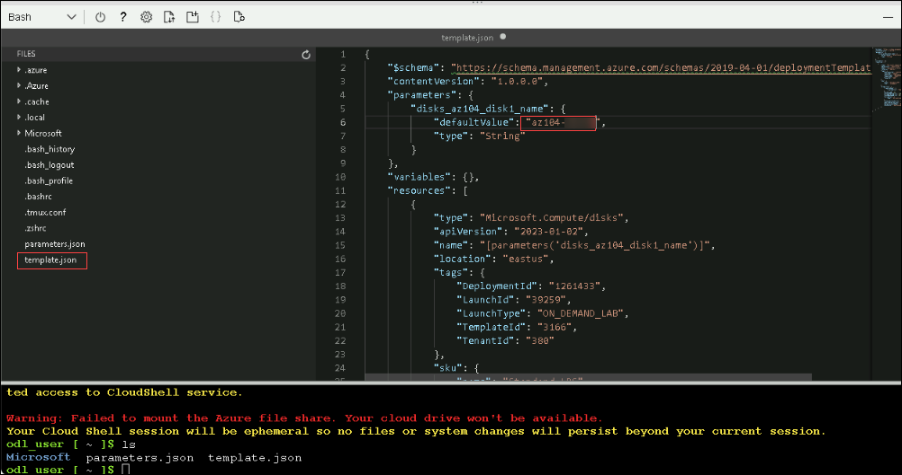

    >**Note**: You can target your template deployment to a resource group, subscription, management group, or tenant. Depending on the scope of the deployment, you use different commands.

1. To deploy to a resource group, use **az deployment group create**.

    Replace [DID] with **<inject key="DeploymentID" enableCopy="false" />**

   ```sh
    az deployment group create --resource-group az104-03b-rg1-[DID] --template-file template.json --parameters parameters.json
    ```    
1. Ensure the command completes and the ProvisioningState is **Succeeded**.

1. Confirm the disk was created.

     ```sh
     az disk list --output table
     ```

## Task 5: Deploy a resource by using Azure Bicep

In this task, you will use a Bicep file to deploy a managed disk. Bicep is a declarative automation tool that is built on ARM templates.

1. Close and reopen **Cloud Shell** in a **Bash** session.

1. Locate and download the **C:\AllFiles\AZ-104-MicrosoftAzureAdministrator-Lab-Files\Allfiles\Labs\03\azuredeploydisk.bicep** file.

1. **Upload** the bicep file to the Cloud Shell. 

1. Select the **Editor** (curly brackets) icon and navigate to the file.

1. Take a minute to read through the bicep template file. Notice how the disk resource is defined. 
   
1. Make the following changes:

   - Change the **managedDiskName** value to **az104-03b-disk5** .
   - Change the **sku name** value to `StandardSSD_LRS`.
   - Change the **diskSizeinGiB** value to **32**.

     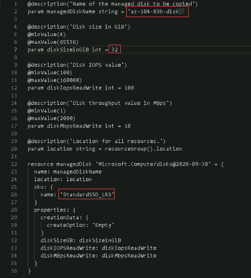

1. Use **Ctrl +S** to save your changes.

1. Now, deploy the template.

    Replace [DID] with **<inject key="DeploymentID" enableCopy="false" />**
    ```
    az deployment group create --resource-group az104-03b-rg1-[DID] --template-file azuredeploydisk.bicep
    ```

1. Confirm the disk was created.

    ```sh
    az disk list --output table
    ```

   <validation step="95c0111f-ab42-4cdd-a5ca-abd36982cc45" />
 
   > **Congratulations** on completing the lab! Now, it's time to validate it. Here are the steps:
   > - Navigate to the Lab Validation Page, from the upper right corner in the lab guide section.
   > - Hit the Validate button for the corresponding task. If you receive a success message, you can proceed to the next task. 
   > - If not, carefully read the error message and retry the step, following the instructions in the lab guide.
   > - If you need any assistance, please contact us at labs-support@spektrasystems.com. We are available 24/7 to help you out.

### Review

In this lab, you have completed:

- Created an Azure Resource Manager template.
- Edited an Azure Resource Manager template and redeployed the template
- Configured the Cloud Shell and deployed a template with Azure PowerShell
- Deployed a template with the CLI
- Deployed a resource by using Azure Bicep


### You have successfully completed the lab
