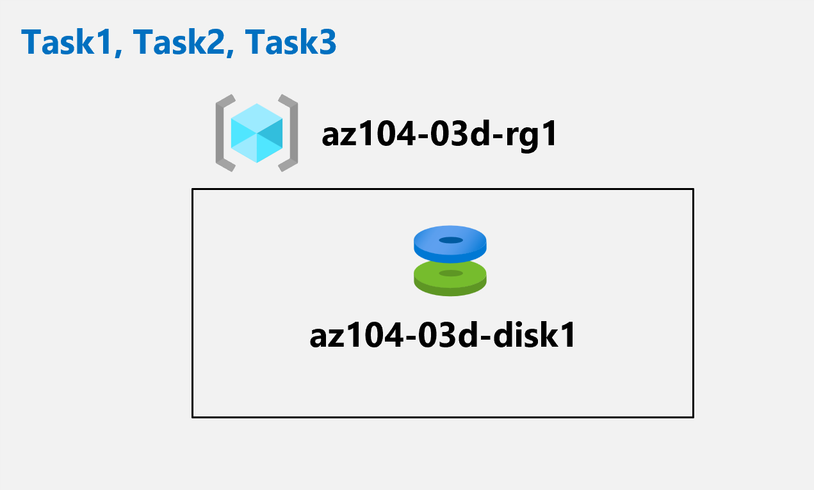

---
lab:
    title: 'Lab 03d: Manage Azure resources by Using Azure CLI (optional)'
    module: 'Administer Azure Resources'
---

# Lab 03d - Manage Azure resources by Using Azure CLI
# Student lab manual

## Lab scenario

Now that you explored the basic Azure administration capabilities associated with provisioning resources and organizing them based on resource groups by using the Azure portal, Azure Resource Manager templates, and Azure PowerShell, you need to carry out the equivalent task by using Azure CLI. To avoid installing Azure CLI, you will leverage Bash environment available in Azure Cloud Shell.

**Note:** An **[interactive lab simulation](https://mslabs.cloudguides.com/guides/AZ-104%20Exam%20Guide%20-%20Microsoft%20Azure%20Administrator%20Exercise%207)** is available that allows you to click through this lab at your own pace. You may find slight differences between the interactive simulation and the hosted lab, but the core concepts and ideas being demonstrated are the same. 

## Objectives

In this lab, you will:

+ Task 1: Start a Bash session in Azure Cloud Shell
+ Task 2: Create a resource group and an Azure managed disk by using Azure CLI
+ Task 3: Configure the managed disk by using Azure CLI

## Estimated timing: 20 minutes

## Architecture diagram



### Instructions

## Exercise 1

## Task 1: Start a Bash session in Azure Cloud Shell

In this task, you will open a Bash session in Cloud Shell. 

1. From the portal, open the **Azure Cloud Shell** by clicking on the icon in the top right of the Azure Portal.

1. If prompted to select either **Bash** or **PowerShell**, select **Bash**. 

    >**Note**: If this is the first time you are starting **Cloud Shell** and you are presented with the **You have no storage mounted** message, select the subscription you are using in this lab, and click **Create storage**. 

1. If prompted, click **Create storage**, and wait until the Azure Cloud Shell pane is displayed. 

1. Ensure **Bash** appears in the drop-down menu in the upper-left corner of the Cloud Shell pane.

## Task 2: Create a resource group and an Azure managed disk by using Azure CLI

In this task, you will create a resource group and an Azure managed disk by using Azure CLI session within Cloud Shell.

1. To create a resource group in the same Azure region as the **az104-03c-rg1** resource group you created in the previous lab, from the Bash session within Cloud Shell, run the following:

   ```sh
   LOCATION=$(az group show --name 'az104-03c-rg1' --query location --out tsv)

   RGNAME='az104-03d-rg1'

   az group create --name $RGNAME --location $LOCATION
   ```
1. To retrieve properties of the newly created resource group, run the following:

   ```sh
   az group show --name $RGNAME
   ```
1. To create a new managed disk with the same characteristics as those you created in the previous labs of this module, from the Bash session within Cloud Shell, run the following:

   ```sh
   DISKNAME='az104-03d-disk1'

   az disk create \
   --resource-group $RGNAME \
   --name $DISKNAME \
   --sku 'Standard_LRS' \
   --size-gb 32
   ```
    >**Note**: When using multi-line syntax, ensure that each line ends with back-slash (`\`) with no trailing spaces and that there are no leading spaces at the beginning of each line.

1. To retrieve properties of the newly created disk, run the following:

   ```sh
   az disk show --resource-group $RGNAME --name $DISKNAME
   ```

## Task 3: Configure the managed disk by using Azure CLI

In this task, you will managing configuration of the Azure managed disk by using Azure CLI session within Cloud Shell. 

1. To increase the size of the Azure managed disk to **64 GB**, from the Bash session within Cloud Shell, run the following:

   ```sh
   az disk update --resource-group $RGNAME --name $DISKNAME --size-gb 64
   ```

1. To verify that the change took effect, run the following:

   ```sh
   az disk show --resource-group $RGNAME --name $DISKNAME --query diskSizeGB
   ```

1. To change the disk performance SKU to **Premium_LRS**, from the Bash session within Cloud Shell, run the following:

   ```sh
   az disk update --resource-group $RGNAME --name $DISKNAME --sku 'Premium_LRS'
   ```

1. To verify that the change took effect, run the following:

   ```sh
   az disk show --resource-group $RGNAME --name $DISKNAME --query sku
   ```

## Clean up resources

 > **Note**: Remember to remove any newly created Azure resources that you no longer use. Removing unused resources ensures you will not see unexpected charges.

 > **Note**:  Don't worry if the lab resources cannot be immediately removed. Sometimes resources have dependencies and take a long time to delete. It is a common Administrator task to monitor resource usage, so just periodically review your resources in the Portal to see how the cleanup is going. 

1. In the Azure portal, open the **Bash** shell session within the **Cloud Shell** pane.

1. List all resource groups created throughout the labs of this module by running the following command:

   ```sh
   az group list --query "[?starts_with(name,'az104-03')].name" --output tsv
   ```

1. Delete all resource groups you created throughout the labs of this module by running the following command:

   ```sh
   az group list --query "[?starts_with(name,'az104-03')].[name]" --output tsv | xargs -L1 bash -c 'az group delete --name $0 --no-wait --yes'
   ```

    >**Note**: The command executes asynchronously (as determined by the --nowait parameter), so while you will be able to run another Azure CLI command immediately afterwards within the same Bash session, it will take a few minutes before the resource groups are actually removed.

## Review

In this lab, you have:

- Started a Bash session in Azure Cloud Shell
- Created a resource group and an Azure managed disk by using Azure CLI
- Configured the managed disk by using Azure CLI
