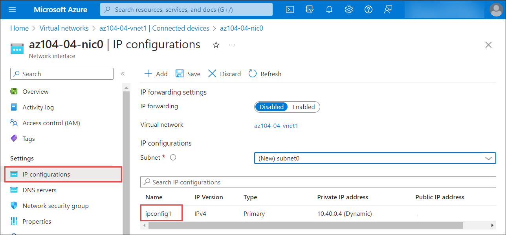
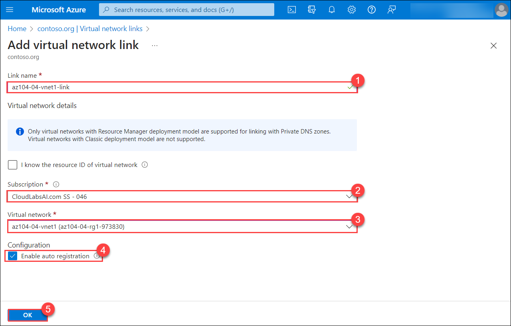

# Lab 04 - Implement Virtual Networking
## Lab scenario
You need to explore Azure virtual networking capabilities. To start, you plan to create a virtual network in Azure that will host a couple of Azure virtual machines. Since you intend to implement network-based segmentation, you will deploy them into different subnets of the virtual network. You also want to make sure that their private and public IP addresses will not change over time. To comply with Contoso security requirements, you need to protect public endpoints of Azure virtual machines accessible from the Internet. Finally, you need to implement DNS name resolution for Azure virtual machines both within the virtual network and from the Internet.

## Lab objectives
In this lab, you will complete the following tasks:
+ Task 1: Create and configure a virtual network
+ Task 2: Deploy virtual machines into the virtual network
+ Task 3: Configure private and public IP addresses of Azure VMs
+ Task 4: Configure network security groups
+ Task 5: Configure Azure DNS for internal name resolution
+ Task 6: Configure Azure DNS for external name resolution

## Estimated timing: 60  minutes

## Architecture diagram

  

## Exercise 1: Create and configure a virtual network

## Task 1: Create a virtual network with subnets using the portal

The organization plans a large amount of growth for core services. In this task, you create the virtual network and the associated subnets to accommodate the existing resources and planned growth. In this task, you will use the Azure portal. 

1. In the Azure portal, search for and select `Virtual Networks`.

1. Select **Create** on the Virtual networks page.

1. Complete the **Basics** tab with the following details:  

	|  **Option**         | **Value**            |
	| ------------------ | -------------------- |
	| Subscription       | Choose the default subscription |(1)
    | Resource Group     | **az104-04-rg1-<inject key="DeploymentID" enableCopy="false" />** (2)|
	| Name               | **az104-04-vnet1** (3)|
	| Region             |  **<inject key="Region" enableCopy="false" />** (4) |

     

1. Click **Next** and subsequently click on **Next** again to move to the **IP Addresses** tab.

    | Setting | Value |
    | --- | --- |
    | IPv4 address space | **10.20.0.0/16** |

1. Select **+ Add a subnet**. Complete the name and address information for each subnet. Be sure to select **Add** for each new subnet. 

	| **Subnet**             | **Option**           | **Value**              |
	| ---------------------- | -------------------- | ---------------------- |
	| SharedServicesSubnet   | Subnet name          | `SharedServicesSubnet` |
	|                        | Starting address		| `10.20.10.0`          |
	|						 | Size					| `/24`	|
	| DatabaseSubnet         | Subnet name          | `DatabaseSubnet`         |
	|                        | Starting address		| `10.20.20.0`        |
	|						 | Size					| `/24`	|

	>**Note:** Every virtual network must have at least one subnet. Reminder that five IP addresses will always be reserved, so consider that in your planning. 

1. Select **Review + create**.

1. Verify your configuration passed validation, and then select **Create**.

1. Wait for the virtual network to deploy and then select **Go to resource**.

    
   
1. Take a minute to verify the **Address space** and the **Subnets**. Notice your other choices in the **Settings** blade. 

   > **Congratulations** on completing the task! Now, it's time to validate it. Here are the steps:
   > - Click Lab Validation tab located at the upper right corner of the lab guide section and navigate to the Lab Validation Page.
   > - Hit the Validate button for the corresponding task.  
   > - If you receive a success message, you can proceed to the next task.If not, carefully read the error message and retry the step, following the instructions in the lab guide.
   > - If you need any assistance, please contact us at labs-support@spektrasystems.com. We are available 24/7 to help you out.

## Task 2: Create a virtual network and subnets using a template

In this task, you create the ManufacturingVnet virtual network and associated subnets. The organization anticipates growth for the manufacturing offices so the subnets are sized for the expected growth. For this task, you use a template to create the resources. 

1. In your Lab VM, navigate to **C:\AllFiles\AZ-104-MicrosoftAzureAdministrator-Lab-Files\Allfiles\Labs\04** where you will find the template and parameter file that will be used for the custom deployment.

1. In the portal, search for and select **Deploy a custom template**.

1. Select **Build your own template in the editor** and then **Load file**.

1. Select the **templates.json** file, then select **Save**.

1. Click on the **Edit Parameters** section and click on **Load File** to upload the parameters fille. Subsequently, click on **Save**

1. In the **Basics** tab, select **az104-04-rg1-<inject key="DeploymentID" enableCopy="false" />** resource group.
    
   

1. Select **Review + create** and then **Create**.

1. Wait for the template to deploy, then confirm (in the portal) the Manufacturing virtual network and subnets were created.

## Task 3: Create and configure communication between an Application Security Group and a Network Security Group

In this task, we create an Application Security Group and a Network Security Group. The NSG will have an inbound security rule that allows traffic from the ASG. The NSG will also have an outbound rule that denies access to the internet. 

### Create the Application Security Group (ASG)

1. In the Azure portal, search for and select `Application security groups`.

1. Click **Create** and provide the basic information.

    | Setting | Value |
    | -- | -- |
    | Subscription | *your subscription* (1) |
    | Resource group | **az104-04-rg1-<inject key="DeploymentID" enableCopy="false" />**  (2)|
    | Name | **asg-web** (3) |
    | Region |  **<inject key="Region" enableCopy="false" />** (4)  |

    

1. Click **Review + create** and then after the validation click **Create**.

### Create the Network Security Group and associate it with the ASG subnet

1. In the Azure portal, search for and select `Network security groups`.

1. Select **+ Create** and provide information on the **Basics** tab. 

    | Setting | Value |
    | -- | -- |
    | Subscription | *your subscription* |
    | Resource group |  **az104-04-rg1-<inject key="DeploymentID" enableCopy="false" />**  |
    | Name | **myNSGSecure** |
    | Region | **<inject key="Region" enableCopy="false" />**  |

1. Click **Review + create** and then after the validation click **Create**.

1. After the NSG is deployed, click **Go to resource**.

1. Under **Settings** click **Subnets** and then **Associate**.

    | Setting | Value |
    | -- | -- |
    | Virtual network | **az104-04-vnet1** |
    | Subnet | **SharedServicesSubnet** |

    

1. Click **OK** to save the association.

### Configure an inbound security rule to allow ASG traffic

1. Continue working with your NSG. In the **Settings** area, select **Inbound security rules**.

1. Review the default inbound rules. Notice that only other virtual networks and load balancers are allowed access.

1. Select **+ Add**.

1. On the **Add inbound security rule** blade, use the following information to add an inbound port rule. This rule allows ASG traffic. When you are finished, select **Add**.

    | Setting | Value |
    | -- | -- |
    | Source | **Application security group** (1) |
    | Source application security groups | **asg-web** (2) |
    | Source port ranges |  * (3) |
    | Destination | **Any** (4) |
    | Service | **Custom** (notice your other choices) (5)|
    | Destination port ranges | **80,443** (6)|
    | Protocol | **TCP** (7) |
    | Action | **Allow** (8) |
    | Priority | **100** (9) |
    | Name | `AllowASG` (10) |

    
 
### Configure an outbound NSG rule that denies Internet access

1. After creating your inbound NSG rule, select **Outbound security rules**. 

1. Notice the **AllowInternetOutboundRule** rule. Also notice the rule cannot be deleted and the priority is 65001.

1. Select **+ Add** and then configure an outbound rule that denies access to the internet. When you are finished, select **Add**.

    | Setting | Value |
    | -- | -- |
    | Source | **Any** |
    | Source port ranges |  * |
    | Destination | **Service tag** |
    | Destination service tag | **Internet** |
    | Service | **Custom** |
    | Destination port ranges | **8080** |
    | Protocol | **Any** |
    | Action | **Deny** |
    | Priority | **4096** |
    | Name | **DenyAnyCustom8080Outbound** |


## Task 4: Configure public and private Azure DNS zones

In this task, you will create and configure public and private DNS zones. 

### Configure a public DNS zone

You can configure Azure DNS to resolve host names in your public domain. For example, if you purchased the contoso.xyz domain name from a domain name registrar, you can configure Azure DNS to host the `contoso.com` domain and resolve www.contoso.xyz to the IP address of your web server or web app.

1. In the portal, search for and select `DNS zones`.

1. Select **+ Create**.

1. Configure the **Basics** tab.

    | Property | Value    |
    |:---------|:---------|
    | Subscription | **Select your subscription**  (1)|
    | Resource group |  **az104-04-rg1-<inject key="DeploymentID" enableCopy="false" />**(2) |
    | Name | **contoso<inject key="DeploymentID" enableCopy="false" />.com** (3)|
    | Region | **<inject key="Region" enableCopy="false" />** (4)|

    

1. Select **Review create** and then **Create**.
   
1. Wait for the DNS zone to deploy and then select **Go to resource**.

1. On the **Overview** blade notice the names of the four Azure DNS name servers assigned to the zone. **Copy** one of the name server addresses. You will need it in a future step. 

  

1. Select **+ Record set**. You add a virtual network link record for each virtual network that needs private name-resolution support.

    | Property | Value    |
    |:---------|:---------|
    | Name | **www** |
    | Type | **A** |
    | TTL | **1** |
    | IP address | **10.1.1.4** |

>**Note:**  In a real-world scenario, you'd enter the public IP address of your web server.

1. Select **OK** and verify **contoso<inject key="DeploymentID" enableCopy="false" />.com** has an A record set named **www**.

   

1. Open a command prompt, and run the following command:
   **Replace DID with <inject key="DeploymentID" enableCopy="false" />** and <name server name> with the name server name you copied in the previous step.
 
    ```sh
   nslookup www.contoso<DID>.com <name server name>
   ```
1. Verify the host name **www.contoso<inject key="DeploymentID" enableCopy="false" />.com** resolves to the IP address you provided. This confirms name resolution is working correctly.

  

### Configure a private DNS zone

A private DNS zone provides name resolution services within virtual networks. A private DNS zone is only accessible from the virtual networks that it is linked to and can't be accessed from the internet. 

1. In the portal, search for and select `Private dns zones`.

1. Select **+ Create**.

1. On the **Basics** tab of Create private DNS zone, enter the information as listed in the table below:

    | Property | Value    |
    |:---------|:---------|
    | Subscription | **Select your subscription** |
    | Resource group | **az104-04-rg1-<inject key="DeploymentID" enableCopy="false" />** |
    | Name | `private.contoso.com` (adjust if you had to rename) |
    | Region |**East US** |

1. Select **Review create** and then **Create**.
   
1. Wait for the DNS zone to deploy and then select **Go to resource**.

1. Notice on the **Overview** blade there are no name server records. 

1. Select **+ Virtual network links** and then select **+ Add**. 

    | Property | Value    |
    |:---------|:---------|
    | Link name | `manufacturing-link` |
    | Virtual network | `ManufacturingVnet` |

1. Select **OK** and wait for the link to create. 

1. From the **Overview** blade select **+ Record set**. You would now add a record for each virtual machine that needs private name-resolution support.

    | Property | Value    |
    |:---------|:---------|
    | Name | **sensorvm** |
    | Type | **A** |
    | TTL | **1** |
    | IP address | **10.1.1.4** |

 >**Note:**  In a real-world scenario, you'd enter the IP address for a specific manufacturing virtual machine


### Task 3: Configure private and public IP addresses of Azure VMs
In this task, you will configure the static assignment of public and private IP addresses assigned to network interfaces of Azure virtual machines.

   > **Note**: Private and public IP addresses are actually assigned to the network interfaces, which, in turn are attached to Azure virtual machines, however, it is fairly common to refer to IP addresses assigned to Azure VMs instead.

1. In the Azure portal, search for and select **Resource groups**, and, on the **Resource groups** blade, click **az104-04-rg1-<inject key="DeploymentID" enableCopy="false" />**.

1. On the **az104-04-rg1-<inject key="DeploymentID" enableCopy="false" />** resource group blade, in the list of its resources, click **az104-04-vnet1**.

     

1. On the **az104-04-vnet1** virtual network blade, review the **Connected devices** section and verify that there are two network interfaces **az104-04-nic0** and **az104-04-nic1** attached to the virtual network.

    

1. Click **az104-04-nic0** and, on the **az104-04-nic0** blade, click **IP configurations**.

    >**Note**: Verify that **ipconfig1** is currently set up with a dynamic private IP address.

1.  On the search bar search for Public IP addresses click on **create**  and on the Create public IP address page specify the following settings and click on **Create**. 

    | Setting | Value |
    | --- | --- |
    | Name | **az104-04-pip0** |
    | SKU | **Standard** |

1. On the Public IP addresses click on **create** and on the Create public IP address page specify the following settings and click on **Create**.
   
    | Setting | Value |
    | --- | --- |
    | Name | **az104-04-pip1** |
    | SKU | **Standard** |

1. In the list IP configurations, click **ipconfig1**.

    
    
1. On the **Edit IP configuration** blade, select Allocation **Static**, leave the default value of **IP address** set to **10.40.0.4**. In the **Public IP address settings** section, select checkbox **Associate public IP address**, on the Public IP address dropdown select **az104-04-pip0** and click **Save**.
    
    

1. Back on the **ipconfig1** blade, and save the changes. Make sure to wait for the save operation to complete before you proceed to the next step.

1. Navigate back to the **az104-04-vnet1** blade and click on **Connected Devices**.

1. Click **az104-04-nic1** and, on the **az104-04-nic1** blade, click **IP configurations**.

    >**Note**: Verify that **ipconfig1** is currently set up with a dynamic private IP address.

1. In the list IP configurations, click **ipconfig1**.

1. On the **Edit IP configuration** blade, select Allocation **Static**, leave the default value of **IP address** set to **10.40.1.4**. In the **Public IP address settings** section, select the checkbox **Associate public** **IP address**, on Public IP address dropdown select **az104-04-pip1** and click **Save**.

   >**Note:** If you receive an error, **domain name is already in use**, this is a known issue. You will need to locate the public ip address and associate it to the NIC separately.
  
1. Back on the **ipconfig1** blade, save the changes.

1. Navigate back to the **az104-04-rg1-<inject key="DeploymentID" enableCopy="false" />** resource group blade, in the list of its resources, click **az104-04-vm0**, and from the **az104-04-vm0** virtual machine blade, note the public IP address entry.

1. Navigate back to the **az104-04-rg1-<inject key="DeploymentID" enableCopy="false" />** resource group blade, in the list of its resources, click **az104-04-vm1**, and from the **az104-04-vm1** virtual machine blade, note the public IP address entry.

   >**Note**: You will need both IP addresses in the last task of this lab.

### Task 4: Configure network security groups
In this task, you will configure network security groups to allow for restricted connectivity to Azure virtual machines.

1. In the Azure portal, navigate back to the **az104-04-rg1-<inject key="DeploymentID" enableCopy="false" />** resource group blade, and in the list of its resources, click **az104-04-vm0**.

1. On the **az104-04-vm0** overview blade, click **Connect**, and click **RDP** in the drop-down menu, on the **Connect with RDP** blade, click **Download RDP File** using the Public IP address, and follow the prompts to start the Remote Desktop session.

1. Note that the connection attempt fails.

    >**Note**: This is expected, because public IP addresses of the Standard SKU, by default, require that the network interfaces to which they are assigned are protected by a network security group. In order to allow Remote Desktop connections, you will create a network security group explicitly allowing inbound RDP traffic from the Internet and assign it to the network interfaces of both virtual machines.

1. Stop the **az104-04-vm0** and **az104-04-vm1** virtual machines.

    >**Note**: This is done for lab expediency. If the virtual machines are running when a network security group is attached to their network interface, it can take over 30 minutes for the attachment to take effect. Once the network security group has been created and attached, the virtual machines will be restarted, and the attachment will be in effect immediately.

1. In the Azure portal, search for and select **Network security groups**, and, on the **Network security groups** blade, click **+ Create**.

1. Create a network security group with the following settings (leave others with their default values):

    | Setting | Value |
    | --- | --- |
    | Subscription | the name of the Azure subscription you are using in this lab |
    | Resource Group | **az104-04-rg1-<inject key="DeploymentID" enableCopy="false" />** |
    | Name | **az104-04-nsg01** |
    | Region |  Select **<inject key="Region" enableCopy="false" />** |

1. Click **Review and Create**. Let validation occur, and hit **Create** to submit your deployment.

    >**Note**: Wait for the deployment to complete. This should take about 2 minutes.

1. On the deployment blade, click **Go to resource** to open the **az104-04-nsg01** network security group blade.

    

1. On the **az104-04-nsg01** network security group blade, in the **Settings** section, click **Inbound security rules**.

     

1. Add an inbound rule with the following settings (leave others with their default values):

    | Setting | Value |
    | --- | --- |
    | Source | **Any** |
    | Source port ranges | * |
    | Destination | **Any** |
    | Service | **RDP** |
    | Action | **Allow** |
    | Priority | **300** |
    | Name | **AllowRDPInBound** |

1. Click **Add**

1. On the **az104-04-nsg01** network security group blade, in the **Settings** section, click **Network interfaces** and then click **Associate**.

1. Associate the **az104-04-nsg01** network security group with the **az104-04-nic0** and **az104-04-nic1** network interfaces.

    >**Note**: It may take up to 5 minutes for the rules from the newly created Network Security Group to be applied to the Network Interface Card.

1.  Navigate to Virtual Machine and start the **az104-04-vm0** and **az104-04-vm1**.

1. Navigate back to the **az104-04-vm0** virtual machine blade.

    >**Note**: In the subsequent steps, you will verify that you can successfully connect to the target virtual machine.

1. On the **az104-04-vm0** blade, click **Connect**, and click **RDP**, on the **Connect with RDP** blade, click **Download RDP File** using the Public IP address, and follow the prompts to start the Remote Desktop session.

    >**Note**: This step refers to connecting via Remote Desktop from a Windows computer. On a Mac, you can use Remote Desktop Client from the Mac App Store and on Linux computers, you can use an open source RDP client software.

    >**Note**: You can ignore any warning prompts when connecting to the target virtual machines.

1. When prompted, sign in with the username mentioned in the parameters file and provide password as **<inject key="AzureAdUserPassword"></inject>**.

    >**Note**: Leave the Remote Desktop session open. You will need it for the next task.
    
   > **Congratulations** on completing the task! Now, it's time to validate it. Here are the steps:
   > - Click Lab Validation tab located at the upper right corner of the lab guide section and navigate to the Lab Validation Page.
   > - Hit the Validate button for the corresponding task.  
   > - If you receive a success message, you can proceed to the next task.If not, carefully read the error message and retry the step, following the instructions in the lab guide.
   > - If you need any assistance, please contact us at labs-support@spektrasystems.com. We are available 24/7 to help you out.

### Task 5: Configure Azure DNS for internal name resolution
In this task, you will configure DNS name resolution within a virtual network by using Azure private DNS zones.

1. In the Azure portal, search for and select **Private DNS zones** and, on the **Private DNS zones** blade, click **+ Create**.

1. Create a private DNS zone with the following settings (leave others with their default values):

    | Setting | Value |
    | --- | --- |
    | Subscription | the name of the Azure subscription you are using in this lab |
    | Resource Group | **az104-04-rg1-<inject key="DeploymentID" enableCopy="false" />** |
    | Name | **contoso.org** |

1. Click **Review and Create**. Let validation occur, and hit **Create** again to submit your deployment.

    >**Note**: Wait for the private DNS zone to be created. This should take about 2 minutes.

1. Click **Go to resource** to open the **contoso.org** DNS private zone blade.

1. On the **contoso.org** private DNS zone blade, in the **Settings** section, click **Virtual network links**

1. Click **+ Add** to create a virtual network link with the following settings (leave others with their default values):

    | Setting | Value |
    | --- | --- |
    | Link name (1)| **az104-04-vnet1-link** |
    | Subscription (2)| the name of the Azure subscription you are using in this lab |
    | Virtual network (3) | **az104-04-vnet1** |
    | Enable auto registration (4) | enabled |
    
 1. Click **OK** (5).
    
    

    >**Note**: Wait for the virtual network link to be created. This should take less than 1 minute.

1. On the **contoso.org** private DNS zone blade, in the sidebar, click **Overview**

1. Verify that the DNS records for **az104-04-vm0** and **az104-04-vm1** appear in the list of record sets as **Auto registered**.

    

    >**Note**: You might need to wait a few minutes and refresh the page if the record sets are not listed.

1. Switch to the Remote Desktop session to **az104-04-vm0**, right-click the **Start** button, and, in the right-click menu, click **Windows PowerShell (Admin)**.

    

1. In the Windows PowerShell console window, run the following to test internal name resolution in the newly created private DNS zone:

   ```powershell
   nslookup az104-04-vm0.contoso.org
   ```
   ```powershell
   nslookup az104-04-vm1.contoso.org
   ```
    
1. Verify that the output of the command includes the private IP address of **az104-04-vm1** (**10.40.1.4**).

     

### Task 6: Configure Azure DNS for external name resolution
In this task, you will configure external DNS name resolution by using Azure public DNS zones.

1. In a web browser, open a new tab and navigate to <https://www.godaddy.com/domains/domain-name-search>.

1. Find a unique domain name and check in the website if the domain name that you have chosen is unique.

1. In the Azure portal, search for and select **DNS zones** and, on the **DNS zones** blade, click **+ Create**.

1. Create a DNS zone with the following settings (leave others with their default values):

    | Setting | Value |
    | --- | --- |
    | Subscription | the name of the Azure subscription you are using in this lab |
    | Resource Group | **az104-04-rg1-<inject key="DeploymentID" enableCopy="false" />** |
    | Name | The DNS domain name you identified earlier in this task |

1. Click Review and Create. Let validation occur, and hit Create again to submit your deployment.

    >**Note**: Wait for the DNS zone to be created. This should take about 2 minutes.

1. Click **Go to resource** to open the blade of the newly created DNS zone.

1. On the DNS zone blade, click **+ Record set**.

1. Add a record set with the following settings (leave others with their default values):

    | Setting | Value |
    | --- | --- |
    | Name | **az104-04-vm0** |
    | Type | **A** |
    | Alias record set | **No** |
    | TTL | **1** |
    | TTL unit | **Hours** |
    | IP address | the public IP address of **az104-04-vm0** which you identified in the third exercise of this lab |

1. Click **OK**

1. On the DNS zone blade, click **+ Record set**.

1. Add a record set with the following settings (leave others with their default values):

    | Setting | Value |
    | --- | --- |
    | Name | **az104-04-vm1** |
    | Type | **A** |
    | Alias record set | **No** |
    | TTL | **1** |
    | TTL unit | **Hours** |
    | IP address | The public IP address of **az104-04-vm1** which you identified in the third exercise of this lab |

1. Click **OK**

1. On the DNS zone blade, note the name of the **Name server 1** entry.

1. In the Azure portal, open the **PowerShell** session in **Cloud Shell** by clicking on the icon in the top right of the Azure Portal.

1. From the Cloud Shell pane, run the following to test the external name resolution of the **az104-04-vm0** DNS record set in the newly created DNS zone (replace the placeholder `[Name server 1]` with the name of **Name server 1** you noted earlier in this task and the `[domain name]` placeholder with the name of the DNS domain you created earlier in this task):

   ```powershell
   nslookup az104-04-vm0.[domain name] [Name server 1]
   ```

1. Verify that the output of the command includes the public IP address of **az104-04-vm0**.

1. From the Cloud Shell pane, run the following to test the external name resolution of the **az104-04-vm1** DNS record set in the newly created DNS zone (replace the placeholder `[Name server 1]` with the name of **Name server 1** you noted earlier in this task and the `[domain name]` placeholder with the name of the DNS domain you created earlier in this task):

   ```powershell
   nslookup az104-04-vm1.[domain name] [Name server 1]
   ```

1. Verify that the output of the command includes the public IP address of **az104-04-vm1**.
    
   > **Congratulations** on completing the task! Now, it's time to validate it. Here are the steps:
   > - Click Lab Validation tab located at the upper right corner of the lab guide section and navigate to the Lab Validation Page.
   > - Hit the Validate button for the corresponding task.  
   > - If you receive a success message, you can proceed to the next task.If not, carefully read the error message and retry the step, following the instructions in the lab guide.
   > - If you need any assistance, please contact us at labs-support@spektrasystems.com. We are available 24/7 to help you out.

### Review
In this lab, you have completed:
+ Created and configured a virtual network
+ Deployed virtual machines into the virtual network
+ Configured private and public IP addresses of Azure VMs
+ Configured network security groups
+ Configured Azure DNS for internal name resolution
+ Configured Azure DNS for external name resolution

### You have successfully completed the lab
