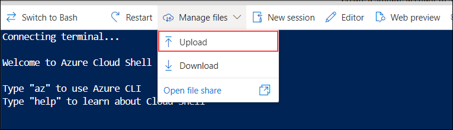
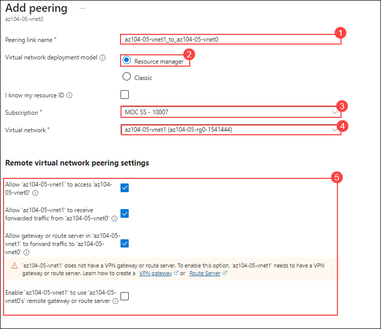
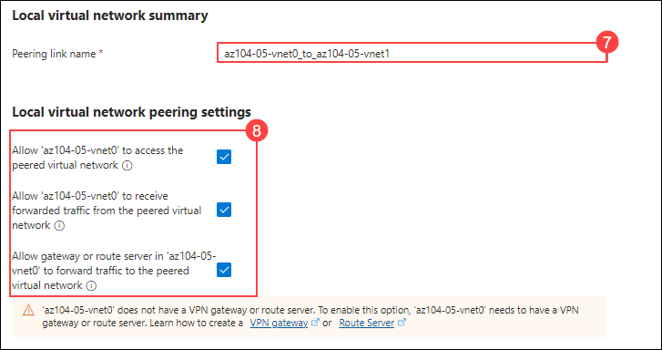

# Lab 05 - Implement Intersite Connectivity
## Lab scenario
Contoso has its data centers in Boston, New York, and Seattle offices connected via mesh wide-area network links, with full connectivity between them. You need to implement a lab environment that will reflect the topology of Contoso's on-premises networks and verify its functionality.

## Lab objectives
In this lab, you will complete the following tasks:
+ Task 1: Provision the lab environment.
+ Task 2: Use Network Watcher to test the connection between virtual machines.
+ Task 3: Configure local and global virtual network peering.
+ Task 4: Test intersite connectivity.
+ Task 5: Create a custom route.

## Estimated timing: 60 minutes

## Architecture diagram

 
 
## Exercise 1: Configure local and global virtual network peering

### Task 1: Provision the lab environment
In this task, you will deploy three virtual machines, each into a separate virtual network, with two of them in the same Azure region and the third one in another Azure region.
   
1. In the Azure portal, open the **Azure Cloud Shell** by clicking on the icon in the top right of the Azure Portal.

    

1. When prompted to select either **Bash** or **PowerShell**, select **PowerShell**. 

    >**Did you know?**  If you mostly work with Linux systems, Bash (CLI) feels more familiar. If you mostly work with Windows systems, Azure PowerShell feels more familiar. 

1. On the **Getting Started** screen select **Mount Storage Account**, select the storage account subscription from drop down and click on **Apply**

1. On mount storage account page, select **I want to create a storage account**. click on Next.

1. Provide the below details to create the storage account and click on **Create**.

    
    | Settings | Values |
    |  -- | -- |
    | Resource Group | **az104-05-rg0-<inject key="DeploymentID" enableCopy="false" />** |
    | Storage account (Create new) | **str<inject key="DeploymentID" enableCopy="false" />** |
    | Region | **<inject key="Region" enableCopy="false" />** |
    | File share (Create new) | **none** |

     >**Note:** As you work with the Cloud Shell a storage account and file share is required. 

1. In the toolbar of the Cloud Shell pane, click on the **Manage files** dropdown, click **Upload** and upload the files **C:\AllFiles\AZ-104-MicrosoftAzureAdministrator-Lab-Files\Allfiles\Labs\05\\az104-05-vnetvm-loop-template.json** and **C:\AllFiles\AZ-104-MicrosoftAzureAdministrator-Lab-Files\Allfiles\Labs\05\\az104-05-vnetvm-loop-parameters.json** into the Cloud Shell home directory.

    

1. From the Cloud Shell pane, run the following to use the resource group that will be hosting the lab environment. The first two virtual networks and a pair of virtual machines will be deployed in `Azure_region_1`. The third virtual network and the third virtual machine will be deployed in the same resource group but another `Azure_region_2`. (Replace the `[Azure_region_1]` and `[Azure_region_2]` placeholder, including the square brackets, with the names of two different Azure regions where you intend to deploy these Azure virtual machines). An example is $location1 = 'eastus'. 

   ```powershell
   $location1 = 'Azure_region_1'

   $location2 = 'Azure_region_2'

   $rgName = 'az104-05-rg0-Deployment-id'
   ```

   >**Note**: In order to identify Azure regions, from the PowerShell session in Cloud Shell, run **(Get-AzLocation).Location** command.

   >**Important**: Replace Deployment-id with **<inject key="DeploymentID" enableCopy="false" />**.
   
   >**Note**: If you get a prompt stating **Provided resource group already exists. Are you sure you want to update it?** type N .

1. From the Cloud Shell pane, run the following to create the three virtual networks and deploy virtual machines into them by using the template and parameter files you uploaded:

   ```powershell
   New-AzResourceGroupDeployment `
      -ResourceGroupName $rgName `
      -TemplateFile $HOME/az104-05-vnetvm-loop-template.json `
      -TemplateParameterFile $HOME/az104-05-vnetvm-loop-parameters.json `
      -location1 $location1 `
      -location2 $location2
   ```

    >**Important**: You will be prompted to provide an admin password. Enter your own Password or give **Pa55w.rd1234**.
    
    >**Note**: Wait for the deployment to complete before proceeding to the next step. This should take about 2 minutes.

1. Close the Cloud Shell pane.


## Task 2: Use Network Watcher to test the connection between virtual machines 


In this task, you verify that resources in peered virtual networks can communicate with each other. Network Watcher will be used to test the connection. Before continuing, ensure both virtual machines have been deployed and are running. 

1. From the Azure portal, search for and select **Network Watcher**.

1. From Network Watcher, in the Network diagnostic tools menu in the left navigation pane, select **Connection troubleshoot**.

1. Use the following information to complete the fields on the **Connection troubleshoot** page and select **Run diagnostic tests** (8).

    | Field | Value | 
    | --- | --- |
    | Source type           | **Virtual machine** (1)  |
    | Virtual machine       | **az104-05-vm0**  (2) | 
    | Destination type      | **Virtual machine** (3)  |
    | Virtual machine       | **az104-05-vm1**  (4) | 
    | Preferred IP Version  | **Both**  (5)            | 
    | Protocol              | **TCP**    (6)           |
    | Destination port      | `3389`     (7)           |  
    | Source port           | *Blank*         |
    | Diagnostic tests      | *Defaults*      |

    

    >**Note**: It may take a couple of minutes for the results to be returned. The screen selections will be greyed out while the results are being collected.. 


### Task 3: Configure local and global virtual network peering

In this task, you will configure local and global peering between the virtual networks you deployed in the previous tasks.

1. In the Azure portal, search for and select **Virtual networks**.

    

1. Review the virtual networks you created in the previous task and verify that the first two are located in the same Azure region and the third one in a different Azure region.

    >**Note**: The template you used for the deployment of the three virtual networks ensures that the IP address ranges of the three virtual networks do not overlap.

1. In the list of virtual networks, click **az104-05-vnet0**.
     
      
      
1. On the **az104-05-vnet0** virtual network blade, in the **Settings** section, click **Peerings (1)** and then click **+ Add (2)**.

     

1. Add a peering with the following settings (leave others with their default values) and click **Add**:

    | Setting | Value|
    | --- | --- |
    | Remote virtual network: Peering link name | **az104-05-vnet1_to_az104-05-vnet0** (1) |
    | Virtual network deployment model | **Resource manager** (2)|
    | I know my resource ID | unselected (3)|
    | Subscription | the name of the Azure subscription you are using in this lab (4) |
    | Virtual network | **az104-05-vnet1** (5)|
    | Remote virtual network peering settings | **Ensure only the first three boxes are checked** (6) |
    | Local Peering link name | **az104-05-vnet0_to_az104-05-vnet1** (7)|
    | Local virtual network peering settings | **Ensure only the first three boxes are checked** (8)|
   
   

   
    
      >**Note**: You can ignore the warning stating that the vnet does not have a routing gateway.

      >**Note**: This step establishes two local peerings - one from az104-05-vnet0 to az104-05-vnet1 and the other from az104-05-vnet1 to az104-05-vnet0.

      >**Note**: In case you run into an issue with the Azure portal interface not displaying the virtual networks created in the previous task, you can configure peering by running the following PowerShell commands from Cloud Shell:

      >**Note**: Replace Deployment-id with **<inject key="DeploymentID" enableCopy="false" />**.
  
    ```powershell
       $rgName = 'az104-05-rg0-Deployment-id'
    
       $vnet0 = Get-AzVirtualNetwork -Name 'az104-05-vnet0' -ResourceGroupName $rgname
    
       $vnet1 = Get-AzVirtualNetwork -Name 'az104-05-vnet1' -ResourceGroupName $rgname
    
       Add-AzVirtualNetworkPeering -Name 'az104-05-vnet0_to_az104-05-vnet1' -VirtualNetwork $vnet0 -RemoteVirtualNetworkId $vnet1.Id
    
       Add-AzVirtualNetworkPeering -Name 'az104-05-vnet1_to_az104-05-vnet0' -VirtualNetwork $vnet1 -RemoteVirtualNetworkId $vnet0.Id
    ``` 

1. On the **az104-05-vnet0** virtual network blade, in the **Settings** section, click **Peerings** and then click **+ Add**.

1. Add a peering with the following settings (leave others with their default values) and click **Add**:

    | Setting | Value|
    | --- | --- |
    | Remote virtual network: Peering link name | **az104-05-vnet2_to_az104-05-vnet0** (1) |
    | Virtual network deployment model | **Resource manager** (2)|
    | I know my resource ID | unselected (3)|
    | Subscription | the name of the Azure subscription you are using in this lab (4) |
    | Virtual network | **az104-05-vnet2** (5)|
    | Remote virtual network peering settings | **Ensure only the first three boxes are checked** (6) |
    | Local Peering link name | **az104-05-vnet0_to_az104-05-vnet2** (7)|
    | Local virtual network peering settings | **Ensure only the first three boxes are checked** (8)|

    >**Note**: You can ignore the warning stating that the vnet does not have a routing gateway.
 
    >**Note**: This step establishes two global peerings - one from az104-05-vnet0 to az104-05-vnet2 and the other from az104-05-vnet2 to az104-05-vnet0.

    >**Note**: In case you run into an issue with the Azure portal interface not displaying the virtual networks created in the previous task, you can configure peering by running the following PowerShell commands from Cloud Shell:

    >**Note**: Replace Deployment-id with **<inject key="DeploymentID" enableCopy="false" />**.
   
    
   ```powershell
   $rgName = 'az104-05-rg0-Deployment-id'

   $vnet0 = Get-AzVirtualNetwork -Name 'az104-05-vnet0' -ResourceGroupName $rgname

   $vnet2 = Get-AzVirtualNetwork -Name 'az104-05-vnet2' -ResourceGroupName $rgname

   Add-AzVirtualNetworkPeering -Name 'az104-05-vnet0_to_az104-05-vnet2' -VirtualNetwork $vnet0 -RemoteVirtualNetworkId $vnet2.Id

   Add-AzVirtualNetworkPeering -Name 'az104-05-vnet2_to_az104-05-vnet0' -VirtualNetwork $vnet2 -RemoteVirtualNetworkId $vnet0.Id
   ``` 

1. Navigate back to the **Virtual networks** blade and, in the list of virtual networks, click **az104-05-vnet1**.

1. On the **az104-05-vnet1** virtual network blade, in the **Settings** section, click **Peerings** and then click **+ Add**.

1. Add a peering with the following settings (leave others with their default values) and click **Add**:

    | Setting | Value|
    | --- | --- |
    | Remote virtual network: Peering link name | **az104-05-vnet2_to_az104-05-vnet1** (1) |
    | Virtual network deployment model | **Resource manager** (2)|
    | I know my resource ID | unselected (3)|
    | Subscription | the name of the Azure subscription you are using in this lab (4) |
    | Virtual network | **az104-05-vnet2** (5)|
    | Remote virtual network peering settings | **Ensure only the first three boxes are checked** (6) |
    | Local Peering link name | **az104-05-vnet1_to_az104-05-vnet2** (7)|
    | Local virtual network peering settings | **Ensure only the first three boxes are checked** (8)|

    >**Note**: You can ignore the warning stating that the vnet does not have a routing gateway.
 
    >**Note**: This step establishes two global peerings - one from az104-05-vnet1 to az104-05-vnet2 and the other from az104-05-vnet2 to az104-05-vnet1.

    >**Note**: In case you run into an issue with the Azure portal interface not displaying the virtual networks created in the previous task, you can configure peering by running the following PowerShell commands from Cloud Shell:

    >**Note**: Replace Deployment-id with **<inject key="DeploymentID" enableCopy="false" />**.
    

 ```powershell
 $rgName = 'az104-05-rg0-Deployment-id'
  
 $vnet1 = Get-AzVirtualNetwork -Name 'az104-05-vnet1' -ResourceGroupName $rgname
  
 $vnet2 = Get-AzVirtualNetwork -Name 'az104-05-vnet2' -ResourceGroupName $rgname
  
 Add-AzVirtualNetworkPeering -Name 'az104-05-vnet1_to_az104-05-vnet2' -VirtualNetwork $vnet1 -RemoteVirtualNetworkId $vnet2.Id
  
 Add-AzVirtualNetworkPeering -Name 'az104-05-vnet2_to_az104-05-vnet1' -VirtualNetwork $vnet2 -RemoteVirtualNetworkId $vnet1.Id
 ``` 
   
   > **Congratulations** on completing the task! Now, it's time to validate it. Here are the steps:
   > - Hit the Validate button for the corresponding task. If you receive a success message, you can proceed to the next task. 
   > - If not, carefully read the error message and retry the step, following the instructions in the lab guide.
   > - If you need any assistance, please contact us at labs-support@spektrasystems.com. We are available 24/7 to help
   
   <validation step="7df6e281-5a25-416d-8ad3-7e0c8a9218d9" />
   
   <validation step="48e06831-31a7-4601-9840-89661d5d56dd" />
   
   <validation step="fb306908-e661-4cac-8769-3eb8b7108271" />


### Task 4: Test intersite connectivity

In this task, you will test connectivity between virtual machines on the three virtual networks that you connected via local and global peering in the previous task.

1. In the Azure portal, search for and select **Virtual machines**.

     

2. In the list of virtual machines, click **az104-05-vm0**.

      

3. On the **az104-05-vm0** blade, click **Connect**, in the drop-down menu, click **RDP**, on the **Connect with RDP** blade, click **Download RDP File** and follow the prompts to start the Remote Desktop session.

      
      
      
      
      

    >**Note**: This step refers to connecting via Remote Desktop from a Windows computer. On a Mac, you can use Remote Desktop Client from the Mac App Store,e and on Linux computers, you can use an open-source RDP client software.

    >**Note**: You can ignore any warning prompts when connecting to the target virtual machines and select Keep.

4. When prompted, sign in by using the **Student** username and the password **Pa55w.rd1234**.

   >**Note**: You can click on **Yes** in the pop-up that appears.
   
   >**Note**: If you get a prompt related to network discovery, click on Yes

6. Within the Remote Desktop session to **az104-05-vm0**, right-click the **Start** button and, in the right-click menu, click **Windows PowerShell (Admin)** and slect Run as Administrator option.

     
   
7. In the Windows PowerShell console window, run the following to test connectivity to **az104-05-vm1** (which has the private IP address of **10.51.0.4**) over TCP port 3389:

   ```powershell
   Test-NetConnection -ComputerName 10.51.0.4 -Port 3389 -InformationLevel 'Detailed'
   ```

    >**Note**: The test uses TCP 3389 since this port is allowed by default by the operating system firewall.

8. Examine the output of the command and verify that the connection was successful.

9. In the Windows PowerShell console window, run the following to test connectivity to **az104-05-vm2** (which has the private IP address of **10.52.0.4**):

   ```powershell
   Test-NetConnection -ComputerName 10.52.0.4 -Port 3389 -InformationLevel 'Detailed'
   ```

10. Switch back to the Azure portal on your lab computer and navigate back to the blade of the **Virtual machine**.

11. In the list of virtual machines, click **az104-05-vm1**.

    

12. On the **az104-05-vm1** blade, click **Connect**, in the drop-down menu, click **RDP**, on the **Connect with RDP** blade, click **Download RDP File** and follow the prompts to start the Remote Desktop session.

    >**Note**: This step refers to connecting via Remote Desktop from a Windows computer. On a Mac, you can use Remote Desktop Client from the Mac App Store, and on Linux computers, you can use an open source RDP client software.

    >**Note**: You can ignore any warning prompts when connecting to the target virtual machines.

13. When prompted, sign in by using the **Student** username and the password **Pa55w.rd1234**.

14. Within the Remote Desktop session to **az104-05-vm1**, right-click the **Start** button and, in the right-click menu, click **Windows PowerShell (Admin)**.

15. In the Windows PowerShell console window, run the following to test connectivity to **az104-05-vm2** (which has the private IP address of **10.52.0.4**) over TCP port 3389:

    ```powershell
    Test-NetConnection -ComputerName 10.52.0.4 -Port 3389 -InformationLevel 'Detailed'
    ```

    >**Note**: The test uses TCP 3389 since this port is allowed by default by the operating system firewall.

16. Examine the output of the command and verify that the connection was successful.


## Task 5: Create a custom route 

In this task, you want to control network traffic between the perimeter subnet and the internal core services subnet. A virtual network appliance will be installed in the core services subnet and all traffic should be routed there. 

1. Back in the Azure portal, navigate to Virtual networks resource and select the **az104-05-vnet0** from the list of virtual networks.

1. Select **Subnets** and then click on **+ Subnet** and click on **Add**

    | Setting | Value | 
    | --- | --- |
    | Name | `perimeter` |
    | Starting address  | `10.50.1.0/24`  |

   
1. In the Azure portal, search for and select **Route tables** resource, and then select **Review + Create** and subsequently click on **Create**. 

    | Setting | Value | 
    | --- | --- |
    | Subscription | Default Subscription |
    | Resource group | **az104-05-rg0--<inject key="DeploymentID" enableCopy="false" />**  |
    | Region | **East US** |
    | Name | **az104-05-vm0** |
    | Propagate gateway routes | **No** |

1. After the route table deploys, select **Go to resource**.

1. From the left navigation pane, under **Settings** select **Routes** and then **+ Add**. Create a route from the future NVA to the CoreServices virtual network. 

    | Setting | Value | 
    | --- | --- |
    | Route name | `PerimetertoCore` |
    | Destination type | **IP Addresses** |
    | Destination IP addresses | `10.50.0.0/22` (core services virtual network) |
    | Next hop type | **Virtual appliance** (notice your other choices) |
    | Next hop address | `10.50.1.7` (future NVA) |

1. Select **+ Add** when the route is completed. The last thing to do is associate the route with the subnet.

1. Select **Subnets** from the left navigation pane and then  click on **+ Associate**. Complete the configuration.

    | Setting | Value | 
    | --- | --- |
    | Virtual network | **az104-05-vnet0** |
    | Subnet | **subnet0** |    

     >**Note**: You have created a user-defined route to direct traffic from the DMZ to the new NVA.  

### Review
In this lab, you have completed:
+ Provisioned the lab environment
+ Use Network Watcher to test the connection between virtual machines
+ Configured local and global virtual network peering
+ Tested intersite connectivity
+ Create a custom route 

### You have successfully completed the lab

## Extend your learning with Copilot
Copilot can assist you in learning how to use the Azure scripting tools. Copilot can also assist in areas not covered in the lab or where you need more information. Open an Edge browser and choose Copilot (top right) or navigate to *copilot.microsoft.com*. Take a few minutes to try these prompts.

+ How can I use Azure PowerShell or Azure CLI commands to add a virtual network peering between vnet1 and vnet2?
+ Create a table highlighting various Azure and 3rd party monitoring tools supported on Azure. Highlight when to use each tool. 
+ When would I create a custom network route in Azure?

## Learn more with self-paced training

+ [Distribute your services across Azure virtual networks and integrate them by using virtual network peering](https://learn.microsoft.com/en-us/training/modules/integrate-vnets-with-vnet-peering/). Use virtual network peering to enable communication across virtual networks in a way that's secure and minimally complex.
+ [Manage and control traffic flow in your Azure deployment with routes](https://learn.microsoft.com/training/modules/control-network-traffic-flow-with-routes/). Learn how to control Azure virtual network traffic by implementing custom routes.


## Key takeaways

Congratulations on completing the lab. Here are the main takeaways for this lab. 

+ By default, resources in different virtual networks cannot communicate.
+ Virtual network peering enables you to seamlessly connect two or more virtual networks in Azure.
+ Peered virtual networks appear as one for connectivity purposes.
+ The traffic between virtual machines in peered virtual networks uses the Microsoft backbone infrastructure.
+ System defined routes are automatically created for each subnet in a virtual network. User-defined routes override or add to the default system routes. 
+ Azure Network Watcher provides a suite of tools to monitor, diagnose, and view metrics and logs for Azure IaaS resources.
