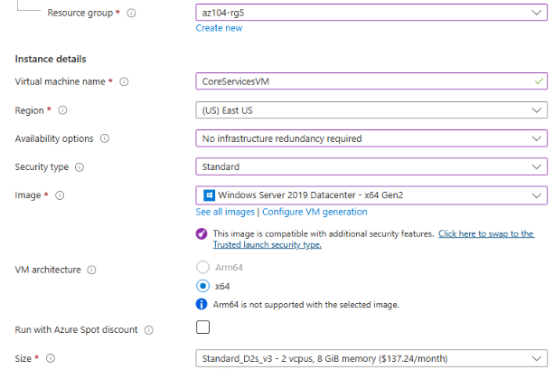
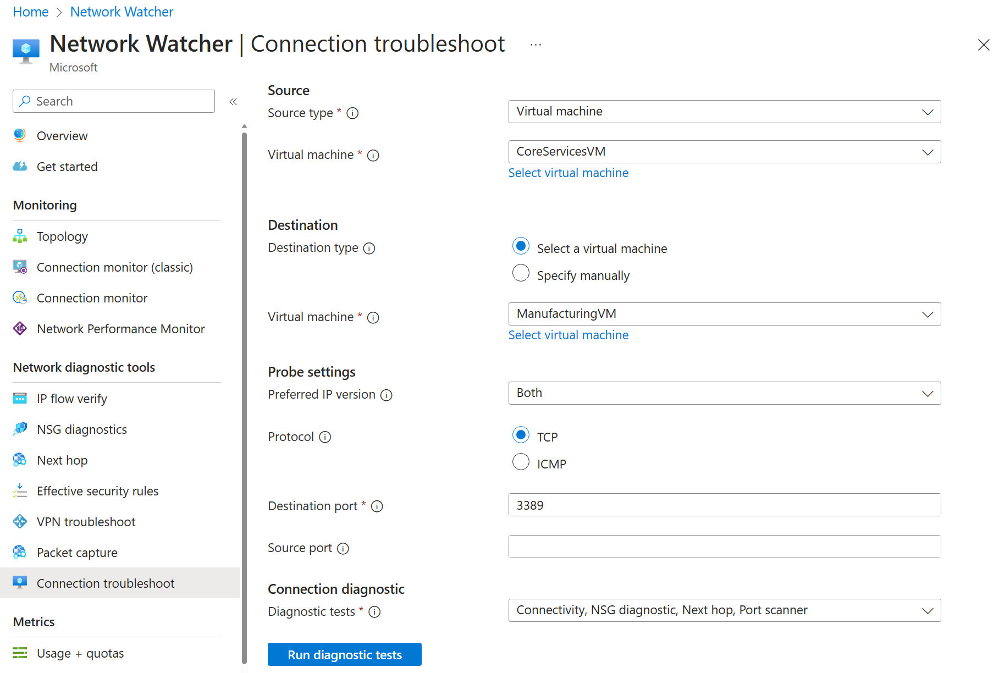

---
lab:
    title: 'Lab 05: Implement Intersite Connectivity'
    module: 'Administer Intersite Connectivity'
---

# Lab 05 - Implement Intersite Connectivity

## Lab introduction

In this lab you explore communication between virtual networks. You implement virtual network peering and test connections. You will also create a custom route. 

This lab requires an Azure subscription. Your subscription type may affect the availability of features in this lab. You may change the region, but the steps are written using **East US**. 

## Estimated time: 50 minutes
    
## Lab scenario 

Your organization segments core IT apps and services (such as DNS and security services) from other parts of the business, including your manufacturing department. However, in some scenarios, apps and services in the core area need to communicate with apps and services in the manufacturing area. In this lab, you configure connectivity between the segmented areas. This is a common scenario for separating production from development or separating one subsidiary from another.  

## Interactive lab simulations

There are several interactive lab simulations that you might find useful for this topic. The simulation lets you to click through a similar scenario at your own pace. There are differences between the interactive simulation and this lab, but many of the core concepts are the same. An Azure subscription is not required. 

+ [Connect two Azure virtual networks using global virtual network peering](https://mslabs.cloudguides.com/guides/AZ-700%20Lab%20Simulation%20-%20Connect%20two%20Azure%20virtual%20networks%20using%20global%20virtual%20network%20peering). Test the connection between two virtual machines in different virtual networks. Create a virtual network peering and retest.

+ [Configure monitoring for virtual networks](https://learn.microsoft.com/training/modules/configure-monitoring-virtual-networks/). Understand how to use Azure Network Watcher Connection Monitor, flow logs, NSG diagnostics, and packet capture to monitor connectivity across your Azure IaaS network resources.

+ [Implement intersite connectivity](https://mslabs.cloudguides.com/en-us/guides/AZ-104%20Exam%20Guide%20-%20Microsoft%20Azure%20Administrator%20Exercise%209). Run a template to create a virtual network infrastructure with several virtual machines. Configure virtual network peerings and test the connections. 

## Architecture diagram


## Job skills

+ Task 1: Create a virtual machine in a virtual network.
+ Task 2: Create a virtual machine in a different virtual network.
+ Task 3: Use Network Watcher to test the connection between virtual machines. 
+ Task 4: Configure virtual network peerings between different virtual networks.
+ Task 5: Use Azure PowerShell to test the connection between virtual machines.
+ Task 6: Create a custom route. 

## Task 1:  Create a core services virtual machine and virtual network

In this task, you create a core services virtual network with a virtual machine. 

1. Sign in to the **Azure portal** - `https://portal.azure.com`.

1. Search for and select `Virtual Machines`.

1. From the virtual machines page, select **Create** then select **Azure Virtual Machine**.

1. On the Basics tab, use the following information to complete the form, and then select **Next: Disks >**. For any setting not specified, leave the default value.
 
    | Setting | Value | 
    | --- | --- |
    | Subscription |  *your subscription* |
    | Resource group |  `az104-rg5` (If necessary, **Create new**. )
    | Virtual machine name |    `CoreServicesVM` |
    | Region | **(US) East US** |
    | Availability options | No infrastructure redundancy required |
    | Security type | **Standard** |
    | Image | **Windows Server 2019 Datacenter: x64 Gen2** (notice your other choices) |
    | Size | **Standard_DS2_v3** |
    | Username | `localadmin` | 
    | Password | **Provide a complex password** |

    
   
1. On the **Disks** tab take the defaults and then select **Next: Networking >**.

1. On the **Networking** tab, for Virtual network, select **Create new**.

1. Use the following information to configure the virtual network, and then select **Ok**. If necessary, remove or replace the existing information.

    | Setting | Value | 
    | --- | --- |
    | Name | `CoreServicesVNet` (Create new) |
    | Address range | `10.0.0.0/16`  |
    | Subnet Name | `Core` | 
    | Subnet address range | `10.0.0.0/24` |

1. Select the **Monitoring** tab. For Boot Diagnostics, select **Disable**.

1. Select **Review + Create**, and then select **Create**.

1. You do not need to wait for the resources to be created. Continue on to the next task.

    >**Note:** Did you notice in this task you created the virtual network as you created the virtual machine? You could also create the virtual network infrastructure then add the virtual machines. 

## Task 2: Create a virtual machine in a different virtual network

In this task, you create a manufacturing services virtual network with a virtual machine. 

1. From the Azure portal, search for and navigate to **Virtual Machines**.

1. From the virtual machines page, select **Create** then select **Azure Virtual Machine**.

1. On the Basics tab, use the following information to complete the form, and then select **Next: Disks >**. For any setting not specified, leave the default value.
 
    | Setting | Value | 
    | --- | --- |
    | Subscription |  *your subscription* |
    | Resource group |  `az104-rg5` |
    | Virtual machine name |    `ManufacturingVM` |
    | Region | **(US) East US** |
    | Security type | **Standard** |
    | Availability options | No infrastructure redundancy required |
    | Image | **Windows Server 2019 Datacenter: x64 Gen2** |
    | Size | **Standard_DS2_v3** | 
    | Username | `localadmin` | 
    | Password | **Provide a complex password** |

1. On the **Disks** tab take the defaults and then select **Next: Networking >**.

1. On the Networking tab, for Virtual network, select **Create new**.

1. Use the following information to configure the virtual network, and then select **Ok**.  If necessary, remove or replace the existing address range.

    | Setting | Value | 
    | --- | --- |
    | Name | `ManufacturingVNet` |
    | Address range | `172.16.0.0/16`  |
    | Subnet Name | `Manufacturing` |
    | Subnet address range | `172.16.0.0/24` |

1. Select the **Monitoring** tab. For Boot Diagnostics, select **Disable**.

1. Select **Review + Create**, and then select **Create**.

## Task 3: Use Network Watcher to test the connection between virtual machines 


In this task, you verify that resources in peered virtual networks can communicate with each other. Network Watcher will be used to test the connection. Before continuing, ensure both virtual machines have been deployed and are running. 

1. From the Azure portal, search for and select `Network Watcher`.

1. From Network Watcher, in the Network diagnostic tools menu, select **Connection troubleshoot**.

1. Use the following information to complete the fields on the **Connection troubleshoot** page.

    | Field | Value | 
    | --- | --- |
    | Source type           | **Virtual machine**   |
    | Virtual machine       | **CoreServicesVM**    | 
    | Destination type      | **Virtual machine**   |
    | Virtual machine       | **ManufacturingVM**   | 
    | Preferred IP Version  | **Both**              | 
    | Protocol              | **TCP**               |
    | Destination port      | `3389`                |  
    | Source port           | *Blank*         |
    | Diagnostic tests      | *Defaults*      |

    

1. Select **Run diagnostic tests**.

    >**Note**: It may take a couple of minutes for the results to be returned. The screen selections will be greyed out while the results are being collected. Notice the **Connectivity test** shows **UnReachable**. This makes sense because the virtual machines are in different virtual networks. 

 
## Task 4: Configure virtual network peerings between virtual networks

In this task, you create a virtual network peering to enable communications between resources in the virtual networks. 

1. In the Azure portal, select the `CoreServicesVnet` virtual network.

1. In CoreServicesVnet, under **Settings**, select **Peerings**.

1. On CoreServicesVnet | Peerings, select **+ Add**.

1. Use the information in the following table to create the peering.

| **Parameter**                                    | **Value**                             |
| --------------------------------------------- | ------------------------------------- |
| **This virtual network**                                       |                                       |
| Peering link name                             | `CoreServicesVnet-to-ManufacturingVnet` |
| Allow CoreServicesVNet to access the peered virtual network            | selected (default)                       |
| Allow CoreServicesVNet to receive forwarded traffic from the peered virtual network | selected                       |
| Allow gateway in CoreServicesVNet to forward traffic to the peered virtual network | Not selected (default) |
| Enable CoreServicesVNet to use the peered virtual networks' remote gateway       | Not selected (default)                        |
| **Remote virtual network**                                   |                                       |
| Peering link name                             | `ManufacturingVnet-to-CoreServicesVnet` |
| Virtual network deployment model              | **Resource manager**                      |
| I know my resource ID                         | Not selected                          |
| Subscription                                  | *your subscription*    |
| Virtual network                               | **ManufacturingVnet**                     |
| Allow ManufacturingVNet to access CoreServicesVNet  | selected (default)                       |
| Allow ManufacturingVNet to receive forwarded traffic from CoreServicesVNet | selected                        |
| Allow gateway in CoreServicesVNet to forward traffic to the peered virtual network | Not selected (default) |
| Enable ManufacturingVNet to use CoreServicesVNet's remote gateway       | Not selected (default)                        |

1. Review your settings and select **Add**.

    
 
1. In CoreServicesVnet | Peerings, verify that the **CoreServicesVnet-to-ManufacturingVnet** peering is listed. Refresh the page to ensure the **Peering status** is **Connected**.

1. Switch to the **ManufacturingVnet** and verify the **ManufacturingVnet-to-CoreServicesVnet** peering is listed. Ensure the **Peering status** is **Connected**. You may need to **Refresh** the page. 


## Task 5: Use Azure PowerShell to test the connection between virtual machines

In this task, you retest the connection between the virtual machines in different virtual networks. 

### Verify the private IP address of the CoreServicesVM

1. From the Azure portal, search for and select the `CoreServicesVM` virtual machine.

1. On the **Overview** blade, in the **Networking** section, record the **Private IP address** of the machine. You need this information to test the connection.
   
### Test the connection to the CoreServicesVM from the **ManufacturingVM**.

>**Did you know?** There are many ways to check connections. In this task, you use **Run command**. You could also continue to use Network Watcher. Or you could use a [Remote Desktop Connection](https://learn.microsoft.com/azure/virtual-machines/windows/connect-rdp#connect-to-the-virtual-machine) to the access the virtual machine. Once connected, use **test-connection**. As you have time, give RDP a try. 

1. Switch to the `ManufacturingVM` virtual machine.

1. In the **Operations** blade, select the **Run command** blade.

1. Select **RunPowerShellScript** and run the **Test-NetConnection** command. Be sure to use the private IP address of the **CoreServicesVM**.

    ```Powershell
    Test-NetConnection <CoreServicesVM private IP address> -port 3389
    ```
1. It may take a couple of minutes for the script to time out. The top of the page shows an informational message *Script execution in progress.*

   
1. The test connection should succeed because peering has been configured. Your computer name and remote address in this graphic may be different. 
   
   

## Task 6: Create a custom route 

In this task, you want to control network traffic between the perimeter subnet and the internal core services subnet. A virtual network appliance will be installed in the core services subnet and all traffic should be routed there. 

1. Search for select the `CoreServicesVnet`.

1. Select **Subnets** and then **+ Create**. Be sure to **Save** your changes. 

    | Setting | Value | 
    | --- | --- |
    | Name | `perimeter` |
    | Subnet address range | `10.0.1.0/24`  |

   
1. In the Azure portal, search for and select `Route tables`, and then select **Create**. 

    | Setting | Value | 
    | --- | --- |
    | Subscription | your subscription |
    | Resource group | `az104-rg5`  |
    | Region | **East US** |
    | Name | `rt-CoreServices` |
    | Propagate gateway routes | **No** |

1. After the route table deploys, select **Go to resource**.

1. Select **Routes** and then **+ Add**. Create a route from the future NVA to the CoreServices virtual network. 

    | Setting | Value | 
    | --- | --- |
    | Route name | `PerimetertoCore` |
    | Destination type | **IP Addresses** |
    | Destination IP addresses | `10.0.0.0/16` (core services virtual network) |
    | Next hop type | **Virtual appliance** (notice your other choices) |
    | Next hop address | `10.0.1.7` (future NVA) |

1. Select **+ Add** when the route is completed. The last thing to do is associate the route with the subnet.

1. Select **Subnets** and then **Associate**. Complete the configuration.

    | Setting | Value | 
    | --- | --- |
    | Virtual network | **CoreServicesVnet** |
    | Subnet | **Core** |    

>**Note**: You have created a user defined route to direct traffic from the DMZ to the new NVA.  

## Cleanup your resources

If you are working with **your own subscription** take a minute to delete the lab resources. This will ensure resources are freed up and cost is minimized. The easiest way to delete the lab resources is to delete the lab resource group. 

+ In the Azure portal, select the resource group, select **Delete the resource group**, **Enter resource group name**, and then click **Delete**.
+ Using Azure PowerShell, `Remove-AzResourceGroup -Name resourceGroupName`.
+ Using the CLI, `az group delete --name resourceGroupName`.


## Key takeaways

Congratulations on completing the lab. Here are the main takeaways for this lab. 

+ By default, resources in different virtual networks cannot communicate.
+ Virtual network peering enables you to seamlessly connect two or more virtual networks in Azure.
+ Peered virtual networks appear as one for connectivity purposes.
+ The traffic between virtual machines in peered virtual networks uses the Microsoft backbone infrastructure.
+ System defined routes are automatically created for each subnet in a virtual network. User-defined routes override or add to the default system routes. 
+ Azure Network Watcher provides a suite of tools to monitor, diagnose, and view metrics and logs for Azure IaaS resources.

## Learn more with self-paced training

+ [Distribute your services across Azure virtual networks and integrate them by using virtual network peering](https://learn.microsoft.com/en-us/training/modules/integrate-vnets-with-vnet-peering/). Use virtual network peering to enable communication across virtual networks in a way that's secure and minimally complex.
+ [Manage and control traffic flow in your Azure deployment with routes](https://learn.microsoft.com/training/modules/control-network-traffic-flow-with-routes/). Learn how to control Azure virtual network traffic by implementing custom routes.
