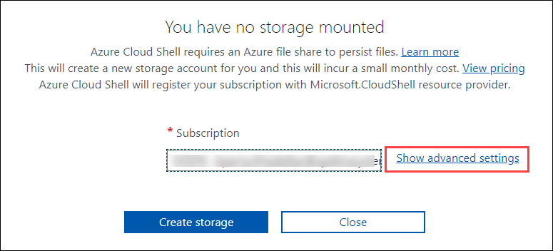

# Lab 05 - Implement Intersite Connectivity
## Lab scenario
Contoso has its data centers in Boston, New York, and Seattle offices connected via mesh wide-area network links, with full connectivity between them. You need to implement a lab environment that will reflect the topology of Contoso's on-premises networks and verify its functionality.

## Lab objectives
In this lab, you will complete the following tasks:
+ Task 1: Provision the lab environment
+ Task 2: Configure local and global virtual network peering
+ Task 3: Test intersite connectivity

## Estimated timing: 30 minutes

## Architecture diagram

 
 
## Exercise 1: Configure local and global virtual network peering

### Task 1: Provision the lab environment
In this task, you will deploy three virtual machines, each into a separate virtual network, with two of them in the same Azure region and the third one in another Azure region.
   
1. In the Azure portal, open the **Azure Cloud Shell** by clicking on the icon in the top right of the Azure Portal.

    

1. If prompted to select either **Bash** or **PowerShell**, select **PowerShell**. 
1. If this is the first time you are starting **Cloud Shell** and you are presented with the **You have no storage mounted** message, select the subscription you are using in this lab, and click **Show Advanced Settings**. 
    
    
    
1. Under **Advanced Settings**, you need to select an existing resource group from the **Resource group (1)** dropdown and enter under the **Storage Account (2)** section as **cloudshell<inject key="DeploymentID" enableCopy="false" />**, and under the **File share (3)** section type **none** as shown in the below image.

1. Click **Create storage (4)**, and wait until the Azure Cloud Shell pane is displayed. 

    

1. In the toolbar of the Cloud Shell pane, click the **Upload/Download files** icon, in the drop-down menu, click **Upload** and upload the files **C:\AllFiles\AZ-104-MicrosoftAzureAdministrator-Lab-Files\Allfiles\Labs\05\\az104-05-vnetvm-loop-template.json** and **C:\AllFiles\AZ-104-MicrosoftAzureAdministrator-Lab-Files\Allfiles\Labs\05\\az104-05-vnetvm-loop-parameters.json** into the Cloud Shell home directory.

     

1. From the Cloud Shell pane, run the following to use the resource group that will be hosting the lab environment. The first two virtual networks and a pair of virtual machines will be deployed in `[Azure_region_1]`. The third virtual network and the third virtual machine will be deployed in the same resource group but another `[Azure_region_2]`. (Replace the `[Azure_region_1]` and `[Azure_region_2]` placeholder, including the square brackets, with the names of two different Azure regions where you intend to deploy these Azure virtual machines). An example is $location1 = 'eastus'. You can use Get-AzLocation to list all locations.

   ```powershell
   $location1 = '[Azure_region_1]'

   $location2 = '[Azure_region_2]'

   $rgName = 'az104-05-rg0-<inject key="DeploymentID" />'
   ```

   >**Note**: In order to identify Azure regions, from a PowerShell session in Cloud Shell, run **(Get-AzLocation).Location**.
   
   >**Note**: Provided resource group already exists. Are you sure you want to update it? type N .

1. From the Cloud Shell pane, run the following to create the three virtual networks and deploy virtual machines into them by using the template and parameter files you uploaded:

   ```powershell
   New-AzResourceGroupDeployment `
      -ResourceGroupName $rgName `
      -TemplateFile $HOME/az104-05-vnetvm-loop-template.json `
      -TemplateParameterFile $HOME/az104-05-vnetvm-loop-parameters.json `
      -location1 $location1 `
      -location2 $location2
   ```

    >**Note**: You will be prompted to provide an admin password. Enter your own Password or give **Pa55w.rd1234**
    
    >**Note**: Wait for the deployment to complete before proceeding to the next step. This should take about 2 minutes.

1. Close the Cloud Shell pane.

### Task 2: Configure local and global virtual network peering
In this task, you will configure local and global peering between the virtual networks you deployed in the previous tasks.

1. In the Azure portal, search for and select **Virtual networks**.

    

1. Review the virtual networks you created in the previous task and verify that the first two are located in the same Azure region and the third one in a different Azure region.

    >**Note**: The template you used for the deployment of the three virtual networks ensures that the IP address ranges of the three virtual networks do not overlap.

1. In the list of virtual networks, click **az104-05-vnet0**.
     
      
      
1. On the **az104-05-vnet0** virtual network blade, in the **Settings** section, click **Peerings (1)** and then click **+ Add (2)**.

     

1. Add a peering with the following settings (leave others with their default values) and click **Add**:

    | Setting | Value|
    | --- | --- |
    | This virtual network: Peering link name | **az104-05-vnet0_to_az104-05-vnet1** |
    | Allow access to remote virtual network | **Ensure the box is checked (default)** |
    | Remote virtual network: Peering link name | **az104-05-vnet1_to_az104-05-vnet0** |
    | Virtual network deployment model | **Resource manager** |
    | I know my resource ID | unselected |
    | Subscription | the name of the Azure subscription you are using in this lab |
    | Virtual network | **az104-05-vnet1** |
    | Allow access to current virtual network |  **Ensure the box is checked (default)** |
   

    >**Note**: This step establishes two local peerings - one from az104-05-vnet0 to az104-05-vnet1 and the other from az104-05-vnet1 to az104-05-vnet0.

    >**Note**: In case you run into an issue with the Azure portal interface not displaying the virtual networks created in the previous task, you can configure peering by running the following PowerShell commands from Cloud Shell:
  
    
   ```powershell
   $rgName = 'az104-05-rg0-<inject key="DeploymentID"/>'

   $vnet0 = Get-AzVirtualNetwork -Name 'az104-05-vnet0' -ResourceGroupName $rgname

   $vnet1 = Get-AzVirtualNetwork -Name 'az104-05-vnet1' -ResourceGroupName $rgname

   Add-AzVirtualNetworkPeering -Name 'az104-05-vnet0_to_az104-05-vnet1' -VirtualNetwork $vnet0 -RemoteVirtualNetworkId $vnet1.Id

   Add-AzVirtualNetworkPeering -Name 'az104-05-vnet1_to_az104-05-vnet0' -VirtualNetwork $vnet1 -RemoteVirtualNetworkId $vnet0.Id
   ``` 

1. On the **az104-05-vnet0** virtual network blade, in the **Settings** section, click **Peerings** and then click **+ Add**.

1. Add a peering with the following settings (leave others with their default values) and click **Add**:

    | Setting | Value|
    | --- | --- |
    | This virtual network: Peering link name | **az104-05-vnet0_to_az104-05-vnet2** |
    | Allow access to remote virtual network |**Ensure the box is checked (default)** |
    | Remote virtual network: Peering link name | **az104-05-vnet2_to_az104-05-vnet0** |
    | Virtual network deployment model | **Resource manager** |
    | I know my resource ID | unselected |
    | Subscription | the name of the Azure subscription you are using in this lab |
    | Virtual network | **az104-05-vnet2** |
    | Allow access to current virtual network |**Ensure the box is checked (default)** |

    >**Note**: This step establishes two global peerings - one from az104-05-vnet0 to az104-05-vnet2 and the other from az104-05-vnet2 to az104-05-vnet0.

    >**Note**: In case you run into an issue with the Azure portal interface not displaying the virtual networks created in the previous task, you can configure peering by running the following PowerShell commands from Cloud Shell:
   
    
   ```powershell
   $rgName = 'az104-05-rg0-<inject key="DeploymentID" />'

   $vnet0 = Get-AzVirtualNetwork -Name 'az104-05-vnet0' -ResourceGroupName $rgname

   $vnet2 = Get-AzVirtualNetwork -Name 'az104-05-vnet2' -ResourceGroupName $rgname

   Add-AzVirtualNetworkPeering -Name 'az104-05-vnet0_to_az104-05-vnet2' -VirtualNetwork $vnet0 -RemoteVirtualNetworkId $vnet2.Id

   Add-AzVirtualNetworkPeering -Name 'az104-05-vnet2_to_az104-05-vnet0' -VirtualNetwork $vnet2 -RemoteVirtualNetworkId $vnet0.Id
   ``` 

1. Navigate back to the **Virtual networks** blade and, in the list of virtual networks, click **az104-05-vnet1**.

1. On the **az104-05-vnet1** virtual network blade, in the **Settings** section, click **Peerings** and then click **+ Add**.

1. Add a peering with the following settings (leave others with their default values) and click **Add**:

    | Setting | Value|
    | --- | --- |
    | This virtual network: Peering link name | **az104-05-vnet1_to_az104-05-vnet2** |
    | Allow access to remote virtual network | **Ensure the box is checked (default)** |
    | Remote virtual network: Peering link name | **az104-05-vnet2_to_az104-05-vnet1** |
    | Virtual network deployment model | **Resource manager** |
    | I know my resource ID | unselected |
    | Subscription | the name of the Azure subscription you are using in this lab |
    | Virtual network | **az104-05-vnet2** |
    | Allow access to current virtual network | **Ensure the box is checked (default)** |

    >**Note**: This step establishes two global peerings - one from az104-05-vnet1 to az104-05-vnet2 and the other from az104-05-vnet2 to az104-05-vnet1.

    >**Note**: In case you run into an issue with the Azure portal interface not displaying the virtual networks created in the previous task, you can configure peering by running the following PowerShell commands from Cloud Shell:
    
    
   ```powershell
   $rgName = 'az104-05-rg0-<inject key="DeploymentID" />'

   $vnet1 = Get-AzVirtualNetwork -Name 'az104-05-vnet1' -ResourceGroupName $rgname

   $vnet2 = Get-AzVirtualNetwork -Name 'az104-05-vnet2' -ResourceGroupName $rgname

   Add-AzVirtualNetworkPeering -Name 'az104-05-vnet1_to_az104-05-vnet2' -VirtualNetwork $vnet1 -RemoteVirtualNetworkId $vnet2.Id

   Add-AzVirtualNetworkPeering -Name 'az104-05-vnet2_to_az104-05-vnet1' -VirtualNetwork $vnet2 -RemoteVirtualNetworkId $vnet1.Id
   ``` 
   
   > **Congratulations** on completing the task! Now, it's time to validate it. Here are the steps:
   > - Navigate to the Lab Validation Page, from the upper right corner in the lab guide section.
   > - Hit the Validate button for the corresponding task. If you receive a success message, you can proceed to the next task. 
   > - If not, carefully read the error message and retry the step, following the instructions in the lab guide.
   > - If you need any assistance, please contact us at labs-support@spektrasystems.com. We are available 24/7 to help you out.


### Task 3: Test intersite connectivity

In this task, you will test connectivity between virtual machines on the three virtual networks that you connected via local and global peering in the previous task.

1. In the Azure portal, search for and select **Virtual machines**.

     

2. In the list of virtual machines, click **az104-05-vm0**.

      

3. On the **az104-05-vm0** blade, click **Connect**, in the drop-down menu, click **RDP**, on the **Connect with RDP** blade, click **Download RDP File** and follow the prompts to start the Remote Desktop session.

      
      
      
      
      

    >**Note**: This step refers to connecting via Remote Desktop from a Windows computer. On a Mac, you can use Remote Desktop Client from the Mac App Store,e and on Linux computers, you can use an open-source RDP client software.

    >**Note**: You can ignore any warning prompts when connecting to the target virtual machines.

4. When prompted, sign in by using the **Student** username and the password **Pa55w.rd1234**.

5. Within the Remote Desktop session to **az104-05-vm0**, right-click the **Start** button and, in the right-click menu, click **Windows PowerShell (Admin)**.

     
   
6. In the Windows PowerShell console window, run the following to test connectivity to **az104-05-vm1** (which has the private IP address of **10.51.0.4**) over TCP port 3389:

   ```powershell
   Test-NetConnection -ComputerName 10.51.0.4 -Port 3389 -InformationLevel 'Detailed'
   ```

    >**Note**: The test uses TCP 3389 since this port is allowed by default by the operating system firewall.

7. Examine the output of the command and verify that the connection was successful.

8. In the Windows PowerShell console window, run the following to test connectivity to **az104-05-vm2** (which has the private IP address of **10.52.0.4**):

   ```powershell
   Test-NetConnection -ComputerName 10.52.0.4 -Port 3389 -InformationLevel 'Detailed'
   ```

9. Switch back to the Azure portal on your lab computer and navigate back to the blade of the **Virtual machine**.

10. In the list of virtual machines, click **az104-05-vm1**.

    

11. On the **az104-05-vm1** blade, click **Connect**, in the drop-down menu, click **RDP**, on the **Connect with RDP** blade, click **Download RDP File** and follow the prompts to start the Remote Desktop session.

    >**Note**: This step refers to connecting via Remote Desktop from a Windows computer. On a Mac, you can use Remote Desktop Client from the Mac App Store, and on Linux computers, you can use an open source RDP client software.

    >**Note**: You can ignore any warning prompts when connecting to the target virtual machines.

12. When prompted, sign in by using the **Student** username and the password **Pa55w.rd1234**.

13. Within the Remote Desktop session to **az104-05-vm1**, right-click the **Start** button and, in the right-click menu, click **Windows PowerShell (Admin)**.

14. In the Windows PowerShell console window, run the following to test connectivity to **az104-05-vm2** (which has the private IP address of **10.52.0.4**) over TCP port 3389:

    ```powershell
    Test-NetConnection -ComputerName 10.52.0.4 -Port 3389 -InformationLevel 'Detailed'
    ```

    >**Note**: The test uses TCP 3389 since this port is allowed by default by the operating system firewall.

15. Examine the output of the command and verify that the connection was successful.

### Review
In this lab, you have completed:
+ Provisioned the lab environment
+ Configured local and global virtual network peering
+ Tested intersite connectivity

### You have successfully completed the lab
