# Lab 06 - Implement Network Traffic Management

## Lab Overview

In this lab, you will learn to configure and manage Azure resources, including Virtual Networks, Load Balancers, Virtual Machines, and Network Security Groups, to create a secure and scalable infrastructure.

## Interactive lab simulations

There are interactive lab simulations that you might find useful for this topic. The simulation lets you to click through a similar scenario at your own pace. There are differences between the interactive simulation and this lab, but many of the core concepts are the same. An Azure subscription is not required.

+ [Create and configure and Azure load balancer](https://mslabs.cloudguides.com/guides/AZ-700%20Lab%20Simulation%20-%20Create%20and%20configure%20an%20Azure%20load%20balancer). Create a virtual network, backend servers, load balancer, and then test the load balancer.
+ [Deploy Azure Application Gateway](https://mslabs.cloudguides.com/guides/AZ-700%20Lab%20Simulation%20-%20Deploy%20Azure%20Application%20Gateway). Create an application gateway, create virtual machines, create the backend pool, and test the gateway.
+ [Implement traffic management](https://mslabs.cloudguides.com/guides/AZ-104%20Exam%20Guide%20-%20Microsoft%20Azure%20Administrator%20Exercise%2010). Implement complete hub and spoke network including virtual machines, virtual networks, peering, load balancer, and application gateway.
  
## Lab objectives
In this lab, you will complete the following tasks:
+ Task 1: Use a template to provision an infrastructure.
+ Task 2: Configure an Azure Load Balancer.
+ Task 3: Configure an Azure Application Gateway.

## Excercise 1: Implement Traffic Management

In this exercise, you will configure and implement Azure Traffic Manager to manage traffic distribution across multiple Azure resources for high availability and performance.

## Task 1: Use a template to provision an infrastructure

In this task, you will use a template to deploy one virtual network, one network security group, and two virtual machines.

1. On Azure Portal page, in **Search resources, services and docs (G+/)** box at the top of the portal, enter **Deploy a custom template**, and then select **Deploy a custom template** under services.

    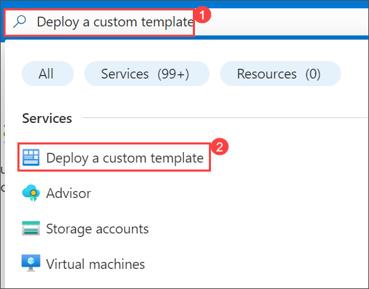

1. On the custom deployment page, select **Build you own template in the editor**.

   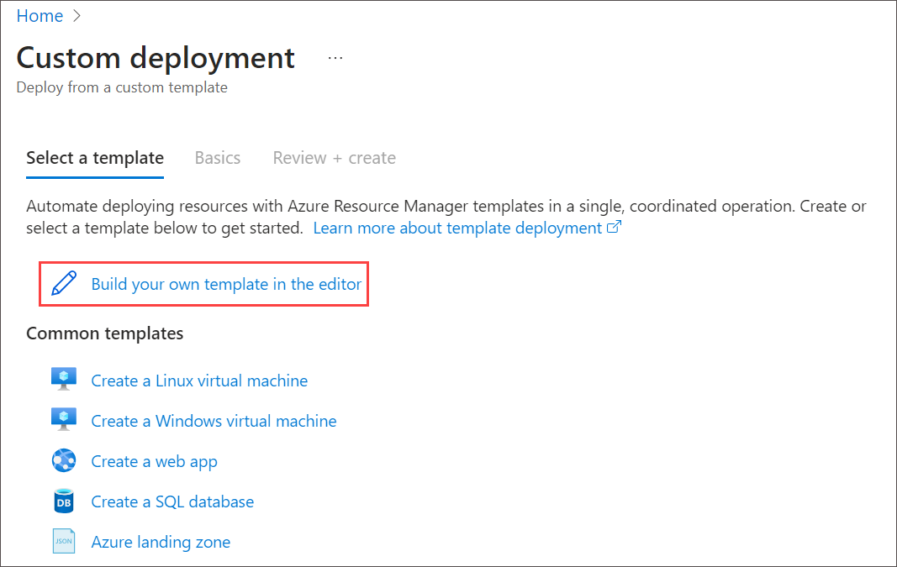
   
1. On the edit template page, select **Load file**.

   
   
1. Locate and select the **C:\AllFiles\AZ-104-MicrosoftAzureAdministrator-Lab-Files\Allfiles\Labs\06\az104-06-vms-template.json** file and select **Open**.

   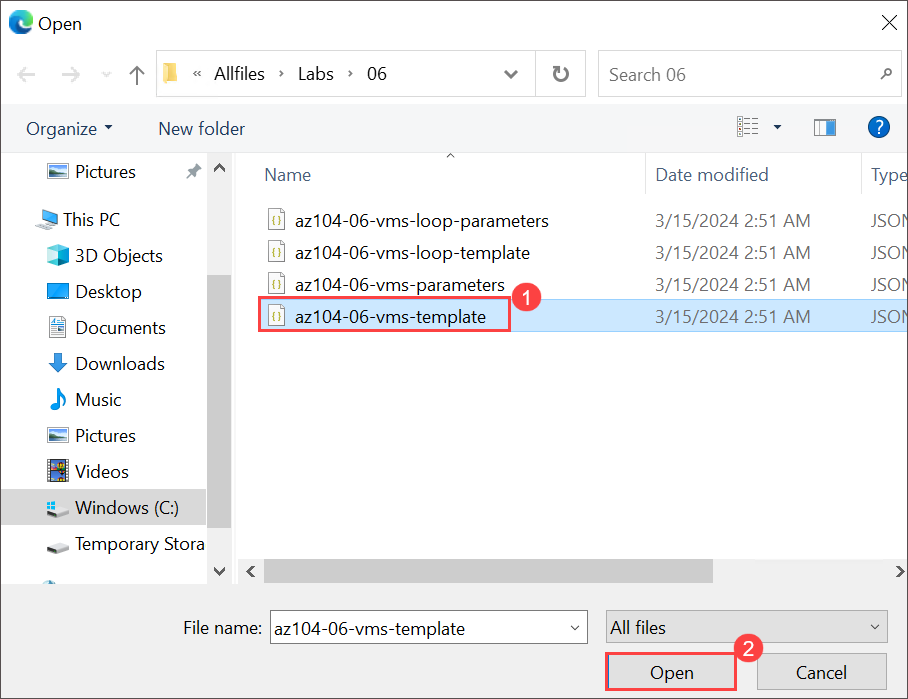

1. Select **Save**.

   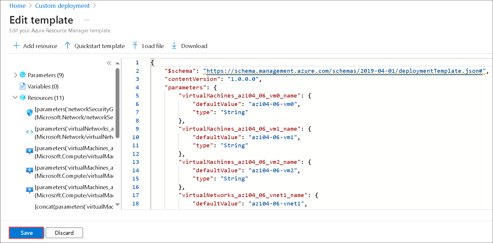
   
1. Select **Edit parameters** > **load** and locate and select **C:\AllFiles\AZ-104-MicrosoftAzureAdministrator-Lab-Files\Allfiles\Labs\06\az104-06-vms-parameters.json** file.

   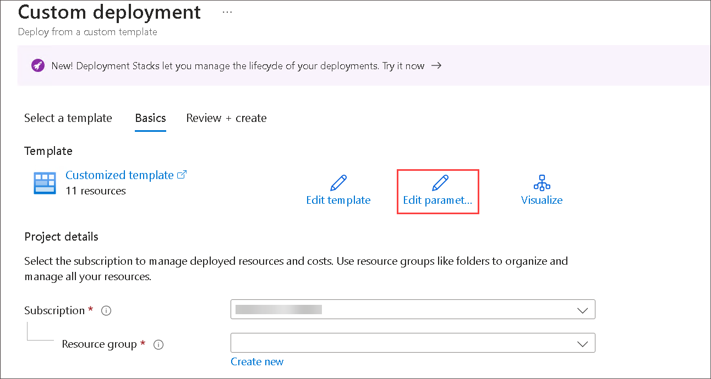

   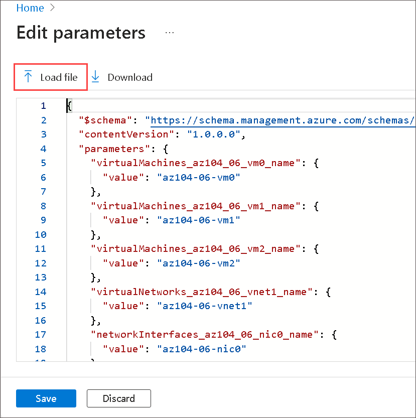

   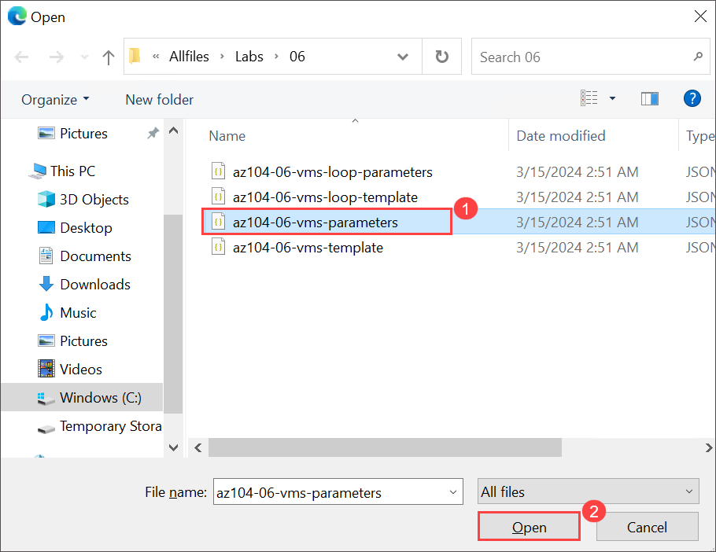

1. Select **Save**.

    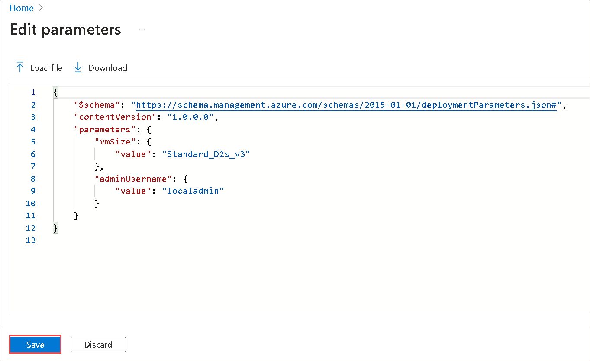
   
1. Use the following information to complete the fields on the custom deployment page, leaving all other fields with the default value and select **Review + Create**.

    | Setting       | Value         |
    | ---           | ---           |
    | Subscription  | your Azure subscription |
    | Resource group | **az104-06-rg1** |
    | Password      | Provide a secure password (Please make sure the password contains uppercase, lowercase letters, digits and a special character and it is at least 8 characters long.)|

     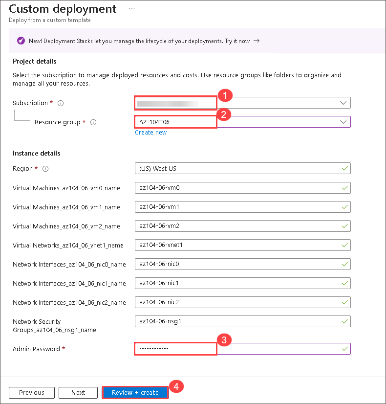
   
    >**Note**: If you receive an error that the VM size is unavailable, select a SKU that is available in your subscription and has at least 2 cores.
  
1. Select **Create**.

    >**Note**: Wait for the deployment to complete before moving to the next task. The deployment should take approximately 5 minutes.

    >**Note**: Review the resources being deployed. There will be one virtual network with three subnets. Each subnet will have a virtual machine.

### Task 2: Implement Azure Load Balancer

In this task, you will implement an Azure Load Balancer in front of the two Azure virtual machines in the hub virtual network

1. On Azure Portal page, in **Search resources, services and docs (G+/)** box at the top of the portal, enter **Load balancer**, and then select **Load balancers** under services.

   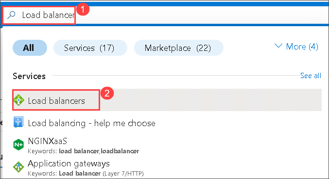

1. On **Load balancing | Load Balancer** blade, click on **+ Create**.

1. Create a load balancer with the following settings (leave others with their default values) and click **Next: Frontend IP configuration >** 

    | Setting | Value |
    | --- | --- |
    | Subscription | the name of the Azure subscription you are using in this lab |
    | Resource group | az104-06-rg1 |
    | Name | **az104-06-lb4** |
    | Region| **<inject key="Region" enableCopy="false"/>** |
    | SKU | **Standard** |
    | Type | **Public** |
    
1.  On the Frontend IP configuration tab click **+ Add frontend IP configuration** , under **Add frontend IP configuration** window add the following settings and click on **Save**
 
    | Setting | Value |
    | --- | --- |
    | Name | **az104-06-pip4** |
    | IP version | **IPv4** |
    | IP type | **IP address** |
    | Public IP address | **Create new** |

    
    | Setting | Value |
    | --- | --- |
    | Name | **az104-06-pip4** |
    | Availability zone | Choose **1** and click **Save** |

1. Back on **Add frontend IP configuration** click on **Add** and click on **Next : Backend pools>**

1. On **Backend pools** tab, and click **+ Add a Backend pools**.

1. Add a backend pool with the following settings (leave others with their default values):

    | Setting | Value |
    | --- | --- |
    | Name | **az104-06-lb4-be1** |
    | Virtual network | **az104-06-vnet1** |
    | Backend Pool Configuration | **NIC** |
    
1. Click **+ Add**, under **IP Configurations** on the **Add backend pool** blade, select all the virtual machines on the **Add IP configurations to backend pool** window and click on **Add** and then click **Save** to save the IP configurations to the backend pool.

1. Click **Next: Inbound rules >**, **+ Add a load balancing rule** with the following settings (leave others with their default values):

    | Setting | Value |
    | --- | --- |
    | Name | **az104-06-lb4-lbrule1** |
    | IP Version | **IPv4** |
    | Frontend IP Address | select the LoadBalancerFrontEnd from the drop down |
    | Backend pool | **az104-06-lb4-be1** |    
    | Protocol | **TCP** |
    | Port | **80** |
    | Backend port | **80** |
    | Session persistence | **None** |
    | Idle timeout (minutes) | **4** |
    | Enable TCP reset | **Disabled** |
    | Enable Floating IP | **Disabled** |
    | Health probe | **Create new** |
    
1. Click **create new** under **Health probe**, on the **Add load balancing rules** blade.

    Add a health probe with the following settings:

    | Setting | Value |
    | --- | --- |
    | Name | **az104-06-lb4-hp1** |
    | Protocol | **TCP** |
    | Port | **80** |
    | Interval | **5** |

    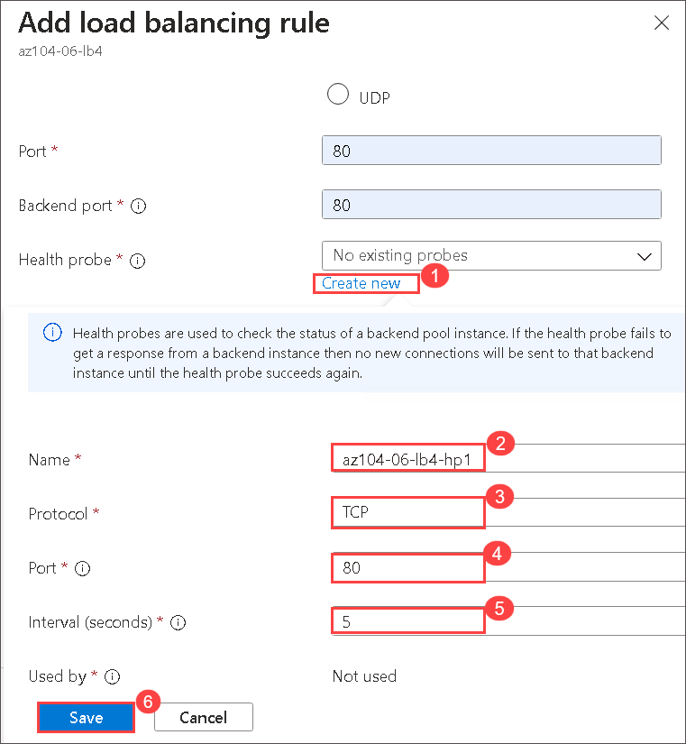

1. Click **Save** and back on the **Add load balancing rules** blade, click **Save**.

1. Click **Next: Outbound rules >**, followed by **Next: Tags >**, followed by **Next: Review + create >**. Let validation occur, and then click **Create** to submit your deployment.

    > **Note**: Wait for the Azure load balancer to be provisioned. This should take about 2 minutes.

1. Wait for the load balancing rule to be created, click **Go to resource** and on the **az104-06-lb4** load balancers blade, in the **Settings** section, click **Frontend IP configuration** and note the value of the **Public IP address**.

1. Start another browser window and navigate to the IP address you identified in the previous step.

1. Verify that the browser window displays the message **Hello World from az104-06-vm0** or **Hello World from az104-06-vm1**.

    .png)

1. Open another browser window but this time by using InPrivate mode and verify whether the target vm changes (as indicated by the message).

    > **Note**: You might need to refresh the browser window or open it again by using InPrivate mode.
    
> **Congratulations** on completing the task! Now, it's time to validate it. Here are the steps:
> - Hit the Validate button for the corresponding task. If you receive a success message, you can proceed to the next task. 
> - If not, carefully read the error message and retry the step, following the instructions in the lab guide.
> - If you need any assistance, please contact us at labs-support@spektrasystems.com. We are available 24/7 to help

<validation step="05e14bc6-a387-4fb8-baa1-c4dbacc8ae56" />

### Task 3: Implement Azure Application Gateway

In this task, you will implement an Azure Application Gateway in front of the two Azure virtual machines in the spoke virtual networks.

1. In the Azure portal, search and select **Virtual networks**.

    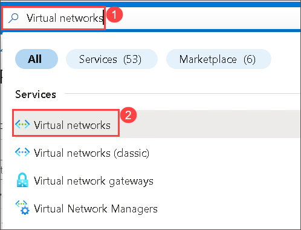

1. On the **Virtual networks** blade, in the list of virtual networks, click **az104-06-vnet1**.

1. On the  **az104-06-vnet1** virtual network blade, in the **Settings** section, click **Subnets**, and then click **+ Subnet**.

    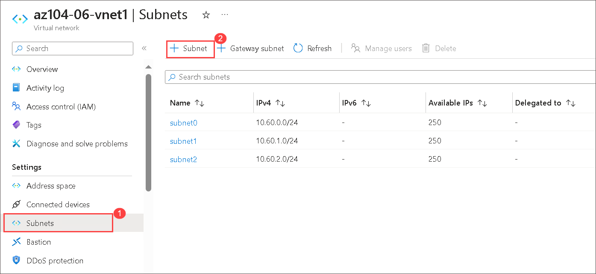

1. Add a subnet with the following settings (leave others with their default values) and click **Add**(4).

    | Setting | Value |
    | --- | --- |
    | Name | **subnet-appgw** (1)|
    | Starting address | **10.60.3.224** (2)|
    | Size | **/27(32 addresses)** (3)|

    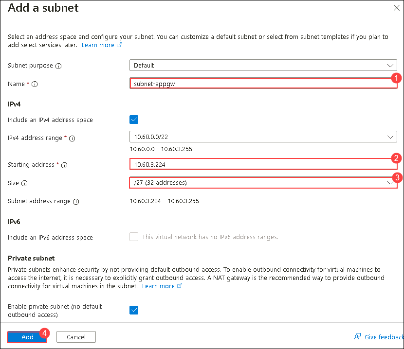

    > **Note**: This subnet will be used by the Azure Application Gateway instances, which you will deploy later in this task. The Application Gateway requires a dedicated subnet of /27 or larger size.

1. In the Azure portal, search and select **Application Gateways** and, on the **Application Gateways** blade.

    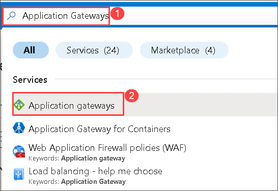

1. On the **Load balancing | Application Gateway** blade, click **+ Create**.

1. On the **Basics** tab of the **Create an application gateway** blade, specify the following settings (leave others with their default values) and click **Next: Frontends >**

    | Setting | Value |
    | --- | --- |
    | Subscription | the name of the Azure subscription you are using in this lab |
    | Resource group | az104-06-rg1 |
    | Application gateway name | **az104-06-appgw5** |
    | Region | **<inject key="Region" enableCopy="false"/>** |
    | Tier | **Standard V2** |
    | Enable autoscaling | **No** |
    | HTTP2 | **Disabled** |
    | Virtual network | **az104-06-vnet1** |
    | Subnet | **subnet-appgw** |

1.  On **Frontends** tab, specify the following settings (leave others with their default values):

    | Setting | Value |
    | --- | --- |
    | Frontend IP address type | **Public** |
    | Public IP address | Select **Add new** |
    
1. On **Add a Public IP**, Specify the following settings(leave others with their default values) and click **Next: Backends >**  

    | Setting | Value |
    | --- | --- |
    | Name | **az104-06-pip5** and click on **Ok** |
    

1. On **Backends**, click **Add a backend pool** and on the **Add a backend pool** blade, specify the following settings (leave others with their default values) and click on **Add**.

    | Setting | Value |
    | --- | --- |
    | Name | **az104-06-appgw5-be1** |
    | Add backend pool without targets | **No** |
    | Target Type |  Virtual machine and choose **az104-06-nic1 (10.60.1.4)** as Target |
    | Target Type |  Virtual machine and choose **az104-06-nic2 (10.60.2.4)** as Target |

    > **Note**: The targets represent the private IP addresses of virtual machines in the spoke virtual networks **az104-06-vm2** and **az104-06-vm3**.

1. Click **Add a backend pool**. This is the backend pool for **images**. Specify the following settings (leave others with their default values). When completed click **Add**.

    | Setting | Value |
    | --- | --- |
    | Name | `az104-imagebe` |
    | Add backend pool without targets | **No** |
    | Target Type | Virtual machine and choose **az104-06-nic1 (10.60.1.4)** as Target|

1. Click **Add a backend pool**. This is the backend pool for **video**. Specify the following settings (leave others with their default values). When completed click **Add**.

    | Setting | Value |
    | --- | --- |
    | Name | `az104-videobe` |
    | Add backend pool without targets | **No** |
    | Target Type | Virtual machine and choose **az104-06-nic2 (10.60.2.4)** as Target|
   
1. Click **Next: Configuration >** and, on the **Configuration** tab of the **Create an application gateway** blade, click **+ Add a routing rule**.

1. On the **Add a routing rule** blade, on the **Listener** tab, specify the following settings:

    | Setting | Value |
    | --- | --- |
    | Rule name | **az104-06-appgw5-rl1** |
    | Priority | **10** |
    | Listener name | **az104-06-appgw5-rl1l1** |
    | Frontend IP | **Public IPv4** |
    | Protocol | **HTTP** |
    | Port | **80** |
    | Listener type | **Basic** |

    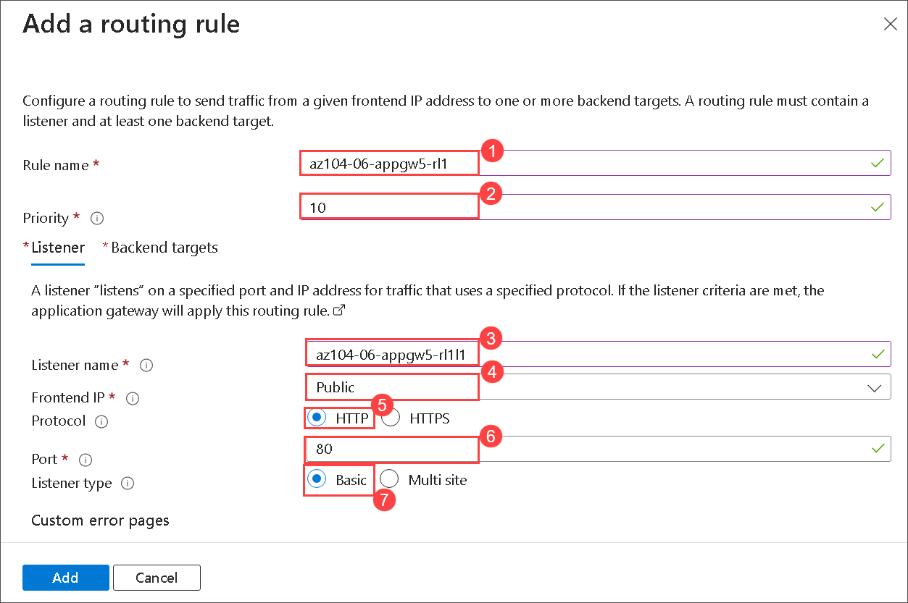
   
1. Switch to the **Backend targets** tab of the **Add a routing rule** blade and specify the following settings (leave others with their default values):

    | Setting | Value |
    | --- | --- |
    | Target type | **Backend pool** |
    | Backend target | **az104-06-appgw5-be1** |
    | Backend setting | Click **Add new** |

    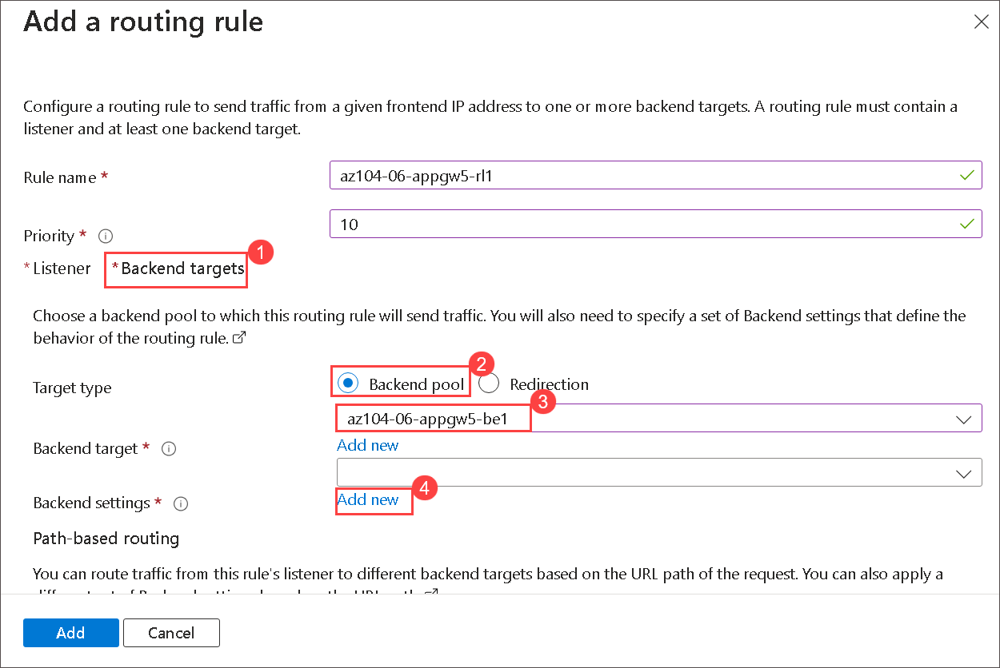
   
1. On the **Add Backend setting** blade, specify the following settings (leave others with their default values) and click **Add**.

    | Setting | Value |
    | --- | --- |
    | Backend settings name | **az104-06-appgw5-http1** |
    | Backend protocol | **HTTP** |
    | Backend port | **80** |
    | Cookie-based affinity | **Disable** |
    | Connection draining | **Disable** |
    | Request time-out (seconds) | **20** |

    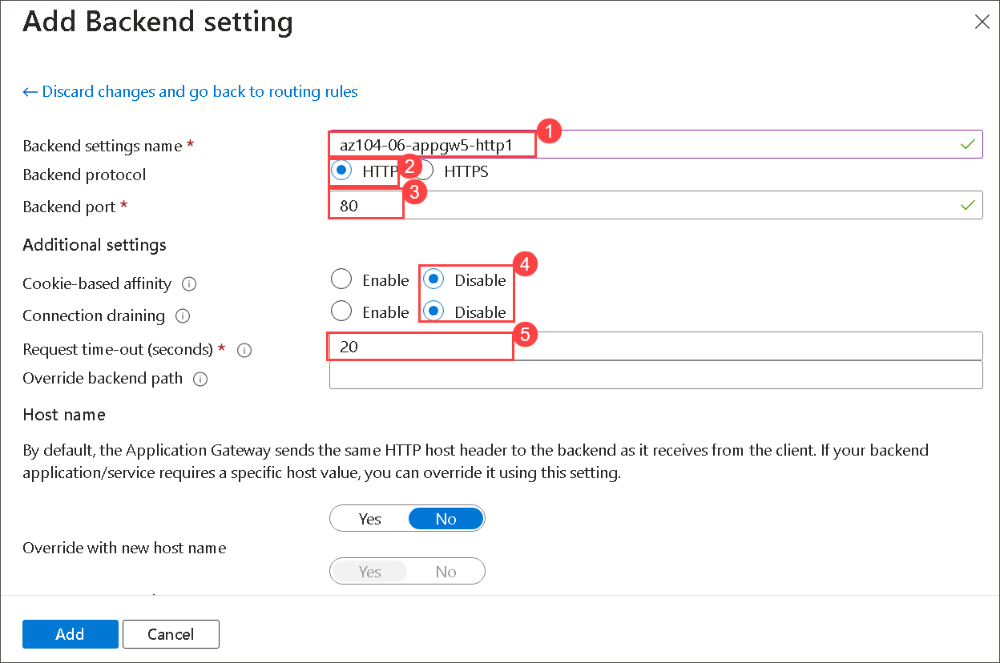
   
1. On the **Add a routing rule** blade. In the **Path based routing** section, select **Add multiple targets to create a path-based rule**. You will create two rules. Click **Add** after the first rule and then **Add** after the second rule. 

     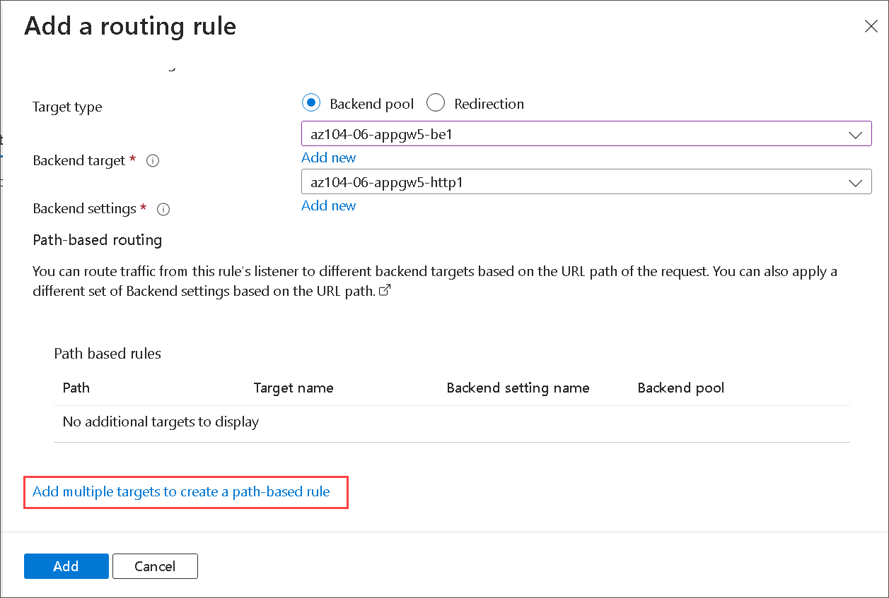
   
    **Rule - routing to the images backend**

    | Setting | Value |
    | --- | --- |
    | Path | `/image/*` |
    | Target name | `images` |
    | Backend settings | **az104-06-appgw5-http1** |
    | Backend target | `az104-imagebe` |

    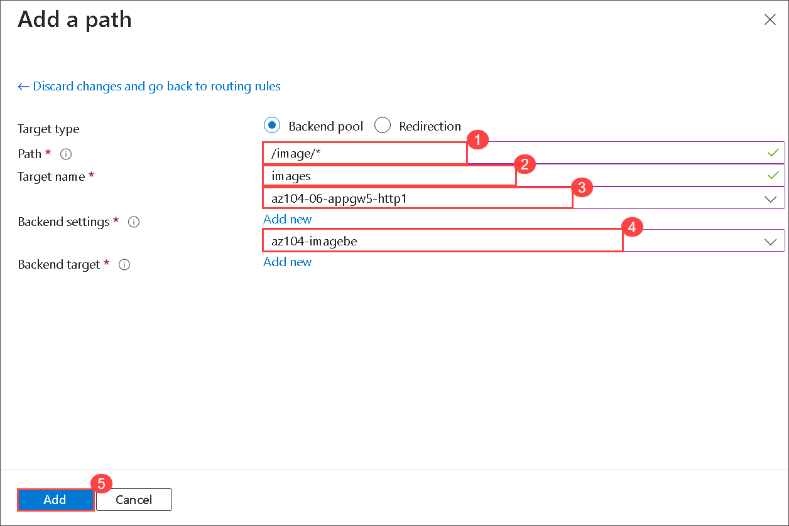
   
    **Rule - routing to the videos backend**

    | Setting | Value |
    | --- | --- |
    | Path | `/video/*` |
    | Target name | `videos` |
    | Backend settings | **az104-06-appgw5-http1** |
    | Backend target | `az104-videobe` |
      
1. Click **Add** on the **Add routing rule** blade. and back on the **Configuration** blade.

1. Click **Next: Tags >**, followed by **Next: Review + create >** and then click **Create**.

    > **Note**: Wait for the Application Gateway instance to be created. This might take about 8 minutes.

1. In the Azure portal, search and select **Application Gateways** and, on the **Application Gateways** blade, click **az104-06-appgw5**.

1. In the **Application Gateway** resource, in the **Monitoring** sectionfrom the left navigation pane, select **Backend health**.

1. Ensure the servers in the backend pool display **Healthy**.

1. On the **az104-06-appgw5** Application Gateway blade, note the value of the **Frontend public IP address**.

1. Start another browser window and test this URL - `<frontend ip address>/image/` and verify you are directed to the image server (vm1).

   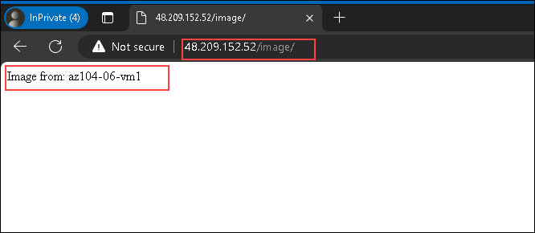

   >**Note:** Replace the frontend IP address with the IP address you copied in the previous step.

1. Start another browser window and test this URL - `<frontend ip address>/video/` and  verify you are directed to the video server (vm2).

   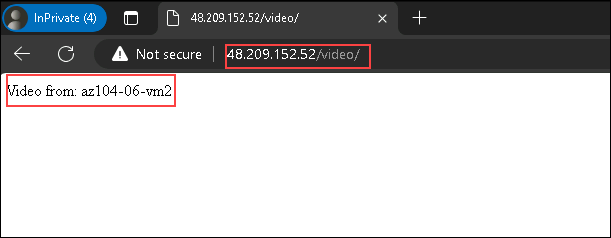

   >**Note:** Replace the frontend IP address with the IP address you copied in the previous step.

   > **Note**: You may need to refresh more than once or open a new browser window in InPrivate mode.

   > **Note**: Targeting virtual machines on multiple virtual networks is not a common configuration, but it is meant to illustrate the point that Application Gateway is capable of targeting virtual machines on multiple virtual networks (as well as endpoints in other Azure regions or even outside of Azure), unlike Azure Load Balancer, which load balances across virtual machines in the same virtual network.

> **Congratulations** on completing the task! Now, it's time to validate it. Here are the steps:
> - Hit the Validate button for the corresponding task. If you receive a success message, you can proceed to the next task. 
> - If not, carefully read the error message and retry the step, following the instructions in the lab guide.
> - If you need any assistance, please contact us at labs-support@spektrasystems.com. We are available 24/7 to help

<validation step="c5b0893d-fb8a-40ab-9566-65332fc9b45e" />

### Review

In this lab, you have completed the following:

- Used an Azure Resource Manager (ARM) template to automate the provisioning of the infrastructure.
- Configured an Azure Load Balancer to distribute incoming traffic across multiple resources for high availability and reliability.
- Set up an Azure Application Gateway to enable advanced traffic routing, SSL termination, and web application firewall protection.

## Extend your learning with Copilot

Copilot can assist you in learning how to use the Azure scripting tools. Copilot can also assist in areas not covered in the lab or where you need more information. Open an Edge browser and choose Copilot (top right) or navigate to *copilot.microsoft.com*. Take a few minutes to try these prompts.

+ Compare and contrast the Azure Load Balancer with the Azure Application Gateway. Help me decide in which scenarios I should use each product. 
+ What tools are available to troubleshoot connections to an Azure Load Balancer? 
+ What are the basic steps for configuring the Azure Application Gateway? Provide a high-level checklist. 
+ Create a table highlighting three Azure load balancing solutions. For each solution show supported protocols, routing policies, session affinity, and TLS offloading.

## Learn more with self-paced training

+ [Improve application scalability and resiliency by using Azure Load Balancer](https://learn.microsoft.com/training/modules/improve-app-scalability-resiliency-with-load-balancer/). Discuss the different load balancers in Azure and how to choose the right Azure load balancer solution to meet your requirements.
+ [Load balance your web service traffic with Application Gateway](https://learn.microsoft.com/training/modules/load-balance-web-traffic-with-application-gateway/). Improve application resilience by distributing load across multiple servers and use path-based routing to direct web traffic.

## Key takeaways

Congratulations on completing the lab. Here are the key points for this lab.

+ Azure Load Balancer is an excellent choice for distributing network traffic across multiple virtual machines at the transport layer (OSI layer 4 - TCP and UDP).
+ Public Load Balancers are used to load balance internet traffic to your VMs. An internal (or private) load balancer is used where private IPs are needed at the frontend only.
+ The Basic load balancer is for small-scale applications that don't need high availability or redundancy. The Standard load balancer is for high performance and ultra-low latency.
+ Azure Application Gateway is a web traffic (OSI layer 7) load balancer that enables you to manage traffic to your web applications.
+ The Application Gateway Standard tier offers all the L7 functionality, including load balancing, The WAF tier adds a firewall to check for malicious traffic.
+ An Application Gateway can make routing decisions based on additional attributes of an HTTP request, for example URI path or host headers.

### You have successfully completed the lab
