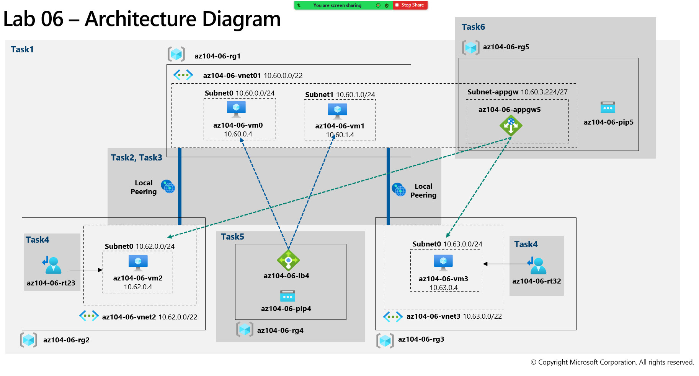

---
lab:
    title: 'Lab 06: Implement Traffic Management'
    module: 'Administer Network Traffic Management'
---

# Lab 06 - Implement Traffic Management
# Student lab manual

## Lab scenario

You were tasked with testing managing network traffic targeting Azure virtual machines in the hub and spoke network topology, which Contoso considers implementing in its Azure environment (instead of creating the mesh topology, which you tested in the previous lab). This testing needs to include implementing connectivity between spokes by relying on user defined routes that force traffic to flow via the hub, as well as traffic distribution across virtual machines by using layer 4 and layer 7 load balancers. For this purpose, you intend to use Azure Load Balancer (layer 4) and Azure Application Gateway (layer 7).

**Note:** An **[interactive lab simulation](https://mslabs.cloudguides.com/guides/AZ-104%20Exam%20Guide%20-%20Microsoft%20Azure%20Administrator%20Exercise%2010)** is available that allows you to click through this lab at your own pace. You may find slight differences between the interactive simulation and the hosted lab, but the core concepts and ideas being demonstrated are the same. 

>**Note**: This lab, by default, requires total of 8 vCPUs available in the Standard_Dsv3 series in the region you choose for deployment, since it involves deployment of four Azure VMs of Standard_D2s_v3 SKU. If your students are using trial accounts, with the limit of 4 vCPUs, you can use a VM size that requires only one vCPU (such as Standard_B1s).

## Objectives

In this lab, you will:

+ Task 1: Provision the lab environment
+ Task 2: Configure the hub and spoke network topology
+ Task 3: Test transitivity of virtual network peering
+ Task 4: Configure routing in the hub and spoke topology
+ Task 5: Implement Azure Load Balancer
+ Task 6: Implement Azure Application Gateway

## Estimated timing: 60 minutes

## Architecture diagram




### Instructions

## Exercise 1

## Task 1: Provision the lab environment

In this task, you will deploy four virtual machines into the same Azure region. The first two will reside in a hub virtual network, while each of the remaining two will reside in a separate spoke virtual network.

1. Sign in to the [Azure portal](https://portal.azure.com).

1. In the Azure portal, open the **Azure Cloud Shell** by clicking on the icon in the top right of the Azure Portal.

1. If prompted to select either **Bash** or **PowerShell**, select **PowerShell**.

    >**Note**: If this is the first time you are starting **Cloud Shell** and you are presented with the **You have no storage mounted** message, select the subscription you are using in this lab, and click **Create storage**.

1. In the toolbar of the Cloud Shell pane, click the **Upload/Download files** icon, in the drop-down menu, click **Upload** and upload the files **\\Allfiles\\Labs\\06\\az104-06-vms-loop-template.json** and **\\Allfiles\\Labs\\06\\az104-06-vms-loop-parameters.json** into the Cloud Shell home directory.

1. From the Cloud Shell pane, run the following to create the first resource group that will be hosting the lab environment (replace the '[Azure_region]' placeholder with the name of an Azure region where you intend to deploy Azure virtual machines)(you can use the "(Get-AzLocation).Location" cmdlet to get the region list):

    ```powershell 
    $location = '[Azure_region]'
    ```
    
    Now the resource group name:
    ```powershell
    $rgName = 'az104-06-rg1'
    ```
    
    And finally create the resource group in your desired location:
    ```powershell
    New-AzResourceGroup -Name $rgName -Location $location
    ```


1. From the Cloud Shell pane, run the following to create the three virtual networks and four Azure VMs into them by using the template and parameter files you uploaded:

    >**Note**: You will be prompted to provide an Admin password.

   ```powershell
   New-AzResourceGroupDeployment `
      -ResourceGroupName $rgName `
      -TemplateFile $HOME/az104-06-vms-loop-template.json `
      -TemplateParameterFile $HOME/az104-06-vms-loop-parameters.json
   ```

    >**Note**: Wait for the deployment to complete before proceeding to the next step. This should take about 5 minutes.

    >**Note**: If you got an error stating the VM size is not available please ask your instructor for assistance and try these steps.
    > 1. Click on the `{}` button in your CloudShell, select the **az104-06-vms-loop-parameters.json** from the left hand side bar and take a note of the `vmSize` parameter value.
    > 1. Check the location in which the 'az104-06-rg1' resource group is deployed. You can run `az group show -n az104-06-rg1 --query location` in your CloudShell to get it.
    > 1. Run `az vm list-skus --location <Replace with your location> -o table --query "[? contains(name,'Standard_D2s')].name"` in your CloudShell.
    > 1. Replace the value of `vmSize` parameter with one of the values returned by the command you just run. If there are no values returned, you may need to choose a different region to deploy into. You may also choose a different family name, like "Standard_B1s".
    > 1. Now redeploy your templates by running the `New-AzResourceGroupDeployment` command again. You can press the up button a few times which would bring the last executed command.

1. From the Cloud Shell pane, run the following to install the Network Watcher extension on the Azure VMs deployed in the previous step:

   ```powershell
   $rgName = 'az104-06-rg1'
   $location = (Get-AzResourceGroup -ResourceGroupName $rgName).location
   $vmNames = (Get-AzVM -ResourceGroupName $rgName).Name

   foreach ($vmName in $vmNames) {
     Set-AzVMExtension `
     -ResourceGroupName $rgName `
     -Location $location `
     -VMName $vmName `
     -Name 'networkWatcherAgent' `
     -Publisher 'Microsoft.Azure.NetworkWatcher' `
     -Type 'NetworkWatcherAgentWindows' `
     -TypeHandlerVersion '1.4'
   }
   ```

    >**Note**: Wait for the deployment to complete before proceeding to the next step. This should take about 5 minutes.


1. Close the Cloud Shell pane.

## Task 2: Configure the hub and spoke network topology

In this task, you will configure local peering between the virtual networks you deployed in the previous tasks in order to create a hub and spoke network topology.

1. In the Azure portal, search for and select **Virtual networks**.

1. Review the virtual networks you created in the previous task.

    >**Note**: The template you used for deployment of the three virtual networks ensures that the IP address ranges of the three virtual networks do not overlap.

1. In the list of virtual networks, select **az104-06-vnet2**.

1. On the **az104-06-vnet2** blade, select **Properties**. 

1. On the **az104-06-vnet2 \| Properties** blade, record the value of the **Resource ID** property.

1. Navigate back to the list of virtual networks and select **az104-06-vnet3**.

1. On the **az104-06-vnet3** blade, select **Properties**. 

1. On the **az104-06-vnet3 \| Properties** blade, record the value of the **Resource ID** property.

    >**Note**: You will need the values of the ResourceID property for both virtual networks later in this task.

    >**Note**: This is a workaround that addresses the issue with the Azure portal occasionally not displaying the newly provisioned virtual network when creating virtual network peerings.

1. In the list of virtual networks, click **az104-06-vnet01**.

1. On the **az104-06-vnet01** virtual network blade, in the **Settings** section, click **Peerings** and then click **+ Add**.

1. Add a peering with the following settings (leave others with their default values) and click **Add**:

    | Setting | Value |
    | --- | --- |
    | This virtual network: Peering link name | **az104-06-vnet01_to_az104-06-vnet2** |
    | Allow 'az104-06-vnet01' to access the peered virtual network | **Ensure the box is checked (default)** |
    | Allow gateway in 'az104-06-vnet01' to forward traffic to the peered virtual network | **Ensure the box is checked** |
    | Remote virtual network: Peering link name | **az104-06-vnet2_to_az104-06-vnet01** |
    | Virtual network deployment model | **Resource manager** |
    | I know my resource ID | enabled |
    | Resource ID | The value of resourceID parameter of **az104-06-vnet2** you recorded earlier in this task. |
    | Allow az104-06-vnet2 to access az104-06-vnet01 | **Ensure the box is checked (default)** |
    | Allow az104-06-vnet2 to receive forwarded traffic from az104-06-vnet01 | **Ensure the box is checked** |

    >**Note**: Wait for the operation to complete.

    >**Note**: This step establishes two local peerings - one from az104-06-vnet01 to az104-06-vnet2 and the other from az104-06-vnet2 to az104-06-vnet01.

1. On the **az104-06-vnet01** virtual network blade, in the **Settings** section, click **Peerings** and then click **+ Add**.

1. Add a peering with the following settings (leave others with their default values) and click **Add**:

    | Setting | Value |
    | --- | --- |
    | This virtual network: Peering link name | **az104-06-vnet01_to_az104-06-vnet3** |
    | Allow 'az104-06-vnet01' to access the peered virtual network | **Ensure the box is checked (default)** |
    | Allow gateway in 'az104-06-vnet01' to forward traffic to the peered virtual network | **Ensure the box is checked** |
    | Remote virtual network: Peering link name | **az104-06-vnet3_to_az104-06-vnet01** |
    | Virtual network deployment model | **Resource manager** |
    | I know my resource ID | enabled |
    | Resource ID | The value of resourceID parameter of **az104-06-vnet3** you recorded earlier in this task. |
    | Allow az104-06-vnet3 to access az104-06-vnet01 | **Ensure the box is checked (default)** |
    | Allow az104-06-vnet3 to receive forwarded traffic from az104-06-vnet01 | **Ensure the box is checked** |


    >**Note**: Wait for the operation to complete.
    
    >**Note**: This step establishes two local peerings - one from az104-06-vnet01 to az104-06-vnet3 and the other from az104-06-vnet3 to az104-06-vnet01. This completes setting up the hub and spoke topology (with two spoke virtual networks).

## Task 3: Test transitivity of virtual network peering

In this task, you will test transitivity of virtual network peering by using Network Watcher.

1. In the Azure portal, search for and select **Network Watcher**.

1. On the **Network Watcher** blade, expand the listing of Azure regions and verify the service is enabled in region you are using. 

1. On the **Network Watcher** blade, navigate to the **Connection troubleshoot**.

1. On the **Network Watcher - Connection troubleshoot** blade, initiate a check with the following settings (leave others with their default values):

    > **Note**: It may take a few minutes for the resource group to be listed. If you don't want to wait, try this: delete the Network Watcher, create a new Network Watcher, and then retry Connection Troubleshoot. 

    | Setting | Value |
    | --- | --- |
    | Subscription | the name of the Azure subscription you are using in this lab |
    | Resource group | **az104-06-rg1** |
    | Source type | **Virtual machine** |
    | Virtual machine | **az104-06-vm0** |
    | Destination | **Specify manually** |
    | URI, FQDN or IPv4 | **10.62.0.4** |
    | Protocol | **TCP** |
    | Destination Port | **3389** |

    > **Note**: **10.62.0.4** represents the private IP address of **az104-06-vm2**

1. Click **Run diagnostic tests** and wait until results of the connectivity check are returned. Verify that the status is **Success**. Review the network path and note that the connection was direct, with no intermediate hops in between the VMs.

    > **Note**: This is expected, since the hub virtual network is peered directly with the first spoke virtual network.

1. On the **Network Watcher - Connection troubleshoot** blade, initiate a check with the following settings (leave others with their default values):

    | Setting | Value |
    | --- | --- |
    | Subscription | the name of the Azure subscription you are using in this lab |
    | Resource group | **az104-06-rg1** |
    | Source type | **Virtual machine** |
    | Virtual machine | **az104-06-vm0** |
    | Destination | **Specify manually** |
    | URI, FQDN or IPv4 | **10.63.0.4** |
    | Protocol | **TCP** |
    | Destination Port | **3389** |

    > **Note**: **10.63.0.4** represents the private IP address of **az104-06-vm3**

1. Click **Run diagnostic tests** and wait until results of the connectivity check are returned. Verify that the status is **Success**. Review the network path and note that the connection was direct, with no intermediate hops in between the VMs.

    > **Note**: This is expected, since the hub virtual network is peered directly with the second spoke virtual network.

1. On the **Network Watcher - Connection troubleshoot** blade, initiate a check with the following settings (leave others with their default values):

    | Setting | Value |
    | --- | --- |
    | Subscription | the name of the Azure subscription you are using in this lab |
    | Resource group | **az104-06-rg1** |
    | Source type | **Virtual machine** |
    | Virtual machine | **az104-06-vm2** |
    | Destination | **Specify manually** |
    | URI, FQDN or IPv4 | **10.63.0.4** |
    | Protocol | **TCP** |
    | Destination Port | **3389** |

1. Click **Run diagnostic tests** and wait until results of the connectivity check are returned. Note that the status is **Fail**.

    > **Note**: This is expected, since the two spoke virtual networks are not peered with each other (virtual network peering is not transitive).

## Task 4: Configure routing in the hub and spoke topology

In this task, you will configure and test routing between the two spoke virtual networks by enabling IP forwarding on the network interface of the **az104-06-vm0** virtual machine, enabling routing within its operating system, and configuring user-defined routes on the spoke virtual network.

1. In the Azure portal, search and select **Virtual machines**.

1. On the **Virtual machines** blade, in the list of virtual machines, click **az104-06-vm0**.

1. On the **az104-06-vm0** virtual machine blade, in the **Settings** section, click **Networking**.

1. Click the **az104-06-nic0** link next to the **Network interface** label, and then, on the **az104-06-nic0** network interface blade, in the **Settings** section, click **IP configurations**.

1. Set **IP forwarding** to **Enabled** and save the change.

   > **Note**: This setting is required in order for **az104-06-vm0** to function as a router, which will route traffic between two spoke virtual networks.

   > **Note**: Now you need to configure operating system of the **az104-06-vm0** virtual machine to support routing.

1. In the Azure portal, navigate back to the **az104-06-vm0** Azure virtual machine blade and click **Overview**.

1. On the **az104-06-vm0** blade, in the **Operations** section, click **Run command**, and, in the list of commands, click **RunPowerShellScript**.

1. On the **Run Command Script** blade, type the following and click **Run** to install the Remote Access Windows Server role.

   ```powershell
   Install-WindowsFeature RemoteAccess -IncludeManagementTools
   ```

   > **Note**: Wait for the confirmation that the command completed successfully.

1. On the **Run Command Script** blade, type the following and click **Run** to install the Routing role service.

   ```powershell
   Install-WindowsFeature -Name Routing -IncludeManagementTools -IncludeAllSubFeature

   Install-WindowsFeature -Name "RSAT-RemoteAccess-Powershell"

   Install-RemoteAccess -VpnType RoutingOnly

   Get-NetAdapter | Set-NetIPInterface -Forwarding Enabled
   ```

   > **Note**: Wait for the confirmation that the command completed successfully.

   > **Note**: Now you need to create and configure user defined routes on the spoke virtual networks.

1. In the Azure portal, search and select **Route tables** and, on the **Route tables** blade, click **+ Create**.

1. Create a route table with the following settings (leave others with their default values):

    | Setting | Value |
    | --- | --- |
    | Subscription | the name of the Azure subscription you are using in this lab |
    | Resource group | **az104-06-rg1** |
    | Location | the name of the Azure region in which you created the virtual networks |
    | Name | **az104-06-rt23** |
    | Propagate gateway routes | **No** |

1. Click **Review and Create**. Let validation occur, and click **Create** to submit your deployment.

   > **Note**: Wait for the route table to be created. This should take about 3 minutes.

1. Click **Go to resource**.

1. On the **az104-06-rt23** route table blade, in the **Settings** section, click **Routes**, and then click **+ Add**.

1. Add a new route with the following settings:

    | Setting | Value |
    | --- | --- |
    | Route name | **az104-06-route-vnet2-to-vnet3** |
    | Address prefix destination | **IP Addresses** |
    | Destination IP addresses/CIDR ranges | **10.63.0.0/20** |
    | Next hop type | **Virtual appliance** |
    | Next hop address | **10.60.0.4** |

1. Click **Add**

1. Back on the **az104-06-rt23** route table blade, in the **Settings** section, click **Subnets**, and then click **+ Associate**.

1. Associate the route table **az104-06-rt23** with the following subnet:

    | Setting | Value |
    | --- | --- |
    | Virtual network | **az104-06-vnet2** |
    | Subnet | **subnet0** |

1. Click **Add**

1. Navigate back to **Route tables** blade and click **+ Create**.

1. Create a route table with the following settings (leave others with their default values):

    | Setting | Value |
    | --- | --- |
    | Subscription | the name of the Azure subscription you are using in this lab |
    | Resource group | **az104-06-rg1** |
    | Region | the name of the Azure region in which you created the virtual networks |
    | Name | **az104-06-rt32** |
    | Propagate gateway routes | **No** |

1. Click Review and Create. Let validation occur, and hit Create to submit your deployment.

   > **Note**: Wait for the route table to be created. This should take about 3 minutes.

1. Click **Go to resource**.

1. On the **az104-06-rt32** route table blade, in the **Settings** section, click **Routes**, and then click **+ Add**.

1. Add a new route with the following settings:

    | Setting | Value |
    | --- | --- |
    | Route name | **az104-06-route-vnet3-to-vnet2** |
    | Address prefix destination | **IP Addresses** |
    | Destination IP addresses/CIDR ranges | **10.62.0.0/20** |
    | Next hop type | **Virtual appliance** |
    | Next hop address | **10.60.0.4** |

1. Click **OK**

1. Back on the **az104-06-rt32** route table blade, in the **Settings** section, click **Subnets**, and then click **+ Associate**.

1. Associate the route table **az104-06-rt32** with the following subnet:

    | Setting | Value |
    | --- | --- |
    | Virtual network | **az104-06-vnet3** |
    | Subnet | **subnet0** |

1. Click **OK**

1. In the Azure portal, navigate back to the **Network Watcher - Connection troubleshoot** blade.

1. On the **Network Watcher - Connection troubleshoot** blade, use the following settings (leave others with their default values):

    | Setting | Value |
    | --- | --- |
    | Subscription | the name of the Azure subscription you are using in this lab |
    | Resource group | **az104-06-rg1** |
    | Source type | **Virtual machine** |
    | Virtual machine | **az104-06-vm2** |
    | Destination | **Specify manually** |
    | URI, FQDN or IPv4 | **10.63.0.4** |
    | Protocol | **TCP** |
    | Destination Port | **3389** |

1. Click **Run diagnostic tests** and wait until results of the connectivity check are returned. Verify that the status is **Success**. Review the network path and note that the traffic was routed via **10.60.0.4**, assigned to the **az104-06-nic0** network adapter. If status is **Fail**, you should stop and then start az104-06-vm0.

    > **Note**: This is expected, since the traffic between spoke virtual networks is now routed via the virtual machine located in the hub virtual network, which functions as a router.

    > **Note**: You can use **Network Watcher** to view topology of the network.

## Task 5: Implement Azure Load Balancer

In this task, you will implement an Azure Load Balancer in front of the two Azure virtual machines in the hub virtual network.

1. In the Azure portal, search for and select **Load balancers** and, on the **Load balancers** blade, click **+ Create**.

1. Create a load balancer with the following settings (leave others with their default values) then click **Next : Frontend IP configuration**:

    | Setting | Value |
    | --- | --- |
    | Subscription | the name of the Azure subscription you are using in this lab |
    | Resource group | **az104-06-rg4** (if necessary create) |
    | Name | **az104-06-lb4** |
    | Region | name of the Azure region into which you deployed all other resources in this lab |
    | SKU  | **Standard** |
    | Type | **Public** |
	| Tier | **Regional** |
    
1. On the **Frontend IP configuration** tab, click **Add a frontend IP configuration** and use the following settings:  
     
    | Setting | Value |
    | --- | --- |
    | Name | **az104-06-fe4** |
    | IP type | IP address |
    | Public IP address | Select **Create new** |
    | Gateway Load Balancer | None |
    
1. On the **Add a public IP address** popup, use the following settings before clicking **OK** and then **Add**. When completed click **Next: Backend pools**. 
     
    | Setting | Value |
    | --- | --- |
    | Name | **az104-06-pip4** |
    | SKU | Standard |
    | Tier | Regional |
    | Assignment | Static |
    | Routing Preference | **Microsoft network** |

1. On the **Backend pools** tab, click **Add a backend pool** with the following settings (leave others with their default values). Click **+ Add** (twice) and then click  **Next:Inbound rules**. 

    | Setting | Value |
    | --- | --- |
    | Name | **az104-06-lb4-be1** |
    | Virtual network | **az104-06-vnet01** |
	| Backend Pool Configuration | **NIC** | 
    | IP Version | **IPv4** |
	| Click **Add** to add a virtual machine |  |
    | az104-06-vm0 | **check the box** |
    | az104-06-vm1 | **check the box** |


1. On the **Inbound rules** tab, click **Add a load balancing rule**. Add a load balancing rule with the following settings (leave others with their default values). When completed click **Add**.

    | Setting | Value |
    | --- | --- |
    | Name | **az104-06-lb4-lbrule1** |
    | IP Version | **IPv4** |
    | Frontend IP Address | **az104-06-fe4** |
    | Backend pool | **az104-06-lb4-be1** |    
	| Protocol | **TCP** |
    | Port | **80** |
    | Backend port | **80** |
	| Health probe | **Create new** |
    | Name | **az104-06-lb4-hp1** |
    | Protocol | **TCP** |
    | Port | **80** |
    | Interval | **5** |
    | Close the create health probe window | **OK** | 
    | Session persistence | **None** |
    | Idle timeout (minutes) | **4** |
    | TCP reset | **Disabled** |
    | Floating IP | **Disabled** |
	| Outbound source network address translation (SNAT) | **Recommended** |

1. As you have time, review the other tabs, then click **Review and create**. Ensure there are no validation errors, then click **Create**. 

1. Wait for the load balancer to deploy then click **Go to resource**.  

1. Select **Frontend IP configuration** from the Load Balancer resource page. Copy the IP address.

1. Open another browser tab and navigate to the IP address. Verify that the browser window displays the message **Hello World from az104-06-vm0** or **Hello World from az104-06-vm1**.

1. Refresh the window to verify the message changes to the other virtual machine. This demonstrates the load balancer rotating through the virtual machines.

    > **Note**: You may need to refresh more than once or open a new browser window in InPrivate mode.

## Task 6: Implement Azure Application Gateway

In this task, you will implement an Azure Application Gateway in front of the two Azure virtual machines in the spoke virtual networks.

1. In the Azure portal, search and select **Virtual networks**.

1. On the **Virtual networks** blade, in the list of virtual networks, click **az104-06-vnet01**.

1. On the  **az104-06-vnet01** virtual network blade, in the **Settings** section, click **Subnets**, and then click **+ Subnet**.

1. Add a subnet with the following settings (leave others with their default values):

    | Setting | Value |
    | --- | --- |
    | Name | **subnet-appgw** |
    | Subnet address range | **10.60.3.224/27** |

1. Click **Save**

    > **Note**: This subnet will be used by the Azure Application Gateway instances, which you will deploy later in this task. The Application Gateway requires a dedicated subnet of /27 or larger size.

1. In the Azure portal, search and select **Application Gateways** and, on the **Application Gateways** blade, click **+ Create**.

1. On the **Basics** tab, specify the following settings (leave others with their default values):

    | Setting | Value |
    | --- | --- |
    | Subscription | the name of the Azure subscription you are using in this lab |
    | Resource group | **az104-06-rg5** (create new) |
    | Application gateway name | **az104-06-appgw5** |
    | Region | name of the Azure region into which you deployed all other resources in this lab |
    | Tier | **Standard V2** |
    | Enable autoscaling | **No** |
	| Instance count | **2** |
	| Availability zone | **None** |
    | HTTP2 | **Disabled** |
    | Virtual network | **az104-06-vnet01** |
    | Subnet | **subnet-appgw (10.60.3.224/27)** |

1. Click **Next: Frontends >** and specify the following settings (leave others with their default values). When complete, click **OK**. 

    | Setting | Value |
    | --- | --- |
    | Frontend IP address type | **Public** |
    | Public IP address| **Add new** | 
	| Name | **az104-06-pip5** |
	| Availability zone | **None** |

1. Click **Next: Backends >** and then **Add a backend pool**. Specify the following settings (leave others with their default values). When completed click **Add**.

    | Setting | Value |
    | --- | --- |
    | Name | **az104-06-appgw5-be1** |
    | Add backend pool without targets | **No** |
    | IP address or FQDN | **10.62.0.4** | 
    | IP address or FQDN | **10.63.0.4** |

    > **Note**: The targets represent the private IP addresses of virtual machines in the spoke virtual networks **az104-06-vm2** and **az104-06-vm3**.

1. Click **Next: Configuration >** and then **+ Add a routing rule**. Specify the following settings:

    | Setting | Value |
    | --- | --- |
    | Rule name | **az104-06-appgw5-rl1** |
    | Priority | **10** |
    | Listener name | **az104-06-appgw5-rl1l1** |
    | Frontend IP | **Public** |
    | Protocol | **HTTP** |
    | Port | **80** |
    | Listener type | **Basic** |
    | Error page url | **No** |

1. Switch to the **Backend targets** tab and specify the following settings (leave others with their default values). When completed click **Add** (twice).  

    | Setting | Value |
    | --- | --- |
    | Target type | **Backend pool** |
    | Backend target | **az104-06-appgw5-be1** |
	| Backend settings | **Add new** |
    | Backend settings name | **az104-06-appgw5-http1** |
    | Backend protocol | **HTTP** |
    | Backend port | **80** |
    | Additional settings | **take the defaults** |
    | Host name | **take the defaults** |

1. Click **Next: Tags >**, followed by **Next: Review + create >** and then click **Create**.

    > **Note**: Wait for the Application Gateway instance to be created. This might take about 8 minutes.

1. In the Azure portal, search and select **Application Gateways** and, on the **Application Gateways** blade, click **az104-06-appgw5**.

1. On the **az104-06-appgw5** Application Gateway blade, copy the value of the **Frontend public IP address**.

1. Start another browser window and navigate to the IP address you identified in the previous step.

1. Verify that the browser window displays the message **Hello World from az104-06-vm2** or **Hello World from az104-06-vm3**.

1. Refresh the window to verify the message changes to the other virtual machine. 

    > **Note**: You may need to refresh more than once or open a new browser window in InPrivate mode.

    > **Note**: Targeting virtual machines on multiple virtual networks is not a common configuration, but it is meant to illustrate the point that Application Gateway is capable of targeting virtual machines on multiple virtual networks (as well as endpoints in other Azure regions or even outside of Azure), unlike Azure Load Balancer, which load balances across virtual machines in the same virtual network.

## Clean up resources

>**Note**: Remember to remove any newly created Azure resources that you no longer use. Removing unused resources ensures you will not see unexpected charges.

>**Note**:  Don't worry if the lab resources cannot be immediately removed. Sometimes resources have dependencies and take a longer time to delete. It is a common Administrator task to monitor resource usage, so just periodically review your resources in the Portal to see how the cleanup is going. 

1. In the Azure portal, open the **PowerShell** session within the **Cloud Shell** pane.

1. List all resource groups created throughout the labs of this module by running the following command:

   ```powershell
   Get-AzResourceGroup -Name 'az104-06*'
   ```

1. Delete all resource groups you created throughout the labs of this module by running the following command:

   ```powershell
   Get-AzResourceGroup -Name 'az104-06*' | Remove-AzResourceGroup -Force -AsJob
   ```

    >**Note**: The command executes asynchronously (as determined by the -AsJob parameter), so while you will be able to run another PowerShell command immediately afterwards within the same PowerShell session, it will take a few minutes before the resource groups are actually removed.

## Review

In this lab, you have:

+ Provisioned the lab environment
+ Configured the hub and spoke network topology
+ Tested transitivity of virtual network peering
+ Configuref routing in the hub and spoke topology
+ Implemented Azure Load Balancer
+ Implemented Azure Application Gateway
