# Lab 07 - Manage Azure Storage

## Lab introduction

In this lab you learn to create storage accounts for Azure blobs and Azure files. You learn to configure and secure blob containers. You also learn to use Storage Browser to configure and secure Azure file shares. 

## Lab scenario

Your organization is currently storing data in on-premises data stores. Most of these files are not accessed frequently. You would like to minimize the cost of storage by placing infrequently accessed files in lower-priced storage tiers. You also plan to explore different protection mechanisms that Azure Storage offers, including network access, authentication, authorization, and replication. Finally, you want to determine to what extent Azure Files is suitable for hosting your on-premises file shares.

## Interactive lab simulations

There are interactive lab simulations that you might find useful for this topic. The simulation lets you to click through a similar scenario at your own pace. There are differences between the interactive simulation and this lab, but many of the core concepts are the same. An Azure subscription is not required. 

+ [Create blob storage](https://mslearn.cloudguides.com/en-us/guides/AZ-900%20Exam%20Guide%20-%20Azure%20Fundamentals%20Exercise%205). Create a storage account, manage blob storage, and monitor storage activities. 
  
+ [Manage Azure storage](https://mslabs.cloudguides.com/guides/AZ-104%20Exam%20Guide%20-%20Microsoft%20Azure%20Administrator%20Exercise%2011). Create a storage account and review the configuration. Manage blob storage containers. Configure storage networking. 

## Lab objectives
In this lab, you will complete the following tasks:
+ Task 1: Create and configure a storage account. 
+ Task 2: Create and configure secure blob storage.
+ Task 3: Create and configure secure Azure file storage.

  
## Estimated timing: 45 minutes

## Architecture diagram

  

## Exercise 1

### Task 1: Create and configure Azure Storage accounts
In this task, you will create and configure an Azure Storage account.

1. On Azure Portal page, in **Search resources, services and docs (G+/)** box at the top of the portal, enter **Storage accounts (1)**, and then select **Storage accounts (2)** under services.

    

1. On **Storage accounts** blade, click **+ Create**.
   
1. On the **Basics** tab of the **Create storage account** blade, specify the following settings (leave others with their default values) then click on **Next (7)**:

    | Setting | Value |
    | --- | --- |
    | Subscription | Leave the default one **(1)** |
    | Resource group | Select **existing** resource group **az104-rg2 (2)** |
    | Storage account name | **strgaz104t07<inject key="DeploymentID" enableCopy="false" /> (3)** |
    | Region | **<inject key="Region" enableCopy="false"/> (4)**  |
    | Performance | **Standard (5)** |
    | Redundancy | **Geo-redundant storage (GRS) (6)** |

     

1. Click **Next: Advanced >**, on the **Advanced** tab of the **Create a storage account** blade, review the available options, accept the defaults, and click **Next**.

1. On the **Networking** tab of the **Create a storage account** blade, review the available options and select **Disable public access and use private access under network access (1)**. Click **Next (2)**.

     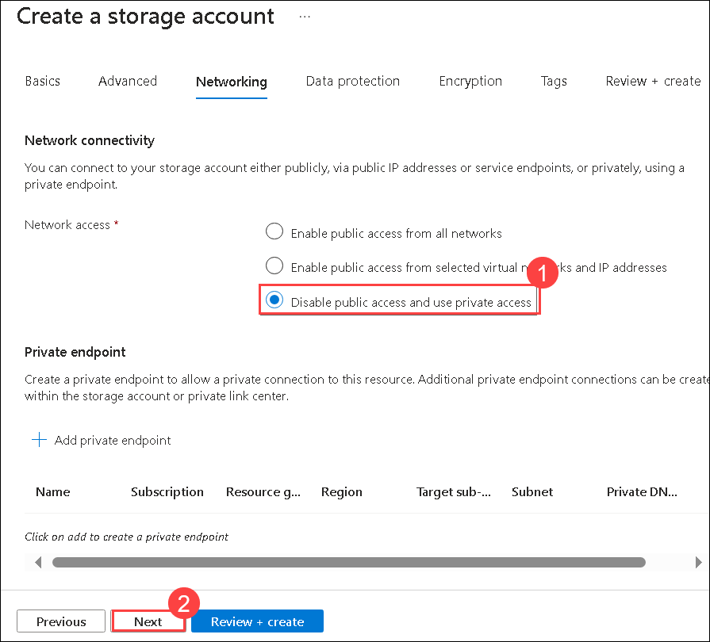

1. On the **Data protection** tab of the **Create a storage account** blade, review the available options and accept the defaults then click on **Next**. 

1. Review the **Encryption** tab. Notice the additional security options. Accept the defaults. Click **Review + Create**.

    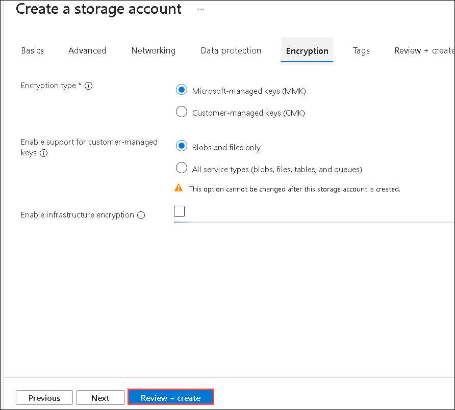

1. Wait for the validation process to complete. Then click on **Create**.

    >**Note**: Wait for the Storage account to be created. This should take about 2 minutes.

1. On the deployment blade, click **Go to resource** to display the Azure Storage account blade.

1. On the Storage account blade, in the **Data management** section, click **Redundancy (1)** and note the secondary location **(2)**. 

    

1. In the same blade **Redundancy (1)** drop-down list select **Locally redundant storage (LRS) (2)** and **Save (3)** the change. 

    

1. In the same blade note that, at this point, the Storage account has the **primary location**.

1. Select **Configuration (1)** blade under **Settings** section of the Storage account, set **Blob access tier (default)** to **Cool (2)**, and **Save (3)** the change.

    

    > **Note**: The cool access tier is optimal for data that is not accessed frequently.

1. Review the **Overview** blade and the additional configurations that can be changed. These are global settings for the storage account. Notice the storage account can be used for Blob containers, File shares, Queues, and Tables.

1. In the **Security + Networking** section, select **Networking (1)**. Notice **public network access is disabled**.

    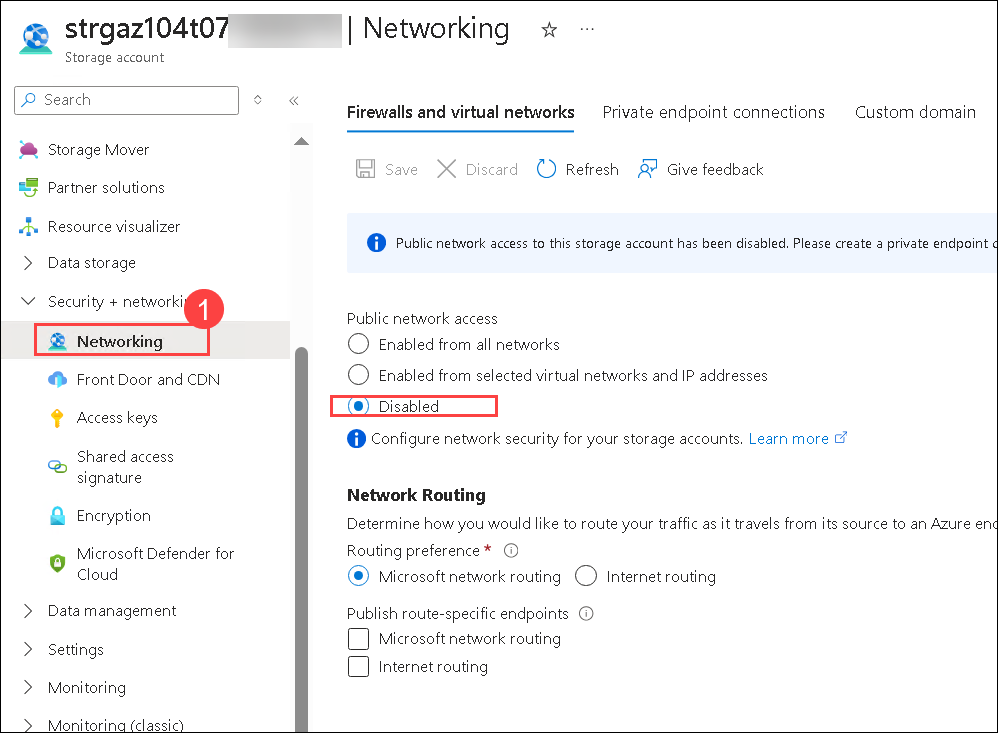

    + Change the **public access level** to **Enabled from all network (2)** and click on **Save (3)** to save your changes. 

      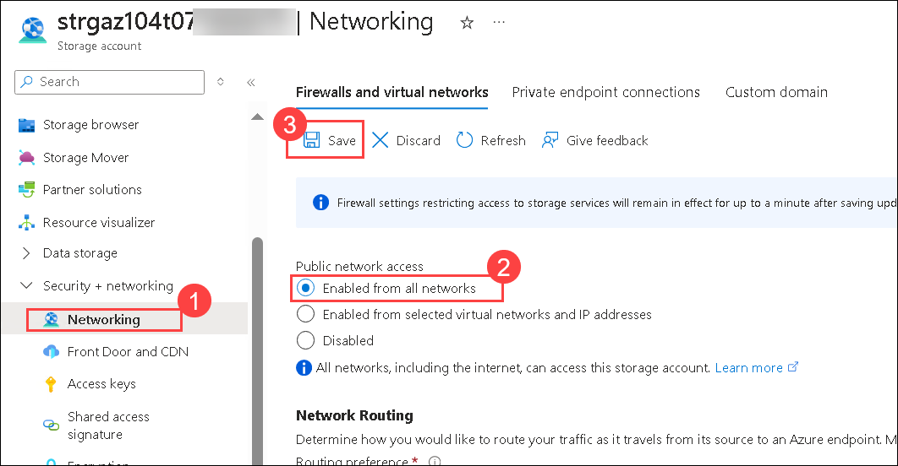    

1. In the **Data management** section, view the **Redundancy** blade. Notice the information about your primary data center locations.

1. In the **Data management** section, select **Lifecycle management (1)**, and then select **+ Add a rule (2)**.

    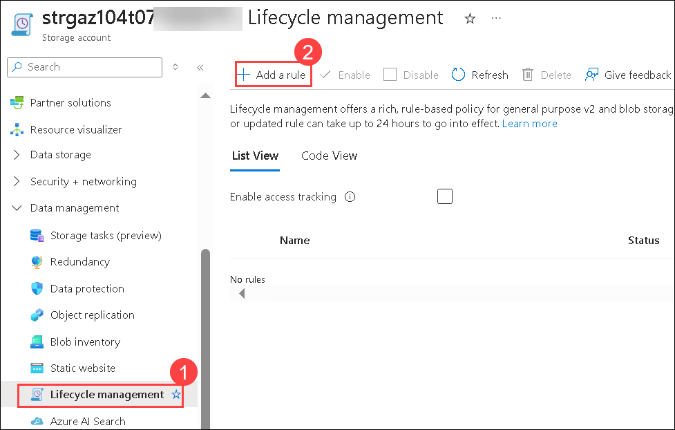

    + **Name** the rule `Movetocool` **(1)**. Notice your options for limiting the scope of the rule and then click on **Next (2)**.
  
      
    
    + On the **Base blobs** tab, *if* based blobs were last modified more than `30 days` ago **(1)** *then* **move to cool storage (2)**. Notice your other choices. Notice you can configure other conditions. Select **Add (3)** when you are done exploring.

      
      
   <validation step="3ca688fb-a039-486a-b051-61de572ea4eb" />
   
  > **Congratulations** on completing the task! Now, it's time to validate it. Here are the steps:
  > - Hit the Validate button for the corresponding task. If you receive a success message, you can proceed to the next task. 
  > - If not, carefully read the error message and retry the step, following the instructions in the lab guide.
  > - If you need any assistance, please contact us at cloudlabs-support@spektrasystems.com. We are available 24/7 to help

### Task 2: Create and configure secure blob storage

In this task, you will create a blob container and upload a blob into it.

### 2.1 Create a blob container and a time-based retention policy

1. On the Storage account blade, in the **Data storage** section, click **Containers (1)**. Click **+ Container (2)**.

    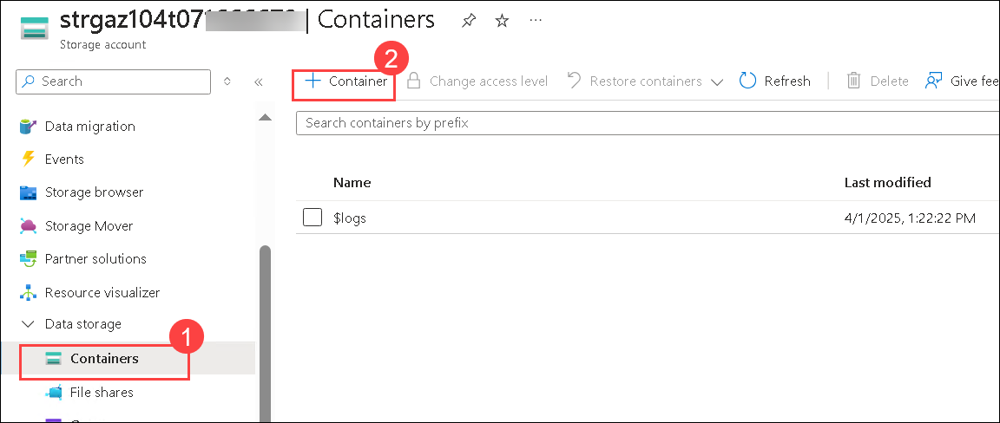

1. Create a container with the following settings and then click on **Create (3)**.

    | Setting | Value |
    | --- | --- |
    | Name | **az104-07-container (1)**  |
    | Public access level | **Private (no anonymous access) (2)** |

     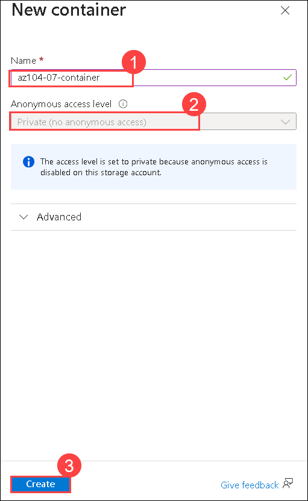

1. On your container, scroll to the **ellipsis (...) (1)** on the far right, select **Access Policy (2)**.

     

1. On the **Access policy** window under the **Immutable blob storage** area, select **Add policy**.

    | Setting | Value |
    | --- | --- |
    | Policy type | **Time-based retention (1)**  |
    | Set retention period for | `180` days **(2)** |
    | Select **Save (3)** |
   
     

## 2.2 Manage blob uploads

1. In the list of containers, select **az104-07-container**.

1. Click **Upload (1)** within the **Upload blob** pane, click on **Browse for files (2)**.

    

1. Browse to `C:\AllFiles\AZ-104-MicrosoftAzureAdministrator-Lab-Files\Allfiles\Labs\07` **(1)**, select **LICENSE (2)** on your lab computer and click **Open (3)**.

    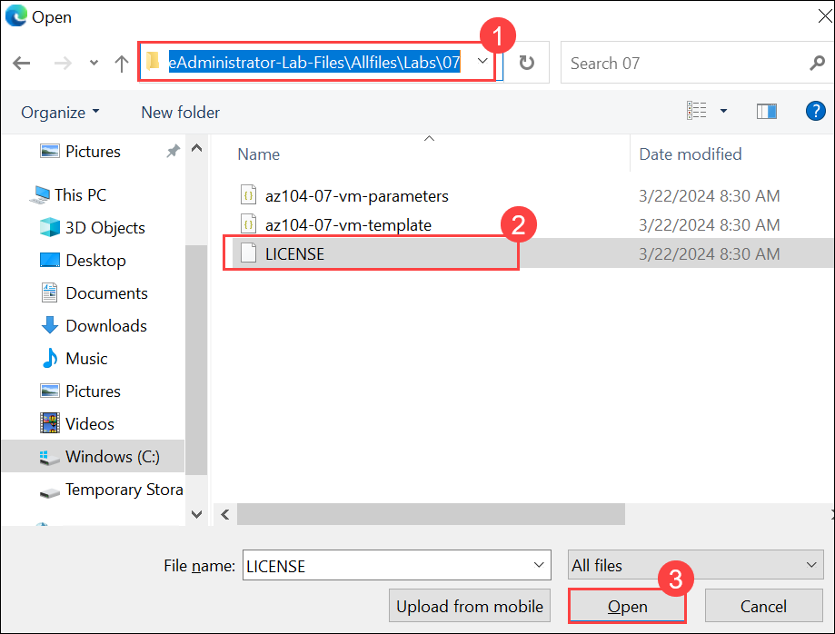

1. On the **Upload blob** blade, expand the **Advanced (1)** section and specify the following settings (leave others with their default values) and then click on **Upload (6)**:

    | Setting | Value |
    | --- | --- |
    | Blob type | **Block blob (2)** |
    | Block size | **4 MB (3)** |
    | Access tier | **Hot (4)** |
    | Upload to folder | **licenses (5)** |

    
   
    > **Note**: Access tier can be set for individual blobs.

    > **Note**: Note that the upload automatically created a subfolder named **licenses**.

1. Back on the **az104-07-container** blade, click **licenses**. 

1. Then click **LICENSE**.

1. On the **licenses/LICENSE (1)** blade, review the available options including **Download, Delete, Change tier, and Acquire lease (2)**.

    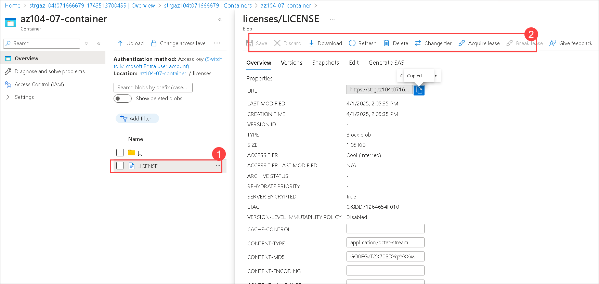

     > **Note**: You have the option to download the blob, change its access tier (it is currently set to **Hot**), and acquire a lease, which would change its lease status to **Locked** (it is currently set to **Unlocked**) and protect the blob from being modified or deleted, as well as assign custom metadata (by specifying an arbitrary key and value pairs). You also have the ability to **Edit** the file directly within the Azure portal interface, without downloading it first. You can also create snapshots, as well as generate a SAS token (you will explore this option in the next task).
     

1. On the **licenses/LICENSE (1)** blade, on the **Overview** tab, click the **Copy to clipboard (2)** button next to the **URL** entry.

    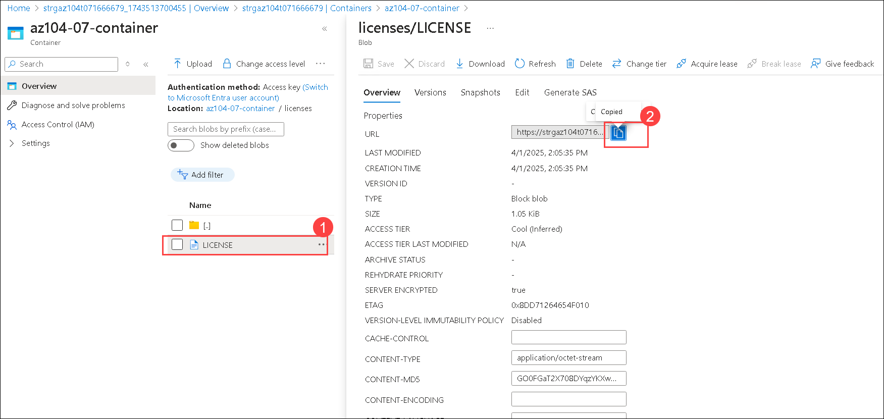

1. Open another browser window by using **InPrivate mode** by clicking the **ellipsis** **(1)** in the top-right corner of the lab VM's browser window and selecting the **New InPrivate Window (2)** option.

    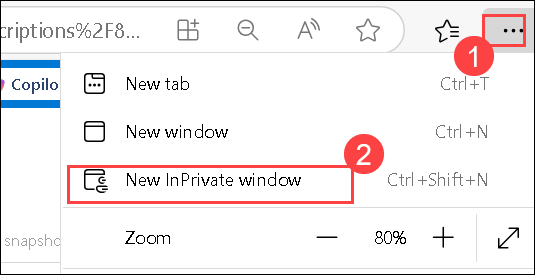

1. Navigate to the URL you copied in the previous step.

    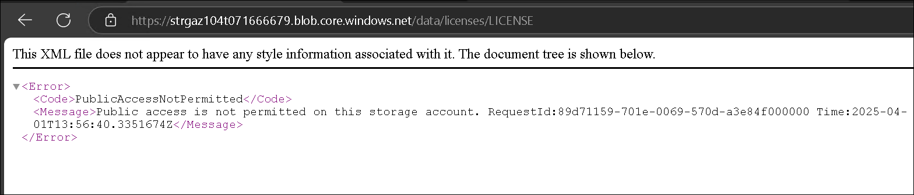

1. You should be presented with an XML-formatted message stating **ResourceNotFound** or **PublicAccessNotPermitted**.

    > **Note**: This is expected since the container you created has the public access level set to **Private (no anonymous access)**.

1. Close the InPrivate mode browser window, return to the browser window showing the **licenses/LICENSE** blade of the Azure Storage container, and switch to the **Generate SAS** tab.

    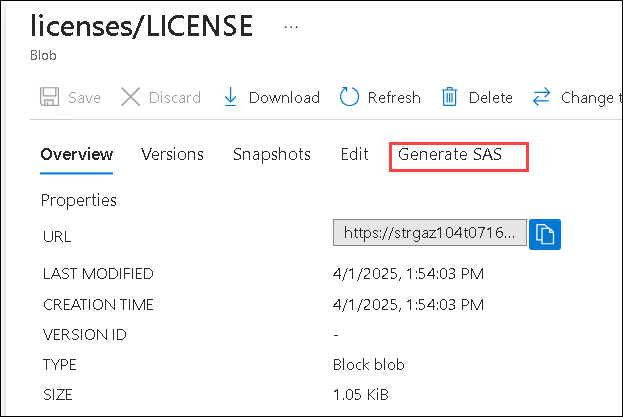

### 2.3 Configure limited access to the blob storage

1. On the **Generate SAS** tab of the **licenses/LICENSE** blade, specify the following settings (leave others with their default values) and then click **Generate SAS token and URL (5)**.

    | Setting | Value |
    | --- | --- |
    | Signing key | **Key 1 (1)** |
    | Permissions | **Read (2)** |
    | Start date | yesterday's date **(3)** |
    | Start time | current time **(3)** |
    | Expiry date | tomorrow's date **(3)** |
    | Expiry time | current time **(3)** |
    | Allowed IP addresses | leave blank **(4)** |

     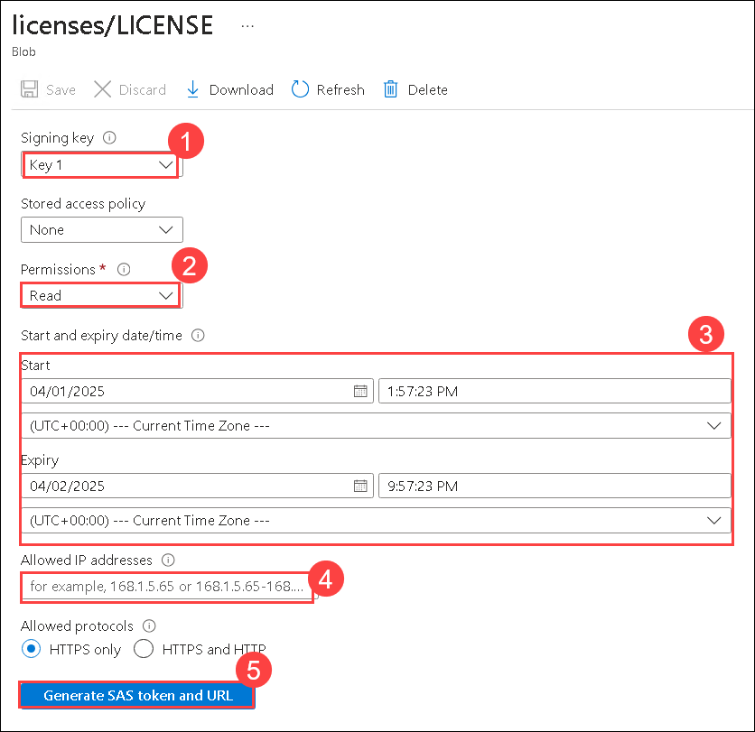

1. Click the **Copy to clipboard** button next to the **Blob SAS URL** entry (you need to scroll down).

    

1. Open another browser window by using InPrivate mode and navigate to the URL you copied in the previous step.

    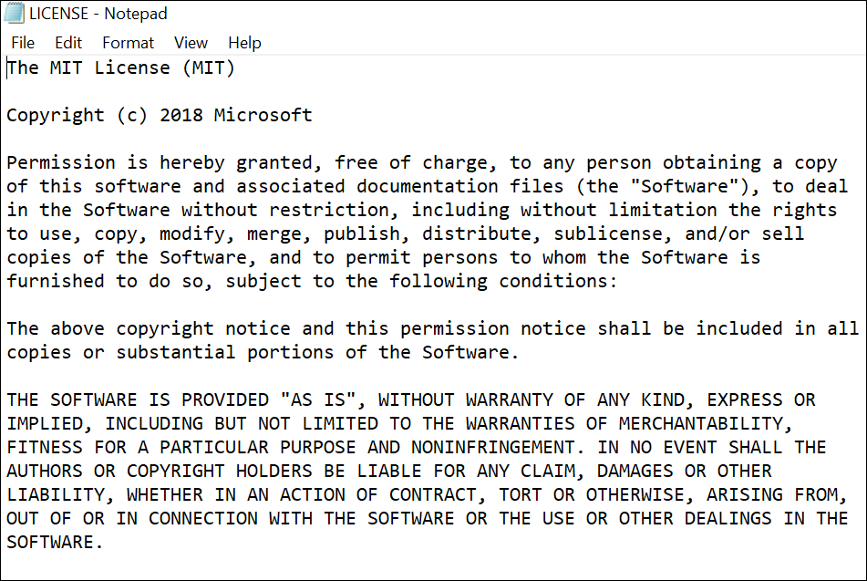

    > **Note**: You should be able to view the content of the file by downloading it and opening it with Notepad.

    > **Note**: This is expected since now your access is authorized based on the newly generated SAS token.

    > **Note**: Save the blob SAS URL. You will need it later in this lab.
    
   <validation step="a496ecfe-9c7a-4646-b2e2-44272cd82651" />
   
  > **Congratulations** on completing the task! Now, it's time to validate it. Here are the steps:
  > - Hit the Validate button for the corresponding task. If you receive a success message, you can proceed to the next task. 
  > - If not, carefully read the error message and retry the step, following the instructions in the lab guide.
  > - If you need any assistance, please contact us at cloudlabs-support@spektrasystems.com. We are available 24/7 to help

### Task 3: Create and configure an Azure File storage
In this task, you will create and configure Azure Files shares.

1. In the Azure portal, navigate back to the blade of the storage account you created in the task 2 of this lab and, in the **Data storage** section, click **File shares (1)**. Click **+ File share (2)**.

    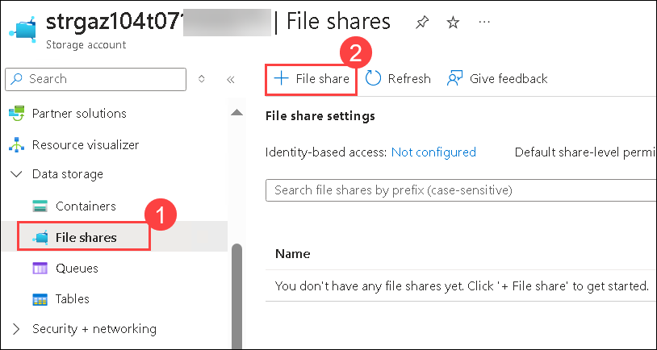

1. Create a file share with the following settings then click on **Next:Backup> (3)**

    | Setting | Value |
    | --- | --- |
    | Name | **az104-07-share (1)** |
    | Tier | **transaction optimized (2)** |

     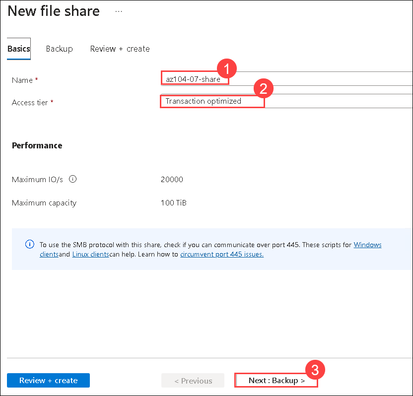    

1. In the Backup tab, uncheck **Enable backup** option and then click on **Review + Create** > **Create**.

    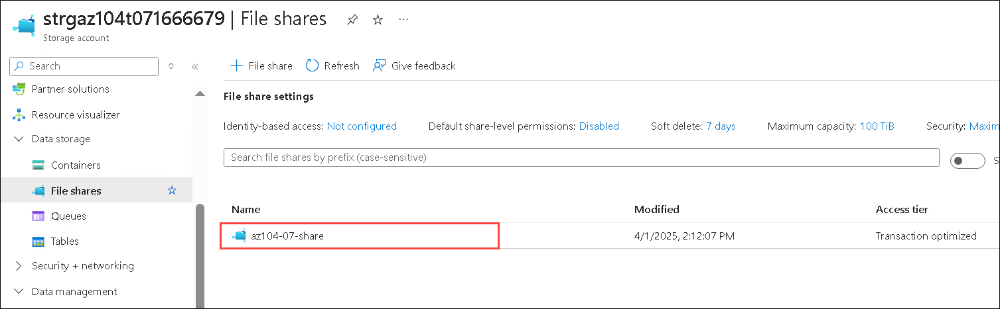

1. Click the newly created file share and note the information available on the **az104-07-share** blade.

### 3.1 Explore Storage Browser and upload a file

1. Return to your storage account and select **Storage Browser (1)**. The Azure Storage Browser is a portal tool that lets you quickly view all the storage services under your account.

1. Select **File shares (2)** and verify your **az104-07-share (3)** directory is present.

    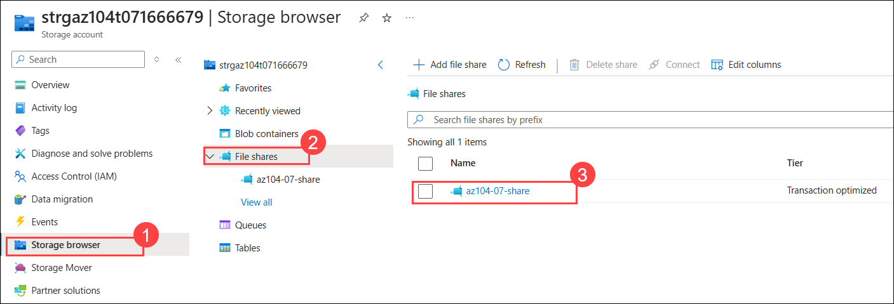

1. Select your **az104-07-share** directory, on the **Browse (1)**, notice you can **+ Add directory (2)**. This lets you create a folder structure. Provide name **az104-07-folder (3)** and click on **OK (4)**

    

1. Open file explorer, navigate to **Downloads (1)**, right click on empty space, click on **New (2)** -> **Text document (3)**.

    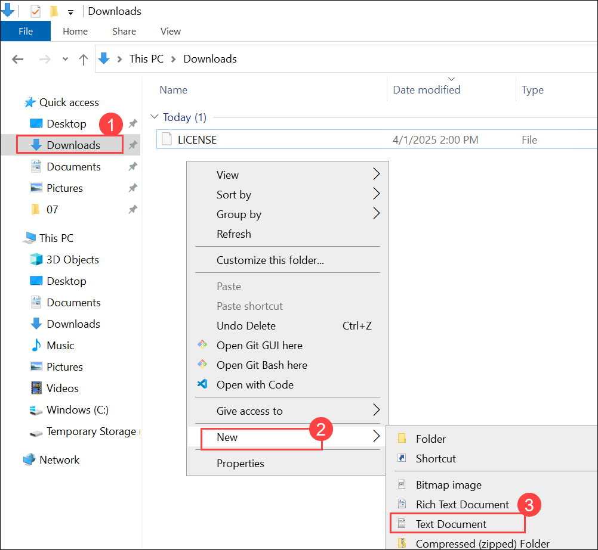

1. Create text document named **az104-07-file.txt** by naming the file as **az104-07-file**.

    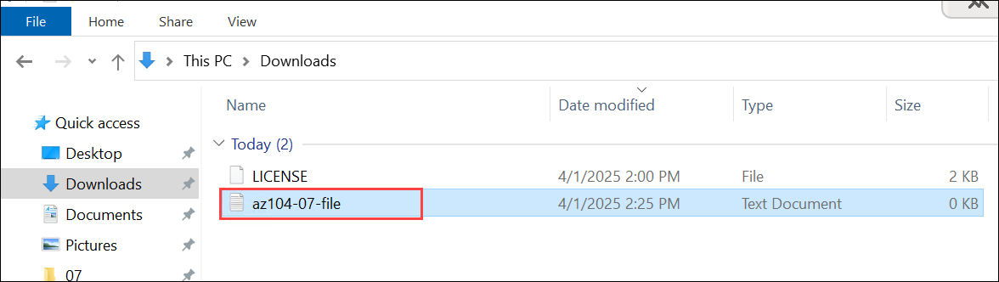

1. Navigate to File share and select **az104-07-share**.

1. Select **Upload**. click on **Browse to a file**.

1. Navigate to **Downloads (1)**, select **az104-07-file.txt (2)** and then click on **Open(3)**.

    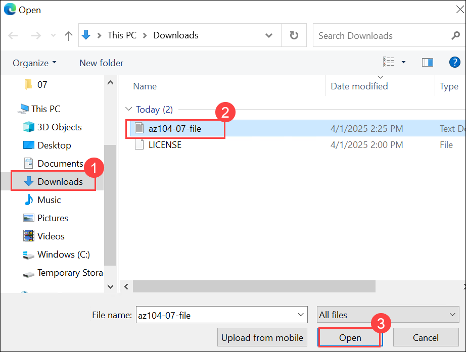

1. Then click **Upload**.

    >**Note**: You can view file shares and manage those shares in the Storage Browser. There are currently no restrictions.
    
   <validation step="106d497d-0f0a-4fdd-8b6c-51028d285557" />
   
  > **Congratulations** on completing the task! Now, it's time to validate it. Here are the steps:
  > - Hit the Validate button for the corresponding task. If you receive a success message, you can proceed to the next task. 
  > - If not, carefully read the error message and retry the step, following the instructions in the lab guide.
  > - If you need any assistance, please contact us at cloudlabs-support@spektrasystems.com. We are available 24/7 to help

### 3.2 Restrict network access to the storage account

1. In the portal, search for **Virtual networks (1)** and select **Virtual networks (2)**.

    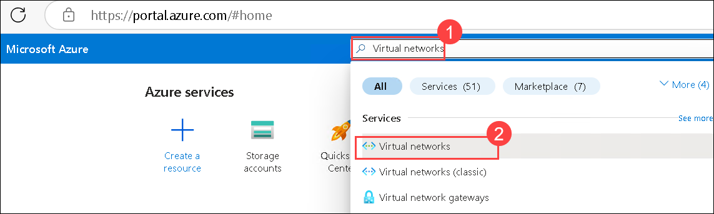

1. Select **+ Create**. 

1. On the create Virtual network page, provide the followinh=g details and then click on **Review + create (5)**.

    | Setting | Value |
    | --- | --- |
    | Subscription | Leave the default one **(1)** |
    | Resource group | Select **existing** resource group **az104-rg2 (2)** |
    | Virtual Network name | `vnet1` **(3)** |
    | Region | **<inject key="Region" enableCopy="false"/> (4)**  |
    
      

1. Then **Create**.

1. Wait for the virtual network to deploy, and then select **Go to resource**.

1. In the **Settings** section, select the **Service endpoints** blade, click on **+ Add (2)**.

    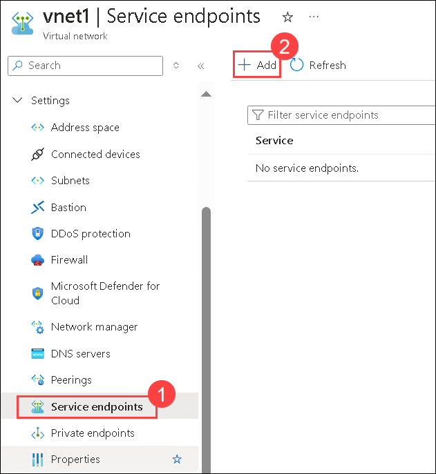

1. On the **Add Service Endpoint**, add the following details and then click on **Add (3)**

    + In the Services drop-down select **Microsoft.Storage** **(1)**
    + In the Subnets drop-down check the **Default** subnet **(2)**   

      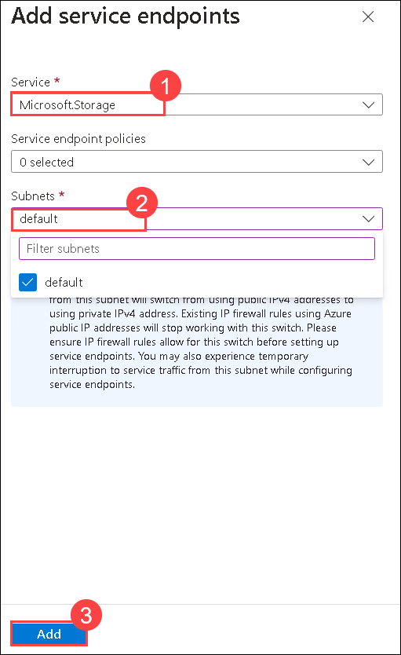    

1. Return to your **Storage account** named **strgaz104t07<inject key="DeploymentID" enableCopy="false" />**

1. In the **Security + networking** section, select the **Networking (1)** blade.

1. Under **Firewalls and virtual networks** tab, for **Public network access** select **Enabled from selected virtual networks and IP addresses (2)**. 

1. Select **+ Add existing virtual network (3)**.

    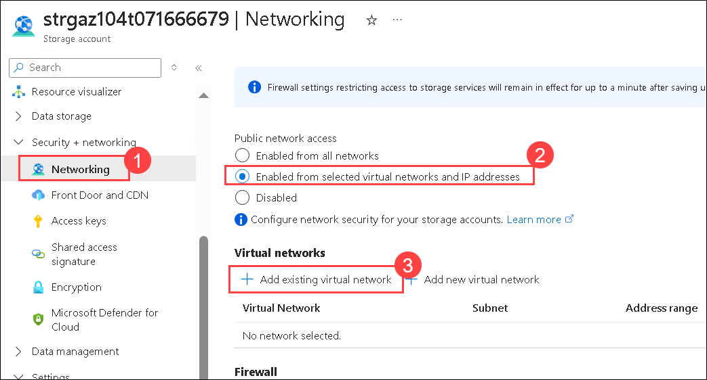

1. On the **Add network** page,  select **vnet1 (1)** and **default (2)** subnet, select **Add (3)**.

    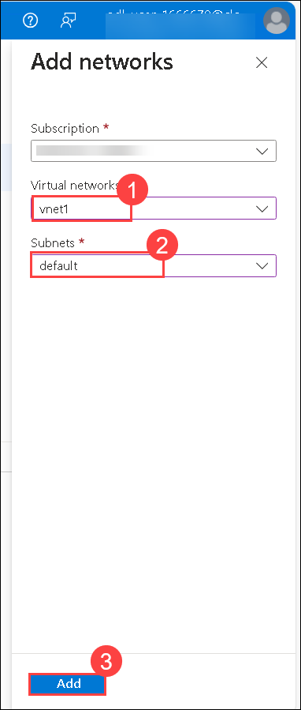

1. Be sure to **Save** your changes.

    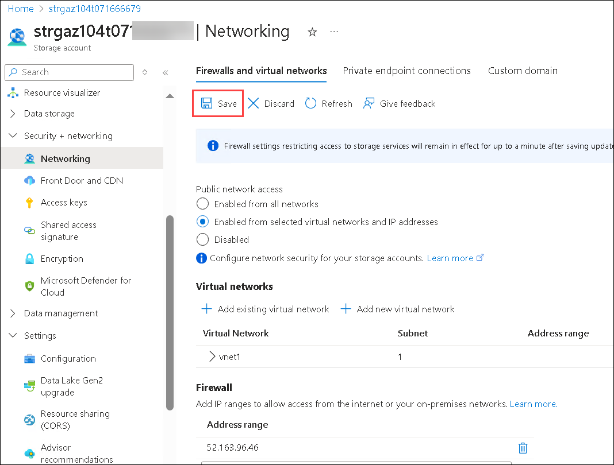

    >**Note:** The storage account should now only be accessed from the virtual network you just created. 

1. Return to your **Storage account** named **strgaz104t07<inject key="DeploymentID" enableCopy="false" />** and select the **Storage browser (1)** then expand **Blob containers** and select **az104-07-container (2)** and **Refresh** the page.  

    >**Note:** You should receive a message *not authorized to perform this operation*. You are not connecting from the virtual network. It may take a couple of minutes for this to take effect.

     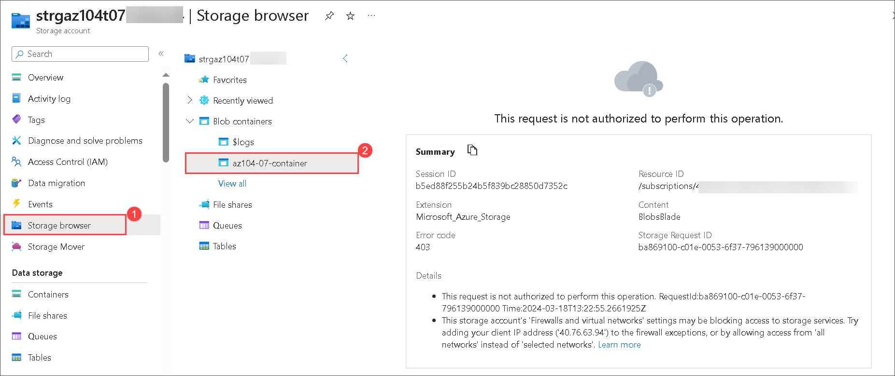
   
## Key takeaways

Congratulations on completing the lab. Here are the main takeaways for this lab. 

+ An Azure storage account contains all your Azure Storage data objects: blobs, files, queues, and tables. The storage account provides a unique namespace for your Azure Storage data that is accessible from anywhere in the world over HTTP or HTTPS.
+ Azure storage provides several redundancy models including Locally redundant storage (LRS), Zone-redundant storage (ZRS), and Geo-redundant storage (GRS). 
+ Azure blob storage allows you to store large amounts of unstructured data on Microsoft's data storage platform. Blob stands for Binary Large Object, which includes objects such as images and multimedia files.
+ Azure file Storage provides shared storage for structured data. The data can be organized in folders.
+ Immutable storage provides the capability to store data in a write once, read many (WORM) state. Immutable storage policies can be time-based or legal-hold.

## Learn more with self-paced training

+ [Optimize your cost with Azure Blob Storage](https://learn.microsoft.com/training/modules/optimize-your-cost-azure-blob-storage/). Learn how to optimize your cost with Azure Blob Storage.
+ [Control access to Azure Storage with shared access signatures](https://learn.microsoft.com/training/modules/control-access-to-azure-storage-with-sas/). Grant access to data stored in your Azure Storage accounts securely by using shared access signatures.

### Review
In this lab, you have completed:
- Create and configure a storage account. 
- Create and configure secure blob storage.
- Create and configure secure Azure file storage.

### You have successfully completed the lab
