# Lab 07 - Manage Azure Storage
## Lab scenario
You need to evaluate the use of Azure storage for storing files residing currently in on-premises data stores. While the majority of these files are not accessed frequently, there are some exceptions. You would like to minimize the cost of storage by placing less frequently accessed files in lower-priced storage tiers. You also plan to explore different protection mechanisms that Azure Storage offers, including network access, authentication, authorization, and replication. Finally, you want to determine to what extent Azure Files service might be suitable for hosting your on-premises file shares.

## Lab objectives
In this lab, you will complete the following tasks:
+ Task 1: Provision the lab environment
+ Task 2: Create and configure Azure Storage accounts
+ Task 3: Manage blob storage
+ Task 4: Manage authentication and authorization for Azure Storage
+ Task 5: Create and configure an Azure Files shares
+ Task 6: Manage network access for Azure Storage

## Estimated timing: 45 minutes

## Architecture diagram

  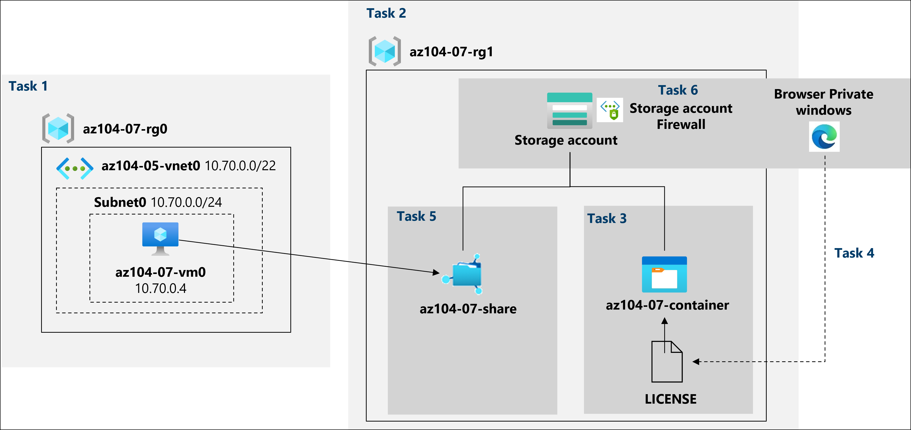

## Exercise 1

### Task 1: Create and configure Azure Storage accounts
In this task, you will create and configure an Azure Storage account.

1. In the Azure portal, search for and select **Storage accounts**. and then click **+ Create**.

    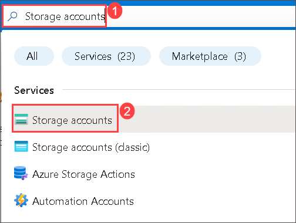

1. On **Storage accounts** blade, click **+ Create**.
   
1. On the **Basics** tab of the **Create storage account** blade, specify the following settings (leave others with their default values):

    | Setting | Value |
    | --- | --- |
    | Subscription | the name of the Azure subscription you are using in this lab |
    | Resource group | the name of an **existing** resource group **az104-07-rg1** |
    | Storage account name | **strgaz104t07<inject key="DeploymentID" enableCopy="false" />** |
    | Region | Same region as the Resource group  |
    | Performance | **Standard** |
    | Redundancy | **Geo-redundant storage (GRS)** |

1. Click **Next: Advanced >**, on the **Advanced** tab of the **Create a storage account** blade, review the available options, accept the defaults, and click **Next: Networking >**.

1. On the **Networking** tab of the **Create a storage account** blade, review the available options and select Disable public access and use private access under network access. Click **Next: Data protection >**.

1. On the **Data protection** tab of the **Create a storage account** blade, review the available options and accept the defaults. Click **Review + Create** and wait for the validation process to complete. Then click on **Create**.

    >**Note**: Wait for the Storage account to be created. This should take about 2 minutes.

1. On the deployment blade, click **Go to resource** to display the Azure Storage account blade.

1. On the Storage account blade, in the **Data management** section, click **Redundancy** and note the secondary location. 

1. In the same blade **Redundancy** drop-down list select **Locally redundant storage (LRS)** and save the change. 

    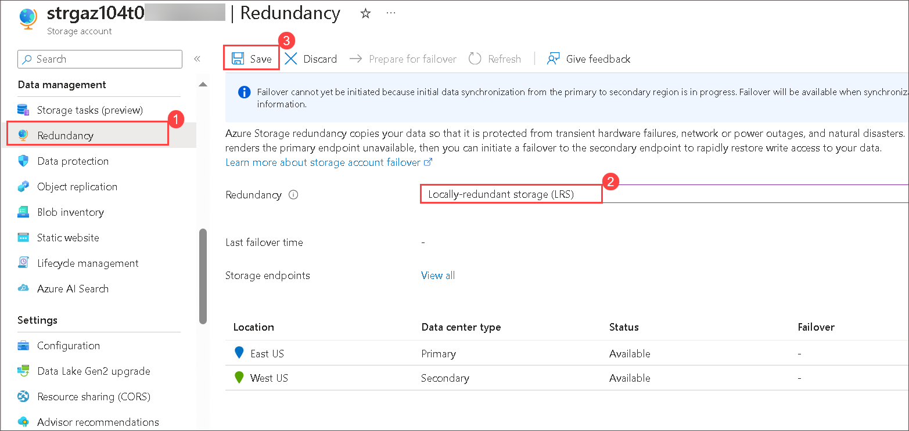

1. In the same blade note that, at this point, the Storage account has the primary location.

1. Select **Configuration** blade under **Settings** section of the Storage account, set **Blob access tier (default)** to **Cool**, and save the change.

    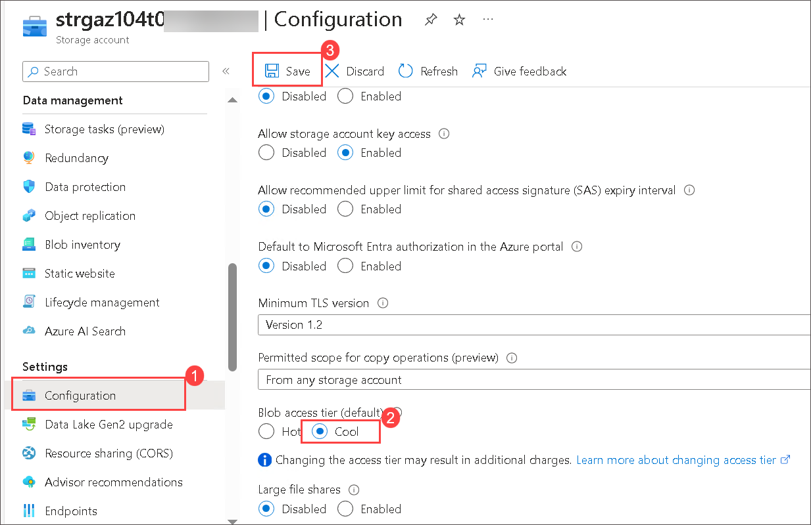

    > **Note**: The cool access tier is optimal for data that is not accessed frequently.

1. Review the **Overview** blade and the additional configurations that can be changed. These are global settings for the storage account. Notice the storage account can be used for Blob containers, File shares, Queues, and Tables.

1. In the **Security + Networking** section, select **Networking**. Notice public network access is disabled.

    + Change the **public access level** to **Enabled from selected virtual networks and IP addresses**.
    + In the **Firewall** section, check the box for **Add your client IP address.**
    + Be sure to **Save** your changes. 

     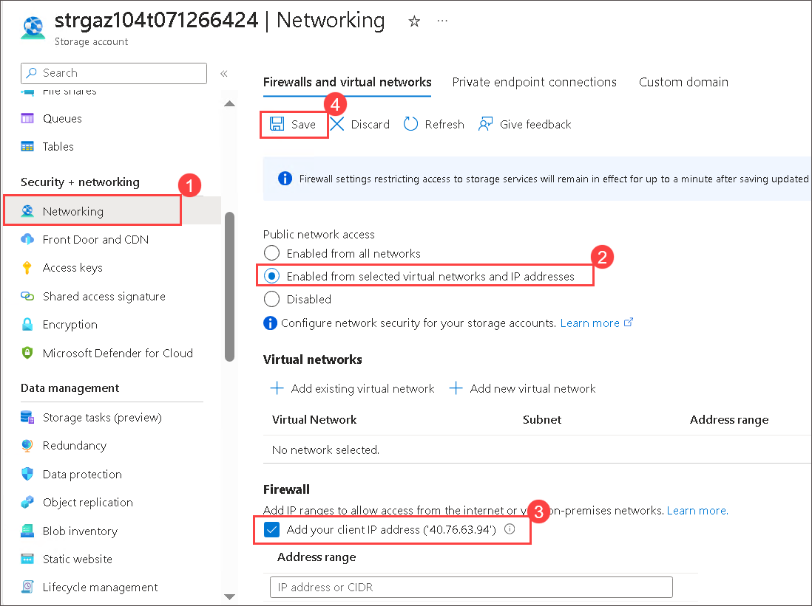
   
1. In the **Data management** section, view the **Redundancy** blade. Notice the information about your primary and secondary data center locations.

1. In the **Data management** section, select **Lifecycle management**, and then select **Add a rule**.

    + **Name** the rule `Movetocool`. Notice your options for limiting the scope of the rule.
  
      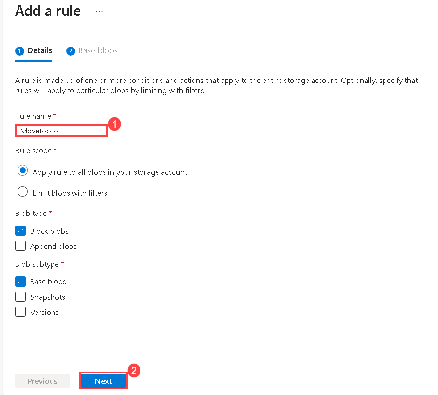
    
    + On the **Base blobs** tab, *if* based blobs were last modified more than `30 days` ago *then* **move to cool storage**. Notice your other choices. Notice you can configure other conditions. Select **Add** when you are done exploring.

      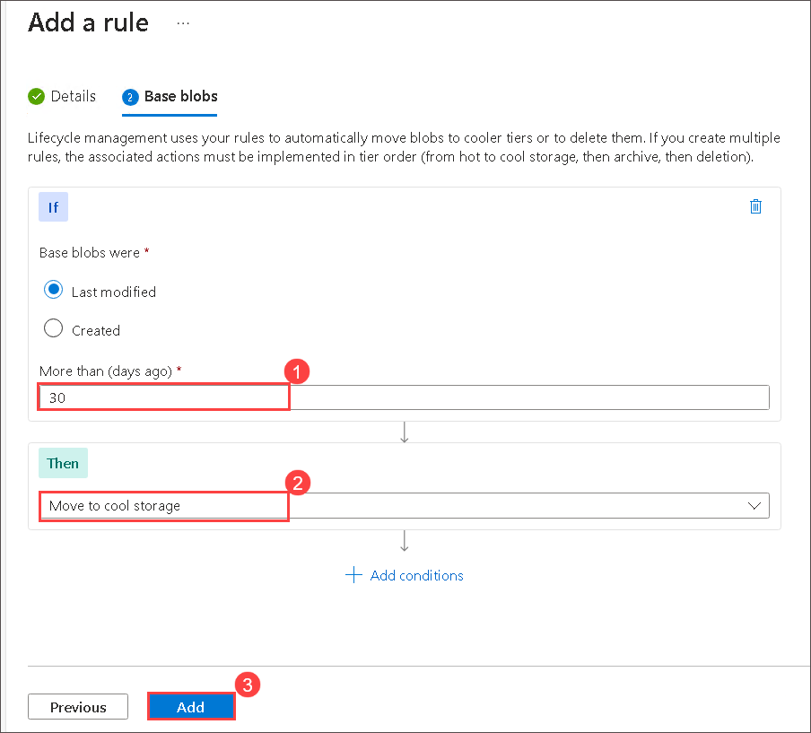
      
   > **Congratulations** on completing the task! Now, it's time to validate it. Here are the steps:
   > - Navigate to the Lab Validation Page, from the upper right corner in the lab guide section.
   > - Hit the Validate button for the corresponding task. If you receive a success message, you can proceed to the next task. 
   > - If not, carefully read the error message and retry the step, following the instructions in the lab guide.
   > - If you need any assistance, please contact us at labs-support@spektrasystems.com. We are available 24/7 to help you out.

### Task 2: Create and configure secure blob storage

In this task, you will create a blob container and upload a blob into it.

## Create a blob container and a time-based retention policy

1. On the Storage account blade, in the **Data storage** section, click **Containers**.

1. Click **+ Container** and create a container with the following settings:

    | Setting | Value |
    | --- | --- |
    | Name | **az104-07-container**  |
    | Public access level | **Private (no anonymous access)** |

1. Click **Create**.

1. On your container, scroll to the ellipsis (...) on the far right, select **Access Policy**.

     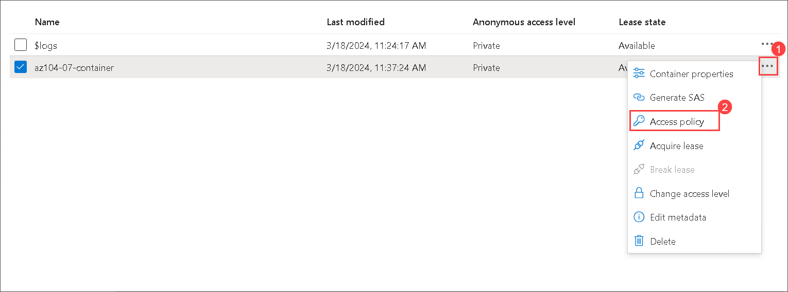

1. In the **Immutable blob storage** area, select **Add policy**.

    | Setting | Value |
    | --- | --- |
    | Policy type | **Time-based retention**  |
    | Set retention period for | `180` days |
    | Select **Save** |
   
     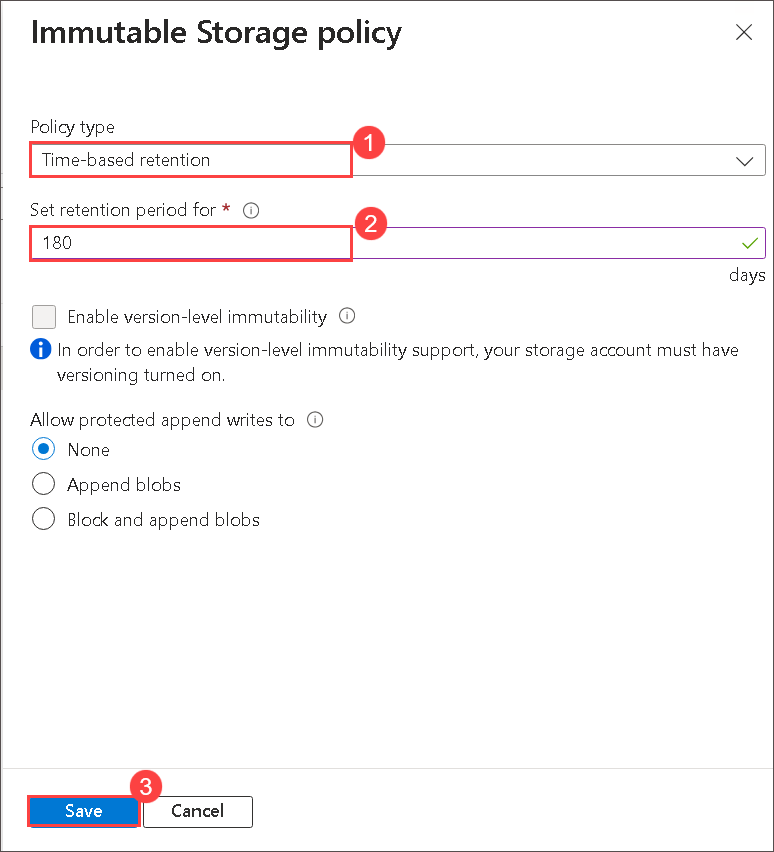

## Manage blob uploads

1. In the list of containers, select **az104-07-container** and click **Upload** within the **Upload blob** pane, click on **Browse for files**.

1. Browse to **C:\AllFiles\AZ-104-MicrosoftAzureAdministrator-master\Allfiles\Labs\07\\LICENSE** on your lab computer and click **Open**.

1. On the **Upload blob** blade, expand the **Advanced** section and specify the following settings (leave others with their default values):

    | Setting | Value |
    | --- | --- |
    | Blob type | **Block blob** |
    | Block size | **4 MB** |
    | Access tier | **Hot** |
    | Upload to folder | **licenses** |

    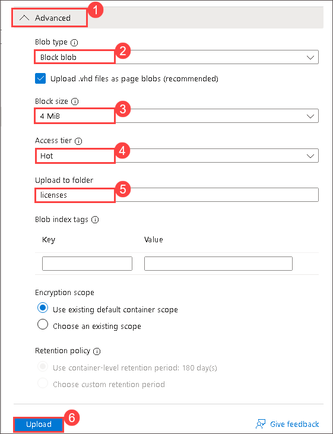
   
    > **Note**: Access tier can be set for individual blobs.

1. Click **Upload**.

    > **Note**: Note that the upload automatically created a subfolder named **licenses**.

1. Back on the **az104-07-container** blade, click **licenses** and then click **LICENSE**.

1. On the **licenses/LICENSE** blade, review the available options.

    > **Note**: You have the option to download the blob, change its access tier (it is currently set to **Hot**), and acquire a lease, which would change its lease status to **Locked** (it is currently set to **Unlocked**) and protect the blob from being modified or deleted, as well as assign custom metadata (by specifying an arbitrary key and value pairs). You also have the ability to **Edit** the file directly within the Azure portal interface, without downloading it first. You can also create snapshots, as well as generate a SAS token (you will explore this option in the next task).
     

1. On the **licenses/LICENSE** blade, on the **Overview** tab, click the **Copy to clipboard** button next to the **URL** entry.

1. Open another browser window by using InPrivate mode and navigate to the URL you copied in the previous step.

1. You should be presented with an XML-formatted message stating **ResourceNotFound** or **PublicAccessNotPermitted**.

    > **Note**: This is expected since the container you created has the public access level set to **Private (no anonymous access)**.

1. Close the InPrivate mode browser window, return to the browser window showing the **licenses/LICENSE** blade of the Azure Storage container, and switch to the **Generate SAS** tab.

> **Congratulations** on completing the task! Now, it's time to validate it. Here are the steps:
   > - Navigate to the Lab Validation Page, from the upper right corner in the lab guide section.
   > - Hit the Validate button for the corresponding task. If you receive a success message, you can proceed to the next task. 
   > - If not, carefully read the error message and retry the step, following the instructions in the lab guide.
   > - If you need any assistance, please contact us at labs-support@spektrasystems.com. We are available 24/7 to help you out.

### Task 3: Configure limited access to the blob storage

1. On the **Generate SAS** tab of the **licenses/LICENSE** blade, specify the following settings (leave others with their default values):

    | Setting | Value |
    | --- | --- |
    | Signing key | **Key 1** |
    | Permissions | **Read** |
    | Start date | yesterday's date |
    | Start time | current time |
    | Expiry date | tomorrow's date |
    | Expiry time | current time |
    | Allowed IP addresses | leave blank |

    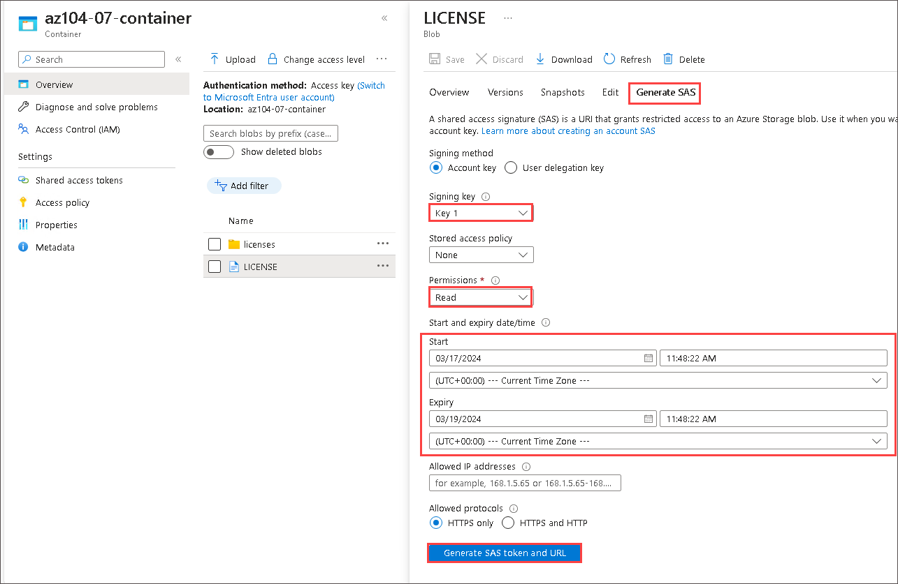
   
1. Click **Generate SAS token and URL**.

1. Click the **Copy to clipboard** button next to the **Blob SAS URL** entry.

    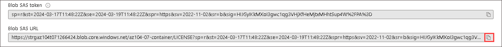

1. Open another browser window by using InPrivate mode and navigate to the URL you copied in the previous step.

    > **Note**: You should be able to view the content of the file by downloading it and opening it with Notepad.

    > **Note**: This is expected since now your access is authorized based on the newly generated SAS token.

    > **Note**: Save the blob SAS URL. You will need it later in this lab.
    
   > **Congratulations** on completing the task! Now, it's time to validate it. Here are the steps:
   > - Navigate to the Lab Validation Page, from the upper right corner in the lab guide section.
   > - Hit the Validate button for the corresponding task. If you receive a success message, you can proceed to the next task. 
   > - If not, carefully read the error message and retry the step, following the instructions in the lab guide.
   > - If you need any assistance, please contact us at labs-support@spektrasystems.com. We are available 24/7 to help you out.

### Task 3: Create and configure an Azure File storage
In this task, you will create and configure Azure Files shares.

1. In the Azure portal, navigate back to the blade of the storage account you created in the task 2 of this lab and, in the **Data storage** section, click **File shares**.

1. Click **+ File share** and create a file share with the following settings.

    | Setting | Value |
    | --- | --- |
    | Name | **az104-07-share** |
    | Tier | **transaction optimized** |

1. In the Backup tab, uncheck **Enable backup** option and then click on **Create**.

1. Click the newly created file share and note the information available on the **az104-07-share** blade.

### Explore Storage Browser and upload a file

1. Return to your storage account and select **Storage Browser**. The Azure Storage Browser is a portal tool that lets you quickly view all the storage services under your account.

1. Select **File shares** and verify your **az104-07-share** directory is present.

1. Select your **az104-07-share** directory and notice you can **+ Add directory**. This lets you create a folder structure. Provide name **az104-07-folder** and click on **OK**

    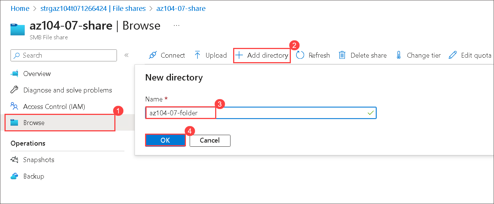

1. Open file explorer and create text document named **az104-07-file.txt**.

1. Navigate to File share and select **az104-07-share**.

1. Select **Upload**. Browse to a file **az104-07-file.txt**, and then click **Upload**.

    >**Note**: You can view file shares and manage those shares in the Storage Browser. There are currently no restrictions.

1. Click **az104-07-folder** and verify that **az104-07-file.txt** appears in the list of files.
    
   > **Congratulations** on completing the task! Now, it's time to validate it. Here are the steps:
   > - Navigate to the Lab Validation Page, from the upper right corner in the lab guide section.
   > - Hit the Validate button for the corresponding task. If you receive a success message, you can proceed to the next task. 
   > - If not, carefully read the error message and retry the step, following the instructions in the lab guide.
   > - If you need any assistance, please contact us at labs-support@spektrasystems.com. We are available 24/7 to help you out.

### Restrict network access to the storage account

1. In the portal, search for and select **Virtual networks**.

1. Select **+ Create**. Select your resource group. and give the virtual network a **name**, `vnet1`.

1. Take the defaults for other parameters, select **Review + create**, and then **Create**.

1. Wait for the virtual network to deploy, and then select **Go to resource**.

1. In the **Settings** section, select the **Subnets** blade.
    + Select the **default** subnet.
    + In the **Service endpoints** section choose **Microsoft.Storage** in the **Services** drop-down.
    + Do not make any other changes.    
    + Be sure to **Save** your changes. 

1. Return to your storage account.

1. In the **Security + networking** section, select the **Networking** blade.

1. Select **add existing virtual network** and select **vnet1** and **default** subnet, select **Add**.

1. In the **Firewall** section, **Delete** your machine IP address. Allowed traffic should only come from the virtual network. 

1. Be sure to **Save** your changes.

    >**Note:** The storage account should now only be accessed from the virtual network you just created. 

1. Select the **Storage browser** and **Refresh** the page. Navigate to your file share or blob content.  

    >**Note:** You should receive a message *not authorized to perform this operation*. You are not connecting from the virtual network. It may take a couple of minutes for this to take effect.

### Review
In this lab, you have completed:
- Provisioned the lab environment
- Created and configured Azure Storage accounts
- Managed blob storage
- Managed authentication and authorization for Azure Storage
- Created and configured Azure Files shares
- Managed network access for Azure Storage

### You have successfully completed the lab
