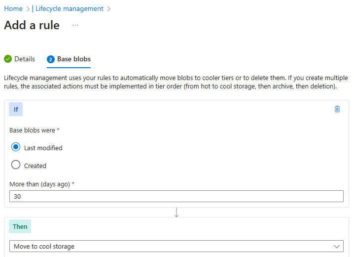

---
lab:
    title: 'Lab 07: Manage Azure storage'
    module: 'Administer Azure Storage'
---

# Lab 07 - Manage Azure Storage

## Lab introduction

In this lab you learn to create storage accounts for Azure blobs and Azure files. You learn to configure and secure blob containers. You also learn to use Storage Browser to configure and secure Azure file shares. 

This lab requires an Azure subscription. Your subscription type may affect the availability of features in this lab. You may change the region, but the steps are written using **East US**.

## Estimated timing: 50 minutes

## Lab scenario

Your organization is currently storing data in on-premises data stores. Most of these files are not accessed frequently. You would like to minimize the cost of storage by placing infrequently accessed files in lower-priced storage tiers. You also plan to explore different protection mechanisms that Azure Storage offers, including network access, authentication, authorization, and replication. Finally, you want to determine to what extent Azure Files is suitable for hosting your on-premises file shares.

## Interactive lab simulations

There are interactive lab simulations that you might find useful for this topic. The simulation lets you to click through a similar scenario at your own pace. There are differences between the interactive simulation and this lab, but many of the core concepts are the same. An Azure subscription is not required. 

+ [Create blob storage](https://mslearn.cloudguides.com/en-us/guides/AZ-900%20Exam%20Guide%20-%20Azure%20Fundamentals%20Exercise%205). Create a storage account, manage blob storage, and monitor storage activities. 
  
+ [Manage Azure storage](https://mslabs.cloudguides.com/guides/AZ-104%20Exam%20Guide%20-%20Microsoft%20Azure%20Administrator%20Exercise%2011). Create a storage account and review the configuration. Manage blob storage containers. Configure storage networking. 

## Architecture diagram

## Job skills

+ Task 1: Create and configure a storage account. 
+ Task 2: Create and configure secure blob storage.
+ Task 3: Create and configure secure Azure file storage.

## Task 1: Create and configure a storage account. 

In this task, you will create and configure a storage account. The storage account will use geo-redundant storage and will not have public access. 

1. Sign in to the **Azure portal** - `https://portal.azure.com`.

1. Search for and select `Storage accounts`, and then click **+ Create**.

1. On the **Basics** tab of the **Create a storage account** blade, specify the following settings (leave others with their default values):

    | Setting | Value |
    | --- | --- |
    | Subscription          | the name of your Azure subscription  |
    | Resource group        | **az104-rg7** (create new) |
    | Storage account name  | any globally unique name between 3 and 24 in length consisting of letters and digits |
    | Region                | **(US) East US**  |
    | Performance           | **Standard** (notice the Premium option) |
    | Redundancy            | **Geo-redundant storage** (notice the other options)|
    | Make read access to data in the event of regional availability | Check the box |

>**Did you know?** You should use the Standard performance tier for most applications. Use the Premium performance tier for enterprise or high-performance applications. 

1. On the **Advanced** tab, use the informational icons to learn more about the choices. Take the defaults. 

1. On the **Networking** tab, review the available options, select **Disable public access and use private access.**.

1. Review the **Data protection** tab. Notice 7 days is the default soft delete retention policy. Note you can enable blob versioning. Accept the defaults.

1. Review the **Encryption** tab. Notice the additional security options. Accept the defaults.

1. Select **Review**, wait for the validation process to complete, and then click **Create**.

1. Once the storage account is deployed, select **Go to resource**.

1. Review the **Overview** blade and the additional configurations that can be changed. These are global settings for the storage account. Notice the storage account can be used for Blob containers, File shares, Queues, and Tables.

1. In the **Security + Networking** section, select **Networking**. Notice public network access is disabled.

    + Change the **public access level** to **Enabled from selected virtual networks and IP addresses**.
    + In the **Firewall** section, check the box for **Add your client IP address.**
    + Be sure to **Save** your changes. 
  
1. In the **Data management** section, view the **Redundancy** blade. Notice the information about your primary and secondary data center locations.

1. In the **Data management** section, select **Lifecycle management**, and then select **Add a rule**.

    + **Name** the rule `Movetocool`. Notice your options for limiting the scope of the rule.
    
    + On the **Base blobs** tab, *if* based blobs were last modified more than `30 days` ago *then* **move to cool storage**. Notice your other choices. 
    
    + Notice you can configure other conditions. Select **Add** when you are done exploring.

    

## Task 2: Create and configure secure blob storage

In this task, you will create a blob container and upload an image. Blob containers are directory-like structures that store unstructured data.

### Create a blob container and a time-based retention policy

1. Continue in the Azure portal, working with your storage account.

1. In the **Data storage** section, click **Containers**. 

1. Click **+ Container** and **Create** a container with the following settings:

    | Setting | Value |
    | --- | --- |
    | Name | `data`  |
    | Public access level | Notice the access level is set to private |

    

1. On your container, scroll to the ellipsis (...) on the far right, select **Access Policy**.

1. In the **Immutable blob storage** area, select **Add policy**.

    | Setting | Value |
    | --- | --- |
    | Policy type | **Time-based retention**  |
    | Set retention period for | `180` days |

1. Select **Save**.

### Manage blob uploads

1. Return to the containers page, select your **data** container and then click **Upload**.

1. On the **Upload blob** blade, expand the **Advanced** section.

    >**Note**: Locate a file to upload. This can be any type of file, but a small file is best. A sample file can be downloaded from the AllFiles directory. 

    | Setting | Value |
    | --- | --- |
    | Browse for files | add the file you have selected to upload |
    | Select **Advanced** | |
    | Blob type | **Block blob** |
    | Block size | **4 MiB** |
    | Access tier | **Hot**  (notice the other options) |
    | Upload to folder | `securitytest` |
    | Encryption scope | Use existing default container scope |

1. Click **Upload**.

1. Confirm you have a new folder, and your file was uploaded. 

1. Select your upload file and review the options including **Download**, **Delete**, **Change tier**, and **Acquire lease**.

1. Copy the file **URL** and paste into a new **Inprivate** browsing window.

1. You should be presented with an XML-formatted message stating **ResourceNotFound** or **PublicAccessNotPermitted**.

    > **Note**: This is expected, since the container you created has the public access level set to **Private (no anonymous access)**.

### Configure limited access to the blob storage

1. Select your uploaded file and then on the **Generate SAS** tab. You can also use the ellipsis (...) to the far right. Specify the following settings (leave others with their default values):

    | Setting | Value |
    | --- | --- |
    | Signing key | **Key 1** |
    | Permissions | **Read** (notice your other choices) |
    | Start date | yesterday's date |
    | Start time | current time |
    | Expiry date | tomorrow's date |
    | Expiry time | current time |
    | Allowed IP addresses | leave blank |

1. Click **Generate SAS token and URL**.

1. Copy the **Blob SAS URL** entry to the clipboard.

1. Open another InPrivate browser window and navigate to the Blob SAS URL you copied in the previous step.

    >**Note**: You should be able to view the content of the file. 

## Task 3: Create and configure an Azure File storage

In this task, you will create and configure Azure File shares. You will use Storage Browser to manage the file share. 

### Create the file share and upload a file

1. In the Azure portal, navigate back to your storage account, in the **Data storage** section, click **File shares**.

1. Click **+ File share** and on the **Basics** tab give the file share a name, `share1`. 

1. Notice the **Tier** options. Keep the default **Transaction optimized**.
   
1. Move to the **Backup** tab and ensure **Enable Backup** is **not** checked. We are disabling backup to simplify the lab configuration.

1. Click **Review + create**, and then **Create**. Wait for the file share to deploy.

    

### Explore Storage Browser and upload a file

1. Return to your storage account and select **Storage Browser**. The Azure Storage Browser is a portal tool that lets you quickly view all the storage services under your account.

1. Select **File shares** and verify your **share1** directory is present.

1. Select your **share1** directory and notice you can **+ Add directory**. This lets you create a folder structure.

1. Select **Upload**. Browse to a file of your choice, and then click **Upload**.

    >**Note**: You can view file shares and manage those shares in the Storage Browser. There are currently no restrictions.

### Restrict network access to the storage account

1. In the portal, search for and select **Virtual networks**.

1. Select **+ Create**. Select your resource group. and give the virtual network a **name**, `vnet1`.

1. Take the defaults for other parameters, select **Review + create**, and then **Create**.

1. Wait for the virtual network to deploy, and then select **Go to resource**.

1. In the **Settings** section, select the **Subnets** blade.
    + Select the **default** subnet.
    + In the **Service endpoints** section choose **Microsoft.Storage** in the **Services** drop-down.
    + Do not make any other changes.    
    + Be sure to **Save** your changes. 

1. Return to your storage account.

1. In the **Security + networking** section, select the **Networking** blade.

1. Select **add existing virtual network** and select **vnet1** and **default** subnet, select **Add**.

1. In the **Firewall** section, **Delete** your machine IP address. Allowed traffic should only come from the virtual network. 

1. Be sure to **Save** your changes.

    >**Note:** The storage account should now only be accessed from the virtual network you just created. 

1. Select the **Storage browser** and **Refresh** the page. Navigate to your file share or blob content.  

    >**Note:** You should receive a message *not authorized to perform this operation*. You are not connecting from the virtual network. It may take a couple of minutes for this to take effect.

## Cleanup your resources

If you are working with **your own subscription** take a minute to delete the lab resources. This will ensure resources are freed up and cost is minimized. The easiest way to delete the lab resources is to delete the lab resource group. 

+ In the Azure portal, select the resource group, select **Delete the resource group**, **Enter resource group name**, and then click **Delete**.
+ Using Azure PowerShell, `Remove-AzResourceGroup -Name resourceGroupName`.
+ Using the CLI, `az group delete --name resourceGroupName`.

## Key takeaways

Congratulations on completing the lab. Here are the main takeaways for this lab. 

+ An Azure storage account contains all your Azure Storage data objects: blobs, files, queues, and tables. The storage account provides a unique namespace for your Azure Storage data that is accessible from anywhere in the world over HTTP or HTTPS.
+ Azure storage provides several redundancy models including Locally redundant storage (LRS), Zone-redundant storage (ZRS), and Geo-redundant storage (GRS). 
+ Azure blob storage allows you to store large amounts of unstructured data on Microsoft's data storage platform. Blob stands for Binary Large Object, which includes objects such as images and multimedia files.
+ Azure file Storage provides shared storage for structured data. The data can be organized in folders.
+ Immutable storage provides the capability to store data in a write once, read many (WORM) state. Immutable storage policies can be time-based or legal-hold.

## Learn more with self-paced training

+ [Optimize your cost with Azure Blob Storage](https://learn.microsoft.com/training/modules/optimize-your-cost-azure-blob-storage/). Learn how to optimize your cost with Azure Blob Storage.
+ [Control access to Azure Storage with shared access signatures](https://learn.microsoft.com/training/modules/control-access-to-azure-storage-with-sas/). Grant access to data stored in your Azure Storage accounts securely by using shared access signatures.
