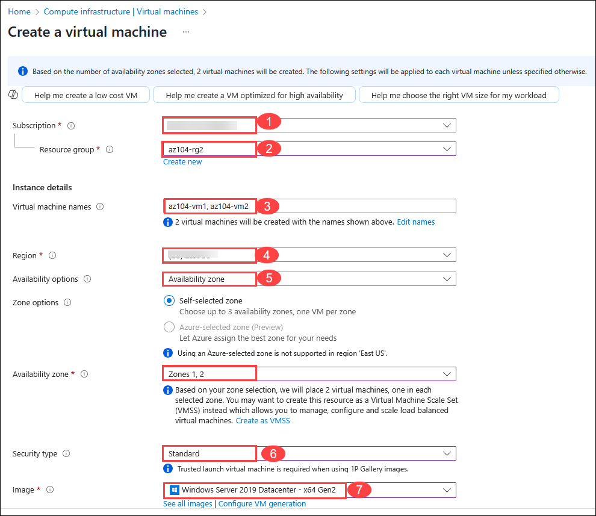
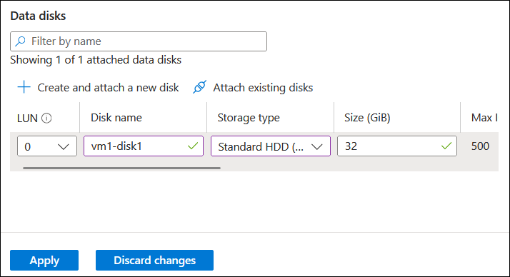
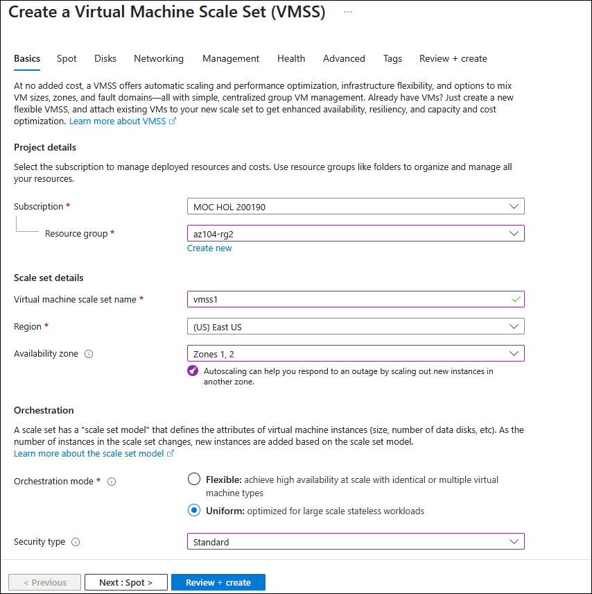
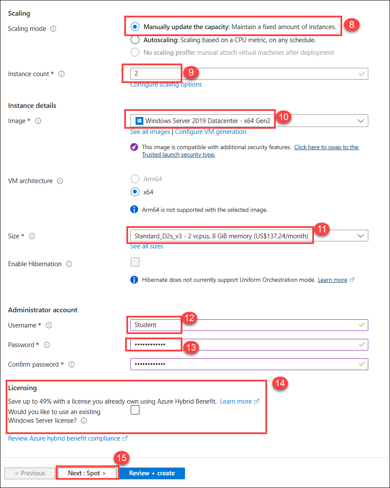
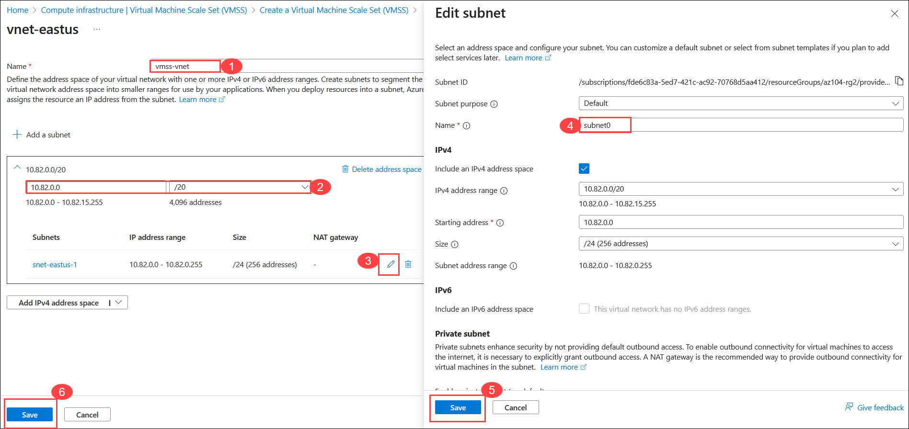
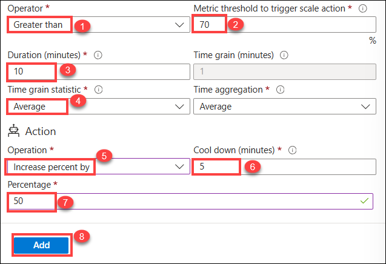
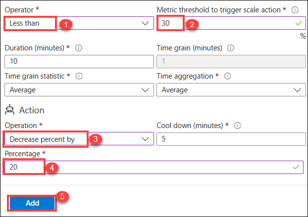

# Lab 08 - Manage Virtual Machines

## Lab Overview

This lab focuses on deploying scalable and high-availability applications in Azure using Virtual Machines (VMs) and Virtual Machine Scale Sets (VMSS).

## Lab objectives
In this lab, you will complete the following tasks:

+ Task 1: Deploy zone-resilient Azure virtual machines by using the Azure portal.
+ Task 2: Manage compute and storage scaling for virtual machines.
+ Task 3: Create and configure Azure Virtual Machine Scale Sets.
+ Task 4: Scale Azure Virtual Machine Scale Sets.
+ Task 5: Create a virtual machine using Azure PowerShell (optional 1).
+ Task 6: Create a virtual machine using the CLI (optional 2).

## Exercise 1: Manage Virtual Machines

In this exercise, you will manage Virtual Machines in Azure to deploy, configure, and maintain scalable and secure cloud-based infrastructure.

### Task 1: Deploy zone-resilient Azure virtual machines by using the Azure portal 

In this task, you will deploy two Azure virtual machines into different availability zones by using the Azure portal. Availability zones offer the highest level of uptime SLA for virtual machines at 99.99%. To achieve this SLA, you must deploy at least two virtual machines across different availability zones.

1. In the Azure portal, search and select `Virtual machines`, on the **Virtual machines** blade, click **+ Create**, and then select in the drop-down **+ Azure virtual machine**. Notice your other choices.

   

1. On the **Basics** tab, in the **Availability zone** drop down menu, place a checkmark next to **Zone 2**. This should select both **Zone 1** and **Zone 2**.

    

   >**Note**: This will deploy two virtual machines in the selected region, one in each zone. You achieve the 99.99% uptime SLA because you have at least two VMs 
    distributed across at least two zones. In the scenario where you might only need one VM, it is a best practice to still deploy the VM to another zone.
     
1. On the **Basics** tab of the **Create a virtual machine** blade, specify the following settings (leave others with their default values):

    | Setting | Value |
    | --- | --- |
    | Subscription | the name of the Azure subscription you will be using in this lab  (1)**|
    | Resource group | select the existing resource group **az104-rg2 (2)** |
    | Virtual machine name | `az104-vm1` and `az104-vm2` (After selecting both availability zones, select **Edit names** under the VM name field.) **(3)**|
    | Region | **<inject key="Region" enableCopy="false" /> (4)** |
    | Availability options | **Availability zone(5)**|
    | Availability zone | **Zone 1, 2** (read the note about using virtual machine scale sets)   |
    | Security type | **Standard (6)** |
    | Image | **Windows Server 2019 Datacenter - Gen2  (7)**|
    | Run Azure Spot discount | **Unchecked (8)**|
    | Size | **Standard D2s v3 (9)**|
    | Username | **Student** (10)** |
    | Password | **Password.1!! (11)** |
    | Public inbound ports | **None (12)** |
    | Would you like to use an existing Windows Server license? | **Unchecked (13)**|

     

     

1. Click **Next: Disks >** and, on the **Disks** tab of the **Create a virtual machine** blade, specify the following settings (leave others with their default values):

    | Setting | Value |
    | --- | --- |
    | OS disk type | **Premium SSD** |
    | Delete with VM | **checked** (default) |
    | Enable Ultra Disk compatibility | **Unchecked** |

1.  Click **Next: Networking >** take the defaults but do not provide a load balancer.

    | Setting | Value |
    | --- | --- |
    | Delete public IP and NIC when VM is deleted | **Checked** |
    | Load balancing options | **None** |

1. Click **Next: Management >** and specify the following settings (leave others with their default values):

    | Setting | Value |
    | --- | --- |
    | Patch orchestration options | **Azure orchestrated** |  
   
1. Click **Next: Monitoring >** and specify the following settings (leave others with their default values):

    | Setting | Value |
    | --- | --- |
    | Boot diagnostics | **Disable** |

1. Click **Next: Advanced >**, take the defaults, then click **Review + Create**.

1. After the validation, click **Create**.

    >**Note:** Notice as the virtual machine deploys the NIC, disk, and public IP address (if configured) are independently created and managed resources.

1. Wait for the deployment to complete, then select **Go to resource**.

   >**Note:** Monitor the **Notification** messages.
   
   <validation step="5059b9da-97ca-432c-af5d-63673672f09f" />
   
  > **Congratulations** on completing the task! Now, it's time to validate it. Here are the steps:
  > - Hit the Validate button for the corresponding task. If you receive a success message, you can proceed to the next task. 
  > - If not, carefully read the error message and retry the step, following the instructions in the lab guide.
  > - If you need any assistance, please contact us at cloudlabs-support@spektrasystems.com. We are available 24/7 to help

## Task 2: Manage compute and storage scaling for virtual machines

In this task, you will scale a virtual machine by adjusting its size to a different SKU. Azure provides flexibility in VM size selection so that you can adjust a VM for periods of time if it needs more (or less) compute and memory allocated. This concept is extended to disks, where you can modify the performance of the disk, or increase the allocated capacity.

1. On the **az104-vm1** virtual machine, under **Availability + scale** blade, select **Size** (1). Search for size **DS1_v2** (2) and click on it then. Click **Resize** (3). When prompted, confirm the changes.

   

    >**Note**: Choose another size if **Standard DS1_v2** is not available. Resizing is also known as vertical , up or down.

1. Under **Settings** blade, select **Disks**.

1. Under **Data disks** select **+ Create and attach a new disk**. Configure the settings (leave other settings at their default values).

    | Setting | Value |
    | --- | --- |
    | Disk name | `vm1-disk1` |
    | Storage type | **Standard HDD** |
    | Size (GiB) | `32` |
    |  Click **Apply** |

     

1. After the disk has been created, click **Detach** (if necessary, scroll to the right to view the detach icon), and then click **Apply**.

   

     >**Note**: Detaching removes the disk from the VM but keeps it in storage for later use.

1. In the azure portal, search and select `Disks`. From the list of disks, select the **vm1-disk1** object.

    >**Note:** The **Overview** blade also provides performance and usage information for the disk.

1. From the left navigation pane, Under the **Settings** blade, select **Size + performance**.

1. Set the storage type to **Standard SSD**, and then click **Save**.

   

1. Navigate back to the **az104-vm1** virtual machine and select **Disks**.

1. In the **Data disk** section, select **Attach existing disks**. and in the **Disk name** drop-down, select **VM1-DISK1**.

    

1. Verify the disk is now **Standard SSD**.

1. Select **Apply** to save your changes. 

    >**Note:** You have now created a virtual machine, scaled the SKU and the data disk size. In the next task we use Virtual Machine Scale Sets to automate the scaling process.

## Azure Virtual Machine Scale Sets Architecture Diagram

   

## Task 3: Create and configure Azure Virtual Machine Scale Sets

In this task, you will deploy an Azure virtual machine scale set across availability zones. VM Scale Sets reduce the administrative overhead of automation by enabling you to configure metrics or conditions that allow the scale set to horizontally scale, scale in or scale out.

1. In the Azure portal, search and select `Virtual machine scale sets` and, on the **Virtual machine scale sets** blade, click **+ Create**.

1. On the **Basics** tab of the **Create a virtual machine scale set** page, specify the following settings (leave others with their default values) and click **Next: Spot (15) >**:

    | Setting | Value |
    | --- | --- |
    | Subscription | the name of your Azure subscription (1)  |
    | Resource group | **az104-rg2** (2)  |
    | Virtual machine scale set name | **vmss1** (3) |
    | Region | **<inject key="Region" enableCopy="false" />** (4) |
    | Availability zone | **Zones 1, 2, 3** (5) |
    | Orchestration mode | **Uniform** (6) |
    | Security type | **Standard** (7) |
    | Scaling mode | **Manually update the capacity** (8) |
    | Instance count | **2** (9) |
    | Image | **Windows Server 2019 Datacenter - x64 Gen2** (10) |
    | Size | **Standard D2s_v3** (11) |
    | Username | **Student** (12) |
    | Password | **Provide a secure password** (13)  |
    | Already have a Windows Server license? | **Unchecked** (14) |

    >**Note**: For the list of Azure regions which support deployment of Windows virtual machines to availability zones, refer to [What are Availability Zones in Azure?](https://docs.microsoft.com/en-us/azure/availability-zones/az-overview)

    

     

1. On the **Spot** tab, accept the defaults and select **Next: Disks >**.

1. On the **Disks** tab, accept the default values and click **Next : Networking >**.

1. On the **Networking** tab, click the **Edit virtual network** link below the **Virtual network** textbox and create a new virtual network with the following settings (leave others with their default values).  When finished, select **OK** (6).

    | Setting | Value |
    | --- | --- |
    | Name | **vmss-vnet** (1) |
    | Address range | `10.82.0.0/20` (delete the existing address range) (2) |
     Click on the **edit** (3) option in the subnet, and provide the below details. Then click on **Save** (5)
    | Subnet name | `subnet0` (4) |
    | Subnet range | `10.82.0.0/24` |
     Click on **Save** (6) on the edit Vnet page. 

    

1. In the **Networking** tab, click the **Edit network interface** icon to the right of the network interface entry.

   

1. For **NIC network security group** section, select **Advanced** and then click **Create new** under the **Configure network security group** drop-down list.

1. On the **Create network security group** pane, specify the following settings (leave others with their default values):

    | Setting | Value |
    | --- | --- |
    | Name | **vmss1-nsg** |

1. Click **Add an inbound rule** and add an inbound security rule with the following settings (leave others with their default values):

    | Setting | Value |
    | --- | --- |
    | Source | **Any** |
    | Source port ranges | * |
    | Destination | **Any** |
    | Service | **HTTP** |
    | Action | **Allow** |
    | Priority | **1010** |
    | Name | `allow-http` |

1. Click **Add** and, back on the **Create network security group** blade, click on **OK**.

1. On the **Edit network interface** pane, make sure **Public IP address** section is set to **Enabled** then click on **OK**.

    

1. In the **Networking** tab, under the **Load balancing** section, specify the following (leave others with their default values).

    | Setting | Value |
    | --- | --- |
    | Load balancing options | **Azure load balancer** |
    | Select a load balancer | **Create a load balancer** |

1. On the **Create a load balancer** page, specify the load balancer name and take the defaults. Click **Create** when you are done click **Next** and Next again to go to the **Management** tab.

    | Setting | Value |
    | --- | --- |
    | Load balancer name | `vmss-lb` |

    >**Note:** Pause for a minute and review what you done. At this point, you have configured the virtual machine scale set with disks and networking. In the network configuration you have created a network security group and allowed HTTP. You have also created a load balancer with a public IP address.

1. On the **Management** tab, specify the following settings (leave others with their default values):

    | Setting | Value |
    | --- | --- |
    | Boot diagnostics | **Disable** |

1. Click **Next : Health >**.

1. On the **Health** tab, review the default settings without making any changes and click **Next : Advanced >**.

1. On the **Advanced** tab, click **Review + create**.

1. On the **Review + create** tab, ensure that the validation passed and click **Create**.

    >**Note**: Wait for the virtual machine scale set deployment to complete. This should take approximately 5 minutes. While you wait review the [documentation](https://learn.microsoft.com/azure/virtual-machine-scale-sets/overview).

   <validation step="f6389488-dd5a-41c1-b761-829aba0f01d3" />
   
  > **Congratulations** on completing the task! Now, it's time to validate it. Here are the steps:
  > - Hit the Validate button for the corresponding task. If you receive a success message, you can proceed to the next task. 
  > - If not, carefully read the error message and retry the step, following the instructions in the lab guide.
  > - If you need any assistance, please contact us at cloudlabs-support@spektrasystems.com. We are available 24/7 to help

## Task 4: Scale Azure Virtual Machine Scale Sets

In this task, you will scale the Virtual Machine (VM) Scale Set in Azure using a custom scale rule to ensure optimal performance and resource utilization based on specific criteria. A VM Scale Set allows you to manage a group of identical, load-balanced virtual machines that automatically scale in or out depending on the demand.

1. Select **Go to resource** or search and select the **vmss1** scale set.

1. Under **Availability + Scale** blade, click on **Scaling**.

   >**Did you know?** You can **Manual scale** or **Custom autoscale**. In scale sets with a small number of VM instances, increasing or decreasing the instance count (Manual scale) may be best. In scale sets with a large number of VM instances, scaling based on metrics (Custom autoscale) may be more appropriate.

 ### 4.1 Scale-out rule

1. Select **Custom autoscale** (1). then change the **Scale mode** to **Scale based on metric**. And then select **Add rule**.

    

1. Let's create a rule that automatically increases the number of VM instances. This rule scales out when the average CPU load is greater than 70% over a 10-minute period. When the rule triggers, the number of VM instances is increased by 50%.

    | Setting | Value |
    | --- | --- |
    | Metric source | **Current resource (vmss1)** |
    | Metric namespace | **Virtual Machine Host** |
    | Metric name | **Percentage CPU** (review your other choices) |

    | Setting | Value |
    | --- | --- |
    | Operator | **Greater than** (1) |
    | Metric threshold to trigger scale action | **70** (2) |
    | Duration (minutes) | **10** (3) |
    | Time grain statistic | **Average** (4) |
    | Operation | **Increase percent by** (review other choices) (5) |
    | Cool down (minutes) | **5** (6) |
    | Percentage | **50** (7) |
      
     

1. Click on **Add** (8) to save the rule.

### 4.2 Scale in rule

1. During evenings or weekends, demand may decrease so it is important to create a scale in rule.

1. Let's create a rule that decreases the number of VM instances in a scale set. The number of instances should decrease when the average CPU load drops below 30% over a 10-minute period. When the rule triggers, the number of VM instances is decreased by 20%.

1. Select **Add a rule**, adjust the settings, then select **Add**.

    | Setting | Value |
    | --- | --- |
    | Operator | **Less than** (1) |
    | Threshold | **30** (2) |
    | Operation | **decrease percentage by** (review your other choices) (3) |
    | Percentage | **20** (4) |

1. Click on **Add** (5) to save the rule.

     

### 4.3 Set the instance limits

1. When your autoscale rules are applied, instance limits make sure that you do not scale out beyond the maximum number of instances or scale in beyond the minimum number of instances.

1. **Instance limits** are shown on the **Scaling** page after the rules.

    | Setting | Value |
    | --- | --- |
    | Minimum | **2** |
    | Maximum | **10** |
    | Default | **2** |

1. Be sure to **Save** your changes

1. On the **vmss1** page, select **Instances**. This is where you would monitor the number of virtual machine instances.

    >**Note:** If you are interested in using Azure PowerShell for virtual machine creation, try Task 5. If you are interested in using the CLI to create virtual machines, try Task 6.

## Task 5: Create a virtual machine using Azure PowerShell (option 1)

1. On the Azure portal, select the **Cloud shell** (**[>_]**)  button at the top of the page to the right of the search box. This opens a cloud shell pane at the bottom of the portal.

   

1. The first time you open the Cloud Shell, you may be prompted to choose the type of shell you want to use (*Bash* or *PowerShell*). If so, select **PowerShell**.

1. On **Getting started** window choose **Mount storage account** then under **Storage account subscription** select your available subscription from the dropdown and click on **Apply**.

1. Within the Mount storage account pane, select **Select existing storage account** and click **Next**. 

    >**Note:** As you work with the Cloud Shell a storage account and file share is required. 

1. Specify the following then click on **Select**.
   
    | Settings | Values |
    |  -- | -- |
    | Resource Group | **az104-rg2** |
    | Storage account name | **str<inject key="DeploymentID" enableCopy="false" />** |
    | File share  | **none** |

1. Run the following command to create a virtual machine. When prompted, provide a username and password for the VM. While you wait check out the [New-AzVM](https://learn.microsoft.com/powershell/module/az.compute/new-azvm?view=azps-11.1.0) command reference for all the parameters associated with creating a virtual machine.

    ```powershell
    New-AzVm `
    -ResourceGroupName 'az104-08-rg01' `
    -Name 'myPSVM' `
    -Location 'East US' `
    -Image 'Win2019Datacenter' `
    -Zone '1' `
    -Size 'Standard_D2s_v3' ` 
    -Credential (Get-Credential)
    ```
    >**Note:** When prompted, please provide a Username and Password to create the new VM.

1. Once the command completes, use **Get-AzVM** to list the virtual machines in your resource group.

    ```powershell
    Get-AzVM `
    -ResourceGroupName 'az104-rg2' `
    -Status
    ```

1. Verify your new virtual machine is listed and the **Status** is **Running**.

1. Use **Stop-AzVM** to deallocate your virtual machine. Type **Yes** to confirm.

    ```powershell
    Stop-AzVM `
    -ResourceGroupName 'az104-rg2' `
    -Name 'myPSVM' 
    ```

1. Use **Get-AzVM** with the **-Status** parameter to verify the machine is **deallocated**.

    >**Did you know?** When you use Azure to stop your virtual machine, the status is *deallocated*. This means that any non-static public IPs are released, and you stop paying for the VM’s compute costs.

## Task 6: Create a virtual machine using the CLI (option 2)

1. Use the icon (top right) to launch a **Cloud Shell** session. Alternately, navigate directly to `https://shell.azure.com`.

1. Be sure to select **Bash**. If necessary, use the **Show advanced settings** and configure the shell storage.

1. Run the following command to create a virtual machine. When prompted, provide a username and password for the VM. While you wait check out the [az vm create](https://learn.microsoft.com/cli/azure/vm?view=azure-cli-latest#az-vm-create) command reference for all the parameters associated with creating a virtual machine.

    ```sh
    az vm create --name myCLIVM --resource-group az104-rg2 --image Win2019Datacenter --admin-username localadmin --generate-ssh-keys
    ```
   >**Note**:**Give Admin password as **Password.1!!** and Password will be not visible
   
1. Once the command completes, use **az vm show** to verify your machine was created.

    ```sh
    az vm show --name  myCLIVM --resource-group az104-rg2 --show-details
    ```

1. Verify the **powerState** is **VM Running**.

1. Use **az vm deallocate** to deallocate your virtual machine.

    ```sh
   az vm deallocate --resource-group az104-rg2 --name myCLIVM
    ```

1. Use **az vm show** to ensure the **powerState** is **VM deallocated**.

    ```sh
    az vm show --name  myCLIVM --resource-group az104-rg2 --show-details
    ```

  >**Did you know?** When you use Azure to stop your virtual machine, the status is *deallocated*. This means that any non-static public IPs are released, and you stop paying for the VM’s compute costs.

### Review

In this lab, you have completed the following:

- Deployed zone-resilient Azure virtual machines using the Azure portal, ensuring high availability across different availability zones.
- Managed the scaling of compute and storage resources for virtual machines to meet performance and capacity requirements.
- Created and configured Azure Virtual Machine Scale Sets to automatically manage and scale a group of identical virtual machines based on demand.
- Scaled Azure Virtual Machine Scale Sets to adjust the number of instances according to changing workload demands, ensuring optimal resource utilization.
- Created a virtual machine using Azure PowerShell (optional), gaining hands-on experience with automation and scripting for VM provisioning.
- Created a virtual machine using the Azure CLI (optional), leveraging command-line tools to streamline the VM deployment process.


## Extend your learning with Copilot
Copilot can assist you in learning how to use the Azure scripting tools. Copilot can also assist in areas not covered in the lab or where you need more information. Open an Edge browser and choose Copilot (top right) or navigate to *copilot.microsoft.com*. Take a few minutes to try these prompts.

+ Provide the steps and the Azure CLI commands to create a Linux virtual machine. 
+ Review the ways you can scale virtual machines and improve performance.
+ Describe Azure storage lifecycle management policies and how they can optimize costs.

## Learn more with self-paced training

+ [Create a Windows virtual machine in Azure](https://learn.microsoft.com/training/modules/create-windows-virtual-machine-in-azure/). Create a Windows virtual machine using the Azure portal. Connect to a running Windows virtual machine using Remote Desktop
+ [Build a scalable application with Virtual Machine Scale Sets](https://learn.microsoft.com/training/modules/build-app-with-scale-sets/). Enable your application to automatically adjust to changes in load while minimizing costs with Virtual Machine Scale Sets.
+ [Connect to virtual machines through the Azure portal by using Azure Bastion](https://learn.microsoft.com/en-us/training/modules/connect-vm-with-azure-bastion/). Deploy Azure Bastion to securely connect to Azure virtual machines directly within the Azure portal to effectively replace an existing jumpbox solution, monitor remote sessions by using diagnostic logs, and manage remote sessions by disconnecting a user session.

## Key takeaways

Congratulations on completing the lab. Here are the main takeaways for this lab.

+ Azure virtual machines are on-demand, scalable computing resources.
+ Azure virtual machines provide both vertical and horizontal scaling options.
+ Configuring Azure virtual machines includes choosing an operating system, size, storage and networking settings.
+ Azure Virtual Machine Scale Sets let you create and manage a group of load balanced VMs.
+ The virtual machines in a Virtual Machine Scale Set are created from the same image and configuration.
+ In a Virtual Machine Scale Set the number of VM instances can automatically increase or decrease in response to demand or a defined schedule.

### You have successfully completed the lab
