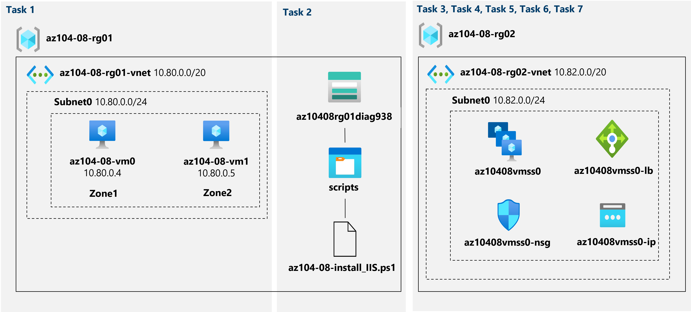

---
lab:
    title: 'Lab 08: Manage Virtual Machines'
    module: 'Administer Virtual Machines'
---

# Lab 08 - Manage Virtual Machines
# Student lab manual

## Lab scenario

You were tasked with identifying different options for deploying and configuring Azure virtual machines. First, you need to determine different compute and storage resiliency and scalability options you can implement when using Azure virtual machines. Next, you need to investigate compute and storage resiliency and scalability options that are available when using Azure virtual machine scale sets. You also want to explore the ability to automatically configure virtual machines and virtual machine scale sets by using the Azure Virtual Machine Custom Script extension.

**Note:** An **[interactive lab simulation](https://mslabs.cloudguides.com/guides/AZ-104%20Exam%20Guide%20-%20Microsoft%20Azure%20Administrator%20Exercise%2012)** is available that allows you to click through this lab at your own pace. You may find slight differences between the interactive simulation and the hosted lab, but the core concepts and ideas being demonstrated are the same. 

## Objectives

In this lab, you will:

+ Task 1: Deploy zone-resilient Azure virtual machines by using the Azure portal and an Azure Resource Manager template
+ Task 2: Configure Azure virtual machines by using virtual machine extensions
+ Task 3: Scale compute and storage for Azure virtual machines
+ Task 4: Register the Microsoft.Insights and Microsoft.AlertsManagement resource providers
+ Task 5: Deploy zone-resilient Azure virtual machine scale sets by using the Azure portal
+ Task 6: Configure Azure virtual machine scale sets by using virtual machine extensions
+ Task 7: Scale compute and storage for Azure virtual machine scale sets (optional)

## Estimated timing: 50 minutes

## Architecture diagram




### Instructions

## Exercise 1

## Task 1: Deploy zone-resilient Azure virtual machines by using the Azure portal and an Azure Resource Manager template

In this task, you will deploy Azure virtual machines into different availability zones by using the Azure portal and an Azure Resource Manager template.

1. Sign in to the [Azure portal](http://portal.azure.com).

1. In the Azure portal, search for and select **Virtual machines** and, on the **Virtual machines** blade, click **+ Create**, click **+ Azure virtual machine**.

1. On the **Basics** tab of the **Create a virtual machine** blade, specify the following settings (leave others with their default values):

    | Setting | Value |
    | --- | --- |
    | Subscription | the name of the Azure subscription you will be using in this lab |
    | Resource group | the name of a new resource group **az104-08-rg01** |
    | Virtual machine name | **az104-08-vm0** |
    | Region | select one of the regions that support availability zones and where you can provision Azure virtual machines |
    | Availability options | **Availability zone** |
    | Availability zone | **Zone 1** |
    | Image | **Windows Server 2019 Datacenter - Gen1/Gen2** |
    | Azure Spot instance | **No** |
    | Size | **Standard D2s v3** |
    | Username | **Student** |
    | Password | **Provide a secure password** |
    | Public inbound ports | **None** |
    | Would you like to use an existing Windows Server license? | **Unchecked** |

1. Click **Next: Disks >** and, on the **Disks** tab of the **Create a virtual machine** blade, specify the following settings (leave others with their default values):

    | Setting | Value |
    | --- | --- |
    | OS disk type | **Premium SSD** |
    | Enable Ultra Disk compatibility | **Unchecked** |

1. Click **Next: Networking >** and, on the **Networking** tab of the **Create a virtual machine** blade, click **Create new** below the **Virtual network** textbox.

1. On the **Create virtual network** blade, specify the following settings (leave others with their default values):

    | Setting | Value |
    | --- | --- |
    | Name | **az104-08-vnet01** |
    | Address range | **10.80.0.0/20** |
    | Subnet name | **subnet0** |
    | Subnet range | **10.80.0.0/24** |

1. Click **OK** and, back on the **Networking** tab of the **Create a virtual machine** blade, specify the following settings (leave others with their default values):

    | Setting | Value |
    | --- | --- |
    | Subnet | **subnet0** |
    | Public IP | **default** |
    | NIC network security group | **basic** |
    | Public inbound Ports | **None** |
    | Accelerated networking | **Off**
    | Place this virtual machine behind an existing load balancing solution? | **Unchecked** |

1. Click **Next: Management >** and, on the **Management** tab of the **Create a virtual machine** blade, specify the following settings (leave others with their default values):

    | Setting | Value |
    | --- | --- |
    | Patch orchestration options | **Manual updates** |  

1. Click **Next: Monitoring >** and, on the **Monitoring** tab of the **Create a virtual machine** blade, specify the following settings (leave others with their default values):

    | Setting | Value |
    | --- | --- |
    | Boot diagnostics | **Enable with custom storage account** |
    | Diagnostics storage account | **accept the default value** |

    >**Note**: If necessary, select an existing storage account in the dropdown list or create a new storage account. Record the name of the storage account. You will use it in the next task.

1. Click **Next: Advanced >**, on the **Advanced** tab of the **Create a virtual machine** blade, review the available settings without modifying any of them, and click **Review + Create**.

1. On the **Review + Create** blade, click **Create**.

1. On the deployment blade, click **Template**.

1. Review the template representing the deployment in progress and click **Deploy**.

    >**Note**: You will use this option to deploy the second virtual machine with matching configuration except for the availability zone.

1. On the **Custom deployment** blade, specify the following settings (leave others with their default values):

    | Setting | Value |
    | --- | --- |
    | Resource Group | **az104-08-rg01** |
    | Network Interface Name | **az104-08-vm1-nic1** |
    | Public IP Address Name | **az104-08-vm1-ip** |
    | Virtual Machine Name, Virtual Machine Name1, Virtual Machine Computer Name   | **az104-08-vm1** |
    | Virtual Machine RG | **az104-08-rg01** |    
    | Admin Username | **Student** |
    | Admin Password | **Provide a secure password**  |
    | Enable Hotpatching | **false** |
    | Zone | **2** |

    >**Note**: You need to modify parameters corresponding to the properties of the distinct resources you are deploying by using the template, including the virtual machine and its network interface.

1. Click **Review + Create**, on the **Review + Create** blade, click **Create**.

    >**Note**: Wait for both deployments to complete before you proceed to the next task. This might take about 5 minutes.

## Task 2: Configure Azure virtual machines by using virtual machine extensions

In this task, you will install Windows Server Web Server role on the two Azure virtual machines you deployed in the previous task by using the Custom Script virtual machine extension.

1. In the Azure portal, search for and select **Storage accounts** and, on the **Storage accounts** blade, click the entry representing the diagnostics storage account you created in the previous task.

1. On the storage account blade, in the **Data Storage** section, click **Containers** and then click **+ Container**.

1. On the **New container** blade, specify the following settings (leave others with their default values) and click **Create**:

    | Setting | Value |
    | --- | --- |
    | Name | **scripts** |
    | Public access level | **Private (no anonymous access**) |

1. Back on the storage account blade displaying the list of containers, click **scripts**.

1. On the **scripts** blade, click **Upload**.

1. On the **Upload blob** blade, click the folder icon, in the **Open** dialog box, navigate to the **\\Allfiles\\Labs\\08** folder, select **az104-08-install_IIS.ps1**, click **Open**, and back on the **Upload blob** blade, click **Upload**.

1. In the Azure portal, search for and select **Virtual machines** and, on the **Virtual machines** blade, click **az104-08-vm0**.

1. On the **az104-08-vm0** virtual machine blade, in the **Settings** section, click **Extensions + applications**, and the click **+ Add**.

1. On the **Install an Extension** blade, click **Custom Script Extension** and then click **Next**.

1. From the **Configure Custom Script Extension Extension** blade, click **Browse**.

1. On the **Storage accounts** blade, click the name of the storage account into which you uploaded the **az104-08-install_IIS.ps1** script, on the **Containers** blade, click **scripts**, on the **scripts** blade, click **az104-08-install_IIS.ps1**, and then click **Select**.

1. Back on the **Install extension** blade, click **Review + create** and, on the **Review + create** blade click **Create**.

1. In the Azure portal, search for and select **Virtual machines** and, on the **Virtual machines** blade, click **az104-08-vm1**.

1. On the **az104-08-vm1** blade, in the **Automation** section, click **Export template**.

1. On the **az104-08-vm1 - Export template** blade, click **Deploy**.

1. On the **Custom deployment** blade, click **Edit template**.

    >**Note**: Disregard the message stating **The resource group is in a location that is not supported by one or more resources in the template. Please choose a different resource group**. This is expected and can be ignored in this case.

1. On the **Edit template** blade, in the section displaying the content of the template, insert the following code starting with line **20** (directly underneath the `"resources": [` line):

   >**Note**: If you are using a tool that pastes the code in line by line intellisense may add extra brackets causing validation errors. You may want to paste the code into notepad first and then paste it into line 20.

   ```json
        {
            "type": "Microsoft.Compute/virtualMachines/extensions",
            "name": "az104-08-vm1/customScriptExtension",
            "apiVersion": "2018-06-01",
            "location": "[resourceGroup().location]",
            "dependsOn": [
                "az104-08-vm1"
            ],
            "properties": {
                "publisher": "Microsoft.Compute",
                "type": "CustomScriptExtension",
                "typeHandlerVersion": "1.7",
                "autoUpgradeMinorVersion": true,
                "settings": {
                    "commandToExecute": "powershell.exe Install-WindowsFeature -name Web-Server -IncludeManagementTools && powershell.exe remove-item 'C:\\inetpub\\wwwroot\\iisstart.htm' && powershell.exe Add-Content -Path 'C:\\inetpub\\wwwroot\\iisstart.htm' -Value $('Hello World from ' + $env:computername)"
              }
            }
        },

   ```

   >**Note**: This section of the template defines the same Azure virtual machine custom script extension that you deployed earlier to the first virtual machine via Azure PowerShell.

1. Click **Save** and, back on the **Custom template** blade, click **Review + Create** and, on the **Review + Create** blade, click **Create**

    >**Note**: Wait for the template deployment to complete. You can monitor its progress from the **Extensions** blade of the **az104-08-vm0** and **az104-08-vm1** virtual machines. This should take no more than 3 minutes.

1. To verify that the Custom Script extension-based configuration was successful, navigate back on the **az104-08-vm1** blade, in the **Operations** section, click **Run command**, and, in the list of commands, click **RunPowerShellScript**.

1. On the **Run Command Script** blade, type the following and click **Run** to access the web site hosted on **az104-08-vm1**:

   ```powershell
   Invoke-WebRequest -URI http://10.80.0.4 -UseBasicParsing
   ```

    >**Note**: The **-UseBasicParsing** parameter is necessary to eliminate dependency on Internet Explorer to complete execution of the cmdlet

    >**Note**: The **-URI** parameter is the **Private IP address** of the VM. Navigate to the **az104-08-vm1** blade, in the **Networking** section, and click **Network settings**

    >**Note**: You can also connect to **az104-08-vm0** and run `Invoke-WebRequest -URI http://10.80.0.5 -UseBasicParsing` to access the web site hosted on **az104-08-vm1**.

## Task 3: Scale compute and storage for Azure virtual machines

In this task you will scale compute for Azure virtual machines by changing their size and scale their storage by attaching and configuring their data disks.

1. In the Azure portal, search for and select **Virtual machines** and, on the **Virtual machines** blade, click **az104-08-vm0**.

1. On the **az104-08-vm0** virtual machine blade, click **Size** and set the virtual machine size to **Standard DS1_v2** and click **Resize**

    >**Note**: Choose another size if **Standard DS1_v2** is not available.

1. On the **az104-08-vm0** virtual machine blade, click **Disks**, Under **Data disks** click **+ Create and attach a new disk**.

1. Create a managed disk with the following settings (leave others with their default values):

    | Setting | Value |
    | --- | --- |
    | Disk name | **az104-08-vm0-datadisk-0** |
    | Storage type | **Premium SSD** |
    | Size (GiB| **1024** |

1. Back on the **az104-08-vm0 - Disks** blade, Under **Data disks** click **+ Create and attach a new disk**.

1. Create a managed disk with the following settings (leave others with their default values) and Save changes:

    | Setting | Value |
    | --- | --- |
    | Disk name | **az104-08-vm0-datadisk-1** |
    | Storage type | **Premium SSD** |
    | Size (GiB)| **1024 GiB** |

1. Back on the **az104-08-vm0 - Disks** blade, click **Save**.

1. On the **az104-08-vm0** blade, in the **Operations** section, click **Run command**, and, in the list of commands, click **RunPowerShellScript**.

1. On the **Run Command Script** blade, type the following and click **Run** to create a drive Z: consisting of the two newly attached disks with the simple layout and fixed provisioning:

   ```powershell
   New-StoragePool -FriendlyName storagepool1 -StorageSubsystemFriendlyName "Windows Storage*" -PhysicalDisks (Get-PhysicalDisk -CanPool $true)

   New-VirtualDisk -StoragePoolFriendlyName storagepool1 -FriendlyName virtualdisk1 -Size 64GB -ResiliencySettingName Simple -ProvisioningType Fixed

   Initialize-Disk -VirtualDisk (Get-VirtualDisk -FriendlyName virtualdisk1)

   New-Partition -DiskNumber 4 -UseMaximumSize -DriveLetter Z
   ```

    > **Note**: Wait for the confirmation that the commands completed successfully.

1. In the Azure portal, search for and select **Virtual machines** and, on the **Virtual machines** blade, click **az104-08-vm1**.

1. On the **az104-08-vm1** blade, in the **Automation** section, click **Export template**.

1. On the **az104-08-vm1 - Export template** blade, click **Deploy**.

1. On the **Custom deployment** blade, click **Edit template**.

    >**Note**: Disregard the message stating **The resource group is in a location that is not supported by one or more resources in the template. Please choose a different resource group**. This is expected and can be ignored in this case.

1. On the **Edit template** blade, in the section displaying the content of the template, replace the line **30** `"vmSize": "Standard_D2s_v3"` with the following line):

   ```json
                    "vmSize": "Standard_DS1_v2"

   ```

    >**Note**: This section of the template defines the same Azure virtual machine size as the one you specified for the first virtual machine via the Azure portal.

1. On the **Edit template** blade, in the section displaying the content of the template, replace line **51** (`"dataDisks": [ ],`) with the following code :

   ```json
                    "dataDisks": [
                      {
                        "lun": 0,
                        "name": "az104-08-vm1-datadisk0",
                        "diskSizeGB": "1024",
                        "caching": "ReadOnly",
                        "createOption": "Empty"
                      },
                      {
                        "lun": 1,
                        "name": "az104-08-vm1-datadisk1",
                        "diskSizeGB": "1024",
                        "caching": "ReadOnly",
                        "createOption": "Empty"
                      }
                    ],
   ```

    >**Note**: If you are using a tool that pastes the code in line by line intellisense may add extra brackets causing validation errors. You may want to paste the code into notepad first and then paste it into line 49.

    >**Note**: This section of the template creates two managed disks and attaches them to **az104-08-vm1**, similarly to the storage configuration of the first virtual machine via the Azure portal.


1. Click **Save** and, back on the **Custom deployment** blade, click **Review + Create** and, on the **Review + Create** blade, click **Create**.

    >**Note**: Wait for the template deployment to complete. You can monitor its progress from the **Disks** blade of the **az104-08-vm1** virtual machine. This should take no more than 3 minutes.

1. Back on the **az104-08-vm1** blade, in the **Operations** section, click **Run command**, and, in the list of commands, click **RunPowerShellScript**.

1. On the **Run Command Script** blade, type the following and click **Run** to create a drive Z: consisting of the two newly attached disks with the simple layout and fixed provisioning:

   ```powershell
   New-StoragePool -FriendlyName storagepool1 -StorageSubsystemFriendlyName "Windows Storage*" -PhysicalDisks (Get-PhysicalDisk -CanPool $true)

   New-VirtualDisk -StoragePoolFriendlyName storagepool1 -FriendlyName virtualdisk1 -Size 2046GB -ResiliencySettingName Simple -ProvisioningType Fixed

   Initialize-Disk -VirtualDisk (Get-VirtualDisk -FriendlyName virtualdisk1)

   New-Partition -DiskNumber 4 -UseMaximumSize -DriveLetter Z
   ```

    > **Note**: Wait for the confirmation that the commands completed successfully.

## Task 4: Register the Microsoft.Insights and Microsoft.AlertsManagement resource providers

1. In the Azure portal, open the **Azure Cloud Shell** by clicking on the icon in the top right of the Azure Portal.

1. If prompted to select either **Bash** or **PowerShell**, select **PowerShell**.

    >**Note**: If this is the first time you are starting **Cloud Shell** and you are presented with the **You have no storage mounted** message, select the subscription you are using in this lab, and click **Create storage**.

1. From the Cloud Shell pane, run the following to register the Microsoft.Insights and Microsoft.AlertsManagement resource providers.

   ```powershell
   Register-AzResourceProvider -ProviderNamespace Microsoft.Insights

   Register-AzResourceProvider -ProviderNamespace Microsoft.AlertsManagement
   ```

## Task 5: Deploy zone-resilient Azure virtual machine scale sets by using the Azure portal

In this task, you will deploy Azure virtual machine scale set across availability zones by using the Azure portal.

1. In the Azure portal, search for and select **Virtual machine scale sets** and, on the **Virtual machine scale sets** blade, click **+ Add** (or **+ Create**).

1. On the **Basics** tab of the **Create a virtual machine scale set** blade, specify the following settings (leave others with their default values) and click **Next : Disks >**:

    | Setting | Value |
    | --- | --- |
    | Subscription | the name of the Azure subscription you are using in this lab |
    | Resource group | the name of a new resource group **az104-08-rg02** |
    | Virtual machine scale set name | **az10408vmss0** |
    | Region | select one of the regions that support availability zones and where you can provision Azure virtual machines different from the one you used to deploy virtual machines earlier in this lab |
    | Availability zone | **Zones 1, 2, 3** |
    | Orchestration mode | **Uniform** |
    | Image | **Windows Server 2019 Datacenter - Gen2** |
    | Run with Azure Spot discount | **No** |
    | Size | **Standard D2s_v3** |
    | Username | **Student** |
    | Password | **Provide a secure password**  |
    | Already have a Windows Server license? | **Unchecked** |

    >**Note**: For the list of Azure regions which support deployment of Windows virtual machines to availability zones, refer to [What are Availability Zones in Azure?](https://docs.microsoft.com/en-us/azure/availability-zones/az-overview)

1. On the **Disks** tab of the **Create a virtual machine scale set** blade, accept the default values and click **Next : Networking >**.

1. On the **Networking** tab of the **Create a virtual machine scale set** blade, click the **Create virtual network** link below the **Virtual network** textbox and create a new virtual network with the following settings (leave others with their default values). 

    | Setting | Value |
    | --- | --- |
    | Name | **az104-08-rg02-vnet** |
    | Address range | **10.82.0.0/20** |
    | Subnet name | **subnet0** |
    | Subnet range | **10.82.0.0/24** |

    >**Note**: Once you create a new virtual network and return to the **Networking** tab of the **Create a virtual machine scale set** blade, the **Virtual network** value will be automatically set to **az104-08-rg02-vnet**.

1. Back on the **Networking** tab of the **Create a virtual machine scale set** blade, click the **Edit network interface** icon to the right of the network interface entry.

1. On the **Edit network interface** blade, in the **NIC network security group** section, click **Advanced** and click **Create new** under the **Configure network security group** drop-down list.

1. On the **Create network security group** blade, specify the following settings (leave others with their default values):

    | Setting | Value |
    | --- | --- |
    | Name | **az10408vmss0-nsg** |

1. Click **Add an inbound rule** and add an inbound security rule with the following settings (leave others with their default values):

    | Setting | Value |
    | --- | --- |
    | Source | **Any** |
    | Source port ranges | **\*** |
    | Destination | **Any** |
    | Destination port ranges | **80** |
    | Protocol | **TCP** |
    | Action | **Allow** |
    | Priority | **1010** |
    | Name | **custom-allow-http** |

1. Click **Add** and, back on the **Create network security group** blade, click **OK**.

1. Back on the **Edit network interface** blade, in the **Public IP address** section, click **Enabled** and click **OK**.

1. Back on the **Networking** tab of the **Create a virtual machine scale set** blade, under the **Load balancing** section, specify the following (leave others with their default values).

    | Setting | Value |
    | --- | --- |
    | Load balancing options | **Azure load balancer** |
    | Select a load balancer | **Create a load balancer** |
    
1.  On the **Create a load balancer** page, specify the load balancer name and take the defaults. Click **Create** when you are done then **Next : Scaling >**.
    
    | Setting | Value |
    | --- | --- |
    | Load balancer name | **az10408vmss0-lb** |

1. On the **Scaling** tab of the **Create a virtual machine scale set** blade, specify the following settings (leave others with their default values) and click **Next : Management >**:

    | Setting | Value |
    | --- | --- |
    | Initial instance count | **2** |
    | Scaling policy | **Manual** |

1. On the **Management** tab of the **Create a virtual machine scale set** blade, specify the following settings (leave others with their default values):

    | Setting | Value |
    | --- | --- |
    | Boot diagnostics | **Enable with custom storage account** |
    | Diagnostics storage account | accept the default value |

    >**Note**: You will need the name of this storage account in the next task.

   Click **Next : Health >**:

1. On the **Health** tab of the **Create a virtual machine scale set** blade, review the default settings without making any changes and click **Next : Advanced >**.

1. On the **Advanced** tab of the **Create a virtual machine scale set** blade, specify the following settings (leave others with their default values) and click **Review + create**.

    | Setting | Value |
    | --- | --- |
    | Spreading algorithm | **Fixed spreading (not recommended with zones)** |

    >**Note**: The **Max spreading** setting is currently not functional.

1. On the **Review + create** tab of the **Create a virtual machine scale set** blade, ensure that the validation passed and click **Create**.

    >**Note**: Wait for the virtual machine scale set deployment to complete. This should take about 5 minutes.

## Task 6: Configure Azure virtual machine scale sets by using virtual machine extensions

In this task, you will install Windows Server Web Server role on the instances of the Azure virtual machine scale set you deployed in the previous task by using the Custom Script virtual machine extension.

1. In the Azure portal, search for and select **Storage accounts** and, on the **Storage accounts** blade, click the entry representing the diagnostics storage account you created in the previous task.

1. On the storage account blade, in the **Data Storage** section, click **Containers** and then click **+ Container**.

1. On the **New container** blade, specify the following settings (leave others with their default values) and click **Create**:

    | Setting | Value |
    | --- | --- |
    | Name | **scripts** |
    | Public access level | **Private (no anonymous access**) |

1. Back on the storage account blade displaying the list of containers, click **scripts**.

1. On the **scripts** blade, click **Upload**.

1. On the **Upload blob** blade, click the folder icon, in the **Open** dialog box, navigate to the **\\Allfiles\\Labs\\08** folder, select **az104-08-install_IIS.ps1**, click **Open**, and back on the **Upload blob** blade, click **Upload**.

1. In the Azure portal, navigate back to the **Virtual machine scale sets** blade and click **az10408vmss0**.

1. On the **az10408vmss0** blade, in the **Settings** section, click **Extensions and applications**, and the click **+ Add**.

1. On the **New resource** blade, click **Custom Script Extension** and then click **Next**.

1. From the **Install extension** blade, **Browse** to and **Select** the **az104-08-install_IIS.ps1** script that was uploaded to the **scripts** container in the storage account earlier in this task, and then click **Create**.

    >**Note**: Wait for the installation of the extension to complete before proceeding to the next step.

1. In the **Settings** section of the **az10408vmss0** blade, click **Instances**, select the checkboxes next to the two instances of the virtual machine scale set, click **Upgrade**, and then, when prompted for confirmation, click **Yes**.

    >**Note**: Wait for the upgrade to complete before proceeding to the next step.

1. In the Azure portal, search for and select **Load balancers** and, in the list of load balancers, click **az10408vmss0-lb**.

1. On the **az10408vmss0-lb** blade, note the value of the **Public IP address** assigned to the frontend of the load balancer, open an new browser tab, and navigate to that IP address.

    >**Note**: Verify that the browser page displays the name of one of the instances of the Azure virtual machine scale set **az10408vmss0**.

## Task 7: Scale compute and storage for Azure virtual machine scale sets

In this task, you will change the size of virtual machine scale set instances, configure their autoscaling settings, and attach disks to them.

1. In the Azure portal, search for and select **Virtual machine scale sets** and select the **az10408vmss0** scale set

1. In the **az10408vmss0** blade, in the **Settings** section, click **Size**.

1. In the list of available sizes, select **Standard DS1_v2** and click **Resize**.

1. In the **Settings** section, click **Instances**, select the checkboxes next to the two instances of the virtual machine scale set, click **Upgrade**, and then, when prompted for confirmation, click **Yes**.

1. In the list of instances, click the entry representing the first instance and, on the scale set instance blade, note its **Location** (it should be one of the zones in the target Azure region into which you deployed the Azure virtual machine scale set).

1. Return to the **az10408vmss0 - Instances** blade, click the entry representing the second instance and, on the scale set instance blade, note its **Location** (it should be one of the other two zones in the target Azure region into which you deployed the Azure virtual machine scale set).

1. Return to the **az10408vmss0 - Instances** blade, and in the **Settings** section, click **Scaling**.

1. On the **az10408vmss0 - Scaling** blade, select the **Custom autoscale** option and configure autoscale with the following settings (leave others with their default values):

    | Setting | Value |
    | --- |--- |
    | Scale mode | **Scale based on a metric** |

1. Click the **+ Add a rule** link and, on the **Scale rule** blade, specify the following settings (leave others with their default values):

    | Setting | Value |
    | --- |--- |
    | Metric source | **Current resource (az10480vmss0)** |
    | Time aggregation | **Average** |
    | Metric namespace | **Virtual Machine Host** |
    | Metric name | **Network In Total** |
    | Operator | **Greater than** |
    | Metric threshold to trigger scale action | **10** |
    | Duration (in minutes) | **1** |
    | Time grain statistic | **Average** |
    | Operation | **Increase count by** |
    | Instance count | **1** |
    | Cool down (minutes) | **5** |

    >**Note**: Obviously these values do not represent a realistic configuration, since their purpose is to trigger autoscaling as soon as possible, without extended wait period.

1. Click **Add** and, back on the **az10408vmss0 - Scaling** blade, specify the following settings (leave others with their default values):

    | Setting | Value |
    | --- |--- |
    | Instance limits Minimum | **1** |
    | Instance limits Maximum | **3** |
    | Instance limits Default | **1** |

1. Click **Save**.

1. In the Azure portal, open the **Azure Cloud Shell** by clicking on the icon in the top right of the Azure Portal.

1. If prompted to select either **Bash** or **PowerShell**, select **PowerShell**.

1. From the Cloud Shell pane, run the following to identify the public IP address of the load balancer in front of the Azure virtual machine scale set **az10408vmss0**.

   ```powershell
   $rgName = 'az104-08-rg02'

   $lbpipName = 'az10408vmss0-lb-publicip'

   $pip = (Get-AzPublicIpAddress -ResourceGroupName $rgName -Name $lbpipName).IpAddress
   ```

1. From the Cloud Shell pane, run the following to start an infinite loop that sends the HTTP requests to the web sites hosted on the instances of Azure virtual machine scale set **az10408vmss0**.

   ```powershell
   while ($true) { Invoke-WebRequest -Uri "http://$pip" }
   ```

1. Minimize the Cloud Shell pane but do not close it, switch back to the **az10408vmss0 - Instances** blade and monitor the number of instances.

    >**Note**: You might need to wait a couple of minutes and click **Refresh**.

1. Once the third instance is provisioned, navigate to its blade to determine its **Location** (it should be different than the first two zones you identified earlier in this task.

1. Close Cloud Shell pane.

1. On the **az10408vmss0** blade, in the **Settings** section, click **Disks**, click **+ Create and attach a new disk**, and attach a new managed disk with the following settings (leave others with their default values):

    | Setting | Value |
    | --- | --- |
    | LUN | **0** |
    | Storage type | **Standard HDD** |
    | Size (GiB) | **32** |

1. Save the change, in the **Settings** section of the **az10408vmss0** blade, click **Instances**, select the checkboxes next to the instances of the virtual machine scale set, click **Upgrade**, and then, when prompted for confirmation, click **Yes**.

    >**Note**: The disk attached in the previous step is a raw disk. Before it can be used, it is necessary to create a partition, create a filesystem, and mount it. To accomplish this, you will use Azure virtual machine Custom Script extension. First, you will need to remove the existing Custom Script Extension.

1. In the **Settings** section of the **az10408vmss0** blade, click **Extensions and applications**, click **CustomScriptExtension**, and then click **Uninstall**.

    >**Note**: Wait for uninstallation to complete.

1. In the Azure portal, open the **Azure Cloud Shell** by clicking on the icon in the top right of the Azure Portal.

1. If prompted to select either **Bash** or **PowerShell**, select **PowerShell**.

1. In the toolbar of the Cloud Shell pane, click the **Upload/Download files** icon, in the drop-down menu, click **Upload** and upload the file **\\Allfiles\\Labs\\08\\az104-08-configure_VMSS_disks.ps1** into the Cloud Shell home directory.

1. From the Cloud Shell pane, run the following to display the content of the script:

   ```powershell
   Set-Location -Path $HOME

   Get-Content -Path ./az104-08-configure_VMSS_disks.ps1
   ```

    >**Note**: The script installs a custom script extension that configures the attached disk.

1. From the Cloud Shell pane, run the following to execute the script and configure disks of Azure virtual machine scale set:

   ```powershell
   ./az104-08-configure_VMSS_disks.ps1
   ```

1. Close the Cloud Shell pane.

1. In the **Settings** section of the **az10408vmss0** blade, click **Instances**, select the checkboxes next to the instances of the virtual machine scale set, click **Upgrade**, and then, when prompted for confirmation, click **Yes**.

## Clean up resources

>**Note**: Remember to remove any newly created Azure resources that you no longer use. Removing unused resources ensures you will not see unexpected charges.

>**Note**:  Don't worry if the lab resources cannot be immediately removed. Sometimes resources have dependencies and take a longer time to delete. It is a common Administrator task to monitor resource usage, so just periodically review your resources in the Portal to see how the cleanup is going. 
1. In the Azure portal, open the **PowerShell** session within the **Cloud Shell** pane.

1. Remove az104-08-configure_VMSS_disks.ps1 by running the following command:

   ```powershell
   rm ~\az104-08*
   ```

1. List all resource groups created throughout the labs of this module by running the following command:

   ```powershell
   Get-AzResourceGroup -Name 'az104-08*'
   ```

1. Delete all resource groups you created throughout the labs of this module by running the following command:

   ```powershell
   Get-AzResourceGroup -Name 'az104-08*' | Remove-AzResourceGroup -Force -AsJob
   ```

    >**Note**: The command executes asynchronously (as determined by the -AsJob parameter), so while you will be able to run another PowerShell command immediately afterwards within the same PowerShell session, it will take a few minutes before the resource groups are actually removed.

## Review

In this lab, you have:

+ Deployed zone-resilient Azure virtual machines by using the Azure portal and an Azure Resource Manager template
+ Configured Azure virtual machines by using virtual machine extensions
+ Scaled compute and storage for Azure virtual machines
+ Deployed zone-reslient Azure virtual machine scale sets by using the Azure portal
+ Configured Azure virtual machine scale sets by using virtual machine extensions
+ Scaled compute and storage for Azure virtual machine scale sets
