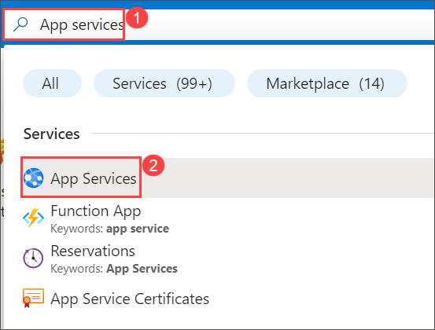
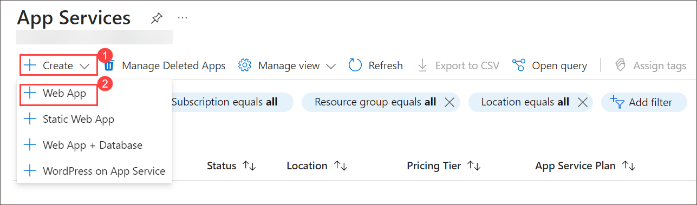
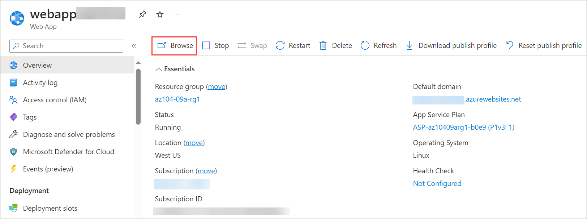
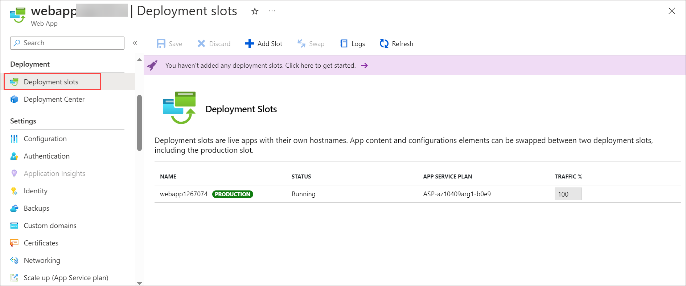
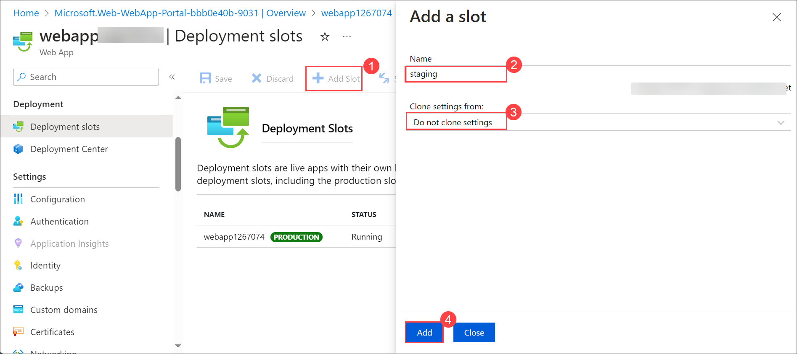
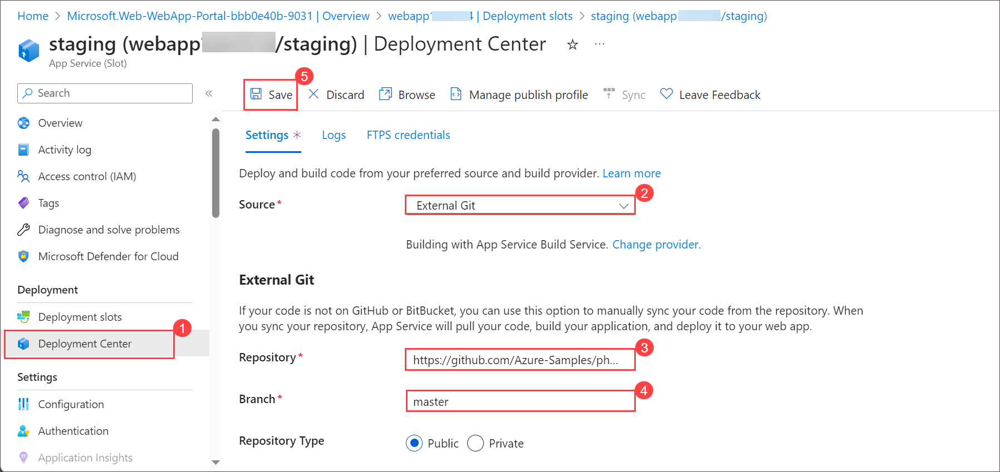
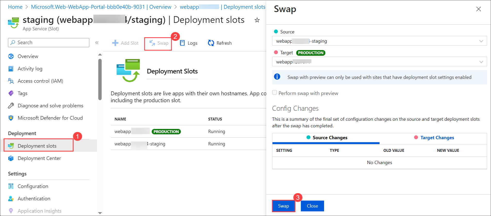
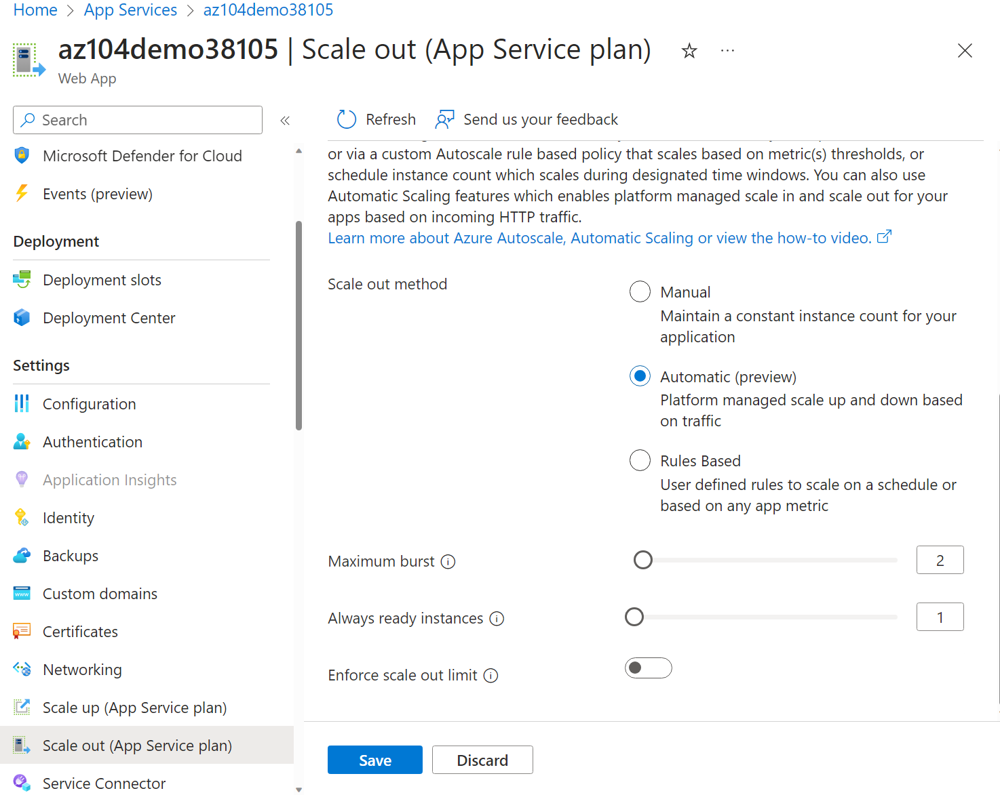

# Lab 09a - Implement Web Apps

## Lab scenario
You need to evaluate the use of Azure Web apps for hosting Contoso's websites, hosted currently in the company's on-premises data centers. The websites are running on Windows servers using PHP runtime stack. You also need to determine how you can implement DevOps practices by leveraging Azure web app deployment slots.

**Note:** An **[interactive lab simulation](https://mslabs.cloudguides.com/guides/AZ-104%20Exam%20Guide%20-%20Microsoft%20Azure%20Administrator%20Exercise%2013)** is available that allows you to click through this lab at your own pace. You may find slight differences between the interactive simulation and the hosted lab, but the core concepts and ideas being demonstrated are the same. 

## Lab objectives
In this lab, you will complete the following tasks:
+ Task 1: Create an Azure web app
+ Task 2: Create a staging deployment slot
+ Task 3: Configure web app deployment settings
+ Task 4: Deploy code to the staging deployment slot
+ Task 5: Swap the staging slots
+ Task 6: Configure and test autoscaling of the Azure web app

## Estimated timing: 30 minutes

## Architecture diagram

## Exercise 1

### Task 1: Create an Azure web app
In this task, you will create an Azure web app.

1. In the Azure portal, search for and select **App services**, and, on the **App Services** blade.

   

1. Click **+ Create** and choose **Create Web App**

   
   
1. On the **Basics** tab , specify the following settings (leave others with their default values):

    | Setting | Value |
    | --- | ---|
    | Subscription | the name of the Azure subscription you are using in this lab |
    | Resource group | Select **az104-09a-rg1** |
    | Web app name | any globally unique name |
    | Publish | **Code** |
    | Runtime stack | **PHP 8.2** |
    | Operating system | **Linux** |
    | Region | the name of an Azure region where you can provision Azure web apps |
    | Pricing plans | accept the default configuration |

    .png)
   
1. Click **Review + create**. On the **Review + create** tab of the **Create Web App** blade, ensure that the validation passed and click **Create**.

    >**Note**: Wait until the web app is created before you proceed to the next task. This should take about a minute.

1. On the deployment blade, click **Go to resource**.

### Task 2: Create a staging deployment slot
In this task, you will create a staging deployment slot.

1. On the blade of the newly deployed web app, click the **Browse** tab to display the default web page in a new browser tab.

   
  
1. Close the new browser tab and, back in the Azure portal, in the **Deployment** section of the web app blade, click **Deployment slots**.

    

    >**Note**: The web app, at this point, has a single deployment slot labeled **PRODUCTION**.

1. Click **+ Add slot**, and add a new slot with the following settings then click on **Add**. 

    | Setting | Value |
    | --- | ---|
    | Name | **staging** |
    | Clone settings from | **Do not clone settings**|

    

1. Once you see **Successfully created slot 'staging'** click on **Close**.
     
1. Back on the **Deployment slots** blade of the web app, click the entry representing the newly created staging slot.

    >**Note**: This will open the blade displaying the properties of the staging slot.

1. Click on the **Browse** tab.

1. Review the staging slot blade and note that its URL differs from the one assigned to the production slot.

## Task 3: Configure Web App deployment settings

In this task, you will configure Web App deployment settings. Deployment settings allow for continuous deployment. This ensures that the app service has the latest version of the application.

1. In the staging slot, select **Deployment Center** and then select **Settings**.

    >**Note:** Make sure you are on the staging slot blade (instead than the production slot).
    
1. In the **Source** drop-down list, select **External Git**. Notice the other choices. 

1. In the repository field, enter `https://github.com/Azure-Samples/php-docs-hello-world`

1. In the branch field, enter `master`.

1. Select **Save**.

     

1. From the staging slot, select **Overview**.

1. Select the **Default domain** link, and open the URL in a new tab. 

1. Verify that the staging slot displays **Hello World**.

    
   
>**Note:** The deployment may take a minute. Be sure to **Refresh** the application page.

### Task 4: Swap the staging slots
In this task, you will swap the staging slot with the production slot.

1. Navigate back to the blade displaying the production slot of the web app.

1. In the **Deployment** section, click **Deployment slots** and then, click **Swap** toolbar icon.

   

1. On the **Swap** blade, review the default settings and click **Swap**.

   >**Note**: Kindly Wait till Swap successfully complete.

1. Once you get **Successfully completed swap between slot 'staging' and slot 'production'** click on **Close**.
   
1. Click **Overview** on the production slot blade of the web app and then click the **URL** link to display the web site home page in a new browser tab.

1. Verify the default web page has been replaced with the **Hello World!** page.

### Task 5: Configure and test autoscaling of the Azure web app

In this task, you will configure autoscaling of Azure Web App. Autoscaling enables you to maintain optimal performance for your web app when traffic to the web app increases. To determine when the app should scale you can monitor metrics like CPU usage, memory, or bandwidth.

1. In the **Settings** section, select **Scale out (App Service plan)**.

    >**Note:** Ensure you are working on the production slot not the staging slot.  

1. From the **Scaling** section, select **Automatic**. Notice the **Rules Based** option. Rules based scaling can be configured for different app metrics. 

1. In the **Maximum burst** field, select **2**.

    

1. Select **Save**.

1. Select **Diagnose and solve problems** (left pane).

1. In the **Load Test your App** box, select **Create Load Test**.

    + Select **+ Create** and give your load test a **name**.  The name must be unique.
    + Select **Review + create** and then **Create**.

1. Wait for the load test to create, and then select **Go to resource**.

1. From the **Overview** | **Add HTTP requests**, select **Create**.

1. For the **Test URL**, paste in your **Default domain** URL. Ensure this is properly formatted and begins with **https://**.

1. Select **Review + create** and **Create**.

    >**Note:** It may take a couple of minutes to create the test. 

1. Review the test results including **Virtual users**, **Response time**, and **Requests/sec**.

1. Select **Stop** to complete the test run.

   > **Congratulations** on completing the task! Now, it's time to validate it. Here are the steps:
   > - Navigate to the Lab Validation Page, from the upper right corner in the lab guide section.
   > - Hit the Validate button for the corresponding task. If you receive a success message, you can proceed to the next task. 
   > - If not, carefully read the error message and retry the step, following the instructions in the lab guide.
   > - If you need any assistance, please contact us at labs-support@spektrasystems.com. We are available 24/7 to help you out.

### Review
In this lab, you have completed:
+ Created an Azure web app
+ Created a staging deployment slot
+ Configured web app deployment settings
+ Deployed code to the staging deployment slot
+ Swapped the staging slots
+ Configured and tested autoscaling of the Azure web app

### You have successfully completed the lab**
