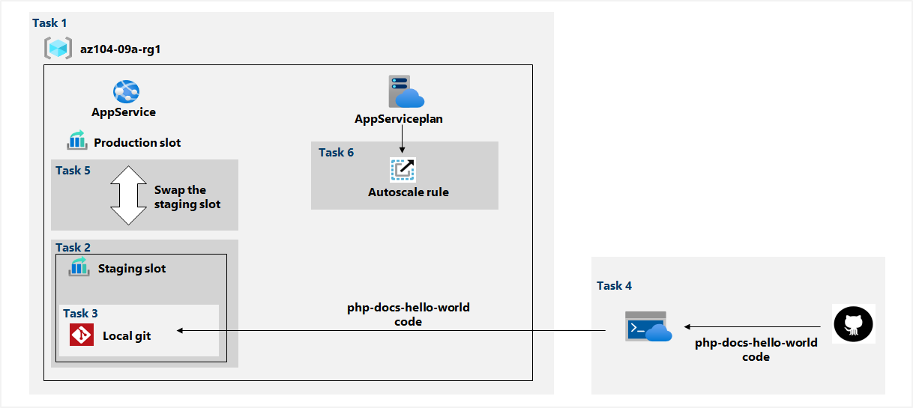

---
lab:
    title: '09a - Implement Web Apps'
    module: 'Administer Serverless Computing'
---

# Lab 09a - Implement Web Apps
# Student lab manual

## Lab scenario

You need to evaluate the use of Azure Web apps for hosting Contoso's web sites, hosted currently in the company's on-premises data centers. The web sites are running on Windows servers using PHP runtime stack. You also need to determine how you can implement DevOps practices by leveraging Azure web apps deployment slots.

**Note:** An **[interactive lab simulation](https://mslabs.cloudguides.com/guides/AZ-104%20Exam%20Guide%20-%20Microsoft%20Azure%20Administrator%20Exercise%2013)** is available that allows you to click through this lab at your own pace. You may find slight differences between the interactive simulation and the hosted lab, but the core concepts and ideas being demonstrated are the same. 

## Objectives

In this lab, you will:

+ Task 1: Create an Azure web app
+ Task 2: Create a staging deployment slot
+ Task 3: Configure web app deployment settings
+ Task 4: Deploy code to the staging deployment slot
+ Task 5: Swap the staging slots
+ Task 6: Configure and test autoscaling of the Azure web app

## Estimated timing: 30 minutes

## Architecture diagram



## Instructions

### Exercise 1

#### Task 1: Create an Azure web app

In this task, you will create an Azure web app.

1. Sign in to the [**Azure portal**](http://portal.azure.com).

1. In the Azure portal, search for and select **App services**, and, on the **App Services** blade, click **+ Create**.

1. On the **Basics** tab of the **Create Web App** blade, specify the following settings (leave others with their default values):

    | Setting | Value |
    | --- | ---|
    | Subscription | the name of the Azure subscription you are using in this lab |
    | Resource group | the name of a new resource group **az104-09a-rg1** |
    | Web app name | any globally unique name |
    | Publish | **Code** |
    | Runtime stack | **PHP 8.0** |
    | Operating system | **Linux** |
    | Region | the name of an Azure region where you can provision Azure web apps |
    | App service plan | accept the default configuration |

1. Click **Review + create**. On the **Review + create** tab of the **Create Web App** blade, ensure that the validation passed and click **Create**.

    >**Note**: Wait until the web app is created before you proceed to the next task. This should take about a minute.

1. On the deployment blade, click **Go to resource**.

#### Task 2: Create a staging deployment slot

In this task, you will create a staging deployment slot.

1. On the blade of the newly deployed web app, click the **URL** link to display the default web page in a new browser tab.

1. Close the new browser tab and, back in the Azure portal, in the **Deployment** section of the web app blade, click **Deployment slots**.

    >**Note**: The web app, at this point, has a single deployment slot labeled **PRODUCTION**.

1. Click **+ Add slot**, and add a new slot with the following settings:

    | Setting | Value |
    | --- | ---|
    | Name | **staging** |
    | Clone settings from | **Do not clone settings**|

1. Back on the **Deployment slots** blade of the web app, click the entry representing the newly created staging slot.

    >**Note**: This will open the blade displaying the properties of the staging slot.

1. Review the staging slot blade and note that its URL differs from the one assigned to the production slot.

#### Task 3: Configure web app deployment settings

In this task, you will configure web app deployment settings.

1. On the staging deployment slot blade, in the **Deployment** section, click **Deployment Center** and then select the **Settings** tab.

    >**Note:** Make sure you are on the staging slot blade (rather than the production slot).
    
1. On the **Settings** tab, in the **Source** drop-down list, select **Local Git** and click the **Save** button

1. On the **Deployment Center** blade, copy the **Git Clone Url** entry to Notepad.

    >**Note:** You will need the Git Clone Url value in the next task of this lab.

1. On the **Deployment Center** blade, select the **Local Git/FTPS credentials** tab, in the **User Scope** section, specify the following settings, and click **Save**.

    | Setting | Value |
    | --- | ---|
    | User name | any globally unique name (must not contain `@` character) |
    | Password | any password that satisfies complexity requirements|

    >**Note:** You will need these credentials in the next task of this lab.

#### Task 4: Deploy code to the staging deployment slot

In this task, you will deploy code to the staging deployment slot.

1. In the Azure portal, open the **Azure Cloud Shell** by clicking on the icon in the top right of the Azure Portal.

1. If prompted to select either **Bash** or **PowerShell**, select **PowerShell**.

    >**Note**: If this is the first time you are starting **Cloud Shell** and you are presented with the **You have no storage mounted** message, select the subscription you are using in this lab, and click **Create storage**.

1. From the Cloud Shell pane, run the following to clone the remote repository containing the code for the web app.

   ```powershell
   git clone https://github.com/Azure-Samples/php-docs-hello-world
   ```

1. From the Cloud Shell pane, run the following to set the current location to the newly created clone of the local repository containing the sample web app code.

   ```powershell
   Set-Location -Path $HOME/php-docs-hello-world/
   ```

1. From the Cloud Shell pane, run the following to add the remote git (make sure to replace the `[deployment_user_name]` and `[git_clone_url]` placeholders with the value of the **Deployment Credentials** user name and **Git Clone Url**, respectively, which you identified in previous task):

   ```powershell
   git remote add [deployment_user_name] [git_clone_url]
   ```

    >**Note**: The value following `git remote add` does not have to match the **Deployment Credentials** user name, but has to be unique

1. From the Cloud Shell pane, run the following to push the sample web app code from the local repository to the Azure web app staging deployment slot (make sure to replace the `[deployment_user_name]` placeholder with the value of the **Deployment Credentials** user name, which you identified in previous task):

   ```powershell
   git push [deployment_user_name] master
   ```

1. If prompted to authenticate, type the `[deployment_user_name]` and the corresponding password (which you set in the previous task).

1. Close the Cloud Shell pane.

1. On the staging slot blade, click **Overview** and then click the **URL** link to display the default web page in a new browser tab.

1. Verify that the browser page displays the **Hello World!** message and close the new tab.

#### Task 5: Swap the staging slots

In this task, you will swap the staging slot with the production slot

1. Navigate back to the blade displaying the production slot of the web app.

1. In the **Deployment** section, click **Deployment slots** and then, click **Swap** toolbar icon.

1. On the **Swap** blade, review the default settings and click **Swap**.

1. Click **Overview** on the production slot blade of the web app and then click the **URL** link to display the web site home page in a new browser tab.

1. Verify the default web page has been replaced with the **Hello World!** page.

#### Task 6: Configure and test autoscaling of the Azure web app

In this task, you will configure and test autoscaling of Azure web app.

1. On the blade displaying the production slot of the web app, in the **Settings** section, click **Scale out (App Service plan)**.

1. Click **Custom autoscale**.

    >**Note**: You also have the option of scaling the web app manually.

1. Select **Scale based on a metric** and click **+ Add a rule**

1. On the **Scale rule** blade, specify the following settings (leave others with their default values):

    | Setting | Value |
    | --- |--- |
    | Metric source | **Current resource** |
    | Metric namespace | **standard metrics** |
    | Metric name | **CPU Percentage** |
    | Operator | **Greater than** |
    | Metric threshold to trigger scale action | **10** |
    | Duration (in minutes) | **1** |
    | Time grain statistic | **Maximum** |
    | Time aggregation | **Maximum** |
    | Operation | **Increase count by** |
    | Instance count | **1** |
    | Cool down (minutes) | **5** |

    >**Note**: These values do not represent a realistic configuration, since their purpose is to trigger autoscaling as soon as possible, without extended wait period.

1. Click **Add** and, back on the App Service plan scaling blade, specify the following settings (leave others with their default values):

    | Setting | Value |
    | --- |--- |
    | Instance limits Minimum | **1** |
    | Instance limits Maximum | **2** |
    | Instance limits Default | **1** |

1. Click **Save**.

    >**Note**: If you got an error complaining about 'microsoft.insights' resource provider not being registered, run `az provider register --namespace 'Microsoft.Insights'` in your cloudshell and retry saving your auto scale rules.

1. In the Azure portal, open the **Azure Cloud Shell** by clicking on the icon in the top right of the Azure Portal.

1. If prompted to select either **Bash** or **PowerShell**, select **PowerShell**.

1. From the Cloud Shell pane, run the following to identify the URL of the Azure web app.

   ```powershell
   $rgName = 'az104-09a-rg1'

   $webapp = Get-AzWebApp -ResourceGroupName $rgName
   ```

1. From the Cloud Shell pane, run the following to start and infinite loop that sends the HTTP requests to the web app:

   ```powershell
   while ($true) { Invoke-WebRequest -Uri $webapp.DefaultHostName }
   ```

1. Minimize the Cloud Shell pane (but do not close it) and, on the web app blade, in the Settings section, click **Scale out (App Service plan)**.

1. Select the **Run history** tab, and check the **Observed resource instance count**.

1. Monitor the utilization and the number of instances for a few minutes. 

    >**Note**: You may need to **Refresh** the page.

1. Once you notice that the number of instances has increased to 2, reopen the Cloud Shell pane and terminate the script by pressing **Ctrl+C**.

1. Close the Cloud Shell pane.

#### Clean up resources

>**Note**: Remember to remove any newly created Azure resources that you no longer use. Removing unused resources ensures you will not see unexpected charges.

>**Note**:  Don't worry if the lab resources cannot be immediately removed. Sometimes resources have dependencies and take a long time to delete. It is a common Administrator task to monitor resource usage, so just periodically review your resources in the Portal to see how the cleanup is going. 

1. In the Azure portal, open the **PowerShell** session within the **Cloud Shell** pane.

1. List all resource groups created throughout the labs of this module by running the following command:

   ```powershell
   Get-AzResourceGroup -Name 'az104-09a*'
   ```

1. Delete all resource groups you created throughout the labs of this module by running the following command:

   ```powershell
   Get-AzResourceGroup -Name 'az104-09a*' | Remove-AzResourceGroup -Force -AsJob
   ```

    >**Note**: The command executes asynchronously (as determined by the -AsJob parameter), so while you will be able to run another PowerShell command immediately afterwards within the same PowerShell session, it will take a few minutes before the resource groups are actually removed.

#### Review

In this lab, you have:

+ Created an Azure web app
+ Created a staging deployment slot
+ Configured web app deployment settings
+ Deployed code to the staging deployment slot
+ Swapped the staging slots
+ Configured and test autoscaling of the Azure web app
