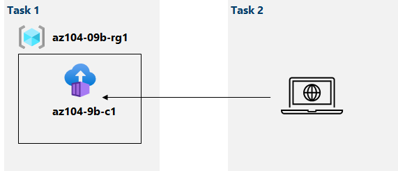

---
lab:
    title: '09b - Implement Azure Container Instances'
    module: 'Administer Serverless Computing'
---

# Lab 09b - Implement Azure Container Instances
# Student lab manual

## Lab scenario

Contoso wants to find a new platform for its virtualized workloads. You identified a number of container images that can be leveraged to accomplish this objective. Since you want to minimize container management, you plan to evaluate the use of Azure Container Instances for deployment of Docker images.

**Note:** An **[interactive lab simulation](https://mslabs.cloudguides.com/guides/AZ-104%20Exam%20Guide%20-%20Microsoft%20Azure%20Administrator%20Exercise%2014)** is available that allows you to click through this lab at your own pace. You may find slight differences between the interactive simulation and the hosted lab, but the core concepts and ideas being demonstrated are the same. 

## Objectives

In this lab, you will:

- Task 1: Deploy a Docker image by using the Azure Container Instance
- Task 2: Review the functionality of the Azure Container Instance

## Estimated timing: 20 minutes

## Architecture diagram



## Instructions

### Exercise 1

#### Task 1: Deploy a Docker image by using the Azure Container Instance

In this task, you will create a new container instance for the web application.

1. Sign in to the [Azure portal](https://portal.azure.com).

1. In the Azure portal, search for locate **Container instances** and then, on the **Container instances** blade, click **+ Create**.

1. On the **Basics** tab of the **Create container instance** blade, specify the following settings (leave others with their default values):

    | Setting | Value |
    | ---- | ---- |
    | Subscription | the name of the Azure subscription you are using in this lab |
    | Resource group | the name of a new resource group **az104-09b-rg1** |
    | Container name | **az104-9b-c1** |
    | Region | the name of a region where you can provision Azure container instances |
    | Image Source | **Quickstart images** |
    | Image | **mcr.microsoft.com/azuredocs/aci-helloworld:latest (Linux)** |

1. Click **Next: Networking >** and, on the **Networking** tab of the **Create container instance** blade, specify the following settings (leave others with their default values):

    | Setting | Value |
    | --- | --- |
    | DNS name label | any valid, globally unique DNS host name |

    >**Note**: Your container will be publicly reachable at dns-name-label.region.azurecontainer.io. If you receive a **DNS name label not available** error message, specify a different value.

1. Click **Next: Advanced >**, review the settings on the **Advanced** tab of the **Create container instance** blade without making any changes, click **Review + Create**, ensure that the validation passed and click **Create**.

    >**Note**: Wait for the deployment to complete. This should take about 3 minutes.

    >**Note**: While you wait, you may be interested in viewing the [code behind the sample application](https://github.com/Azure-Samples/aci-helloworld). To view it, browse the \\app folder.

#### Task 2: Review the functionality of the Azure Container Instance

In this task, you will review the deployment of the container instance.

1. On the deployment blade, click the **Go to resource** link.

1. On the **Overview** blade of the container instance, verify that **Status** is reported as **Running**.

1. Copy the value of the container instance **FQDN**, open a new browser tab, and navigate to the corresponding URL.

1. Verify that the **Welcome to Azure Container Instance** page is displayed.

1. Close the new browser tab, back in the Azure portal, in the **Settings** section of the container instance blade, click **Containers**, and then click **Logs**.

1. Verify that you see the log entries representing the HTTP GET request generated by displaying the application in the browser.

#### Clean up resources

>**Note**: Remember to remove any newly created Azure resources that you no longer use. Removing unused resources ensures you will not see unexpected charges.

>**Note**:  Don't worry if the lab resources cannot be immediately removed. Sometimes resources have dependencies and take a long time to delete. It is a common Administrator task to monitor resource usage, so just periodically review your resources in the Portal to see how the cleanup is going. 

1. In the Azure portal, open the **PowerShell** session within the **Cloud Shell** pane.

1. List all resource groups created throughout the labs of this module by running the following command:

   ```powershell
   Get-AzResourceGroup -Name 'az104-09b*'
   ```

1. Delete all resource groups you created throughout the labs of this module by running the following command:

   ```powershell
   Get-AzResourceGroup -Name 'az104-09b*' | Remove-AzResourceGroup -Force -AsJob
   ```

    >**Note**: The command executes asynchronously (as determined by the -AsJob parameter), so while you will be able to run another PowerShell command immediately afterwards within the same PowerShell session, it will take a few minutes before the resource groups are actually removed.

#### Review

In this lab, you have:

- Deployed a Docker image by using the Azure Container Instance
- Reviewed the functionality of the Azure Container Instance
