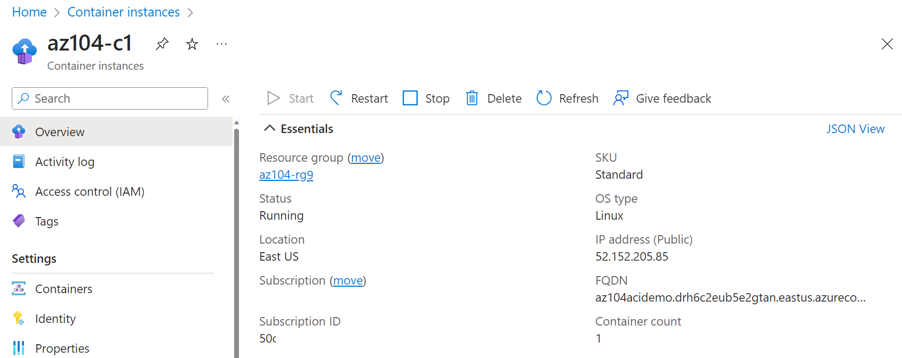

---
lab:
    title: 'Lab 09b: Implement Azure Container Instances'
    module: 'Administer PaaS Compute Options'
---

# Lab 09b - Implement Azure Container Instances

## Lab introduction

In this lab, you learn how to implement and deploy Azure Container Instances.

This lab requires an Azure subscription. Your subscription type may affect the availability of features in this lab. You may change the region, but the steps are written using **East US**.

## Estimated timing: 15 minutes

## Lab scenario

Your organization has a web application that runs on a virtual machine in your on-premises data center. The organization wants to move all applications to the cloud but doesn't want to have a large number of servers to manage. You decide to evaluate Azure Container Instances and Docker. 
## Interactive lab simulations

There are interactive lab simulations that you might find useful for this topic. The simulation lets you to click through a similar scenario at your own pace. There are differences between the interactive simulation and this lab, but many of the core concepts are the same. An Azure subscription is not required.

+ [Deploy Azure Container Instances](https://mslearn.cloudguides.com/en-us/guides/AZ-900%20Exam%20Guide%20-%20Azure%20Fundamentals%20Exercise%203). Create, configure, and deploy a Docker container with Azure Container Instances.
  
+ [Implement Azure Container Instances](https://mslabs.cloudguides.com/guides/AZ-104%20Exam%20Guide%20-%20Microsoft%20Azure%20Administrator%20Exercise%2014).  Deploy a Docker image using Azure Container Instances. 

## Job skills

- Task 1: Deploy an Azure Container Instance using a Docker image.
- Task 2: Test and verify deployment of an Azure Container Instance.

## Architecture diagram

## Task 1: Deploy an Azure Container Instance using a Docker image

In this task, you will create a simple web application using a Docker image. Docker is a platform that provides the ability to package and run applications in isolated environments called containers. Azure Container Instances provides the compute environment for the container image.

1. Sign in to the **Azure portal** - `https://portal.azure.com`.

1. In the Azure portal, search for and select `Container instances` and then, on the **Container instances** blade, click **+ Create**.

1. On the **Basics** tab of the **Create container instance** blade, specify the following settings (leave others with their default values):

    | Setting | Value |
    | ---- | ---- |
    | Subscription | Select your Azure subscription |
    | Resource group | `az104-rg9` (If necessary, select **Create new**) |
    | Container name | `az104-c1` |
    | Region | **East US** (or a region available near you)|
    | Image Source | **Quickstart images** |
    | Image | **mcr.microsoft.com/azuredocs/aci-helloworld:latest (Linux)** |

1. Click **Next: Networking >** and specify the following settings (leave others with their default values):

    | Setting | Value |
    | --- | --- |
    | DNS name label | any valid, globally unique DNS host name |

    >**Note**: Your container will be publicly reachable at dns-name-label.region.azurecontainer.io. If you receive a **DNS name label not available** error message, specify a different value.

1. Click **Next: Advanced >**, review the settings without making any changes.

 1. Click **Review + Create**, ensure that the validation passed and then select **Create**.

    >**Note**: Wait for the deployment to complete. This should take 2-3 minutes.

    >**Note**: While you wait, you may be interested in viewing the [code behind the sample application](https://github.com/Azure-Samples/aci-helloworld). To view the code, browse the \\app folder.

## Task 2: Test and verify deployment of an Azure Container Instance 

In this task, you review the deployment of the container instance. By default, the Azure Container Instance is accessible over port 80. After the instance has been deployed, you can navigate to the container using the DNS name that you provided in the previous task.

1. On the deployment blade, click the **Go to resource** link.

1. On the **Overview** blade of the container instance, verify that **Status** is reported as **Running**.

1. Copy the value of the container instance **FQDN**, open a new browser tab, and navigate to the corresponding URL.

     

1. Verify that the **Welcome to Azure Container Instance** page is displayed. Refresh the page several times to create some log entries then close the browser tab.  

1. In the **Settings** section of the container instance blade, click **Containers**, and then click **Logs**.

1. Verify that you see the log entries representing the HTTP GET request generated by displaying the application in the browser.
   
## Cleanup your resources

If you are working with **your own subscription** take a minute to delete the lab resources. This will ensure resources are freed up and cost is minimized. The easiest way to delete the lab resources is to delete the lab resource group. 

+ In the Azure portal, select the resource group, select **Delete the resource group**, **Enter resource group name**, and then click **Delete**.
+ Using Azure PowerShell, `Remove-AzResourceGroup -Name resourceGroupName`.
+ Using the CLI, `az group delete --name resourceGroupName`.

## Key takeaways

Congratulations on completing the lab. Here are the main takeaways for this lab. 

+ Azure Container Instances (ACI) is a service that enables you to deploy containers on the Microsoft Azure public cloud.
+ ACI doesn't require you to provision or manage any underlying infrastructure.
+ ACI supports both Linux containers and Windows containers.
+ Workloads on ACI are usually started and stopped by some kind of process or trigger and are usually short-lived. 

## Learn more with self-paced training

+ [Run container images in Azure Container Instances](https://learn.microsoft.com/training/modules/create-run-container-images-azure-container-instances/). Learn how Azure Container Instances can help you quickly deploy containers, how to set environment variables, and specify container restart policies.

    
