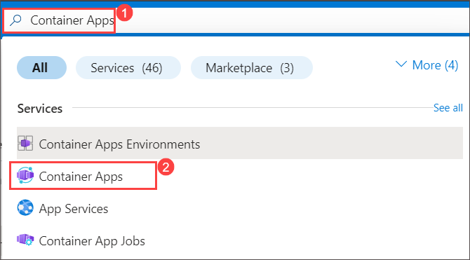
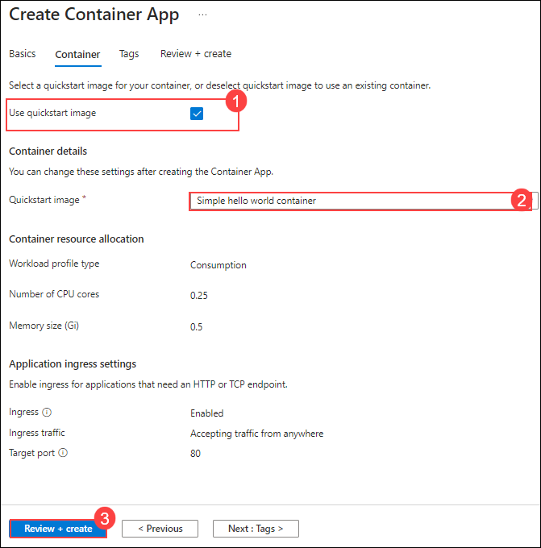
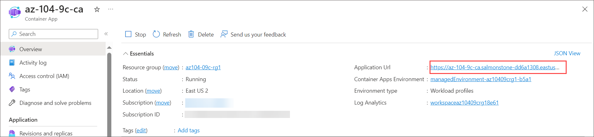
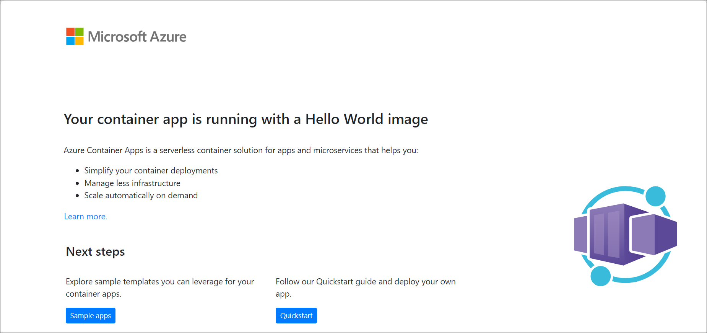

# Lab 09c - Implement Azure Container Apps

## Lab Overview

In this lab, you will learn how to implement and deploy Azure Container Apps (ACA), a serverless platform designed for running containerized applications with minimal infrastructure management. ACA abstracts the complexities of setting up and managing the underlying Kubernetes clusters, allowing you to focus purely on deploying and running containers in the cloud.

## Lab objectives

- Task 1: Create and configure an Azure Container App and environment.
- Task 2: Test and verify deployment of the Azure Container App.

## Exercise 3: Implement Azure Container Apps

In this exercise, you will explore the process of creating and deploying containerized applications using Azure Container Apps (ACA), a fully managed serverless platform

## Task 1: Create and configure an Azure Container App and environment

Azure Container Apps take the concept of a managed Kubernetes cluster a step further and manages the cluster environment as well as provides other managed services on top of the cluster. Unlike an Azure Kubernetes cluster, where you must still manage the cluster, an Azure Container Apps instance removes some of the complexity to setting up a Kubernetes cluster.

1. From the Azure portal, search for and select **Container Apps**.

   
   
1. From **Container Apps**, select **+ Create**.

1. Use the following information to fill out the details on the **Basics** tab and click on **Next: Container >**

    | Setting | Action |
    |---|---|
    | Subscription | Select your Azure subscription |
    | Resource group | az104-09c-rg1 |
    | Container app name |  az-104-9c-ca |
    | Region    | **<inject key="Region" enableCopy="false" />** |
    | Container Apps Environment |  Select **Create new** > Environment name to **my-environment** > **Create** |
   
1. On the **Container** tab, ensure that **Use quickstart image** (1) is enabled and that the quickstart image is set to **Simple hello world container** (2). Select the **Review + create** (3). 

   

1. Select **Create**.

    >**Note:** Wait for the container app to deploy. This will take a couple of minutes. 
 
## Task 2: Test and verify deployment of the Azure Container App

By default, the Azure container app that you create will accept traffic on port 80 using the sample Hello World application. Azure Container Apps will provide a DNS name for the application. Copy and navigate to this URL to ensure that the application is up and running.

1. Select **Go to resource** to view your new container app.

1. Select the link next to *Application URL* to view your application.

   

1. Verify you receive the **Your Azure Container Apps app is live** message.
   
   

   <validation step="d5792eb0-ed59-4287-ae1b-9e66e706f1d3" />
   
  > **Congratulations** on completing the task! Now, it's time to validate it. Here are the steps:
  > - Hit the Validate button for the corresponding task. If you receive a success message, you can proceed to the next task. 
  > - If not, carefully read the error message and retry the step, following the instructions in the lab guide.
  > - If you need any assistance, please contact us at cloudlabs-support@spektrasystems.com. We are available 24/7 to help

### Review
In this lab, you have completed the following:

- Created and configured an Azure Container App and environment.
- Tested and verified deployment of the Azure Container App.

## Extend your learning with Copilot
Copilot can assist you in learning how to use the Azure scripting tools. Copilot can also assist in areas not covered in the lab or where you need more information. Open an Edge browser and choose Copilot (top right) or navigate to *copilot.microsoft.com*. Take a few minutes to try these prompts.

+ Summarize the steps to create and configure an Azure Container App.
+ Compare and contrast Azure Container Apps to Azure Kubernetes Service.

## Learn more with self-paced training

+ [Configure a container app in Azure Container Apps](https://learn.microsoft.com/training/modules/configure-container-app-azure-container-apps/). Examines the features and capabilities of Azure Container Apps, and then focuses on how to create, configure, scale, and manage container apps using Azure Container Apps.

## Key takeaways

Congratulations on completing the lab. Here are the main takeaways for this lab. 

+ Azure Container Apps (ACA) is a serverless platform that allows you to maintain less infrastructure and save costs while running containerized applications.
+ Container Apps provides server configuration, container orchestration, and deployment details. 
+ Workloads on ACA are usually long-running processes like a Web App.

### You have successfully completed the lab

     
