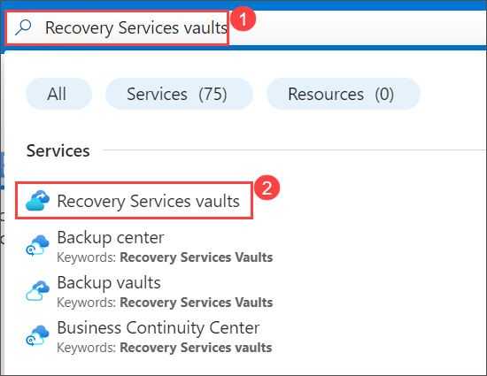
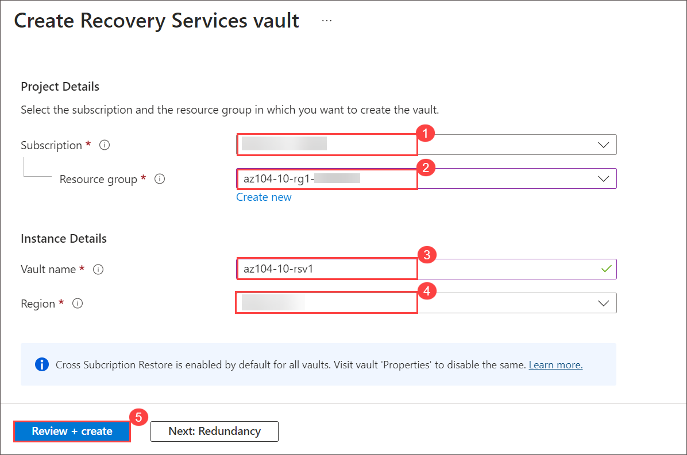
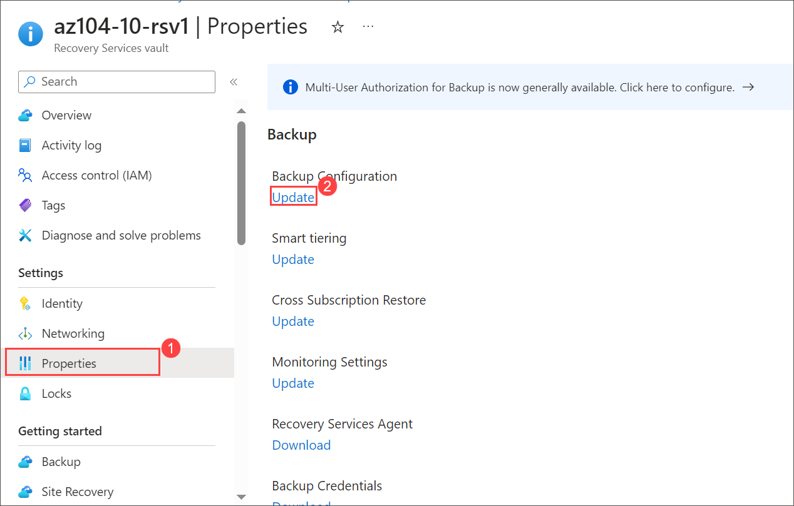
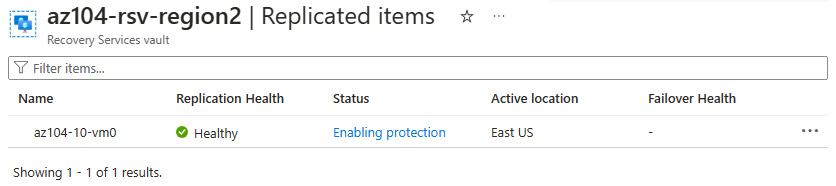

# Lab 10 - Backup virtual machines
## Lab scenario
You have been tasked with evaluating the use of Azure Recovery Services for backup and restore of files hosted on Azure virtual machines and on-premises computers. In addition, you want to identify methods of protecting data stored in the Recovery Services vault from accidental or malicious data loss.

## Lab objectives
In this lab, you will complete the following tasks:
+ Task 1: Provision the lab environment
+ Task 2: Create a Recovery Services vault
+ Task 3: Implement Azure virtual machine-level backup
+ Task 4: Implement File and Folder backup
+ Task 5: Perform file recovery by using the Azure Recovery Services agent
+ Task 6: Perform file recovery by using Azure virtual machine snapshots (optional)
+ Task 7: Review the Azure Recovery Services soft delete functionality (optional)

## Estimated timing: 50 minutes

## Architecture diagram

## Excercise 1: Backup virtual machines

### Task 1: Provision the lab environment
In this task, you will deploy two virtual machines that will be used to test different backup scenarios.

1. In the Azure portal search for and select `Deploy a custom template`.

1. On the custom deployment page, select **Build you own template in the editor**.

1. On the edit template page, select **Load file**.

1. Locate and select the **C:\AllFiles\AZ-104-MicrosoftAzureAdministrator-Lab-Files\Allfiles\Labs\10\az104-10-vms-edge-template.json** file and select **Open**.

   >**Note:** Take a moment to review the template. We are deploying a virtual network and virtual machine so we can demonstrate backup and recovery. 

1. **Save** your changes.

1. Select **Edit parameters** and then **Load file**.

1. Load and select the **C:\AllFiles\AZ-104-MicrosoftAzureAdministrator-Lab-Files\Allfiles\Labs\10\az104-10-vms-edge-parameters.json** file.

1. **Save** your changes.

1. Use the following information to complete the custom deployment fields, leaving all other fields with their default values:

    | Setting       | Value         | 
    | ---           | ---           |
    | Subscription  | Your Azure subscription |
    | Resource group| az104-10-rg1 (If necessary, select **Create new**)
    | Region        | **East US**   |
    | Password      | Provide a complex password |

1. Select **Review + Create**, then select **Create**.

    >**Note:** Wait for the template to deploy, then select **Go to resource**. You should have one virtual machine in one virtual network. 

### Task 2: Create a Recovery Services vault
In this task, you will create a recovery services vault.

1. Navigate to the **Home** page, search for and select **Recovery Services vaults** and, on the **Recovery Services vaults** blade.

    

1. Click **+ Create**.

1. On the **Create Recovery Services vault** blade, specify the following settings and click **Review + Create**.

    | Settings | Value |
    | --- | --- |
    | Subscription | the name of the Azure subscription you are using in this lab |
    | Resource group | Select resource group **az104-10-rg1-<inject key="DeploymentID" enableCopy="false"/>** |
    | Vault Name | **az104-10-rsv1** |
    | Region | the name of a region which you copied in previous steps |

    >**Note**: Make sure that you specify the same region into which you deployed virtual machines in the previous task.

    
     
1. Ensure that the validation has passed, and click **Create**.

    >**Note**: Wait for the deployment to complete. The deployment should take less than 1 minute.

1. When the deployment is completed, click **Go to Resource**.

1. On the **az104-10-rsv1** Recovery Services vault blade, in the **Settings** section, click **Properties**.

1. On the **az104-10-rsv1 - Properties** blade, click the **Update** link under **Backup Configuration** label.

    

1. On the **Backup Configuration** blade, review the choices for **Storage replication type**. Leave the default setting of **Geo-redundant** in place and close the blade.

    >**Note**: This setting can be configured only if there are no existing backup items.

1. Back on the **az104-10-rsv1 - Properties** blade, click the **Update** link underunder **Security Settings > Soft Delete and security settings** label.

1. On the **Security Settings** blade, note that **Soft Delete (For workload running in Azure)** is **Enabled**. Notice the **soft delete retention period** is **14** days. 

1. Return to the Recovery Services vault blade, select the **Overview** blade.

>**Did you know?** Azure has two types of vaults: Recovery Services vaults and Backup vaults. The main difference is the datasources that can be backed up. Learn more about [the differences](https://learn.microsoft.com/answers/questions/405915/what-is-difference-between-recovery-services-vault).

### Task 3: Implement Azure virtual machine-level backup
In this task, you will implement Azure virtual-machine level backup.

   >**Note**: Before you start this task, make sure that the deployment you initiated in the first task of this lab has successfully completed. You can check that by going to the respected resource group in the Azure portal and on the overview page of the resource group click on **Deployments**.

1. On the **az104-10-rsv1** Recovery Services vault blade, click **Overview**, then click **+ Backup**.

1. On the **Backup Goal** blade, specify the following settings:

    | Settings | Value |
    | --- | --- |
    | Where is your workload running? | **Azure** |
    | What do you want to backup? | **Virtual machine** |

1. On the **Backup Goal** blade, click **Backup**.

1. On **Configure backup** in **Backup policy**, review the **DefaultPolicy** settings and select **Create a new policy**.

1. Define a new backup policy with the following settings (leave others with their default values):

    | Setting | Value |
    | ---- | ---- |
    | Policy name | **az104-10-backup-policy** |
    | Frequency | **Daily** |
    | Time | **12:00 AM** |
    | Timezone | the name of your local time zone |
    | Retain instant recovery snapshot(s) for | **2** Days(s) |

1. Click **OK** to create the policy and then, in the **Virtual Machines** section, select **Add**.

1. On the **Select virtual machines** blade, select **az-104-10-vm0**, click **OK**, and, back on the **Backup** blade, click **Enable backup**.

    >**Note**: Wait for the backup to be enabled. This should take about 2 minutes.

1. Once deployment finish click on **Go to Resouces**.
   
1. Navigate back to the **az104-10-rsv1** Recovery Services vault blade, in the **Protected items** section, click **Backup items**, and then under Backup Management type select the **Azure virtual machines**  entry.

1. On the **Backup Items (Azure Virtual Machine)** blade, select the View details link for **az104-10-vm0**, and review the values of the Backup Pre-Check and Last Backup Status entries.

1. On the **az104-10-vm0** Backup Item blade, click **Backup now**, accept the default value in the **Retain Backup Till** drop-down list, and click **OK**.

    >**Note**: Do not wait for the backup to complete but instead proceed to the next task.

## Task 4: Monitor Azure Backup

In this task, you will deploy an Azure storage account. Then you will configure the vault to send the logs and metrics to the storage account. This repository can then be used with Log Analytics or other third-party monitoring solutions.

1. From the Azure portal, search for and select `Storage accounts`.

1. On the Storage accounts page, select **Create**.

1. Use the following information to define the storage account, then and select **Review**.

    | Settings | Value |
    | --- | --- | 
    | Subscription          | *Your subscription*    |
    | Resource group        | **az104-rg-region1**        |
    | Storage account name  | Provide a globally unique name   |
    | Region                | **East US**   |

1. On the Review tab, select **Create**.

    >**Note**: Wait for the deployment to complete. It should take about a minute.

1. Search and select your Recovery Services vault.

1. Select **Diagnostic Settings** and then select **Add diagnostic setting**.

1. Name the setting `Logs and Metrics to storage`.

1. Place a checkmark next to the following log and metric categories:

    - **Azure Backup Reporting Data**
    - **Addon Azure Backup Job Data**
    - **Addon Azure Backup Alert Data**
    - **Azure Site Recovery Jobs**
    - **Azure Site Recovery Events**
    - **Health**

1. In the Destination details, place a checkmark next to **Archive to a storage account**.

1. In the Storage account drop-down field, select the storage account that you deployed earlier in this task.

1. Select **Save**.

1. Return to your Recovery Services vault, in the **Monitoring** blade select **Backup jobs**.

1. Locate the backup operation for the **az104-10-vm0** virtual machine. 

1. Review the details of the backup job.

## Task 5: Enable virtual machine replication

1. In the Azure portal, search for and select `Recovery Services vaults` and, on the **Recovery Services vaults** blade, click **+ Create**.

1. On the **Create Recovery Services vault** blade, specify the following settings:

    | Settings | Value |
    | --- | --- |
    | Subscription | the name of your Azure subscription |
    | Resource group | `az104-rg-region2` (If necessary, select **Create new**) |
    | Vault Name | `az104-rsv-region2` |
    | Region | **West US** |

    >**Note**: Make sure that you specify a **different** region than the virtual machine.

1. Click **Review + Create**, ensure that the validation passes and then click **Create**.

    >**Note**: Wait for the deployment to complete. The deployment should take a couple of minutes. 

1. Search for and select the `az104-10-vm0` virtual machine.

1. In the **Backup + Disaster recovery** blade, select **Disaster recovery**. 

1. Select **Enable replication**.

1. On the **Basics** tab, notice the **Target region**.

1. Move to the **Advanced settings** tab. Resource selections have been made for you. It is important to review them. 

1. Verify your subscription, vm resource group, virtual network, and availability (take the default) settings.

1. In **Storage settings** select **Show details**.

    | Setting | Value |
    | ---- | ---- |
    | Churn for the vm | **Normal churn**  |
    | Cache storage account | **(new) xxx**  |

   >**Note:** It is important that both of these settings be populated, or the validation will fail. If values are not present, try refreshing the page. If that doesn't work, create an empty storage account and then return to this page.

1. In **Replication settings** select **Show details**. Notice your recovery resources vault in region 2 was automatically selected.

1. Select **Review + Start replication** and then **Enable replication**.

    >**Note**: Enabling replication will take a 10-15 minutes. Watch the notification messages in the upper right of the portal. While you wait, consider reviewing the self-paced training links at the end of this page.
    
1. Once the replication is complete, search for and locate your Recovery Services Vault, **az104-rsv-region2**. You may need to **Refresh** the page. 

1. In the **Protected items** section, select **Replicated items**.

1. Check that the virtual machine is showing as healthy for the replication health. Note that the status will show the synchronization (starting at 0%) status and ultimately show **Protected** after the initial synchronization completes.

   

1. Select the virtual machine to view more details.
   
>**Did you know?** It is a good practice to [test the failover of a protected VM](https://learn.microsoft.com/azure/site-recovery/tutorial-dr-drill-azure#run-a-test-failover-for-a-single-vm).

   > **Congratulations** on completing the task! Now, it's time to validate it. Here are the steps:
   > - Navigate to the Lab Validation Page, from the upper right corner in the lab guide section.
   > - Hit the Validate button for the corresponding task. If you receive a success message, you can proceed to the next task. 
   > - If not, carefully read the error message and retry the step, following the instructions in the lab guide.
   > - If you need any assistance, please contact us at labs-support@spektrasystems.com. We are available 24/7 to help you out.

## Key takeaways

Congratulations on completing the lab. Here are the main takeaways for this lab. 

+ Azure Backup service provides simple, secure, and cost-effective solutions to back up and recover your data.
+ Azure Backup can protect on-premises and cloud resources including virtual machines and file shares.
+ Azure Backup policies configure the frequency of backups and the retention period for recovery points. 
+ Azure Site Recovery is a disaster recovery solution that provides protection for your virtual machines and applications.
+ Azure Site Recovery replicates your workloads to a secondary site, and in the event of an outage or disaster, you can failover to the secondary site and resume operations with minimal downtime.
+ A Recovery Services vault stores your backup data and minimizes management overhead.

## Learn more with self-paced training

+ [Protect your virtual machines by using Azure Backup](https://learn.microsoft.com/training/modules/protect-virtual-machines-with-azure-backup/). Use Azure Backup to help protect on-premises servers, virtual machines, SQL Server, Azure file shares, and other workloads.
+ [Protect your Azure infrastructure with Azure Site Recovery](https://learn.microsoft.com/en-us/training/modules/protect-infrastructure-with-site-recovery/). Provide disaster recovery for your Azure infrastructure by customizing replication, failover, and failback of Azure virtual machines with Azure Site Recovery.

### Review
In this lab, you have completed:
+ Provisioned the lab environment
+ Created a Recovery Services vault
+ Implemented Azure virtual machine-level backup
+ Implemented File and Folder backup
+ Performed file recovery by using Azure Recovery Services agent
+ Performed file recovery by using Azure virtual machine snapshots
+ Reviewed the Azure Recovery Services soft delete functionality

### You have successfully completed the lab
