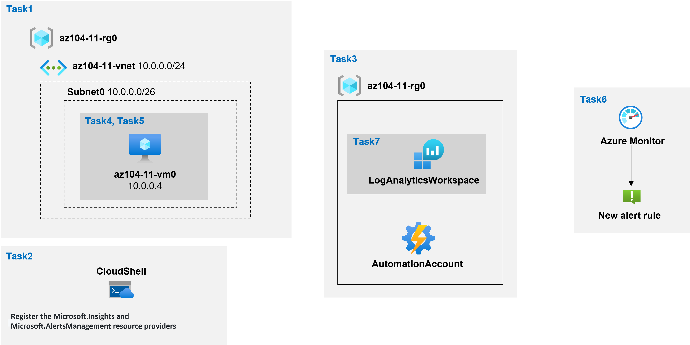

---
lab:
    title: '11 - Implement Monitoring'
    module: 'Administer Monitoring'
---

# Lab 11 - Implement Monitoring
# Student lab manual

## Lab scenario

You need to evaluate Azure functionality that would provide insight into performance and configuration of Azure resources, focusing in particular on Azure virtual machines. To accomplish this, you intend to examine the capabilities of Azure Monitor, including Log Analytics.

**Note:** An **[interactive lab simulation](https://mslabs.cloudguides.com/guides/AZ-104%20Exam%20Guide%20-%20Microsoft%20Azure%20Administrator%20Exercise%2017)** is available that allows you to click through this lab at your own pace. You may find slight differences between the interactive simulation and the hosted lab, but the core concepts and ideas being demonstrated are the same. 

## Objectives

In this lab, you will:

+ Task 1: Provision the lab environment
+ Task 2: Register the Microsoft.Insights and Microsoft.AlertsManagement resource providers
+ Task 3: Create and configure an Azure Log Analytics workspace and Azure Automation-based solutions
+ Task 4: Review default monitoring settings of Azure virtual machines
+ Task 5: Configure Azure virtual machine diagnostic settings
+ Task 6: Review Azure Monitor functionality
+ Task 7: Review Azure Log Analytics functionality

## Estimated timing: 45 minutes

## Architecture diagram



## Instructions

### Exercise 1

#### Task 1: Provision the lab environment

In this task, you will deploy a virtual machine that will be used to test monitoring scenarios.

1. Sign in to the [Azure portal](https://portal.azure.com).

1. In the Azure portal, open the **Azure Cloud Shell** by clicking on the icon in the top right of the Azure Portal.

1. If prompted to select either **Bash** or **PowerShell**, select **PowerShell**.

    >**Note**: If this is the first time you are starting **Cloud Shell** and you are presented with the **You have no storage mounted** message, select the subscription you are using in this lab, and click **Create storage**.

1. In the toolbar of the Cloud Shell pane, click the **Upload/Download files** icon, in the drop-down menu, click **Upload** and upload the files **\\Allfiles\\Labs\\11\\az104-11-vm-template.json** and **\\Allfiles\\Labs\\11\\az104-11-vm-parameters.json** into the Cloud Shell home directory.

1. Edit the Parameters file you just uploaded and change the password. If you need help editing the file in the Shell please ask your instructor for assistance. As a best practice, secrets, like passwords, should be more securely stored in the Key Vault. 

1. From the Cloud Shell pane, run the following to create the resource group that will be hosting the virtual machines (replace the `[Azure_region]` placeholder with the name of an Azure region where you intend to deploy Azure virtual machines):

    >**Note**: Make sure to choose one of the regions listed as **Log Analytics Workspace Region** in the referenced in [Workspace mappings documentation](https://docs.microsoft.com/en-us/azure/automation/how-to/region-mappings)

   ```powershell
   $location = '[Azure_region]'

   $rgName = 'az104-11-rg0'

   New-AzResourceGroup -Name $rgName -Location $location
   ```

1. From the Cloud Shell pane, run the following to create the first virtual network and deploy a virtual machine into it by using the template and parameter files you uploaded:

   ```powershell
   New-AzResourceGroupDeployment `
      -ResourceGroupName $rgName `
      -TemplateFile $HOME/az104-11-vm-template.json `
      -TemplateParameterFile $HOME/az104-11-vm-parameters.json `
      -AsJob
   ```

    >**Note**: Do not wait for the deployment to complete but instead proceed to the next task. The deployment should take about 3 minutes.

#### Task 2: Register the Microsoft.Insights and Microsoft.AlertsManagement resource providers.

1. From the Cloud Shell pane, run the following to register the Microsoft.Insights and Microsoft.AlertsManagement resource providers.

   ```powershell
   Register-AzResourceProvider -ProviderNamespace Microsoft.Insights

   Register-AzResourceProvider -ProviderNamespace Microsoft.AlertsManagement
   ```

1. Minimize Cloud Shell pane (but do not close it).

#### Task 3: Create and configure an Azure Log Analytics workspace and Azure Automation-based solutions

In this task, you will create and configure an Azure Log Analytics workspace and Azure Automation-based solutions

1. In the Azure portal, search for and select **Log Analytics workspaces** and, on the **Log Analytics workspaces** blade, click **+ Create**.

1. On the **Basics** tab of the **Create Log Analytics workspace** blade, enter the following settings, click **Review + Create** and then click **Create**:

    | Settings | Value |
    | --- | --- |
    | Subscription | the name of the Azure subscription you are using in this lab |
    | Resource group | the name of a new resource group **az104-11-rg1** |
    | Log Analytics Workspace | any unique name |
    | Region | the name of the Azure region into which you deployed the virtual machine in the previous task |

    >**Note**: Make sure that you specify the same region into which you deployed virtual machines in the previous task.

    >**Note**: Wait for the deployment to complete. The deployment should take about 1 minute.

1. In the Azure portal, search for and select **Automation Accounts**, and on the **Automation Accounts** blade, click **+ Create**.

1. On the **Create an Automation Account** blade, specify the following settings, and click **Review + Create** upon validation click **Create**:

    | Settings | Value |
    | --- | --- |
    | Automation account name | any unique name |
    | Subscription | the name of the Azure subscription you are using in this lab |
    | Resource group | **az104-11-rg1** |
    | Region | the name of the Azure region determined based on [Workspace mappings documentation](https://docs.microsoft.com/en-us/azure/automation/how-to/region-mappings) |

    >**Note**: Make sure that you specify the Azure region based on the [Workspace mappings documentation](https://docs.microsoft.com/en-us/azure/automation/how-to/region-mappings)

    >**Note**: Wait for the deployment to complete. The deployment might take about 3 minutes.

1. Click **Go to resource**.

1. On the Automation account blade, in the **Configuration Management** section, click **Inventory**.

1. In the **Inventory** pane, in the **Log Analytics workspace** drop-down list, select the Log Analytics workspace you created earlier in this task and click **Enable**.

    >**Note**: Wait for the installation of the corresponding Log Analytics solution to complete. This might take about 3 minutes.

    >**Note**: This automatically installs the **Change tracking** solution as well.

1. On the Automation account blade, in the **Update Management** section, click **Update management** and click **Enable**.

    >**Note**: Wait for the installation to complete. This might take about 5 minutes.

#### Task 4: Review default monitoring settings of Azure virtual machines

In this task, you will review default monitoring settings of Azure virtual machines

1. In the Azure portal, search for and select **Virtual machines**, and on the **Virtual machines** blade, click **az104-11-vm0**.

1. On the **az104-11-vm0** blade, in the **Monitoring** section, click **Metrics**.

1. On the **az104-11-vm0 \| Metrics** blade, on the default chart, note that the only available **Metrics Namespace** is **Virtual Machine Host**.

    >**Note**: This is expected, since no guest-level diagnostic settings have been configured yet. You do have, however, the option of enabling guest memory metrics directly from the **Metrics Namespace** drop down-list. You will enable it later in this exercise.

1. In the **Metric** drop-down list, review the list of available metrics.

    >**Note**: The list includes a range of CPU, disk, and network-related metrics that can be collected from the virtual machine host, without having access into guest-level metrics.

1. In the **Metric** drop-down list, select **Percentage CPU**, in the **Aggregation** drop-down list, select **Avg**, and review the resulting chart.

#### Task 5: Configure Azure virtual machine diagnostic settings

In this task, you will configure Azure virtual machine diagnostic settings.

1. On the **az104-11-vm0** blade, in the **Monitoring** section, click **Diagnostic settings**.

1. On the **Overview** tab of the **az104-11-vm0 \| Diagnostic settings** blade, select a **Diagnostic storage account**, and then click **Enable guest-level monitoring**.

    >**Note**: Wait for the diagnostic settings extension to be installed. This might take about 3 minutes.

1. Switch to the **Performance counters** tab of the **az104-11-vm0 \| Diagnostic settings** blade and review the available counters.

    >**Note**: By default, CPU, memory, disk, and network counters are enabled. You can switch to the **Custom** view for more detailed listing.

1. Switch to the **Logs** tab of the **az104-11-vm0 \| Diagnostic settings** blade and review the available event log collection options.

    >**Note**: By default, log collection includes critical, error, and warning entries from the Application Log and System log, as well as Audit failure entries from the Security log. Here as well you can switch to the **Custom** view for more detailed configuration settings.

1. On the **az104-11-vm0** blade, in the **Monitoring** section, click **Logs** and then click **Enable**.

1. On the **az104-11-vm0 - Logs** blade, ensure **Azure Monitor agent (Recommended)** is selected, and then click **Configure**.  

    >**Note**: Do not wait for the operation to be completed, but instead proceed to the next step. The operation might take about 5 minutes.

1. On the **az104-11-vm0 \| Logs** blade, in the **Monitoring** section, click **Metrics**.

1. On the **az104-11-vm0 \| Metrics** blade, on the default chart, note that at this point, the **Metrics Namespace** drop-down list, in addition to the **Virtual Machine Host** entry includes also the **Guest (classic)** entry.

    >**Note**: This is expected, since you enabled guest-level diagnostic settings. You also have the option to **Enable new guest memory metrics**.

1. In the **Metrics Namespace** drop-down list, select  the **Guest (classic)** entry.

1. In the **Metric** drop-down list, review the list of available metrics.

    >**Note**: The list includes additional guest-level metrics not available when relying on the host-level monitoring only.

1. In the **Metric** drop-down list, select **Memory\\Available Bytes**, in the **Aggregation** drop-down list, select **Max**, and review the resulting chart.

#### Task 6: Review Azure Monitor functionality

1. In the Azure portal, search for and select **Monitor** and, on the **Monitor \| Overview** blade, click **Metrics**.

1. On the **Select a scope** blade, on the **Browse** tab, navigate to the **az104-11-rg0** resource group, expand it, select the checkbox next to the **az104-11-vm0** virtual machine entry within that resource group, and click **Apply**.

    >**Note**: This gives you the same view and options as those available from the **az104-11-vm0 - Metrics** blade.

1. In the **Metric** drop-down list, select **Percentage CPU**, in the **Aggregation** drop-down list, select **Avg**, and review the resulting chart.

1. On the **Monitor \| Metrics** blade, on the **Avg Percentage CPU for az104-11-vm0** pane, click **New alert rule**.

    >**Note**: Creating an alert rule from Metrics is not supported for metrics from the Guest (classic) metric namespace. This can be accomplished by using Azure Resource Manager templates, as described in the document [Send Guest OS metrics to the Azure Monitor metric store using a Resource Manager template for a Windows virtual machine](https://docs.microsoft.com/en-us/azure/azure-monitor/platform/collect-custom-metrics-guestos-resource-manager-vm)

1. On the **Create alert rule** blade, in the **Condition** section, click the existing condition entry.

1. On the **Configure signal logic** blade, in the list of signals, in the **Alert logic** section, specify the following settings (leave others with their default values) and click **Done**:

    | Settings | Value |
    | --- | --- |
    | Threshold | **Static** |
    | Operator | **Greater than** |
    | Aggregation type | **Average** |
    | Threshold value | **2** |
    | Aggregation granularity (Period) | **1 minute** |
    | Frequency of evaluation | **Every 1 Minute** |

1. Click **Next: Actions >**, on the **Create an alert rule** blade, in the **Action group** section, click the **+ Create action group** button.

1. On the **Basics** tab of the **Create action group** blade, specify the following settings (leave others with their default values) and select **Next: Notifications >**:

    | Settings | Value |
    | --- | --- |
    | Subscription | the name of the Azure subscription you are using in this lab |
    | Resource group | **az104-11-rg1** |
    | Action group name | **az104-11-ag1** |
    | Display name | **az104-11-ag1** |

1. On the **Notifications** tab of the **Create an action group** blade, in the **Notification type** drop-down list, select **Email/SMS message/Push/Voice**. In the **Name** text box, type **admin email**. Click the **Edit details** (pencil) icon.

1. On the **Email/SMS message/Push/Voice** blade, select the **Email** checkbox, type your email address in the **Email** textbox, leave others with their default values, click **OK**, back on the **Notifications** tab of the **Create an action group** blade, select **Next: Actions  >**.

1. On the **Actions** tab of the **Create action group** blade, review items available in the **Action type** drop-down list without making any changes and select **Review + create**.

1. On the **Review + create** tab of the **Create action group** blade, select **Create**.

1. Back on the **Create alert rule** blade, click **Next: Details >**, and in the **Alert rule details** section, specify the following settings (leave others with their default values):

    | Settings | Value |
    | --- | --- |
    | Alert rule name | **CPU Percentage above the test threshold** |
    | Alert rule description | **CPU Percentage above the test threshold** |
    | Severity | **Sev 3** |
    | Enable upon creation | **Yes** |

1. Click **Review + create** and on the **Review + create** tab click **Create**.

    >**Note**: It can take up to 10 minutes for a metric alert rule to become active.

1. In the Azure portal, search for and select **Virtual machines**, and on the **Virtual machines** blade, click **az104-11-vm0**.

1. On the **az104-11-vm0** blade, click **Connect**, in the drop-down menu, click **RDP**, on the **Connect with RDP** blade, click **Download RDP File** and follow the prompts to start the Remote Desktop session.

    >**Note**: This step refers to connecting via Remote Desktop from a Windows computer. On a Mac, you can use Remote Desktop Client from the Mac App Store and on Linux computers you can use an open source RDP client software.

    >**Note**: You can ignore any warning prompts when connecting to the target virtual machines.

1. When prompted, sign in by using the **Student** username and the password from the parameters file.

1. Within the Remote Desktop session, click **Start**, expand the **Windows System** folder, and click **Command Prompt**.

1. From the Command Prompt, run the following to trigger increased CPU utilization on the **az104-11-vm0** Azure VM:

   ```sh
   for /l %a in (0,0,1) do echo a
   ```

    >**Note**: This will initiate the infinite loop that should increase the CPU utilization above the threshold of the newly created alert rule.

1. Leave the Remote Desktop session open and switch back to the browser window displaying the Azure portal on your lab computer.

1. In the Azure portal, navigate back to the **Monitor** blade and click **Alerts**.

1. Note the number of **Sev 3** alerts and then click the **Sev 3** row.

    >**Note**: You might need to wait for a few minutes and click **Refresh**.

1. On the **All Alerts** blade, review generated alerts.

#### Task 7: Review Azure Log Analytics functionality

1. In the Azure portal, navigate back to the **Monitor** blade, click **Logs**.

    >**Note**: You might need to click **Get Started** if this is the first time you access Log Analytics.

1. If necessary, click **Select scope**, on the **Select a scope** blade, select the **Recent** tab, select **az104-11-vm0**, and click **Apply**.

1. In the query window, paste the following query, click **Run**, and review the resulting chart:

   ```sh
   // Virtual Machine available memory
   // Chart the VM's available memory over the last hour.
   InsightsMetrics
   | where TimeGenerated > ago(1h)
   | where Name == "AvailableMB"
   | project TimeGenerated, Name, Val
   | render timechart
   ```

    > **Note**: The query should not have any errors (indicated by red blocks on the right scroll bar). If the query will not paste without errors directly from the instructions, paste the query code into a text editor such as Notepad, and then copy and paste it into the query window from there.


1. Click **Queries** in the toolbar, on the **Queries** pane, locate the **Track VM availability** tile and double-click it to fill the query window, click the **Run** command button in the tile, and review the results.

1. On the **New Query 1** tab, select the **Tables** header, and review the list of tables in the **Virtual machines** section.

    >**Note**: The names of several tables correspond to the solutions you installed earlier in this lab.

1. Hover the mouse over the **VMComputer** entry and click the **See Preview data** icon.

1. If any data is available, in the **Update** pane, click **Use in editor**.

    >**Note**: You might need to wait a few minutes before the update data becomes available.

#### Clean up resources

>**Note**: Remember to remove any newly created Azure resources that you no longer use. Removing unused resources ensures you will not see unexpected charges.

>**Note**:  Don't worry if the lab resources cannot be immediately removed. Sometimes resources have dependencies and take a longer time to delete. It is a common Administrator task to monitor resource usage, so just periodically review your resources in the Portal to see how the cleanup is going. 

1. In the Azure portal, open the **PowerShell** session within the **Cloud Shell** pane.

1. List all resource groups created throughout the labs of this module by running the following command:

   ```powershell
   Get-AzResourceGroup -Name 'az104-11*'
   ```

1. Delete all resource groups you created throughout the labs of this module by running the following command:

   ```powershell
   Get-AzResourceGroup -Name 'az104-11*' | Remove-AzResourceGroup -Force -AsJob
   ```

    >**Note**: The command executes asynchronously (as determined by the -AsJob parameter), so while you will be able to run another PowerShell command immediately afterwards within the same PowerShell session, it will take a few minutes before the resource groups are actually removed.

#### Review

In this lab, you have:

+ Provisioned the lab environment
+ Created and configured an Azure Log Analytics workspace and Azure Automation-based solutions
+ Reviewed default monitoring settings of Azure virtual machines
+ Configured Azure virtual machine diagnostic settings
+ Reviewed Azure Monitor functionality
+ Reviewed Azure Log Analytics functionality
