# Lab 11 - Implement Monitoring

## Lab Overview

In this lab, you will explore Azure Monitor's capabilities to gain insights into the performance and configuration of Azure resources, particularly focusing on virtual machines.

## Lab objectives

In this lab, you will complete the following tasks:

+ Task 1: Use a template to provision an infrastructure.
+ Task 2: Create an alert.
+ Task 3: Configure action group notifications.
+ Task 4: Trigger an alert and confirm it is working.
+ Task 5: Configure an alert processing rule.
+ Task 6: Use Azure Monitor log queries.

## Exercise 1: Implement Monitoring

This exercise involves setting up Azure Monitor to track the performance and configuration of Azure resources, with a focus on virtual machines.

## Task 1: Use a template to provision an infrastructure

In this task, you will deploy a virtual machine (VM) on Azure, which will serve as the test environment for monitoring various Azure resources. 

1. In the Azure Portal page, in the **Search resources, services and docs (G+/)** box at the top of the portal search for **Deploy a custom template (1)** and select **Deploy a custom template (2)** resource.

   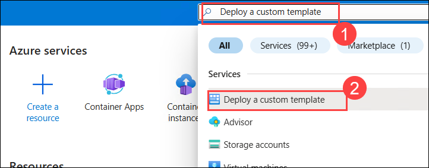

1. On the custom deployment page, select **Build you own template in the editor**.

1. On the edit template page, select **Load file** option.

1. Locate and select the **C:\AllFiles\AZ-104-MicrosoftAzureAdministrator-Lab-Files\Allfiles\Labs\11 (1)** then **az104-11-vm-template.json (2)** file and select **Open (3)**.

   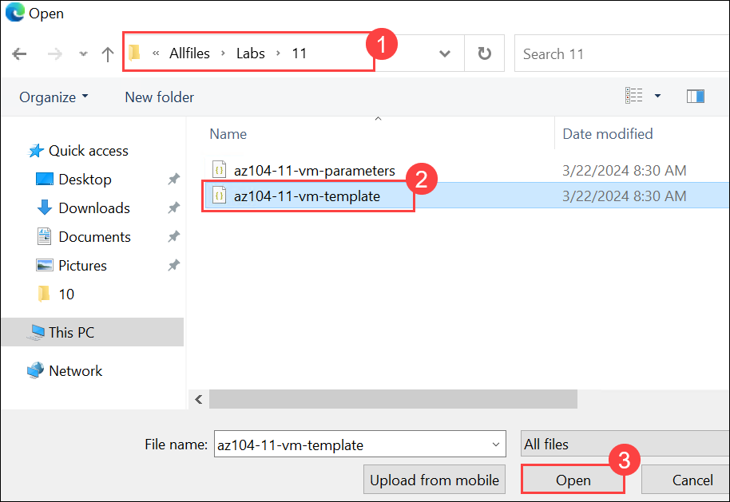

1. Select **Save**.

1. Use the following information to complete the custom deployment fields, leaving all other fields with their default values:

    | Setting       | Value         | 
    | ---           | ---           |
    | Subscription  | Your Azure subscription (1) |
    | Resource group| **az104-rg2** (2)|
    | Region        |  **<inject key="Region" enableCopy="false" />** (3) |
    | Admin Username| **Student** (4)|
    | Password      | **Pa55w.rd!!**  (5)|

    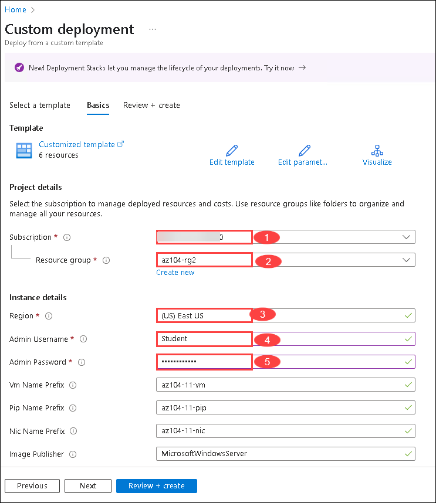
    
1. Select **Review + create**, then select **Create**.

1. Wait for the deployment to finish, then click **Go to resource group**.

1. Review what resources were deployed. There should be one virtual network with one virtual machine.

**1.1 Configure Azure Monitor for virtual machines (this will be used in the last task)**

1. In the portal, search for **Monitor (1)** and select **Monitor (2)** resource.

    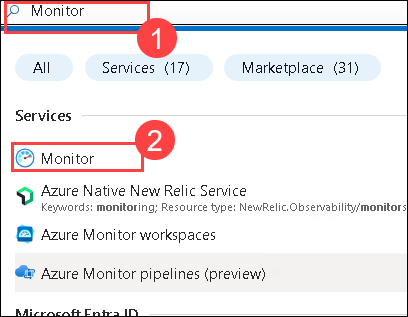

1. Take a minute to review all the insights, detection, triage, and diagnosis tools that are available.

1. Select **View** in the **VM Insights** box.

   

1. Now select **Configure Insights**.

1. Select your virtual machine, expand **az104-rg2 (1)** abd then select **az104-11-vm0 (2)**.

    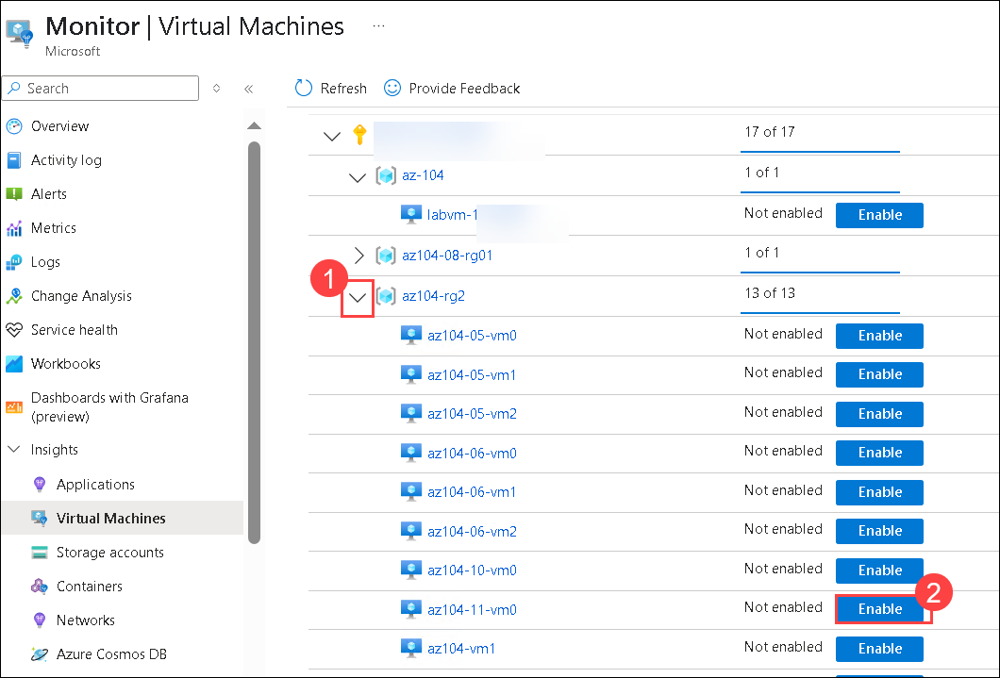

1. Then **Enable** (twice).    

   

1. Take the defaults for subscription and data collection rules, then select **Configure**. 

1. It will take a few minutes for the virtual machine agent to install and configure, please proceed to the next step.

## Task 2: Create an alert

In this task, you will set up an alert within Azure Monitor to notify you when a virtual machine (VM) is deleted. Alerts are vital for proactive monitoring, helping you stay informed about critical changes in your resources.

1. Continue on the **Monitor** page , select **Alerts**.

   

1. Select **+ Create** and select **Alert rule**.

   

1. Select the check box for the **az104-rg2 (1)** resource group, then select **Apply (2)**. This alert will apply to any virtual machines in the resource group. Alternatively, you could just specify one particular machine. 

   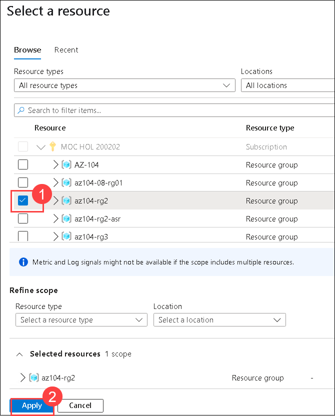

1. Select the **Condition** tab and then select the **See all signals** link.

   

1. Search for and select **Delete Virtual Machine (Virtual Machines) (1)**. Notice the other built-in signals. Select **Apply (2)**

    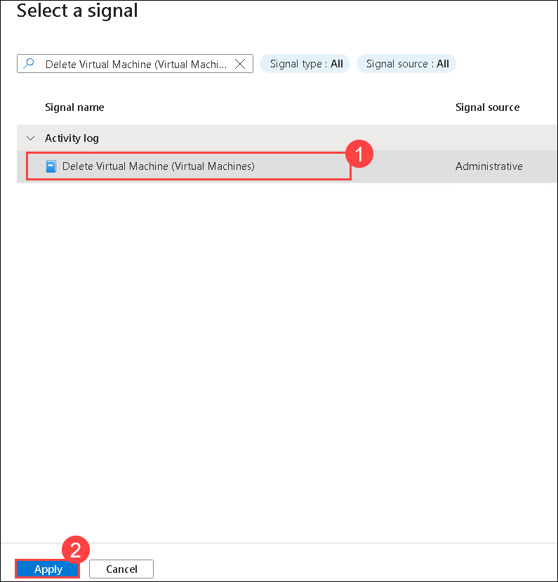

1. In the **Alert logic** area (scroll down), review the **Event level** selections. Leave the default of **All selected**.

1. Review the **Status** selections. Leave the default of **All selected**.

1. Leave the **Create an alert rule** pane open for the next task.

## Task 3: Configure action group notifications

In this task, you will configure an action group that sends an email notification to the operations team when the previously created alert is triggered. 

1. Continue working on your alert. Select **Next: Actions >**, and click on **Create Action group**.

    >**Did you know?** You can add up to five action groups to an alert rule. Action groups are executed concurrently, in no specific order. Multiple alert rules can use the same action group. 

1. On the **Basics** tab, enter the following values for each setting.

    | Setting | Value |
    |---------|---------|
    | **Project details** |
    | Subscription | your subscription (1) |
    | Resource group | **az104-rg2** (2) |
    | Region | **Global** (default) |
    | **Instance details** |
    | Action group name | `Alert the operations team` (must be unique in the resource group) (3) |
    | Display name | `AlertOpsTeam` (4) |

    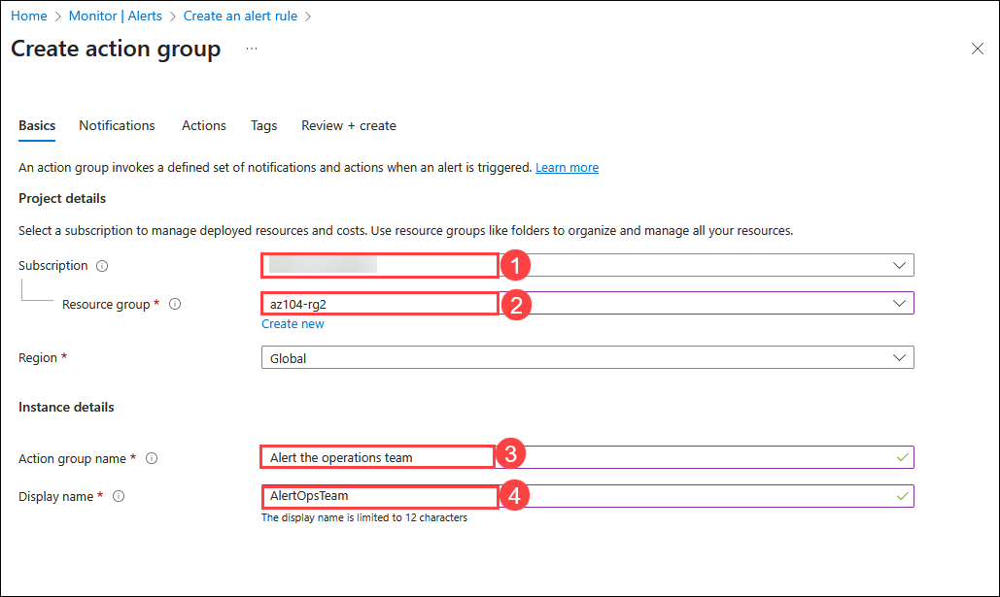

1. Select **Next: Notifications >** and enter the following values for each setting.

    | Setting | Value |
    |---------|---------|
    | Notification type | Select **Email/SMS message/Push/Voice** |
    | Name | `VM was deleted` |

1. Click on the **Edit (pencil icon)** icon next to the email entry.

   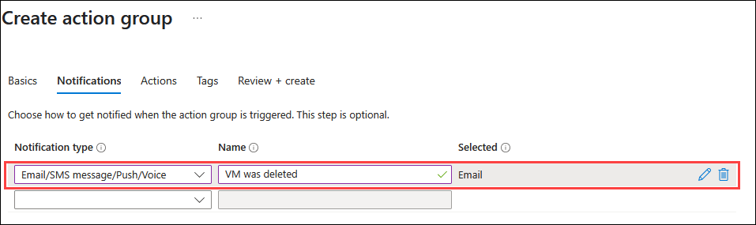

1. Select **Email (1)**, in the **Email** box, enter your personal email address **(2)**, and then select **OK (3)**.

    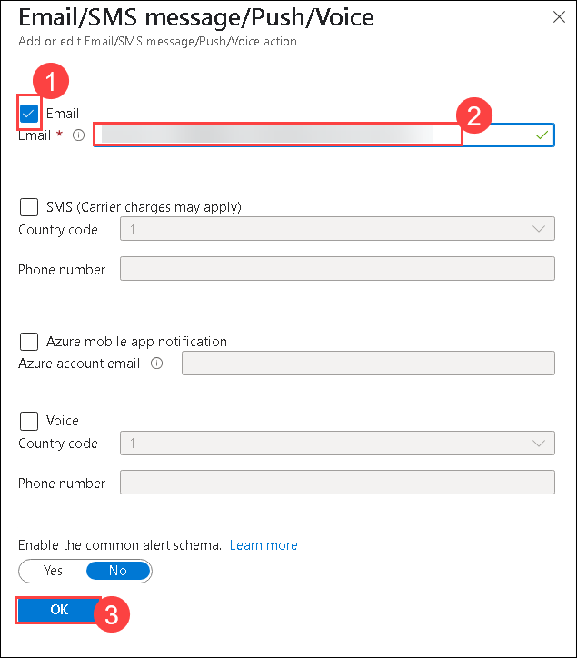

1. Select **Review + create** and subsequently click on **Create**. 

   >**Note:** You should receive an email notification saying you were added to an action group. There may be a few minutes delay, but that is a sure sign the rule has deployed.

1. Once the action group is created move to the **Next: Details >** tab and enter the following values for each setting and then select **Review+create (3)**:

    | Setting | Value |
    |---------|---------|
    | Alert rule name | `VM was deleted` **(1)** |
    | Alert rule description | `A VM in your resource group was deleted` **(2)** |

    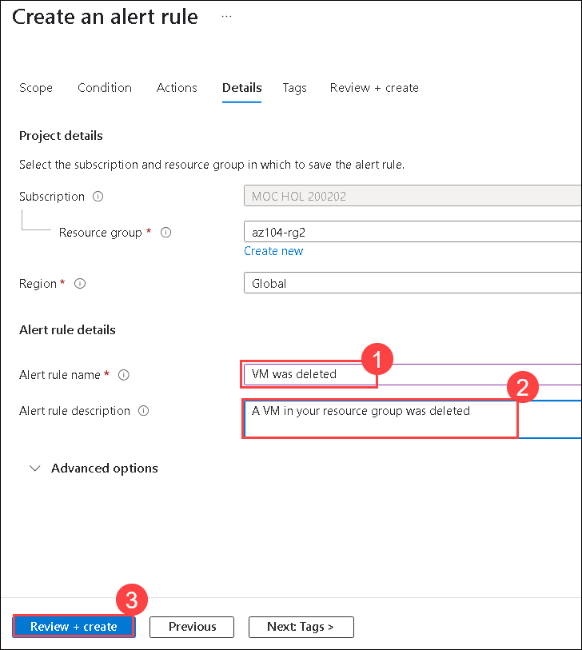    

1. Then select **Create**.

> **Congratulations** on completing the task! Now, it's time to validate it. Here are the steps:
 
- Hit the Validate button for the corresponding task. If you receive a success message, you can proceed to the next task. 
- If not, carefully read the error message and retry the step, following the instructions in the lab guide.
- If you need any assistance, please contact us at cloudlabs-support@spektrasystems.com. We are available 24/7 to help you out.

   <validation step="040aee9b-d83d-499f-b9f7-ae44dab39be7" />

## Task 4: Trigger an alert and confirm it is working

In this task, you will manually trigger the alert by performing an action that matches the alert condition, such as deleting the virtual machine.

>**Note:** If you delete the virtual machine before the alert rule deploys, the alert rule might not be triggered. 

1. In the portal, search for and select **Virtual machines** resource.

1. Search for **az104-11-vm0** and the select **az104-11-vm0** virtual machine.

1. Select **Delete** from the menu bar.

    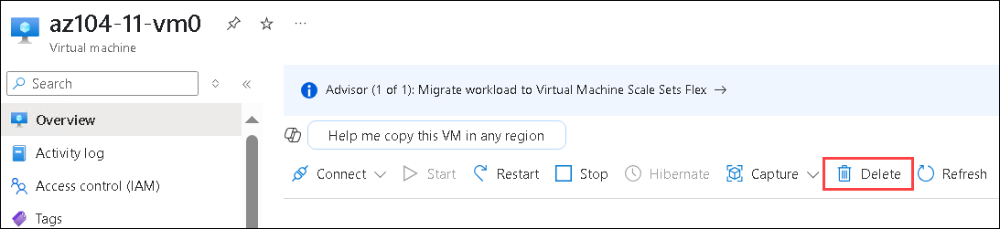

1. Check the box for **Apply force delete (1)**. Check the box at the bottom confirming that you want the resource to be deleted **(2)** and select **Delete (3)**.

    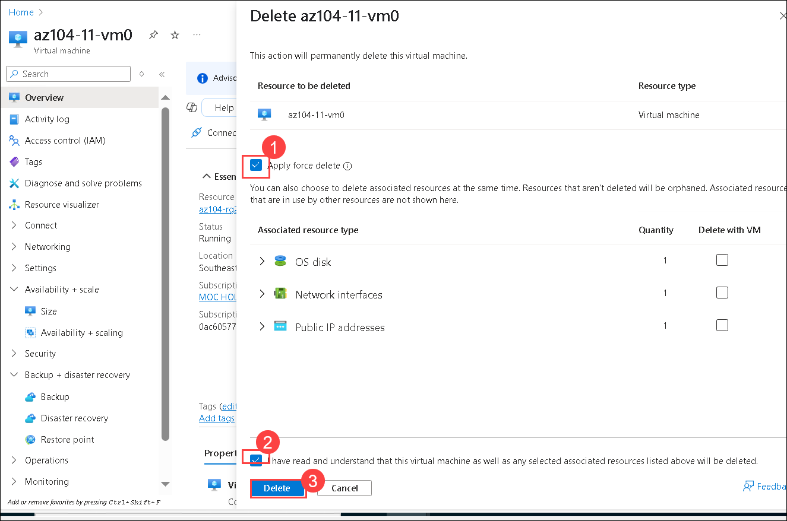

1. In the title bar, select the **Notifications** icon and wait until **vm0** is successfully deleted.

1. Navigate to your email, you should receive a notification email that reads, **Important notice: Azure Monitor alert VM was deleted was activated...** If not, open your email program and look for an email from azure-noreply@microsoft.com.

   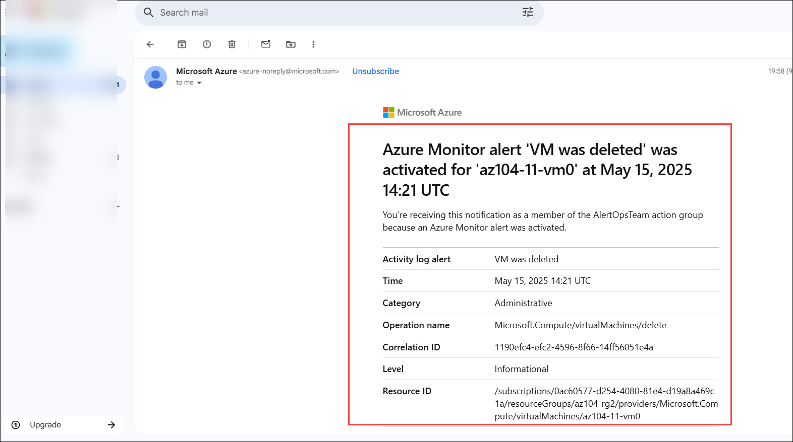
   
1. On the Azure portal resource menu, select **Monitor**, and then select **Alerts** in the menu on the left.

1. You should get the verbose alerts that were generated by deleting **vm0**.

   
   
    >**Note:** It can take a few minutes for the alert email to be sent and for the alerts to be updated in the portal. If you don't want to wait, continue to the next task and then return. 

1. Select the name of one of the alerts (For example, **VM was deleted**). An **Alert details** pane appears that shows more details about the event.

> **Congratulations** on completing the task! Now, it's time to validate it. Here are the steps:
 
- Hit the Validate button for the corresponding task. If you receive a success message, you can proceed to the next task. 
- If not, carefully read the error message and retry the step, following the instructions in the lab guide.
- If you need any assistance, please contact us at cloudlabs-support@spektrasystems.com. We are available 24/7 to help you out.

   <validation step="2874f1f3-4ced-405d-9a87-533958710105" />

## Task 5: Configure an alert processing rule

In this task, you will create an alert processing rule designed to suppress or pause notifications for a defined period, such as during scheduled maintenance. 

1. Continue in the **Alerts** blade, select **Alert processing rules** and then **+ Create**.

   
   
1. Select your resource group **az104-rg2**, then select **Apply**.

   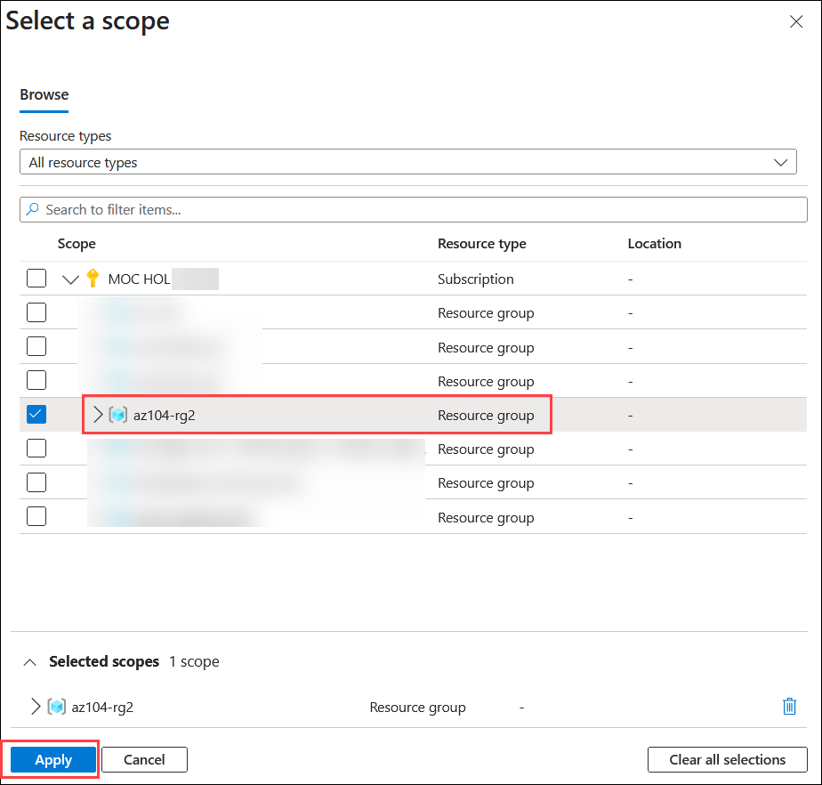
   
1. Select **Next: Rule settings >**, then select **Suppress notifications**.
   
1. Select **Next: Scheduling >**.
   
1. By default, the rule works all the time, unless you disable it or configure a schedule. You are going to define a rule to suppress notifications during overnight maintenance.
Enter these settings for the scheduling of the alert processing rule and elect **Next: Details > (5)**:

    | Setting | Value |
    |---------|---------|
    | Apply the rule | At a specific time **(1)** |
    | Start | Enter today's date at 10 pm. **(2)** |
    | End | Enter tomorrow's date at 7 am. **(3)** |
    | Time zone | Select the local timezone. **(4)** |

    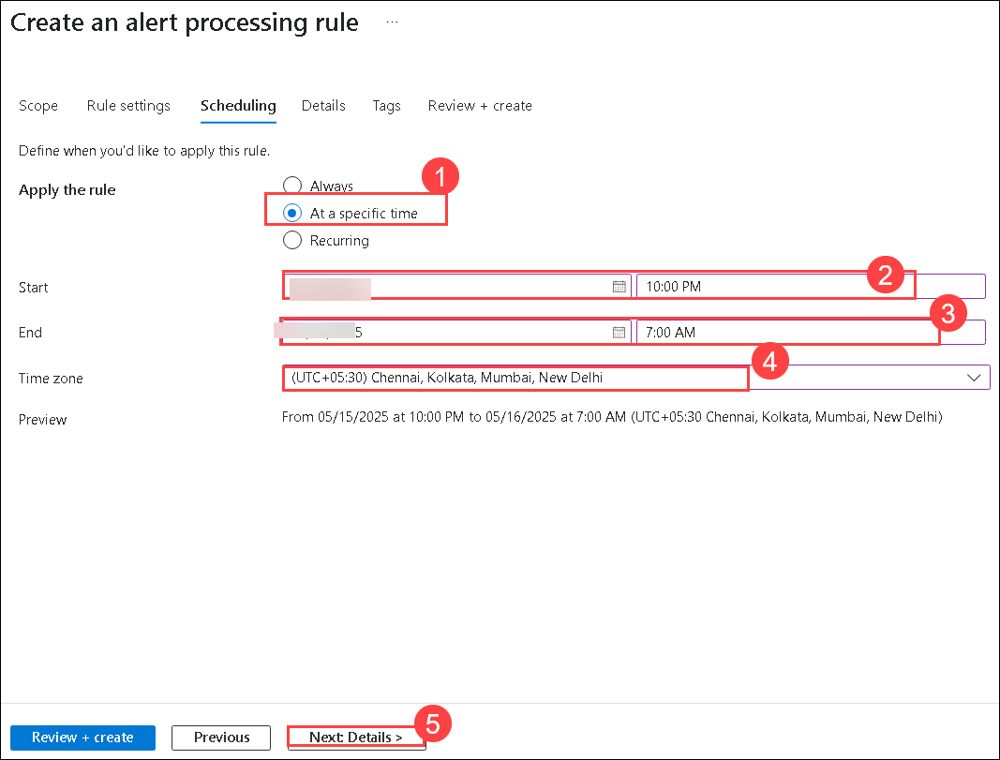

1. Enter these settings then select **Review+create (4)**:

    | Setting | Value |
    |---------|---------|
    | Resource group | **az104-rg2 (1)** |
    | Rule name | `Planned Maintenance` **(2)** |
    | Description | `Suppress notifications during planned maintenance.` **(3)** |

        

1. Then select **Create**.

## Task 6: Use Azure Monitor log queries

In this task, you will utilize Azure Monitor to query and analyze the data collected from the virtual machine. Azure Monitor provides a comprehensive set of tools that enable you to view logs and metrics associated with the VM's performance and health.

1. In the Azure portal, search for and select `Monitor` blade, click **Logs** from the left navigation pane.

    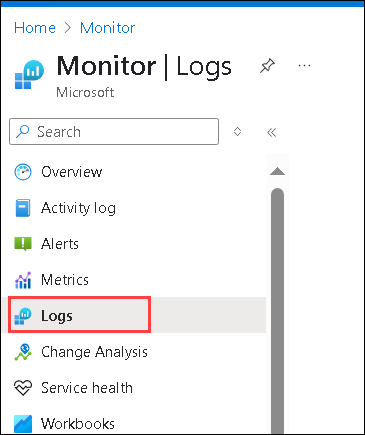

1. If necessary close the splash screen. 

1. Select a scope, **az104-rg2 (1)**. Select **Apply (2)**. 

    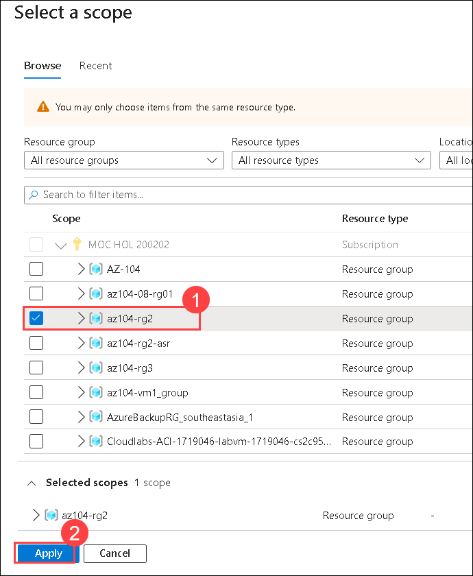

1. Set the mode to **KQL mode**.

    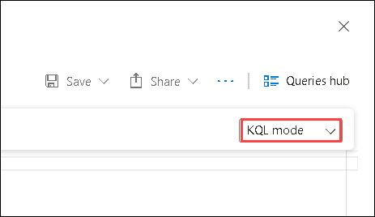

1. Click on the **Queries (1)** tab, expand **Virtual machines (2)** (left pane). Review the queries that are available. Click the **Count heartbeats (3)** query and select **Run (4)**.

    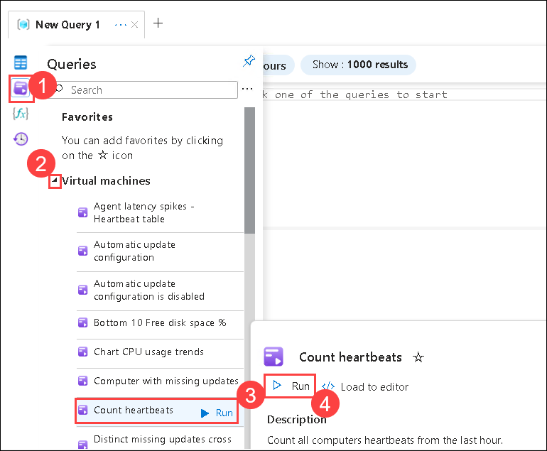

1. You should receive a heartbeat count for when the virtual machine was running.

    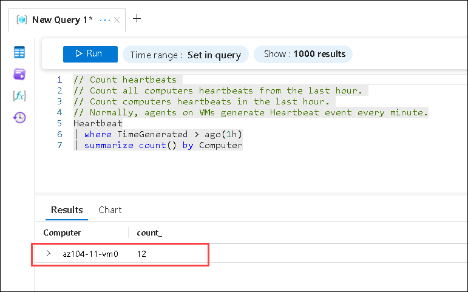

1. Review the query. This query uses the **heartbeat** table. 

1. Replace the query with this one **(1)**, and then click **Run (2)**. Review the resulting chart. 

   ```
    InsightsMetrics
    | where TimeGenerated > ago(1h)
    | where Name == "UtilizationPercentage"
    | summarize avg(Val) by bin(TimeGenerated, 5m), Computer //split up by computer
    | render timechart
   ```
    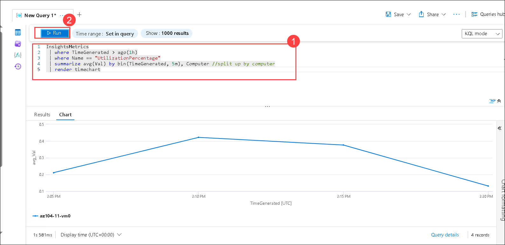

     >**Did you know?**: If you want to practice with other queries, there is a [Log Analytics Demo Environment](https://learn.microsoft.com/azure/azure-monitor/logs/log-analytics-tutorial#open-log-analytics).
    
     >**Did you know?**: Once you find a query you like, you can create an alert from it. 

### Review

In this lab, you have completed the following:

- Used a template to provision an infrastructure, allowing for quick and efficient deployment of a virtual machine and associated resources
- Created an alert to track specific actions or events, such as the deletion of a virtual machine, helping to proactively identify issues and take necessary actions to prevent disruptions.
- Configured action group notifications to ensure that the relevant team members or stakeholders are immediately informed via email, SMS, or other methods when an alert is triggered, facilitating rapid response.
- Triggered an alert by performing a relevant action, such as deleting a virtual machine, and then confirmed that the notification system works as expected, ensuring that alerts are properly sent out when required.
- Configured an alert processing rule to suppress notifications during planned maintenance periods, allowing for more control over the alerting system and reducing unnecessary notifications during non-critical periods.
- Used Azure Monitor log queries to extract and analyze data from the virtual machine, providing valuable insights into performance metrics and system health, and helping to identify trends or anomalies that require attention.

## Extend your learning with Copilot
Copilot can assist you in learning how to use the Azure scripting tools. Copilot can also assist in areas not covered in the lab or where you need more information. Open an Edge browser and choose Copilot (top right). Take a few minutes to try these prompts.

+ What are the basic configuration steps to be alerted in Azure when a virtual machine is down?
+ How can I be notified when an Azure alert is triggered?
+ Construct an Azure Monitor query to provide virtual machine CPU performance information.

## Learn more with self-paced training

+ [Improve incident response with alerting on Azure](https://learn.microsoft.com/en-us/training/modules/incident-response-with-alerting-on-azure/). Respond to incidents and activities in your infrastructure through alerting capabilities in Azure Monitor.
+ [Monitor your Azure virtual machines with Azure Monitor](https://learn.microsoft.com/en-us/training/modules/monitor-azure-vm-using-diagnostic-data/). Monitor your Azure VMs by using Azure Monitor to collect and analyze VM host and client metrics and logs.

## Key takeaways

Congratulations on completing the lab. Here are the main takeaways for this lab. 

+ Alerts help you detect and address issues before users notice there might be a problem with your infrastructure or application.
+ You can alert on any metric or log data source in the Azure Monitor data platform.
+ An alert rule monitors your data and captures a signal that indicates something is happening on the specified resource.
+ An alert is triggered if the conditions of the alert rule are met. Several actions (email, SMS, push, voice) can be triggered.
+ Action groups include individuals that should be notified of an alert.

### You have successfully completed the lab
