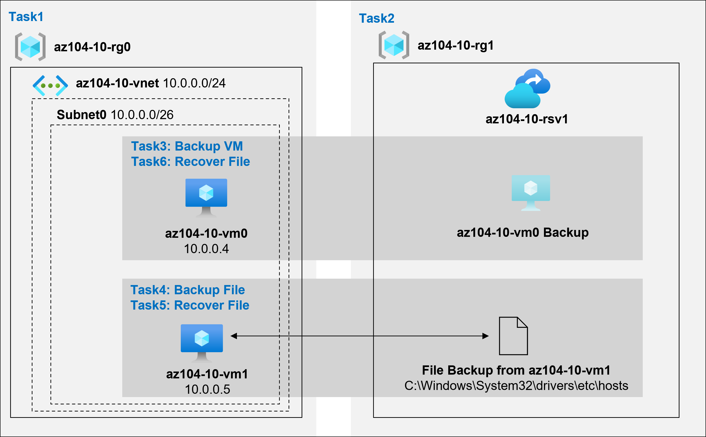

# Lab Scenario Preview - 10 - Backup virtual machines

## Lab overview
You have been tasked with evaluating the use of Azure Recovery Services for backup and restore of files hosted on Azure virtual machines and on-premises computers. In addition, you want to identify methods of protecting data stored in the Recovery Services vault from accidental or malicious data loss.

## Objectives
In this lab, you will complete the following tasks:
+ Task 1: Provision the lab environment
+ Task 2: Create a Recovery Services vault
+ Task 3: Implement Azure virtual machine-level backup
+ Task 4: Implement File and Folder backup
+ Task 5: Perform file recovery by using Azure Recovery Services agent
+ Task 6: Perform file recovery by using Azure virtual machine snapshots (optional)
+ Task 7: Review the Azure Recovery Services soft delete functionality (optional)

## Architecture diagram

Once you understand the lab's content, you can start the Hands-on Lab by clicking the **Launch** button located in the top right corner. This will lead you to the lab environment and guide. You can also preview the full lab guide [here](https://experience.cloudlabs.ai/#/labguidepreview/91b023a8-63f5-4301-af98-eaf0e4705c18) if you want to go through detailed guide prior to launching lab environment.
