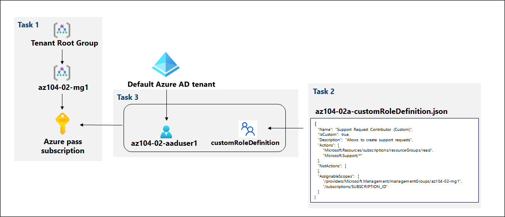
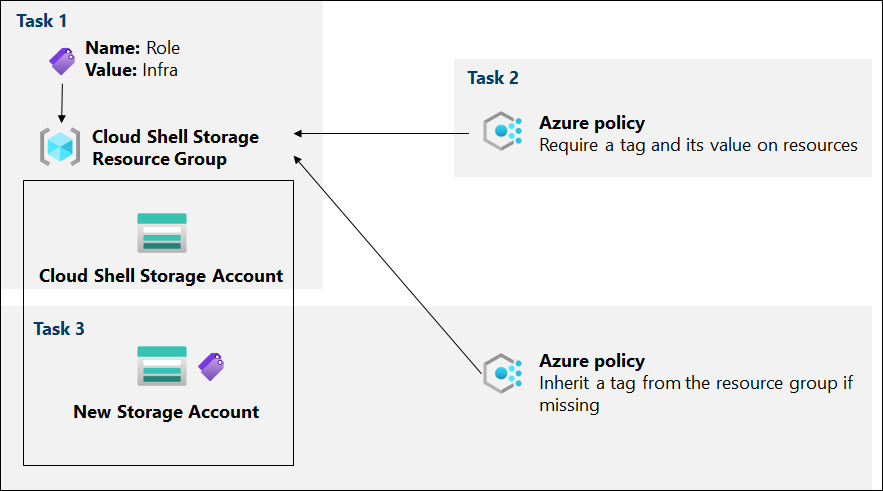

# Lab Scenario Preview - 02 - Administer Governance and Compliance

## Lab overview
In order to improve management of Azure resources in Contoso, you have been tasked with implementing the following functionality:
- creating a management group that would include all of Contoso's Azure subscriptions
- granting permissions to submit support requests for all subscriptions in the management group to a designated Azure Active Directory user. That user's permissions should be limited only to: 
    - creating support request tickets
    - viewing resource groups 
- tagging resource groups that include only infrastructure resources (such as Cloud Shell storage accounts)
- ensuring that only properly tagged infrastructure resources can be added to infrastructure resource groups
- remediating any non-compliant resources 

## Objectives
In this lab, you will complete the following tasks:
+ Lab 2a - Manage Subscriptions and RBAC
    + Task 1: Implement Management Groups
    + Task 2: Create custom RBAC roles 
    + Task 3: Assign RBAC roles
+ Lab 2b - Manage Governance via Azure Policy
    + Task 2: Enforce tagging via an Azure policy
    + Task 3: Apply tagging via an Azure policy

## Lab 2a - Architecture diagram

## Lab 2b - Architecture diagram

Once you understand the lab's content, you can start the Hands-on Lab by clicking the **Launch** button located in the top right corner. This will lead you to the lab environment and guide. You can also preview the full lab guide [here](https://experience.cloudlabs.ai/#/labguidepreview/84c5cd48-bf0d-4edc-9fc3-932082b0b0b9) if you want to go through detailed guide prior to launching lab environment.
