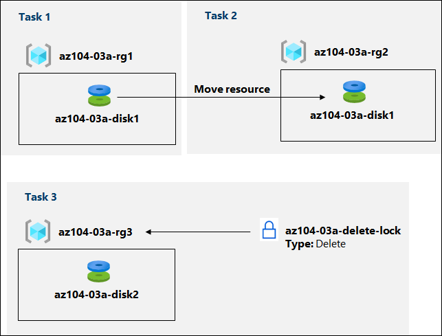
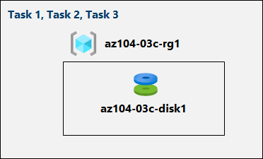

# Lab Scenario Preview - 03 - Administer Azure Resources

## Lab scenario
You need to explore the basic Azure administration capabilities associated with provisioning resources and organizing them based on resource groups, including moving resources between resource groups using Azure portal, zure Resource Manager templates, Azure PowerShell and Azure CLI. You also want to explore options for protecting disk resources from being accidentally deleted, while still allowing for modifying their performance characteristics and size.

## Objectives
In this lab, you will:
+ Lab 3a - Manage Azure resources by Using the Azure Portal
    + Task 1: Use the existing resource groups and deploy resources to resource groups
    + Task 2: Move resources between resource groups
    + Task 3: Implement and test resource locks
+ Lab 3b - Manage Azure resources by Using ARM Templates
    + Task 1: Review an ARM template for deployment of an Azure managed disk
    + Task 2: Create an Azure managed disk by using an ARM template
    + Task 3: Review the ARM template-based deployment of the managed disk
+ Lab 3c - Manage Azure resources by Using Azure PowerShell
   + Task 1: Start a PowerShell session in Azure Cloud Shell
   + Task 2: Use the existing resource group and create an Azure managed disk by using Azure PowerShell
   + Task 3: Configure the managed disk by using Azure PowerShell
+ Lab 3d - Manage Azure resources by Using Azure CLI
   + Task 1: Start a Bash session in Azure Cloud Shell
   + Task 2: Use the existing resource group and create an Azure managed disk by using Azure CLI
   + Task 3: Configure the managed disk by using Azure CLI

## Lab 3a - Architecture diagram

## Lab 3b - Architecture diagram

## Lab 3c, 3d - Architecture diagram

Once you understand the lab's content, you can start the Hands-on Lab by clicking the **Launch** button located in the top right corner. This will lead you to the lab environment and guide. You can also preview the full lab guide [here](https://experience.cloudlabs.ai/#/labguidepreview/fc021e9f-3b0a-4258-b62a-6142bba0a1e5) if you want to go through detailed guide prior to launching lab environment.
