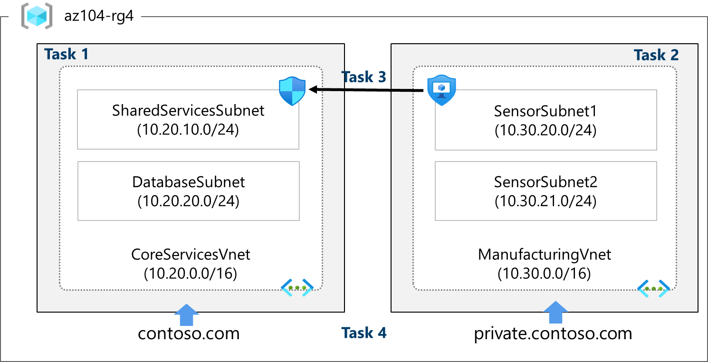

# Lab Scenario Preview - 04 - Implement Virtual Networking

## Lab overview
You need to explore Azure virtual networking capabilities. To start, you plan to create a virtual network in Azure that will host a couple of Azure virtual machines. Since you intend to implement network-based segmentation, you will deploy them into different subnets of the virtual network. You also want to make sure that their private and public IP addresses will not change over time. To comply with Contoso security requirements, you need to protect public endpoints of Azure virtual machines accessible from the Internet. Finally, you need to implement DNS name resolution for Azure virtual machines both within the virtual network and from the Internet.

## Lab objectives
In this lab, you will complete the following tasks:
- Task 1: Create a virtual network with subnets using the portal.
- Task 2: Create a virtual network and subnets using a template.
- Task 3: Create and configure communication between an Application Security Group and a Network Security Group.
- Task 4: Configure public and private Azure DNS zones

## Architecture diagram

Once you understand the lab's content, you can start the Hands-on Lab by clicking the **Launch** button located in the top right corner. This will lead you to the lab environment and guide. You can also preview the full lab guide [here](https://experience.cloudlabs.ai/#/labguidepreview/5bba10f5-69ec-4c1c-a548-21337d2f6b99) if you want to go through detailed guide prior to launching lab environment.
