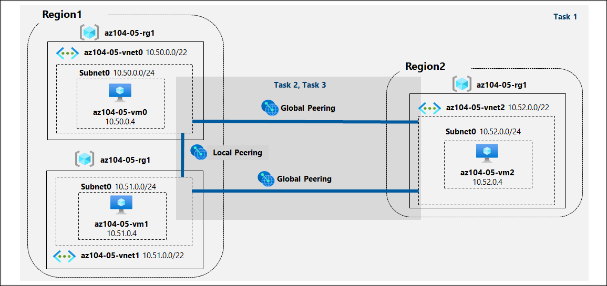

# Lab Scenario Preview - 05 - Implement Intersite Connectivity

## Lab overview
Contoso has its data centers in Boston, New York, and Seattle offices connected via mesh wide-area network links, with full connectivity between them. You need to implement a lab environment that will reflect the topology of Contoso's on-premises networks and verify its functionality.

## Objectives
In this lab, you will complete the following tasks:
+ Task 1: Provision the lab environment
+ Task 2: Configure local and global virtual network peering
+ Task 3: Test intersite connectivity

## Architecture diagram

Once you understand the lab's content, you can start the Hands-on Lab by clicking the **Launch** button located in the top right corner. This will lead you to the lab environment and guide. You can also preview the full lab guide [here](https://experience.cloudlabs.ai/#/labguidepreview/d919c7be-fc3f-45fc-8b73-09648d1f29e3) if you want to go through detailed guide prior to launching lab environment.
