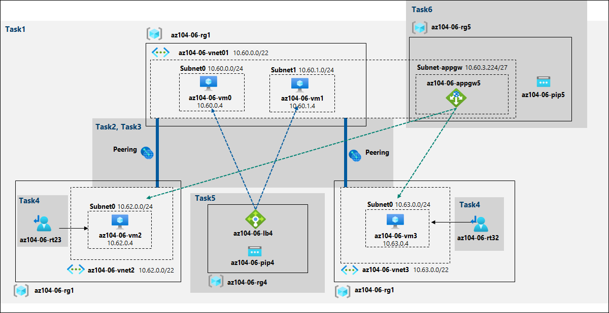

# Lab Scenario Preview - 06 - Implement Traffic Management

## Lab overview
You were tasked with testing managing network traffic targeting Azure virtual machines in the hub and spoke network topology, which Contoso considers implementing in its Azure environment (instead of creating the mesh topology, which you tested in the previous lab). This testing needs to include implementing connectivity between spokes by relying on user defined routes that force traffic to flow via the hub, as well as traffic distribution across virtual machines by using layer 4 and layer 7 load balancers. For this purpose, you intend to use Azure Load Balancer (layer 4) and Azure Application Gateway (layer 7).

## Lab objectives
In this lab, you will complete the following tasks:
+ Task 1: Provision the lab environment
+ Task 2: Configure the hub and spoke network topology
+ Task 3: Test transitivity of virtual network peering
+ Task 4: Configure routing in the hub and spoke topology
+ Task 5: Implement Azure Load Balancer
+ Task 6: Implement Azure Application Gateway

## Architecture diagram

Once you understand the lab's content, you can start the Hands-on Lab by clicking the **Launch** button located in the top right corner. This will lead you to the lab environment and guide. You can also preview the full lab guide [here](https://experience.cloudlabs.ai/#/labguidepreview/34db3765-6316-4973-aff4-667f86fdfcda) if you want to go through detailed guide prior to launching lab environment.
