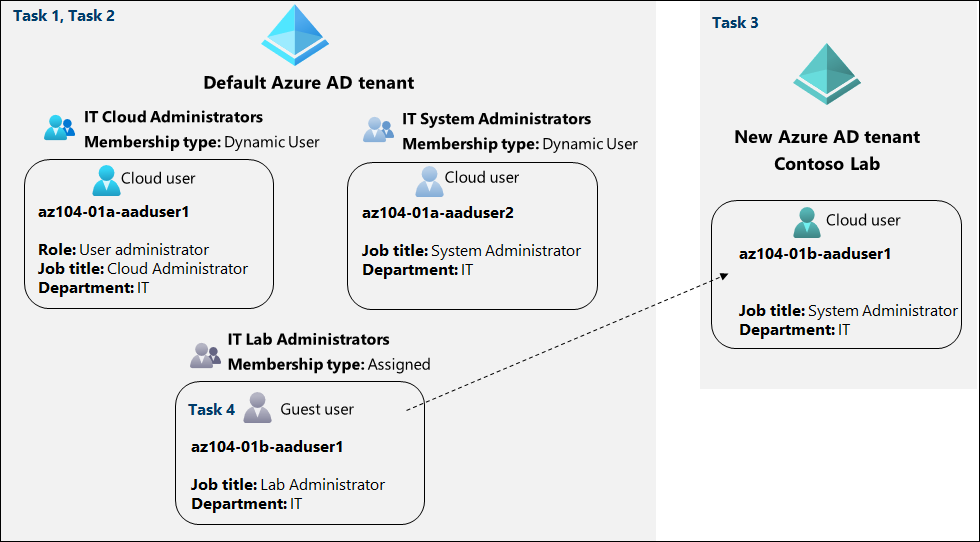
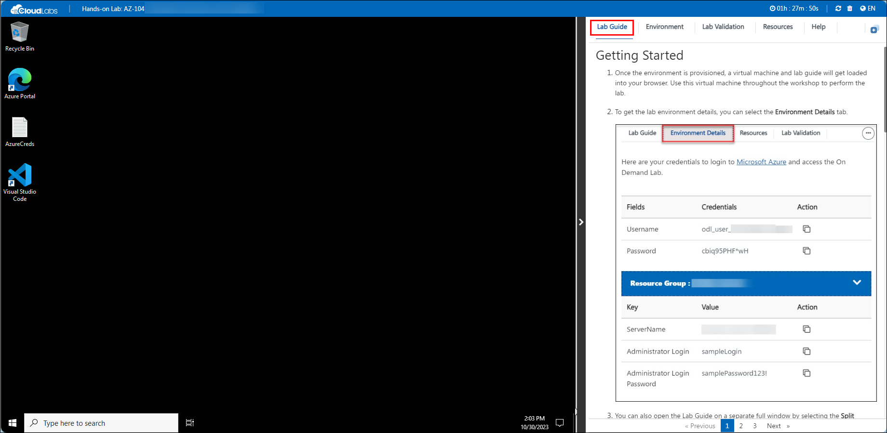
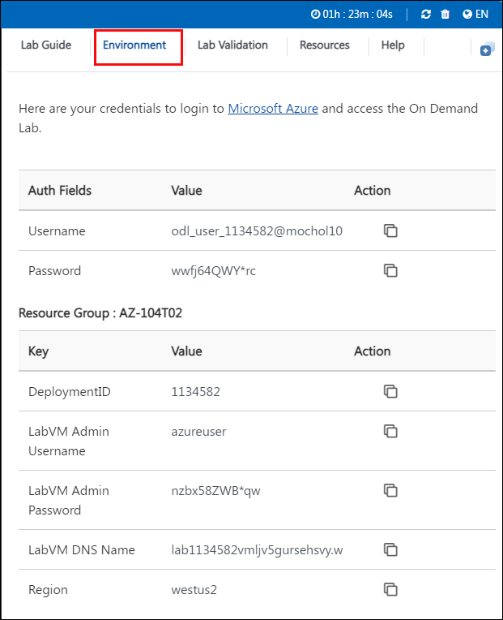
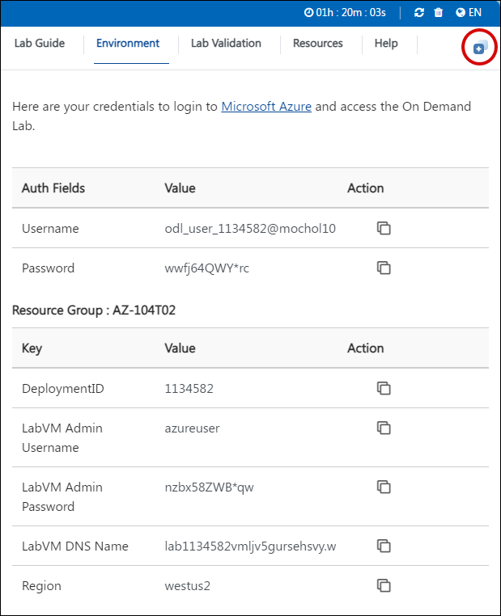
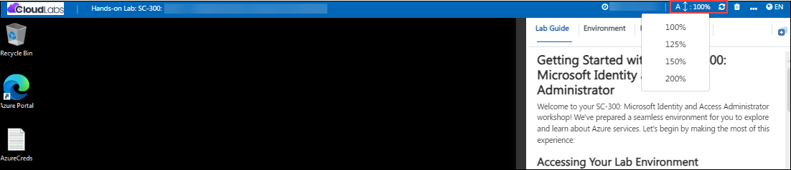
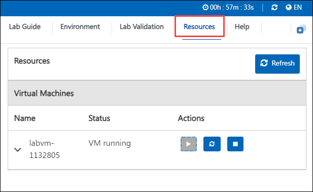
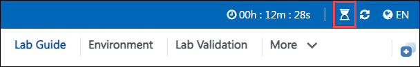
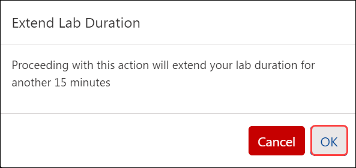
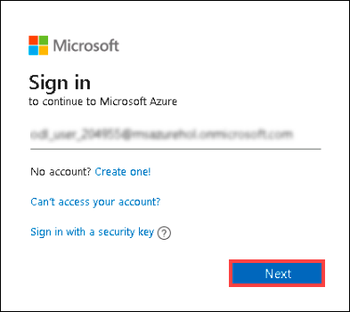
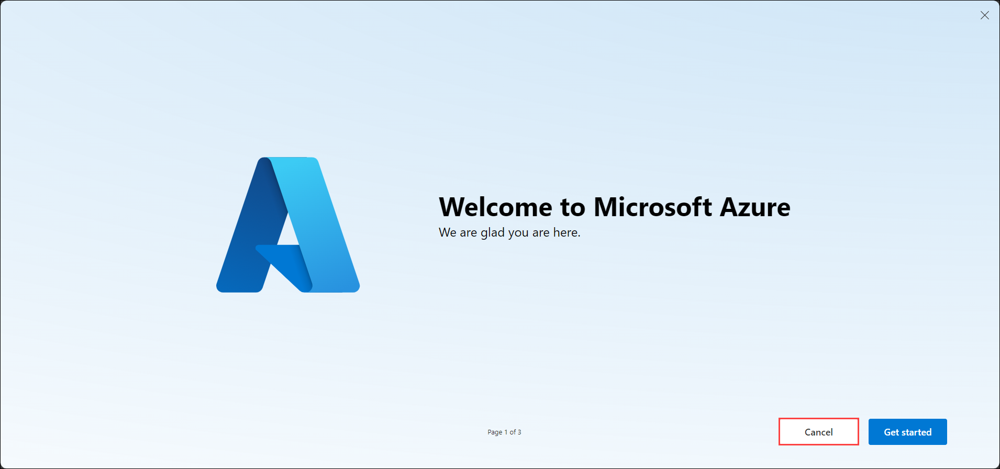

# AZ-104: Microsoft Azure Administrator Workshop

Welcome to your AZ-104: Microsoft Azure Administrator workshop! We've prepared a seamless environment for you to explore and learn Azure Services. Let's begin by making the most of this experience.

# Lab 01- Manage Microsoft Entra ID Identities

### Overall Estimated Duration: 50 minutes

## Overview

In this hands-on lab, you'll gain practical experience in managing identity and access within a cloud environment using Microsoft Entra ID, a key component of Azure's security and identity management features. You will learn how to create and configure Entra ID users, set up groups with both assigned and dynamic membership, and manage a Microsoft Entra ID tenant. Additionally, you’ll gain expertise in inviting and managing guest users, enabling secure collaboration with external parties. By the end of this lab, you'll be proficient in the essential tasks of provisioning and managing users, groups, and guest access in Microsoft Entra ID, equipping you with the skills to efficiently manage identity and access in your organization’s Azure environment.

## Objective

By the end of this lab, you will be able to manage and configure Microsoft Entra ID users, groups with assigned and dynamic membership, tenants, and guest users.

1. **Create and configure Entra ID users**: You will learn the process of creating and configuring Microsoft Entra ID (formerly Azure Active Directory) users in the Azure portal. This includes setting up user profiles, configuring essential properties like the usage location, assigning roles to users, and ensuring that users have appropriate permissions within the Entra ID environment.
2. **Create Entra ID groups with assigned and dynamic membership**: You will be able to create and configure Entra ID (Azure Active Directory) groups with both assigned and dynamic membership. This involves setting up groups that automatically include members based on specific attributes (dynamic membership) and groups where members are manually added (assigned membership).
3. **Create a Microsoft Entra ID tenant**: You will get to know the process of creating a new Microsoft Entra ID (formerly Azure Active Directory) tenant. This involves setting up a separate directory environment that can be used to manage users, groups, and resources independently from other tenants.
4. **Manage Entra ID guest users**: You will manage guest users in Microsoft Entra ID by inviting external users to access resources within your Azure subscription.

## Pre-requisites

Fundamental knowledge in managing identity and access within cloud environment using Microsoft Entra ID, a key element of Azure's security and identity management capabilities.

## Architecture

In this hands-on lab, the architecture flow includes several essential components.

1. Creating and Configuring Entra ID Users: Understanding how to create and manage user accounts within Microsoft Entra ID, including setting properties like job title, department, and usage location. The user will also learn how to assign roles and permissions to control access to Azure resources.

1. Creating Groups with Assigned and Dynamic Membership: Learning how to create security groups within Entra ID, including the difference between assigned membership (manually adding members) and dynamic membership (automatically adding members based on specific criteria). This includes setting up dynamic membership rules that automate the group population based on user attributes like job title.

1. Creating a Microsoft Entra ID Tenant: Gaining experience in setting up a new Entra ID tenant, which is essentially a dedicated instance of Azure Active Directory for managing users, groups, and resources. This task also teaches about the initial setup and configuration of a new tenant.

1. Inviting and Managing Entra ID Guest Users: Learning how to securely collaborate with external users by inviting them as guest users to your Entra ID tenant. This includes granting them access to specific resources by adding them to relevant groups and understanding how to manage their permissions.

## Architecture Diagram

   

## Explanation of Components

1. **Microsoft Entra ID**: Microsoft Entra ID (formerly Azure Active Directory) is a cloud-based identity and access management service from Microsoft. It helps organizations manage user identities, control access to resources, and ensure secure authentication across various cloud-based and on-premises applications.

2. **Entra ID groups**: Entra ID groups, part of Microsoft Entra ID, are used to manage and organize users in an organization by grouping them together. These groups help simplify the management of user permissions and access to resources. There are two main types of Entra ID groups:
   - Assigned Membership Groups: Users are manually added or removed from these groups by an administrator. This type of group is useful for static sets of users who need specific access rights.
   - Dynamic Membership Groups: Membership in these groups is determined automatically based on rules or attributes, such as job title or department. For example, a dynamic group can be configured to automatically include all users with the job title 
    "Cloud Administrator."

3. **Microsoft Entra ID tenant**: A Microsoft Entra ID tenant is a dedicated, trusted instance of Microsoft Entra ID that an organization receives when they sign up for a Microsoft cloud service such as Azure, Microsoft 365, or Dynamics 365. The tenant represents the organization in the Microsoft cloud environment and serves as the top-level container for all users, groups, and resources within that organization.

# Getting Started with the Lab
 
Welcome to your AZ-104: Microsoft Azure Administrator  workshop! We've prepared a seamless environment for you to explore and learn Azure Services. Let's begin by making the most of this experience:
 
## Accessing Your Lab Environment
 
Once you're ready to dive in, your virtual machine and lab guide will be right at your fingertips within your web browser.
 

### Virtual Machine & Lab Guide
 
Your virtual machine is your workhorse throughout the workshop. The lab guide is your roadmap to success.
 
## Exploring Your Lab Resources
 
To get a better understanding of your lab resources and credentials, navigate to the **Environment** tab.
 

 
## Utilizing the Split Window Feature
 
For convenience, you can open the lab guide in a separate window by selecting the **Split Window** button from the top right corner.
 

 
## Utilizing the Zoom In/Out Feature

To adjust the zoom level for the environment page, click the A↕ : 100% icon located next to the timer in the lab environment.

## Managing Your Virtual Machine
 
Feel free to start, stop, or restart your virtual machine as needed from the **Resources** tab. Your experience is in your hands!
 

## **Lab Duration Extension**

1. To extend the duration of the lab, kindly click the **Hourglass** icon in the top right corner of the lab environment. 

    

    >**Note:** You will get the **Hourglass** icon when 10 minutes are remaining in the lab.

2. Click **OK** to extend your lab duration.
 
   

3. If you have not extended the duration prior to when the lab is about to end, a pop-up will appear, giving you the option to extend. Click **OK** to proceed.
 
## Let's Get Started with Azure Portal
 
1. On your virtual machine, click on the Azure Portal icon as shown below:
 
    
 
2. You'll see the **Sign into Microsoft Azure** tab. Here, enter your credentials:
 
   - **Email/Username:** <inject key="AzureAdUserEmail"></inject>
 
      
 
3. Next, provide your password:
 
   - **Password:** <inject key="AzureAdUserPassword"></inject>
 
      

1. If you see the pop-up **Action Required**, click **Ask Later**.
   
     

1. First-time users are often prompted to Stay Signed In, if you see any such pop-up, click on No.

1. If a **Welcome to Microsoft Azure** popup window appears, click **Cancel** to skip the tour.
    
        

1. Click **Next** from the bottom right corner to embark on your Lab journey!
 
    

In this hands-on lab, you'll learn to manage identity and access using Microsoft Entra ID, including creating and configuring users, groups, and tenants, and managing guest users. This will equip you with essential skills to efficiently handle identity and access in Azure.

## Support Contact

1. The CloudLabs support team is available 24/7, 365 days a year, via email and live chat to ensure seamless assistance at any time. We offer dedicated support channels tailored specifically for both learners and instructors, ensuring that all your needs are promptly and efficiently addressed.

   Learner Support Contacts:

   - Email Support: labs-support@spektrasystems.com
   - Live Chat Support: https://cloudlabs.ai/labs-support

1. Now, click on Next from the lower right corner to move on to the next page.
   
## Happy Learning!!
