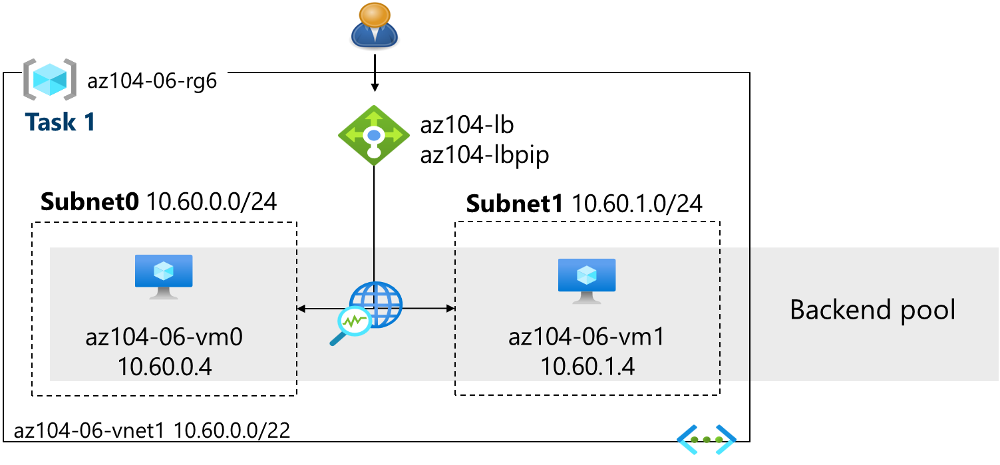

# AZ-104: Microsoft Azure Administrator Workshop

Welcome to your AZ-104: Microsoft Azure Administrator workshop! We've prepared a seamless environment for you to explore and learn Azure Services. Let's begin by making the most of this experience.

# Lab 06 - Implement Traffic Management

### Overall Estimated Duration: 60 minutes

## Overview

In this lab, you will configure and test traffic management solutions in Azure by deploying and configuring a public Azure Load Balancer (Layer 4) and Azure Application Gateway (Layer 7) to manage traffic between virtual machines in a hub-and-spoke network topology. The scenario simulates Contoso's network design, where you will ensure traffic flows through the hub via user-defined routes, implementing both load balancing and application-level routing. Tasks include using a template to deploy the infrastructure, configuring the Azure Load Balancer for basic traffic distribution, and setting up the Azure Application Gateway for advanced, path-based routing to specific backend pools. You will also validate the setup by testing traffic redirection based on different routing rules.

## Objective

The objective of this lab is to design, deploy, and configure a multi-tier Azure infrastructure for efficient traffic management using Azure templates, Load Balancer, and Application Gateway.

1. **Provision Infrastructure Using Templates**: Deploy a virtual network, network security group, and two virtual machines using an Azure template.

2. **Configure Azure Load Balancer**: Set up an Azure Load Balancer to distribute traffic across virtual machines in the hub virtual network, ensuring connectivity and load balancing.

3. **Implement Azure Application Gateway**: Configure an Azure Application Gateway to route traffic based on path rules, directing requests to backend virtual machines located in spoke networks.

4. **Validate Traffic Management Setup**: Test the traffic management setup by verifying load balancing and application gateway routing, ensuring the configuration meets the traffic management requirements.

## Pre-requisites

 - Familiarity with core cloud computing concepts, particularly Microsoft Azure services, including virtual networks, load balancing, and application gateways.
 - Understanding of PowerShell or Azure CLI for advanced configuration and automation of Azure resources.

## Architecture  

In this hands-on lab, the architecture flow includes several essential components.

1. Learn how to design and configure Azure Virtual Networks to enable secure communication between resources and services within Azure, while managing IP addressing and subnets.

2. Understand the principles of load balancing, its importance for distributing traffic, and how to configure Azure Load Balancer to ensure high availability for your applications.

3. Creating and configuring virtual machines within Azure, including selecting the appropriate VM size, managing storage, and deploying them within a VNet for application hosting.

4. Explore how to implement Network Security Groups (NSGs) to control inbound and outbound traffic to Azure resources, ensuring that your infrastructure follows best practices for security.

## Architecture diagram

## Explanation of Components

1. **Azure Virtual Networks (VNets):** A Virtual Network (VNet) is the fundamental building block for your private network in Azure. It allows you to securely connect Azure resources such as virtual machines (VMs), apps, and databases.

2. **Azure Load Balancer**: The Azure Load Balancer distributes incoming network traffic across multiple virtual machines or other resources, ensuring no single resource becomes overloaded.

3. **Azure Virtual Machines (VMs)**: Virtual machines are scalable compute resources that run in Azure. They can be configured with various operating systems, sizes, and configurations depending on your needs.

# Getting Started with the Lab
 
Welcome to your AZ-104: Microsoft Azure Administrator  workshop! We've prepared a seamless environment for you to explore and learn Azure Services. Let's begin by making the most of this experience:
 
## Accessing Your Lab Environment
 
Once you're ready to dive in, your virtual machine and lab guide will be right at your fingertips within your web browser.
 

### Virtual Machine & Lab Guide
 
Your virtual machine is your workhorse throughout the workshop. The lab guide is your roadmap to success.
 
## Exploring Your Lab Resources
 
To get a better understanding of your lab resources and credentials, navigate to the **Environment** tab.
 

 
## Utilizing the Split Window Feature
 
For convenience, you can open the lab guide in a separate window by selecting the **Split Window** button from the top right corner.
 

 
## Utilizing the Zoom In/Out Feature

To adjust the zoom level for the environment page, click the A↕ : 100% icon located next to the timer in the lab environment.

## Managing Your Virtual Machine
 
Feel free to start, stop, or restart your virtual machine as needed from the **Resources** tab. Your experience is in your hands!
 

## **Lab Duration Extension**

1. To extend the duration of the lab, kindly click the **Hourglass** icon in the top right corner of the lab environment. 

    

    >**Note:** You will get the **Hourglass** icon when 10 minutes are remaining in the lab.

2. Click **OK** to extend your lab duration.
 
   

3. If you have not extended the duration prior to when the lab is about to end, a pop-up will appear, giving you the option to extend. Click **OK** to proceed.
 
## Let's Get Started with Azure Portal
 
1. On your virtual machine, click on the Azure Portal icon as shown below:
 
    
 
2. You'll see the **Sign into Microsoft Azure** tab. Here, enter your credentials:
 
   - **Email/Username:** <inject key="AzureAdUserEmail"></inject>
 
      
 
3. Next, provide your password:
 
   - **Password:** <inject key="AzureAdUserPassword"></inject>
 
      

1. If you see the pop-up **Action Required**, click **Ask Later**.
   
     

1. First-time users are often prompted to Stay Signed In, if you see any such pop-up, click on No.

1. If a **Welcome to Microsoft Azure** popup window appears, click **Cancel** to skip the tour.
    
        

1. Click **Next** from the bottom right corner to embark on your Lab journey!
 
    

In this hands-on lab, you'll learn to manage identity and access using Microsoft Entra ID, including creating and configuring users, groups, and tenants, and managing guest users. This will equip you with essential skills to efficiently handle identity and access in Azure.

## Support Contact

1. The CloudLabs support team is available 24/7, 365 days a year, via email and live chat to ensure seamless assistance at any time. We offer dedicated support channels tailored specifically for both learners and instructors, ensuring that all your needs are promptly and efficiently addressed.

   Learner Support Contacts:

   - Email Support: labs-support@spektrasystems.com
   - Live Chat Support: https://cloudlabs.ai/labs-support

1. Now, click on Next from the lower right corner to move on to the next page.
   
## Happy Learning!!
