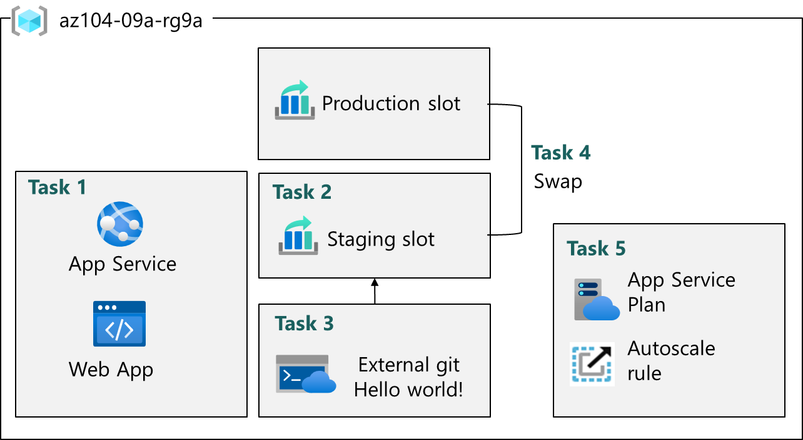

# AZ-104: Microsoft Azure Administrator Workshop

Welcome to your AZ-104: Microsoft Azure Administrator workshop! We've prepared a seamless environment for you to explore and learn Azure Services. Let's begin by making the most of this experience.

# Lab 09 - Implement Web Apps, Container Instances and Container Apps

### Overall Estimated Duration: 65 minutes

## Overview

In this lab, you will explore the use of Azure services for hosting and managing web applications, including Azure Web Apps, Azure Container Instances (ACI), and Azure Container Apps (ACA). You'll begin by evaluating Azure Web Apps for hosting Contoso's websites, covering tasks such as creating and configuring web apps, managing deployment slots for continuous integration and delivery, and implementing autoscaling to optimize performance. Next, you'll work with ACI to deploy Docker containers, review container functionality, and monitor the container instance's status and logs. Finally, you will configure and deploy Azure Container Apps, which simplifies container management and orchestration, offering a serverless platform for cloud applications. By completing these tasks, you will gain hands-on experience in deploying, managing, and scaling web applications and containerized workloads on Azure efficiently.

## Objective

The following are the objectives of the lab: 

1. **Deploy and manage web applications using Azure Web Apps**, configuring continuous integration, deployment slots, and autoscaling for performance optimization.

2. **Implement Docker containers using Azure Container Instances (ACI)** for running virtualized workloads without managing infrastructure, including container deployment and monitoring.

3. **Create and deploy Azure Container Apps** in a serverless environment, simplifying container orchestration and management while testing the app's functionality and verifying deployment.

## Pre-requisites

1. Web Application Deployment: Knowledge of deploying applications to cloud services like Azure Web Apps and how to manage web applications in the cloud.

2. Basic Networking: Understanding DNS, load balancing, and basic networking concepts for connecting and deploying containerized applications.

## Architecture 

## Exercise 1: Implement Web Apps

1. **Azure Web Apps**: Learn how to deploy, configure, and manage web applications on Azure using the Azure App Service platform, which simplifies the hosting of web apps without needing to manage underlying infrastructure.

2. **PHP Runtime Stack**: Understand how to configure and deploy applications using the PHP runtime stack on Azure Web Apps, which is commonly used for dynamic websites.

3. **Deployment Slots**: Gain hands-on experience with deployment slots, which allow you to deploy web applications in staging environments before pushing them to production, helping to support continuous integration (CI) and continuous delivery (CD) practices.

## Architecture diagram

## Explanation of Components

1. **Azure Web Apps (App Service)**: This is the primary service used in the lab. It enables you to deploy web applications in the Azure cloud without having to manage the underlying infrastructure.

2. **Deployment Slots**: Deployment slots are a key feature of Azure Web Apps that allow you to deploy and test your application in different environments.

3. **Autoscaling**: Azure Web Apps can be configured to automatically scale up or scale down based on traffic demand.

## Exercise 2: Implement Azure Container Instances

1. **Deploying Docker Containers on Azure**: In this lab, you learn how to deploy a Docker container using Azure Container Instances (ACI), which is a serverless container service.

2. **Container Instance Management**: The lab covers how to configure and manage Azure Container Instances.

3. **Container Instance Monitoring and Functionality Review**: After deploying the container, you'll verify the deployment by checking the status of the container instance and ensuring that it is running properly.

## Architecture diagram

## Explanation of Components

1. **Azure Container Instances (ACI)**: This is the primary service used in the lab to deploy Docker containers. ACI allows you to run containers without having to manage the underlying virtual machines or infrastructure.

2. **Docker Image**: A container image is used as the basis for the Azure Container Instance deployment.

3. **Networking and DNS Configuration**: When deploying the container, networking settings are configured, including assigning a unique DNS name label.

4. **Logs**: Once the container is deployed, logs are generated to track the behavior and requests of the application.

## Exercise 3: Implement Azure Container Apps

1. **Creating and Configuring an Azure Container App**: This involves specifying the Azure subscription, resource group, and container app name. You also create a new environment for the app, which provides the necessary infrastructure and services to run the containers.

2. **Deploying a Sample Container Image**: After setting up the environment, you deploy a simple container image (a "Hello World" application) to the Azure Container App.

3. **Verifying the Deployment**: Once the container app is deployed, you test and verify its functionality by accessing the application through a URL provided by Azure.

## Architecture diagram

## Explanation of Components

1. **Azure Container Apps (ACA)**: This is a serverless platform designed to run containerized applications without managing infrastructure.

2. **Azure Container Apps Environment**: This is the environment that provides the necessary resources and configurations to run Azure Container Apps.

3. **Quickstart Image (Simple Hello World Container)**: This is a sample Docker image used to deploy a simple application for testing purposes. 

# Getting Started with the Lab
 
Welcome to your AZ-104: Microsoft Azure Administrator  workshop! We've prepared a seamless environment for you to explore and learn Azure Services. Let's begin by making the most of this experience:
 
## Accessing Your Lab Environment
 
Once you're ready to dive in, your virtual machine and lab guide will be right at your fingertips within your web browser.
 

### Virtual Machine & Lab Guide
 
Your virtual machine is your workhorse throughout the workshop. The lab guide is your roadmap to success.
 
## Exploring Your Lab Resources
 
To get a better understanding of your lab resources and credentials, navigate to the **Environment** tab.
 

 
## Utilizing the Split Window Feature
 
For convenience, you can open the lab guide in a separate window by selecting the **Split Window** button from the top right corner.
 

 
## Utilizing the Zoom In/Out Feature

To adjust the zoom level for the environment page, click the A↕ : 100% icon located next to the timer in the lab environment.

## Managing Your Virtual Machine
 
Feel free to start, stop, or restart your virtual machine as needed from the **Resources** tab. Your experience is in your hands!
 

## **Lab Duration Extension**

1. To extend the duration of the lab, kindly click the **Hourglass** icon in the top right corner of the lab environment. 

    

    >**Note:** You will get the **Hourglass** icon when 10 minutes are remaining in the lab.

2. Click **OK** to extend your lab duration.
 
   

3. If you have not extended the duration prior to when the lab is about to end, a pop-up will appear, giving you the option to extend. Click **OK** to proceed.
 
## Let's Get Started with Azure Portal
 
1. On your virtual machine, click on the Azure Portal icon as shown below:
 
    
 
2. You'll see the **Sign into Microsoft Azure** tab. Here, enter your credentials:
 
   - **Email/Username:** <inject key="AzureAdUserEmail"></inject>
 
      
 
3. Next, provide your password:
 
   - **Password:** <inject key="AzureAdUserPassword"></inject>
 
      

1. If you see the pop-up **Action Required**, click **Ask Later**.
   
     

1. First-time users are often prompted to Stay Signed In, if you see any such pop-up, click on No.

1. If a **Welcome to Microsoft Azure** popup window appears, click **Cancel** to skip the tour.
    
        

1. Click **Next** from the bottom right corner to embark on your Lab journey!
 
    

In this hands-on lab, you'll learn to manage identity and access using Microsoft Entra ID, including creating and configuring users, groups, and tenants, and managing guest users. This will equip you with essential skills to efficiently handle identity and access in Azure.

## Support Contact

1. The CloudLabs support team is available 24/7, 365 days a year, via email and live chat to ensure seamless assistance at any time. We offer dedicated support channels tailored specifically for both learners and instructors, ensuring that all your needs are promptly and efficiently addressed.

   Learner Support Contacts:

   - Email Support: labs-support@spektrasystems.com
   - Live Chat Support: https://cloudlabs.ai/labs-support

1. Now, click on Next from the lower right corner to move on to the next page.
   
## Happy Learning!!

