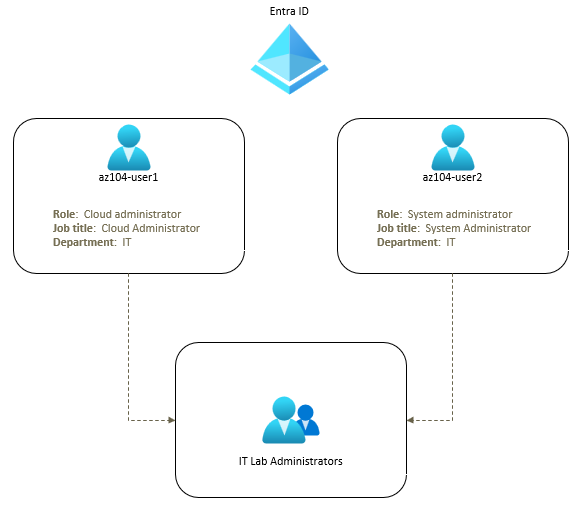
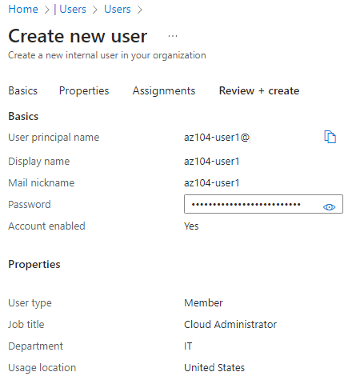
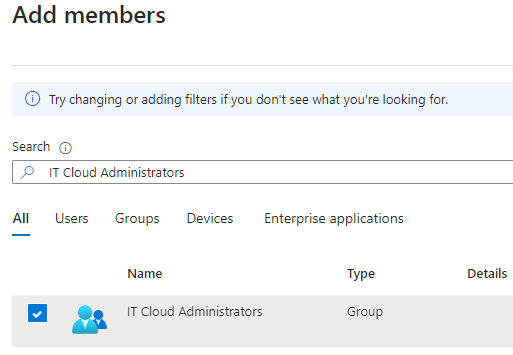
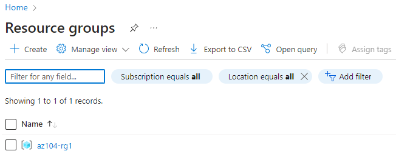

---
lab:
    title: 'Lab 01: Manage Microsoft Entra ID Identities'
    module: 'Administer Identity'
---

# Lab 01 - Manage Microsoft Entra ID Identities

# Student lab manual

## Lab scenario

Your organization is building out a new lab environment for pre-production testing of apps and services.  A few engineers are being hired to manage the lab environment, including the virtual machines. In order to allow the engineers to authenticate by using Microsoft Entra ID, you have been tasked with provisioning users and group accounts. To minimize administrative overhead, membership of the groups should be updated automatically based on job titles. You also need to know how to delete users to prevent access after an engineer leaves your organization.

**Note:** An **[interactive lab simulation](https://mslabs.cloudguides.com/guides/AZ-104%20Exam%20Guide%20-%20Microsoft%20Azure%20Administrator%20Exercise%201)** is available that allows you to click through this lab at your own pace. You may find slight differences between the interactive simulation and the hosted lab, but the core concepts and ideas being demonstrated are the same.

## Objectives

In this lab, you will:

+ Task 1: Familiarize yourself with the Azure portal (optional)
+ Task 2: Create and configure users
+ Task 3: Create groups
+ Task 4: Create a resource group

## Estimated timing: 30 minutes

## Architecture diagram

### Instructions

## Task 1: Familiarize yourself with the Azure portal

    >**Note:** During this course you will use the Azure portal. If you are not familiar with the portal, please take a few minutes to orient yourself. 

1. Sign in to the [Azure portal](https://portal.azure.com).

1. Begin your tour of the Azure portal, by selecting the top left menu icon.

   + Select **Home** to view recent and favorite resources.
   + Select **Dashboard**. [Dashboards](https://learn.microsoft.com/zure/azure-portal/azure-portal-dashboards) are a focused and organized view of your cloud resources in the Azure portal. Use dashboards as a workspace where you can monitor resources and quickly launch tasks for day-to-day operations.

## Task 2: Create and configure  users

In this task, you will create and configure user accounts. User accounts will store all of the user's information such as their name, department, location, and contact information.

1. In the Azure portal, search for and select **Microsoft Entra ID**.

1. On the Microsoft Entra ID blade, scroll down to the **Manage** section, click **User settings**, and review available configuration options.

1. On the Microsoft Entra ID blade, in the **Manage** section, click **Users**, and then click your user account to display its **Profile** settings. 

1. Click **Edit properties**, and then in the **Settings** tab, set **Usage location** to **United States** and click **Save** to apply the change.

    >**Note**: This is necessary in order to assign an Microsoft Entra ID license to an  account.

1. Navigate back to the **Users - All users** blade, and then click **+ New user**.

1. Create a new user with the following settings (leave others with their defaults):

    | Setting | Value |
    | --- | --- |
    | User principal name | `az104-user1` |
    | Display name | `az104-user1` |
    | Auto-generate password | de-select |
    | Initial password | **Provide a secure password** |
    | Job title (Properties tab) | `Cloud Administrator` |
    | Department (Properties tab) | `IT` |
    | Usage location (Properties tab) | **United States** |

    >**Note**: **Copy to clipboard** the full **User Principal Name** (user name plus domain). You will need it later in this task.

    

1. In the list of users, click the newly created user account to display its blade.

1. Review the options available in the **Manage** section and note that you can identify the roles assigned to the user account as well as the user account's permissions to Azure resources.

1. In the **Manage** section, click **Assigned roles**, then click **+ Add assignment** button and assign the **User administrator** role to **az104-user1**.

    >**Note**: You also have the option of assigning roles when provisioning a new user.

1. Open an **InPrivate** browser window and sign in to the [Azure portal](https://portal.azure.com) using the newly created user account. When prompted to update the password, change the password to a secure password of your choosing. 

    >**Note**: Rather than typing the user name (including the domain name), you can paste the content of Clipboard.

1. In the **InPrivate** browser window, in the Azure portal, search for and select **Microsoft Entra ID**.

    >**Note**: While this user account can access the tenant, it does not have any access to Azure resources. This is expected, since such access would need to be granted explicitly by using Azure Role-Based Access Control. 

1. In the **InPrivate** browser window, on the Microsoft Entra ID blade, scroll down to the **Manage** section, click **User settings**, and note that you do not have permissions to modify any configuration options.

1. In the **InPrivate** browser window, on the Microsoft Entra ID blade, in the **Manage** section, click **Users**, and then click **+ New user**.

1. Create a new user with the following settings (leave others with their defaults):

    | Setting | Value |
    | --- | --- |
    | User principal name | `az104-user2` |
    | Display name | `az104-user2` |
    | Auto-generate password | de-select  |
    | Initial password | **Provide a secure password** |
    | Job title | `System Administrator` |
    | Department | `IT` |
    | Usage location | **United States** |
    
1. Sign out as the az104-user1 user from the Azure portal and close the InPrivate browser window.

## Task 3: Create groups with assigned and dynamic membership

In this task, you will create a group. Groups are used for user accounts or devices. Some groups have members that are statically assigned. Some groups have members that are dynamically assigned. Dynamic groups update automatically based on the properties of user accounts or devices. Static groups require more administrative overhead (administrators have to add and remove members manually).

1. In the Azure portal, navigate to the Microsoft Entra ID tenant blade and click **Groups**.

1. Use the **+ New group** button to create a new group with the following settings:

    | Setting | Value |
    | --- | --- |
    | Group type | **Security** |
    | Group name | `IT Lab Administrators` |
    | Group description | `Administrators that manage the IT lab` |
    | Membership type | **Assigned** |

    >**Note**: Your **Membership type** drop-down list might be grayed out. This is where you can switch from an assigned group to a dynamic group if you have an Entra ID Premium P1 or P2 license.

    

   
1. Click **No members selected**.

1. From the **Add members** blade, search for **IT Cloud Administrators**, click the checkbox to the left of it. Next, search for **IT System Administrators** groups, click the checkbox to the left of it and then click **Select**. Back on the **New Group** blade, click **Create**.

    

## Task 4: Create a new resource group

In this task, you will create a new resource group. A resource group is a grouping of related resources (such as all the resources for a project, a department, or an application). Resource groups provide a way to limit access to a subset of your organization's resources. In this case, we want the virtual machine administrators to only have access to virtual machines in the lab and not all of the organization's virtual machines.
    
1. In the Azure portal, search for and select **Resource groups**.
   
1. On the **Resource groups** blade, click **+ Create**, and specify the following setting:

    | Setting | Value |
    | --- | --- |
    | Subscription name | the name of your Azure subscription |
    | Resource group name | `az104-rg1` |
    | Location | **East US** |
    
1. Click **Review + create** and then click **Create**.

>**Note**: Wait for the resource group to deploy. Use the **Notification** icon (top right) to track progress of the deployment.

1. Back on the **Resource groups** blade, refresh the page and verify your new resource group appears in the list of resource groups.

#### Review

Congratulations! You created and configured user accounts, created a group, created a resource group, assigned a role to a user, and deleted a user account.
